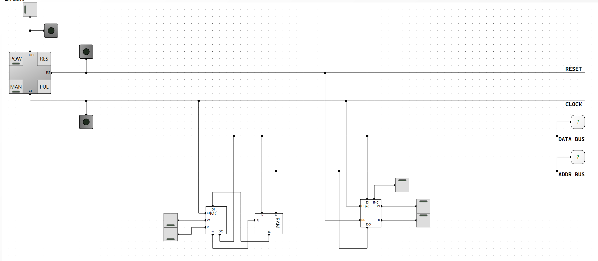
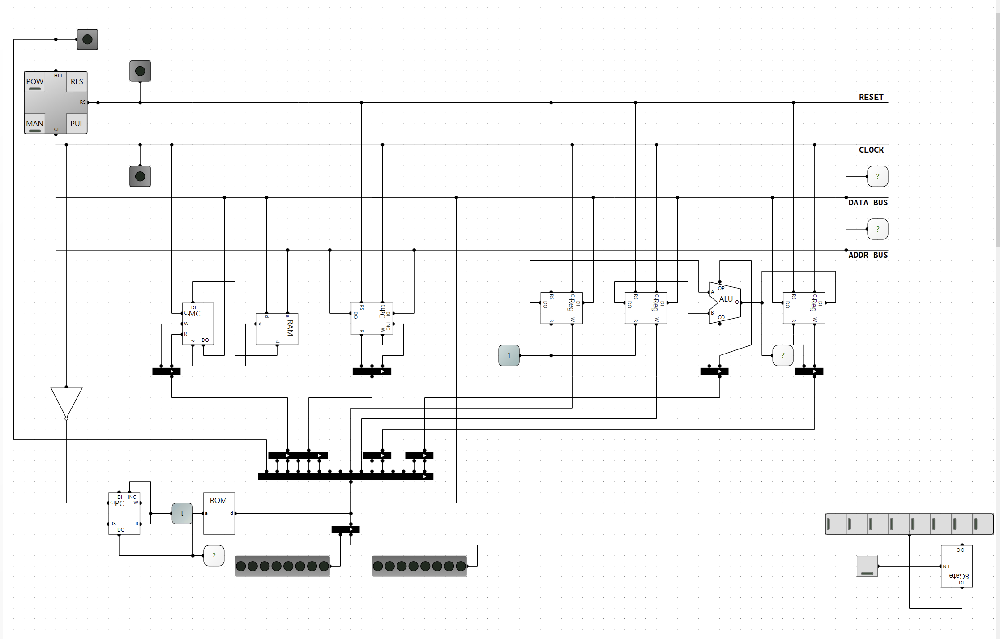
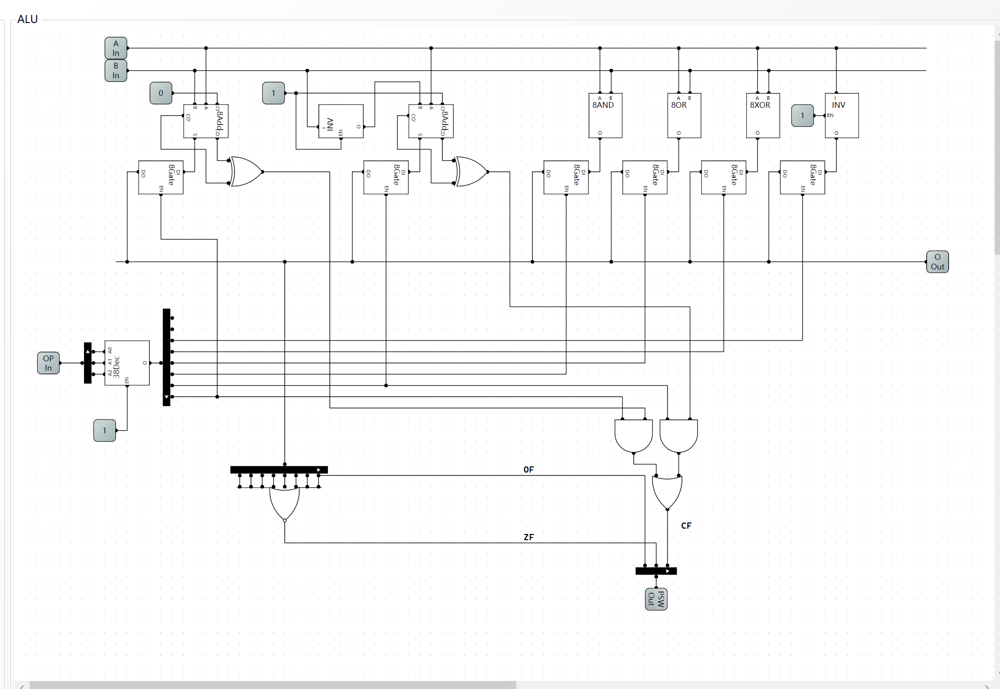
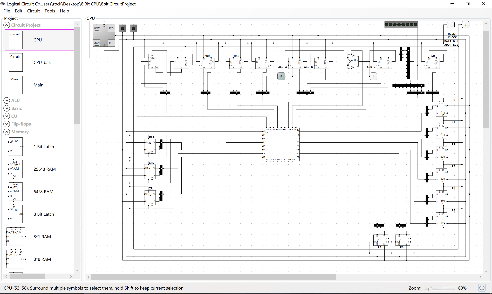
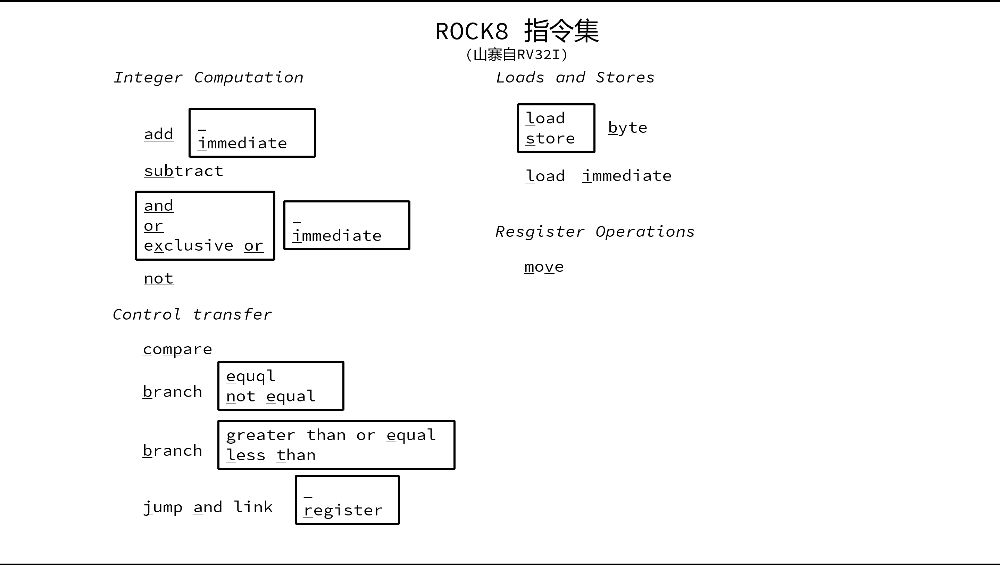
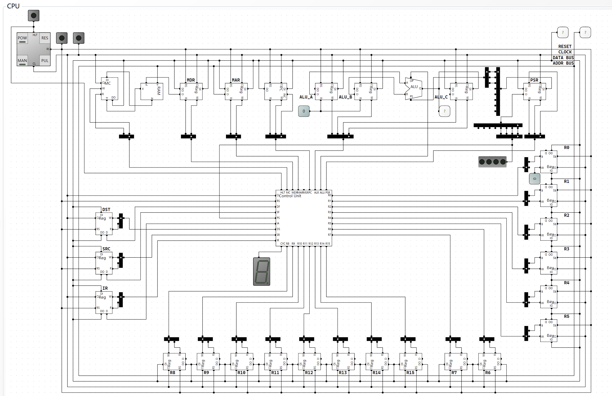
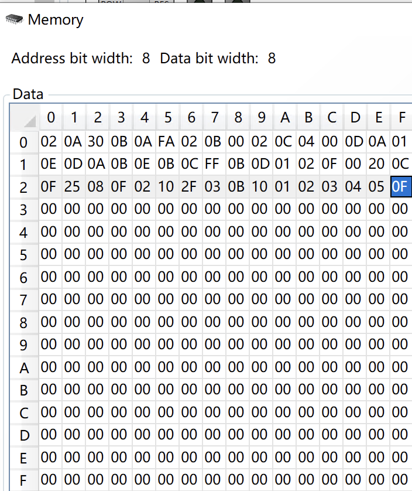

# 8-bits-CPU

PC MC and bus



微程序控制器与微命令编程



> 记一个踩过的坑：
>
> POW打开时，有可能会立即带来上升沿，而部分总线上的数据还未准备好造成莫名其妙的错误
>
> 因此需要增加一个nop来解决此问题

ALU



## 8 bits CPU



## 指令系统

### 指令格式
一条指令3个Byte，分别为OP，DST，SRC
| 23    16 | 15    8 | 7   0 |
| -------- | ------- | ----- |
| OP       | DST     | SRC   |

### 支持指令集：


### 寄存器：
| Register | Alias | Description                   |
| -------- | ----- | ----------------------------- |
| r0       | Zero  | Always be 0.                  |
| r1       | ra    | Return address.               |
| r2       | sp    | Stack pointer.Return address. |
| r3-r15   | -     | -                             |

### 汇编器rasm
> ./rasm 下实现了简单的汇编器

> ./rasm/test_code.asm 为汇编示例代码

```asm
li r0, 0xff ; this is a comment
mv r1, r0
lb r2, 0x02
sb r2, 0x20
nop
hlt
```

> ./rasm/test.bin 为生成的二进制文件

本汇编器基于我自己写的 rlex 和 rparsr 实现  
[RockRockWhite/RLex: lexical analyis by rust (github.com)](https://github.com/RockRockWhite/RLex)  
[RockRockWhite/RParser: a parser tools by rust (github.com)](https://github.com/RockRockWhite/RParser)  

## 最终完成CPU硬件图



## 汇编sample
下面这段代码的功能是计算栈底开始的5个字节的和，并将结果存储到res中。

```asm
# calculate the sum of 5 bytes started from stack_bottom
# and store result to res

li sp, stack_top
addi sp, -6

# r3 store sum
li r3, 0
# r4 for loop
li r4, 4
# r5 for stack
mv r5, sp

loop:
    lb r6, (r5)
    add r3, r6

    addi r4, -1
    addi r5, 1

    # r7 for cmp
    li r7, 0
    cmp r4, r7
    bge Zero, loop

# store result to res
# r8 for store
li r8, res
sb r3, (r8)

stack_bottom:
    .byte 0x1
    .byte 0x2
    .byte 0x3
    .byte 0x4
    .byte 0x5
res:
    .byte 0x0
stack_top:
```

运行结果:



## 总结
闭关3周多左右，实现了一个8位二进制CPU，又或者说，实现了一个8位的计算机。

跟着b站一个UP“踌躇月光”（[StevenBaby/computer: 计算机科学体系结构的实现 (github.com)](https://github.com/StevenBaby/computer)）的视频与《编码》这本神书，一步步地，在LogicCircuit这个软件中，从最基本的与或非门电路开始，开始一步步地构建出半加器、全加器、8位加法器。。。。。。再到ALU、存储芯片、微程序控制器，直至实现了一个完整的CPU。

接着，我又利用学习编译原理山寨的低配版flex和bison（我将他们称为rlex 和 rparser）为我的这个CPU实现了一个汇编器（指令格式部分参考的RV32I，但是仅此而已，别的就没参照标准了），可以将汇编代码转换成我的CPU能跑的二进制代码。

这一套做下来，感觉特别有意思，也特别有成就感。大二那年，在b站刷到别人在我的世界里用红石造的CPU，感觉特别的羡慕。直到今天，我终于能说，我也具备了构建一个CPU的能力了！！！