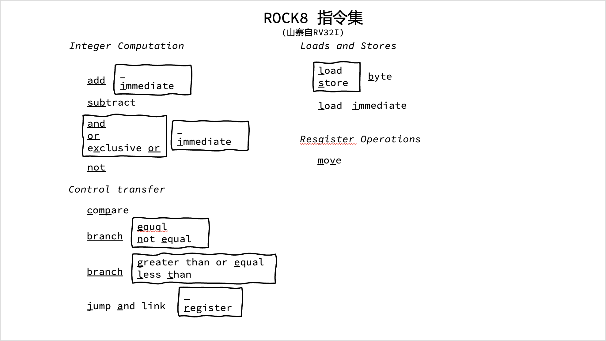

# 8-bits-CPU

PC MC and bus


微程序控制器与微命令编程


> 记一个踩过的坑：
>
> POW打开时，有可能会立即带来上升沿，而部分总线上的数据还未准备好造成莫名其妙的错误
>
> 因此需要增加一个nop来解决此问题

ALU


## 8 bits CPU


## 指令系统
> ./rasm 下实现了简单的汇编器

> ./rasm/test_code.asm 为汇编示例代码

```asm
li r0, 0xff ; this is a comment
mv r1, r0
lb r2, 0x02
sb r2, 0x20
nop
hlt
```

> ./rasm/test.bin 为生成的二进制文件

本汇编器基于我自己写的 rlex 和 rparsr 实现  
[RockRockWhite/RLex: lexical analyis by rust (github.com)](https://github.com/RockRockWhite/RLex)  
[RockRockWhite/RParser: a parser tools by rust (github.com)](https://github.com/RockRockWhite/RParser)  


