# Generated Info

## Base Info
- config_file: ./conf/rasm.rparser
- output_file: src/rasm_parser.rs
- time: 2023-09-11 15:55:53.853718438 +08:00

---

## DFA Graph

```mermaid
graph LR
0["instruction -> •xor register comma register\ninstruction -> •and register comma register\n__DUMMY_START__ -> •S\ninstruction -> •sb register comma number\ninstruction -> •not register\ninstruction -> •jal register comma number\ninstruction -> •ori register comma number\ninstruction -> •sub register comma register\ninstruction -> •mv register comma register\ninstruction -> •cmp register comma register\ninstruction -> •li register comma number\ninstruction -> •hlt\ninstruction -> •lb register comma number\nS -> •program\nprogram -> •instructions\ninstruction -> •xori register comma number\ninstruction -> •or register comma register\ninstructions -> •\ninstruction -> •add register comma register\ninstruction -> •addi register comma number\ninstructions -> •instruction instructions\ninstruction -> •andi register comma number\ninstruction -> •nop\n"]
1["instruction -> nop•\n"]
2["instruction -> cmp •register comma register\n"]
3["instruction -> cmp register •comma register\n"]
4["instruction -> cmp register comma •register\n"]
5["instruction -> cmp register comma register•\n"]
6["program -> instructions•\n"]
7["instruction -> addi •register comma number\n"]
8["instruction -> addi register •comma number\n"]
9["instruction -> addi register comma •number\n"]
10["instruction -> addi register comma number•\n"]
11["instruction -> hlt•\n"]
12["instruction -> lb •register comma number\n"]
13["instruction -> lb register •comma number\n"]
14["instruction -> lb register comma •number\n"]
15["instruction -> lb register comma number•\n"]
16["instruction -> xor •register comma register\n"]
17["instruction -> xor register •comma register\n"]
18["instruction -> xor register comma •register\n"]
19["instruction -> xor register comma register•\n"]
20["instruction -> and •register comma register\n"]
21["instruction -> and register •comma register\n"]
22["instruction -> and register comma •register\n"]
23["instruction -> and register comma register•\n"]
24["instruction -> li •register comma number\n"]
25["instruction -> li register •comma number\n"]
26["instruction -> li register comma •number\n"]
27["instruction -> li register comma number•\n"]
28["instruction -> sb •register comma number\n"]
29["instruction -> sb register •comma number\n"]
30["instruction -> sb register comma •number\n"]
31["instruction -> sb register comma number•\n"]
32["instruction -> xori •register comma number\n"]
33["instruction -> xori register •comma number\n"]
34["instruction -> xori register comma •number\n"]
35["instruction -> xori register comma number•\n"]
36["S -> program•\n"]
37["instruction -> jal •register comma number\n"]
38["instruction -> jal register •comma number\n"]
39["instruction -> jal register comma •number\n"]
40["instruction -> jal register comma number•\n"]
41["instruction -> sub •register comma register\n"]
42["instruction -> sub register •comma register\n"]
43["instruction -> sub register comma •register\n"]
44["instruction -> sub register comma register•\n"]
45["instruction -> add •register comma register\n"]
46["instruction -> add register •comma register\n"]
47["instruction -> add register comma •register\n"]
48["instruction -> add register comma register•\n"]
49["instruction -> •xori register comma number\ninstruction -> •lb register comma number\ninstruction -> •add register comma register\ninstruction -> •andi register comma number\ninstruction -> •addi register comma number\ninstruction -> •sub register comma register\ninstruction -> •hlt\ninstructions -> •instruction instructions\ninstruction -> •cmp register comma register\ninstruction -> •ori register comma number\ninstruction -> •xor register comma register\ninstructions -> •\ninstruction -> •and register comma register\ninstruction -> •li register comma number\ninstruction -> •sb register comma number\ninstruction -> •jal register comma number\ninstruction -> •nop\ninstruction -> •not register\ninstruction -> •or register comma register\ninstructions -> instruction •instructions\ninstruction -> •mv register comma register\n"]
50["instruction -> ori •register comma number\n"]
51["instruction -> ori register •comma number\n"]
52["instruction -> ori register comma •number\n"]
53["instruction -> ori register comma number•\n"]
54["instructions -> instruction instructions•\n"]
55["instruction -> andi •register comma number\n"]
56["instruction -> andi register •comma number\n"]
57["instruction -> andi register comma •number\n"]
58["instruction -> andi register comma number•\n"]
59["instruction -> or •register comma register\n"]
60["instruction -> or register •comma register\n"]
61["instruction -> or register comma •register\n"]
62["instruction -> or register comma register•\n"]
63["instruction -> mv •register comma register\n"]
64["instruction -> mv register •comma register\n"]
65["instruction -> mv register comma •register\n"]
66["instruction -> mv register comma register•\n"]
67["instruction -> not •register\n"]
68["instruction -> not register•\n"]
69["__DUMMY_START__ -> S•\n"]

0--"nop"-->1
4--"register"-->5
3--"comma"-->4
2--"register"-->3
0--"cmp"-->2
0--"instructions"-->6
9--"number"-->10
8--"comma"-->9
7--"register"-->8
0--"addi"-->7
0--"hlt"-->11
14--"number"-->15
13--"comma"-->14
12--"register"-->13
0--"lb"-->12
18--"register"-->19
17--"comma"-->18
16--"register"-->17
0--"xor"-->16
22--"register"-->23
21--"comma"-->22
20--"register"-->21
0--"and"-->20
26--"number"-->27
25--"comma"-->26
24--"register"-->25
0--"li"-->24
30--"number"-->31
29--"comma"-->30
28--"register"-->29
0--"sb"-->28
34--"number"-->35
33--"comma"-->34
32--"register"-->33
0--"xori"-->32
0--"program"-->36
39--"number"-->40
38--"comma"-->39
37--"register"-->38
0--"jal"-->37
43--"register"-->44
42--"comma"-->43
41--"register"-->42
0--"sub"-->41
47--"register"-->48
46--"comma"-->47
45--"register"-->46
0--"add"-->45
49--"jal"-->37
49--"nop"-->1
49--"add"-->45
49--"xori"-->32
49--"cmp"-->2
52--"number"-->53
51--"comma"-->52
50--"register"-->51
49--"ori"-->50
49--"xor"-->16
49--"and"-->20
49--"hlt"-->11
49--"instructions"-->54
49--"sub"-->41
49--"li"-->24
49--"lb"-->12
57--"number"-->58
56--"comma"-->57
55--"register"-->56
49--"andi"-->55
49--"instruction"-->49
61--"register"-->62
60--"comma"-->61
59--"register"-->60
49--"or"-->59
65--"register"-->66
64--"comma"-->65
63--"register"-->64
49--"mv"-->63
49--"sb"-->28
67--"register"-->68
49--"not"-->67
49--"addi"-->7
0--"instruction"-->49
0--"not"-->67
0--"ori"-->50
0--"S"-->69
0--"or"-->59
0--"mv"-->63
0--"andi"-->55

```


---

## Follow Set
```txt
__EPSILON__: ["__$__"]
__$__: []
add: ["register"]
or: ["register"]
not: ["register"]
instruction: ["mv", "ori", "__$__", "xori", "jal", "not", "sub", "and", "nop", "add", "xor", "sb", "lb", "cmp", "or", "li", "hlt", "addi", "andi"]
mv: ["register"]
sb: ["register"]
addi: ["register"]
and: ["register"]
andi: ["register"]
S: ["__$__"]
lb: ["register"]
sub: ["register"]
cmp: ["register"]
program: ["__$__"]
xor: ["register"]
jal: ["register"]
instructions: ["__$__"]
li: ["register"]
nop: ["and", "hlt", "xor", "andi", "or", "addi", "li", "lb", "jal", "sb", "nop", "add", "__$__", "cmp", "mv", "xori", "ori", "not", "sub"]
__DUMMY_START__: ["__$__"]
register: ["not", "and", "ori", "lb", "cmp", "jal", "xor", "comma", "li", "or", "andi", "mv", "xori", "nop", "add", "sb", "sub", "__$__", "hlt", "addi"]
comma: ["number", "register"]
hlt: ["hlt", "add", "jal", "sb", "lb", "cmp", "sub", "mv", "xor", "ori", "li", "addi", "andi", "not", "or", "xori", "nop", "__$__", "and"]
xori: ["register"]
number: ["nop", "xor", "andi", "mv", "sb", "add", "hlt", "and", "ori", "not", "__$__", "sub", "addi", "lb", "li", "jal", "xori", "cmp", "or"]
ori: ["register"]
```

---
## Action Table
```txt
State 0:
hlt: Shift(11)
__$__: Accept
cmp: Shift(2)
lb: Shift(12)
add: Shift(45)
ori: Shift(50)
program: Shift(36)
xori: Shift(32)
S: Shift(69)
instructions: Shift(6)
xor: Shift(16)
and: Shift(20)
sub: Shift(41)
li: Shift(24)
sb: Shift(28)
instruction: Shift(49)
or: Shift(59)
addi: Shift(7)
jal: Shift(37)
mv: Shift(63)
not: Shift(67)
andi: Shift(55)
nop: Shift(1)
===================
State 1:
andi: Reduce(ReduceDerivation { left: "instruction", right: ["nop"] })
add: Reduce(ReduceDerivation { left: "instruction", right: ["nop"] })
or: Reduce(ReduceDerivation { left: "instruction", right: ["nop"] })
li: Reduce(ReduceDerivation { left: "instruction", right: ["nop"] })
lb: Reduce(ReduceDerivation { left: "instruction", right: ["nop"] })
cmp: Reduce(ReduceDerivation { left: "instruction", right: ["nop"] })
and: Reduce(ReduceDerivation { left: "instruction", right: ["nop"] })
sb: Reduce(ReduceDerivation { left: "instruction", right: ["nop"] })
not: Reduce(ReduceDerivation { left: "instruction", right: ["nop"] })
__$__: Reduce(ReduceDerivation { left: "instruction", right: ["nop"] })
addi: Reduce(ReduceDerivation { left: "instruction", right: ["nop"] })
ori: Reduce(ReduceDerivation { left: "instruction", right: ["nop"] })
xori: Reduce(ReduceDerivation { left: "instruction", right: ["nop"] })
xor: Reduce(ReduceDerivation { left: "instruction", right: ["nop"] })
nop: Reduce(ReduceDerivation { left: "instruction", right: ["nop"] })
sub: Reduce(ReduceDerivation { left: "instruction", right: ["nop"] })
hlt: Reduce(ReduceDerivation { left: "instruction", right: ["nop"] })
jal: Reduce(ReduceDerivation { left: "instruction", right: ["nop"] })
mv: Reduce(ReduceDerivation { left: "instruction", right: ["nop"] })
===================
State 2:
register: Shift(3)
===================
State 3:
comma: Shift(4)
===================
State 4:
register: Shift(5)
===================
State 5:
and: Reduce(ReduceDerivation { left: "instruction", right: ["cmp", "register", "comma", "register"] })
ori: Reduce(ReduceDerivation { left: "instruction", right: ["cmp", "register", "comma", "register"] })
not: Reduce(ReduceDerivation { left: "instruction", right: ["cmp", "register", "comma", "register"] })
xor: Reduce(ReduceDerivation { left: "instruction", right: ["cmp", "register", "comma", "register"] })
li: Reduce(ReduceDerivation { left: "instruction", right: ["cmp", "register", "comma", "register"] })
nop: Reduce(ReduceDerivation { left: "instruction", right: ["cmp", "register", "comma", "register"] })
sb: Reduce(ReduceDerivation { left: "instruction", right: ["cmp", "register", "comma", "register"] })
lb: Reduce(ReduceDerivation { left: "instruction", right: ["cmp", "register", "comma", "register"] })
sub: Reduce(ReduceDerivation { left: "instruction", right: ["cmp", "register", "comma", "register"] })
cmp: Reduce(ReduceDerivation { left: "instruction", right: ["cmp", "register", "comma", "register"] })
__$__: Reduce(ReduceDerivation { left: "instruction", right: ["cmp", "register", "comma", "register"] })
mv: Reduce(ReduceDerivation { left: "instruction", right: ["cmp", "register", "comma", "register"] })
xori: Reduce(ReduceDerivation { left: "instruction", right: ["cmp", "register", "comma", "register"] })
add: Reduce(ReduceDerivation { left: "instruction", right: ["cmp", "register", "comma", "register"] })
or: Reduce(ReduceDerivation { left: "instruction", right: ["cmp", "register", "comma", "register"] })
jal: Reduce(ReduceDerivation { left: "instruction", right: ["cmp", "register", "comma", "register"] })
hlt: Reduce(ReduceDerivation { left: "instruction", right: ["cmp", "register", "comma", "register"] })
addi: Reduce(ReduceDerivation { left: "instruction", right: ["cmp", "register", "comma", "register"] })
andi: Reduce(ReduceDerivation { left: "instruction", right: ["cmp", "register", "comma", "register"] })
===================
State 6:
__$__: Reduce(ReduceDerivation { left: "program", right: ["instructions"] })
===================
State 7:
register: Shift(8)
===================
State 8:
comma: Shift(9)
===================
State 9:
number: Shift(10)
===================
State 10:
xor: Reduce(ReduceDerivation { left: "instruction", right: ["addi", "register", "comma", "number"] })
sb: Reduce(ReduceDerivation { left: "instruction", right: ["addi", "register", "comma", "number"] })
lb: Reduce(ReduceDerivation { left: "instruction", right: ["addi", "register", "comma", "number"] })
sub: Reduce(ReduceDerivation { left: "instruction", right: ["addi", "register", "comma", "number"] })
add: Reduce(ReduceDerivation { left: "instruction", right: ["addi", "register", "comma", "number"] })
mv: Reduce(ReduceDerivation { left: "instruction", right: ["addi", "register", "comma", "number"] })
not: Reduce(ReduceDerivation { left: "instruction", right: ["addi", "register", "comma", "number"] })
jal: Reduce(ReduceDerivation { left: "instruction", right: ["addi", "register", "comma", "number"] })
__$__: Reduce(ReduceDerivation { left: "instruction", right: ["addi", "register", "comma", "number"] })
andi: Reduce(ReduceDerivation { left: "instruction", right: ["addi", "register", "comma", "number"] })
and: Reduce(ReduceDerivation { left: "instruction", right: ["addi", "register", "comma", "number"] })
nop: Reduce(ReduceDerivation { left: "instruction", right: ["addi", "register", "comma", "number"] })
ori: Reduce(ReduceDerivation { left: "instruction", right: ["addi", "register", "comma", "number"] })
or: Reduce(ReduceDerivation { left: "instruction", right: ["addi", "register", "comma", "number"] })
li: Reduce(ReduceDerivation { left: "instruction", right: ["addi", "register", "comma", "number"] })
hlt: Reduce(ReduceDerivation { left: "instruction", right: ["addi", "register", "comma", "number"] })
addi: Reduce(ReduceDerivation { left: "instruction", right: ["addi", "register", "comma", "number"] })
xori: Reduce(ReduceDerivation { left: "instruction", right: ["addi", "register", "comma", "number"] })
cmp: Reduce(ReduceDerivation { left: "instruction", right: ["addi", "register", "comma", "number"] })
===================
State 11:
mv: Reduce(ReduceDerivation { left: "instruction", right: ["hlt"] })
xori: Reduce(ReduceDerivation { left: "instruction", right: ["hlt"] })
not: Reduce(ReduceDerivation { left: "instruction", right: ["hlt"] })
and: Reduce(ReduceDerivation { left: "instruction", right: ["hlt"] })
hlt: Reduce(ReduceDerivation { left: "instruction", right: ["hlt"] })
addi: Reduce(ReduceDerivation { left: "instruction", right: ["hlt"] })
xor: Reduce(ReduceDerivation { left: "instruction", right: ["hlt"] })
li: Reduce(ReduceDerivation { left: "instruction", right: ["hlt"] })
__$__: Reduce(ReduceDerivation { left: "instruction", right: ["hlt"] })
add: Reduce(ReduceDerivation { left: "instruction", right: ["hlt"] })
or: Reduce(ReduceDerivation { left: "instruction", right: ["hlt"] })
nop: Reduce(ReduceDerivation { left: "instruction", right: ["hlt"] })
jal: Reduce(ReduceDerivation { left: "instruction", right: ["hlt"] })
sub: Reduce(ReduceDerivation { left: "instruction", right: ["hlt"] })
lb: Reduce(ReduceDerivation { left: "instruction", right: ["hlt"] })
ori: Reduce(ReduceDerivation { left: "instruction", right: ["hlt"] })
sb: Reduce(ReduceDerivation { left: "instruction", right: ["hlt"] })
cmp: Reduce(ReduceDerivation { left: "instruction", right: ["hlt"] })
andi: Reduce(ReduceDerivation { left: "instruction", right: ["hlt"] })
===================
State 12:
register: Shift(13)
===================
State 13:
comma: Shift(14)
===================
State 14:
number: Shift(15)
===================
State 15:
hlt: Reduce(ReduceDerivation { left: "instruction", right: ["lb", "register", "comma", "number"] })
not: Reduce(ReduceDerivation { left: "instruction", right: ["lb", "register", "comma", "number"] })
cmp: Reduce(ReduceDerivation { left: "instruction", right: ["lb", "register", "comma", "number"] })
sub: Reduce(ReduceDerivation { left: "instruction", right: ["lb", "register", "comma", "number"] })
ori: Reduce(ReduceDerivation { left: "instruction", right: ["lb", "register", "comma", "number"] })
addi: Reduce(ReduceDerivation { left: "instruction", right: ["lb", "register", "comma", "number"] })
__$__: Reduce(ReduceDerivation { left: "instruction", right: ["lb", "register", "comma", "number"] })
sb: Reduce(ReduceDerivation { left: "instruction", right: ["lb", "register", "comma", "number"] })
xori: Reduce(ReduceDerivation { left: "instruction", right: ["lb", "register", "comma", "number"] })
xor: Reduce(ReduceDerivation { left: "instruction", right: ["lb", "register", "comma", "number"] })
lb: Reduce(ReduceDerivation { left: "instruction", right: ["lb", "register", "comma", "number"] })
and: Reduce(ReduceDerivation { left: "instruction", right: ["lb", "register", "comma", "number"] })
add: Reduce(ReduceDerivation { left: "instruction", right: ["lb", "register", "comma", "number"] })
nop: Reduce(ReduceDerivation { left: "instruction", right: ["lb", "register", "comma", "number"] })
jal: Reduce(ReduceDerivation { left: "instruction", right: ["lb", "register", "comma", "number"] })
li: Reduce(ReduceDerivation { left: "instruction", right: ["lb", "register", "comma", "number"] })
andi: Reduce(ReduceDerivation { left: "instruction", right: ["lb", "register", "comma", "number"] })
mv: Reduce(ReduceDerivation { left: "instruction", right: ["lb", "register", "comma", "number"] })
or: Reduce(ReduceDerivation { left: "instruction", right: ["lb", "register", "comma", "number"] })
===================
State 16:
register: Shift(17)
===================
State 17:
comma: Shift(18)
===================
State 18:
register: Shift(19)
===================
State 19:
andi: Reduce(ReduceDerivation { left: "instruction", right: ["xor", "register", "comma", "register"] })
ori: Reduce(ReduceDerivation { left: "instruction", right: ["xor", "register", "comma", "register"] })
xor: Reduce(ReduceDerivation { left: "instruction", right: ["xor", "register", "comma", "register"] })
cmp: Reduce(ReduceDerivation { left: "instruction", right: ["xor", "register", "comma", "register"] })
hlt: Reduce(ReduceDerivation { left: "instruction", right: ["xor", "register", "comma", "register"] })
and: Reduce(ReduceDerivation { left: "instruction", right: ["xor", "register", "comma", "register"] })
sub: Reduce(ReduceDerivation { left: "instruction", right: ["xor", "register", "comma", "register"] })
nop: Reduce(ReduceDerivation { left: "instruction", right: ["xor", "register", "comma", "register"] })
xori: Reduce(ReduceDerivation { left: "instruction", right: ["xor", "register", "comma", "register"] })
jal: Reduce(ReduceDerivation { left: "instruction", right: ["xor", "register", "comma", "register"] })
not: Reduce(ReduceDerivation { left: "instruction", right: ["xor", "register", "comma", "register"] })
add: Reduce(ReduceDerivation { left: "instruction", right: ["xor", "register", "comma", "register"] })
or: Reduce(ReduceDerivation { left: "instruction", right: ["xor", "register", "comma", "register"] })
__$__: Reduce(ReduceDerivation { left: "instruction", right: ["xor", "register", "comma", "register"] })
sb: Reduce(ReduceDerivation { left: "instruction", right: ["xor", "register", "comma", "register"] })
li: Reduce(ReduceDerivation { left: "instruction", right: ["xor", "register", "comma", "register"] })
addi: Reduce(ReduceDerivation { left: "instruction", right: ["xor", "register", "comma", "register"] })
mv: Reduce(ReduceDerivation { left: "instruction", right: ["xor", "register", "comma", "register"] })
lb: Reduce(ReduceDerivation { left: "instruction", right: ["xor", "register", "comma", "register"] })
===================
State 20:
register: Shift(21)
===================
State 21:
comma: Shift(22)
===================
State 22:
register: Shift(23)
===================
State 23:
or: Reduce(ReduceDerivation { left: "instruction", right: ["and", "register", "comma", "register"] })
and: Reduce(ReduceDerivation { left: "instruction", right: ["and", "register", "comma", "register"] })
__$__: Reduce(ReduceDerivation { left: "instruction", right: ["and", "register", "comma", "register"] })
sb: Reduce(ReduceDerivation { left: "instruction", right: ["and", "register", "comma", "register"] })
sub: Reduce(ReduceDerivation { left: "instruction", right: ["and", "register", "comma", "register"] })
jal: Reduce(ReduceDerivation { left: "instruction", right: ["and", "register", "comma", "register"] })
hlt: Reduce(ReduceDerivation { left: "instruction", right: ["and", "register", "comma", "register"] })
add: Reduce(ReduceDerivation { left: "instruction", right: ["and", "register", "comma", "register"] })
xor: Reduce(ReduceDerivation { left: "instruction", right: ["and", "register", "comma", "register"] })
mv: Reduce(ReduceDerivation { left: "instruction", right: ["and", "register", "comma", "register"] })
addi: Reduce(ReduceDerivation { left: "instruction", right: ["and", "register", "comma", "register"] })
not: Reduce(ReduceDerivation { left: "instruction", right: ["and", "register", "comma", "register"] })
cmp: Reduce(ReduceDerivation { left: "instruction", right: ["and", "register", "comma", "register"] })
lb: Reduce(ReduceDerivation { left: "instruction", right: ["and", "register", "comma", "register"] })
li: Reduce(ReduceDerivation { left: "instruction", right: ["and", "register", "comma", "register"] })
andi: Reduce(ReduceDerivation { left: "instruction", right: ["and", "register", "comma", "register"] })
ori: Reduce(ReduceDerivation { left: "instruction", right: ["and", "register", "comma", "register"] })
xori: Reduce(ReduceDerivation { left: "instruction", right: ["and", "register", "comma", "register"] })
nop: Reduce(ReduceDerivation { left: "instruction", right: ["and", "register", "comma", "register"] })
===================
State 24:
register: Shift(25)
===================
State 25:
comma: Shift(26)
===================
State 26:
number: Shift(27)
===================
State 27:
addi: Reduce(ReduceDerivation { left: "instruction", right: ["li", "register", "comma", "number"] })
sub: Reduce(ReduceDerivation { left: "instruction", right: ["li", "register", "comma", "number"] })
lb: Reduce(ReduceDerivation { left: "instruction", right: ["li", "register", "comma", "number"] })
hlt: Reduce(ReduceDerivation { left: "instruction", right: ["li", "register", "comma", "number"] })
li: Reduce(ReduceDerivation { left: "instruction", right: ["li", "register", "comma", "number"] })
andi: Reduce(ReduceDerivation { left: "instruction", right: ["li", "register", "comma", "number"] })
add: Reduce(ReduceDerivation { left: "instruction", right: ["li", "register", "comma", "number"] })
jal: Reduce(ReduceDerivation { left: "instruction", right: ["li", "register", "comma", "number"] })
mv: Reduce(ReduceDerivation { left: "instruction", right: ["li", "register", "comma", "number"] })
__$__: Reduce(ReduceDerivation { left: "instruction", right: ["li", "register", "comma", "number"] })
ori: Reduce(ReduceDerivation { left: "instruction", right: ["li", "register", "comma", "number"] })
and: Reduce(ReduceDerivation { left: "instruction", right: ["li", "register", "comma", "number"] })
sb: Reduce(ReduceDerivation { left: "instruction", right: ["li", "register", "comma", "number"] })
cmp: Reduce(ReduceDerivation { left: "instruction", right: ["li", "register", "comma", "number"] })
xor: Reduce(ReduceDerivation { left: "instruction", right: ["li", "register", "comma", "number"] })
xori: Reduce(ReduceDerivation { left: "instruction", right: ["li", "register", "comma", "number"] })
nop: Reduce(ReduceDerivation { left: "instruction", right: ["li", "register", "comma", "number"] })
not: Reduce(ReduceDerivation { left: "instruction", right: ["li", "register", "comma", "number"] })
or: Reduce(ReduceDerivation { left: "instruction", right: ["li", "register", "comma", "number"] })
===================
State 28:
register: Shift(29)
===================
State 29:
comma: Shift(30)
===================
State 30:
number: Shift(31)
===================
State 31:
add: Reduce(ReduceDerivation { left: "instruction", right: ["sb", "register", "comma", "number"] })
cmp: Reduce(ReduceDerivation { left: "instruction", right: ["sb", "register", "comma", "number"] })
mv: Reduce(ReduceDerivation { left: "instruction", right: ["sb", "register", "comma", "number"] })
andi: Reduce(ReduceDerivation { left: "instruction", right: ["sb", "register", "comma", "number"] })
xori: Reduce(ReduceDerivation { left: "instruction", right: ["sb", "register", "comma", "number"] })
xor: Reduce(ReduceDerivation { left: "instruction", right: ["sb", "register", "comma", "number"] })
__$__: Reduce(ReduceDerivation { left: "instruction", right: ["sb", "register", "comma", "number"] })
ori: Reduce(ReduceDerivation { left: "instruction", right: ["sb", "register", "comma", "number"] })
sb: Reduce(ReduceDerivation { left: "instruction", right: ["sb", "register", "comma", "number"] })
li: Reduce(ReduceDerivation { left: "instruction", right: ["sb", "register", "comma", "number"] })
and: Reduce(ReduceDerivation { left: "instruction", right: ["sb", "register", "comma", "number"] })
addi: Reduce(ReduceDerivation { left: "instruction", right: ["sb", "register", "comma", "number"] })
jal: Reduce(ReduceDerivation { left: "instruction", right: ["sb", "register", "comma", "number"] })
not: Reduce(ReduceDerivation { left: "instruction", right: ["sb", "register", "comma", "number"] })
hlt: Reduce(ReduceDerivation { left: "instruction", right: ["sb", "register", "comma", "number"] })
or: Reduce(ReduceDerivation { left: "instruction", right: ["sb", "register", "comma", "number"] })
lb: Reduce(ReduceDerivation { left: "instruction", right: ["sb", "register", "comma", "number"] })
nop: Reduce(ReduceDerivation { left: "instruction", right: ["sb", "register", "comma", "number"] })
sub: Reduce(ReduceDerivation { left: "instruction", right: ["sb", "register", "comma", "number"] })
===================
State 32:
register: Shift(33)
===================
State 33:
comma: Shift(34)
===================
State 34:
number: Shift(35)
===================
State 35:
mv: Reduce(ReduceDerivation { left: "instruction", right: ["xori", "register", "comma", "number"] })
__$__: Reduce(ReduceDerivation { left: "instruction", right: ["xori", "register", "comma", "number"] })
sub: Reduce(ReduceDerivation { left: "instruction", right: ["xori", "register", "comma", "number"] })
xori: Reduce(ReduceDerivation { left: "instruction", right: ["xori", "register", "comma", "number"] })
and: Reduce(ReduceDerivation { left: "instruction", right: ["xori", "register", "comma", "number"] })
li: Reduce(ReduceDerivation { left: "instruction", right: ["xori", "register", "comma", "number"] })
hlt: Reduce(ReduceDerivation { left: "instruction", right: ["xori", "register", "comma", "number"] })
or: Reduce(ReduceDerivation { left: "instruction", right: ["xori", "register", "comma", "number"] })
ori: Reduce(ReduceDerivation { left: "instruction", right: ["xori", "register", "comma", "number"] })
add: Reduce(ReduceDerivation { left: "instruction", right: ["xori", "register", "comma", "number"] })
nop: Reduce(ReduceDerivation { left: "instruction", right: ["xori", "register", "comma", "number"] })
addi: Reduce(ReduceDerivation { left: "instruction", right: ["xori", "register", "comma", "number"] })
lb: Reduce(ReduceDerivation { left: "instruction", right: ["xori", "register", "comma", "number"] })
xor: Reduce(ReduceDerivation { left: "instruction", right: ["xori", "register", "comma", "number"] })
andi: Reduce(ReduceDerivation { left: "instruction", right: ["xori", "register", "comma", "number"] })
jal: Reduce(ReduceDerivation { left: "instruction", right: ["xori", "register", "comma", "number"] })
cmp: Reduce(ReduceDerivation { left: "instruction", right: ["xori", "register", "comma", "number"] })
not: Reduce(ReduceDerivation { left: "instruction", right: ["xori", "register", "comma", "number"] })
sb: Reduce(ReduceDerivation { left: "instruction", right: ["xori", "register", "comma", "number"] })
===================
State 36:
__$__: Reduce(ReduceDerivation { left: "S", right: ["program"] })
===================
State 37:
register: Shift(38)
===================
State 38:
comma: Shift(39)
===================
State 39:
number: Shift(40)
===================
State 40:
xori: Reduce(ReduceDerivation { left: "instruction", right: ["jal", "register", "comma", "number"] })
cmp: Reduce(ReduceDerivation { left: "instruction", right: ["jal", "register", "comma", "number"] })
not: Reduce(ReduceDerivation { left: "instruction", right: ["jal", "register", "comma", "number"] })
and: Reduce(ReduceDerivation { left: "instruction", right: ["jal", "register", "comma", "number"] })
xor: Reduce(ReduceDerivation { left: "instruction", right: ["jal", "register", "comma", "number"] })
__$__: Reduce(ReduceDerivation { left: "instruction", right: ["jal", "register", "comma", "number"] })
nop: Reduce(ReduceDerivation { left: "instruction", right: ["jal", "register", "comma", "number"] })
lb: Reduce(ReduceDerivation { left: "instruction", right: ["jal", "register", "comma", "number"] })
addi: Reduce(ReduceDerivation { left: "instruction", right: ["jal", "register", "comma", "number"] })
sb: Reduce(ReduceDerivation { left: "instruction", right: ["jal", "register", "comma", "number"] })
jal: Reduce(ReduceDerivation { left: "instruction", right: ["jal", "register", "comma", "number"] })
li: Reduce(ReduceDerivation { left: "instruction", right: ["jal", "register", "comma", "number"] })
hlt: Reduce(ReduceDerivation { left: "instruction", right: ["jal", "register", "comma", "number"] })
mv: Reduce(ReduceDerivation { left: "instruction", right: ["jal", "register", "comma", "number"] })
ori: Reduce(ReduceDerivation { left: "instruction", right: ["jal", "register", "comma", "number"] })
add: Reduce(ReduceDerivation { left: "instruction", right: ["jal", "register", "comma", "number"] })
andi: Reduce(ReduceDerivation { left: "instruction", right: ["jal", "register", "comma", "number"] })
or: Reduce(ReduceDerivation { left: "instruction", right: ["jal", "register", "comma", "number"] })
sub: Reduce(ReduceDerivation { left: "instruction", right: ["jal", "register", "comma", "number"] })
===================
State 41:
register: Shift(42)
===================
State 42:
comma: Shift(43)
===================
State 43:
register: Shift(44)
===================
State 44:
hlt: Reduce(ReduceDerivation { left: "instruction", right: ["sub", "register", "comma", "register"] })
xori: Reduce(ReduceDerivation { left: "instruction", right: ["sub", "register", "comma", "register"] })
addi: Reduce(ReduceDerivation { left: "instruction", right: ["sub", "register", "comma", "register"] })
ori: Reduce(ReduceDerivation { left: "instruction", right: ["sub", "register", "comma", "register"] })
jal: Reduce(ReduceDerivation { left: "instruction", right: ["sub", "register", "comma", "register"] })
xor: Reduce(ReduceDerivation { left: "instruction", right: ["sub", "register", "comma", "register"] })
sub: Reduce(ReduceDerivation { left: "instruction", right: ["sub", "register", "comma", "register"] })
not: Reduce(ReduceDerivation { left: "instruction", right: ["sub", "register", "comma", "register"] })
lb: Reduce(ReduceDerivation { left: "instruction", right: ["sub", "register", "comma", "register"] })
nop: Reduce(ReduceDerivation { left: "instruction", right: ["sub", "register", "comma", "register"] })
add: Reduce(ReduceDerivation { left: "instruction", right: ["sub", "register", "comma", "register"] })
sb: Reduce(ReduceDerivation { left: "instruction", right: ["sub", "register", "comma", "register"] })
mv: Reduce(ReduceDerivation { left: "instruction", right: ["sub", "register", "comma", "register"] })
and: Reduce(ReduceDerivation { left: "instruction", right: ["sub", "register", "comma", "register"] })
or: Reduce(ReduceDerivation { left: "instruction", right: ["sub", "register", "comma", "register"] })
cmp: Reduce(ReduceDerivation { left: "instruction", right: ["sub", "register", "comma", "register"] })
li: Reduce(ReduceDerivation { left: "instruction", right: ["sub", "register", "comma", "register"] })
andi: Reduce(ReduceDerivation { left: "instruction", right: ["sub", "register", "comma", "register"] })
__$__: Reduce(ReduceDerivation { left: "instruction", right: ["sub", "register", "comma", "register"] })
===================
State 45:
register: Shift(46)
===================
State 46:
comma: Shift(47)
===================
State 47:
register: Shift(48)
===================
State 48:
hlt: Reduce(ReduceDerivation { left: "instruction", right: ["add", "register", "comma", "register"] })
jal: Reduce(ReduceDerivation { left: "instruction", right: ["add", "register", "comma", "register"] })
or: Reduce(ReduceDerivation { left: "instruction", right: ["add", "register", "comma", "register"] })
add: Reduce(ReduceDerivation { left: "instruction", right: ["add", "register", "comma", "register"] })
cmp: Reduce(ReduceDerivation { left: "instruction", right: ["add", "register", "comma", "register"] })
lb: Reduce(ReduceDerivation { left: "instruction", right: ["add", "register", "comma", "register"] })
__$__: Reduce(ReduceDerivation { left: "instruction", right: ["add", "register", "comma", "register"] })
addi: Reduce(ReduceDerivation { left: "instruction", right: ["add", "register", "comma", "register"] })
andi: Reduce(ReduceDerivation { left: "instruction", right: ["add", "register", "comma", "register"] })
not: Reduce(ReduceDerivation { left: "instruction", right: ["add", "register", "comma", "register"] })
nop: Reduce(ReduceDerivation { left: "instruction", right: ["add", "register", "comma", "register"] })
mv: Reduce(ReduceDerivation { left: "instruction", right: ["add", "register", "comma", "register"] })
sb: Reduce(ReduceDerivation { left: "instruction", right: ["add", "register", "comma", "register"] })
sub: Reduce(ReduceDerivation { left: "instruction", right: ["add", "register", "comma", "register"] })
and: Reduce(ReduceDerivation { left: "instruction", right: ["add", "register", "comma", "register"] })
xori: Reduce(ReduceDerivation { left: "instruction", right: ["add", "register", "comma", "register"] })
ori: Reduce(ReduceDerivation { left: "instruction", right: ["add", "register", "comma", "register"] })
xor: Reduce(ReduceDerivation { left: "instruction", right: ["add", "register", "comma", "register"] })
li: Reduce(ReduceDerivation { left: "instruction", right: ["add", "register", "comma", "register"] })
===================
State 49:
nop: Shift(1)
ori: Shift(50)
jal: Shift(37)
sub: Shift(41)
xor: Shift(16)
and: Shift(20)
add: Shift(45)
cmp: Shift(2)
addi: Shift(7)
xori: Shift(32)
sb: Shift(28)
mv: Shift(63)
__$__: Reduce(ReduceDerivation { left: "instructions", right: [] })
hlt: Shift(11)
or: Shift(59)
lb: Shift(12)
instruction: Shift(49)
instructions: Shift(54)
not: Shift(67)
andi: Shift(55)
li: Shift(24)
===================
State 50:
register: Shift(51)
===================
State 51:
comma: Shift(52)
===================
State 52:
number: Shift(53)
===================
State 53:
li: Reduce(ReduceDerivation { left: "instruction", right: ["ori", "register", "comma", "number"] })
hlt: Reduce(ReduceDerivation { left: "instruction", right: ["ori", "register", "comma", "number"] })
and: Reduce(ReduceDerivation { left: "instruction", right: ["ori", "register", "comma", "number"] })
mv: Reduce(ReduceDerivation { left: "instruction", right: ["ori", "register", "comma", "number"] })
sb: Reduce(ReduceDerivation { left: "instruction", right: ["ori", "register", "comma", "number"] })
add: Reduce(ReduceDerivation { left: "instruction", right: ["ori", "register", "comma", "number"] })
jal: Reduce(ReduceDerivation { left: "instruction", right: ["ori", "register", "comma", "number"] })
addi: Reduce(ReduceDerivation { left: "instruction", right: ["ori", "register", "comma", "number"] })
or: Reduce(ReduceDerivation { left: "instruction", right: ["ori", "register", "comma", "number"] })
cmp: Reduce(ReduceDerivation { left: "instruction", right: ["ori", "register", "comma", "number"] })
sub: Reduce(ReduceDerivation { left: "instruction", right: ["ori", "register", "comma", "number"] })
lb: Reduce(ReduceDerivation { left: "instruction", right: ["ori", "register", "comma", "number"] })
andi: Reduce(ReduceDerivation { left: "instruction", right: ["ori", "register", "comma", "number"] })
not: Reduce(ReduceDerivation { left: "instruction", right: ["ori", "register", "comma", "number"] })
ori: Reduce(ReduceDerivation { left: "instruction", right: ["ori", "register", "comma", "number"] })
xori: Reduce(ReduceDerivation { left: "instruction", right: ["ori", "register", "comma", "number"] })
nop: Reduce(ReduceDerivation { left: "instruction", right: ["ori", "register", "comma", "number"] })
xor: Reduce(ReduceDerivation { left: "instruction", right: ["ori", "register", "comma", "number"] })
__$__: Reduce(ReduceDerivation { left: "instruction", right: ["ori", "register", "comma", "number"] })
===================
State 54:
__$__: Reduce(ReduceDerivation { left: "instructions", right: ["instruction", "instructions"] })
===================
State 55:
register: Shift(56)
===================
State 56:
comma: Shift(57)
===================
State 57:
number: Shift(58)
===================
State 58:
xor: Reduce(ReduceDerivation { left: "instruction", right: ["andi", "register", "comma", "number"] })
ori: Reduce(ReduceDerivation { left: "instruction", right: ["andi", "register", "comma", "number"] })
sb: Reduce(ReduceDerivation { left: "instruction", right: ["andi", "register", "comma", "number"] })
lb: Reduce(ReduceDerivation { left: "instruction", right: ["andi", "register", "comma", "number"] })
li: Reduce(ReduceDerivation { left: "instruction", right: ["andi", "register", "comma", "number"] })
addi: Reduce(ReduceDerivation { left: "instruction", right: ["andi", "register", "comma", "number"] })
jal: Reduce(ReduceDerivation { left: "instruction", right: ["andi", "register", "comma", "number"] })
nop: Reduce(ReduceDerivation { left: "instruction", right: ["andi", "register", "comma", "number"] })
__$__: Reduce(ReduceDerivation { left: "instruction", right: ["andi", "register", "comma", "number"] })
cmp: Reduce(ReduceDerivation { left: "instruction", right: ["andi", "register", "comma", "number"] })
or: Reduce(ReduceDerivation { left: "instruction", right: ["andi", "register", "comma", "number"] })
not: Reduce(ReduceDerivation { left: "instruction", right: ["andi", "register", "comma", "number"] })
hlt: Reduce(ReduceDerivation { left: "instruction", right: ["andi", "register", "comma", "number"] })
sub: Reduce(ReduceDerivation { left: "instruction", right: ["andi", "register", "comma", "number"] })
xori: Reduce(ReduceDerivation { left: "instruction", right: ["andi", "register", "comma", "number"] })
mv: Reduce(ReduceDerivation { left: "instruction", right: ["andi", "register", "comma", "number"] })
add: Reduce(ReduceDerivation { left: "instruction", right: ["andi", "register", "comma", "number"] })
andi: Reduce(ReduceDerivation { left: "instruction", right: ["andi", "register", "comma", "number"] })
and: Reduce(ReduceDerivation { left: "instruction", right: ["andi", "register", "comma", "number"] })
===================
State 59:
register: Shift(60)
===================
State 60:
comma: Shift(61)
===================
State 61:
register: Shift(62)
===================
State 62:
add: Reduce(ReduceDerivation { left: "instruction", right: ["or", "register", "comma", "register"] })
mv: Reduce(ReduceDerivation { left: "instruction", right: ["or", "register", "comma", "register"] })
ori: Reduce(ReduceDerivation { left: "instruction", right: ["or", "register", "comma", "register"] })
xor: Reduce(ReduceDerivation { left: "instruction", right: ["or", "register", "comma", "register"] })
__$__: Reduce(ReduceDerivation { left: "instruction", right: ["or", "register", "comma", "register"] })
nop: Reduce(ReduceDerivation { left: "instruction", right: ["or", "register", "comma", "register"] })
or: Reduce(ReduceDerivation { left: "instruction", right: ["or", "register", "comma", "register"] })
jal: Reduce(ReduceDerivation { left: "instruction", right: ["or", "register", "comma", "register"] })
sub: Reduce(ReduceDerivation { left: "instruction", right: ["or", "register", "comma", "register"] })
xori: Reduce(ReduceDerivation { left: "instruction", right: ["or", "register", "comma", "register"] })
not: Reduce(ReduceDerivation { left: "instruction", right: ["or", "register", "comma", "register"] })
hlt: Reduce(ReduceDerivation { left: "instruction", right: ["or", "register", "comma", "register"] })
sb: Reduce(ReduceDerivation { left: "instruction", right: ["or", "register", "comma", "register"] })
li: Reduce(ReduceDerivation { left: "instruction", right: ["or", "register", "comma", "register"] })
lb: Reduce(ReduceDerivation { left: "instruction", right: ["or", "register", "comma", "register"] })
cmp: Reduce(ReduceDerivation { left: "instruction", right: ["or", "register", "comma", "register"] })
addi: Reduce(ReduceDerivation { left: "instruction", right: ["or", "register", "comma", "register"] })
andi: Reduce(ReduceDerivation { left: "instruction", right: ["or", "register", "comma", "register"] })
and: Reduce(ReduceDerivation { left: "instruction", right: ["or", "register", "comma", "register"] })
===================
State 63:
register: Shift(64)
===================
State 64:
comma: Shift(65)
===================
State 65:
register: Shift(66)
===================
State 66:
add: Reduce(ReduceDerivation { left: "instruction", right: ["mv", "register", "comma", "register"] })
sub: Reduce(ReduceDerivation { left: "instruction", right: ["mv", "register", "comma", "register"] })
cmp: Reduce(ReduceDerivation { left: "instruction", right: ["mv", "register", "comma", "register"] })
jal: Reduce(ReduceDerivation { left: "instruction", right: ["mv", "register", "comma", "register"] })
ori: Reduce(ReduceDerivation { left: "instruction", right: ["mv", "register", "comma", "register"] })
sb: Reduce(ReduceDerivation { left: "instruction", right: ["mv", "register", "comma", "register"] })
andi: Reduce(ReduceDerivation { left: "instruction", right: ["mv", "register", "comma", "register"] })
and: Reduce(ReduceDerivation { left: "instruction", right: ["mv", "register", "comma", "register"] })
lb: Reduce(ReduceDerivation { left: "instruction", right: ["mv", "register", "comma", "register"] })
addi: Reduce(ReduceDerivation { left: "instruction", right: ["mv", "register", "comma", "register"] })
nop: Reduce(ReduceDerivation { left: "instruction", right: ["mv", "register", "comma", "register"] })
hlt: Reduce(ReduceDerivation { left: "instruction", right: ["mv", "register", "comma", "register"] })
__$__: Reduce(ReduceDerivation { left: "instruction", right: ["mv", "register", "comma", "register"] })
or: Reduce(ReduceDerivation { left: "instruction", right: ["mv", "register", "comma", "register"] })
mv: Reduce(ReduceDerivation { left: "instruction", right: ["mv", "register", "comma", "register"] })
xori: Reduce(ReduceDerivation { left: "instruction", right: ["mv", "register", "comma", "register"] })
not: Reduce(ReduceDerivation { left: "instruction", right: ["mv", "register", "comma", "register"] })
xor: Reduce(ReduceDerivation { left: "instruction", right: ["mv", "register", "comma", "register"] })
li: Reduce(ReduceDerivation { left: "instruction", right: ["mv", "register", "comma", "register"] })
===================
State 67:
register: Shift(68)
===================
State 68:
sub: Reduce(ReduceDerivation { left: "instruction", right: ["not", "register"] })
li: Reduce(ReduceDerivation { left: "instruction", right: ["not", "register"] })
jal: Reduce(ReduceDerivation { left: "instruction", right: ["not", "register"] })
lb: Reduce(ReduceDerivation { left: "instruction", right: ["not", "register"] })
or: Reduce(ReduceDerivation { left: "instruction", right: ["not", "register"] })
andi: Reduce(ReduceDerivation { left: "instruction", right: ["not", "register"] })
__$__: Reduce(ReduceDerivation { left: "instruction", right: ["not", "register"] })
nop: Reduce(ReduceDerivation { left: "instruction", right: ["not", "register"] })
hlt: Reduce(ReduceDerivation { left: "instruction", right: ["not", "register"] })
mv: Reduce(ReduceDerivation { left: "instruction", right: ["not", "register"] })
cmp: Reduce(ReduceDerivation { left: "instruction", right: ["not", "register"] })
addi: Reduce(ReduceDerivation { left: "instruction", right: ["not", "register"] })
sb: Reduce(ReduceDerivation { left: "instruction", right: ["not", "register"] })
and: Reduce(ReduceDerivation { left: "instruction", right: ["not", "register"] })
xor: Reduce(ReduceDerivation { left: "instruction", right: ["not", "register"] })
add: Reduce(ReduceDerivation { left: "instruction", right: ["not", "register"] })
ori: Reduce(ReduceDerivation { left: "instruction", right: ["not", "register"] })
xori: Reduce(ReduceDerivation { left: "instruction", right: ["not", "register"] })
not: Reduce(ReduceDerivation { left: "instruction", right: ["not", "register"] })
===================
State 69:
__$__: Reduce(ReduceDerivation { left: "__DUMMY_START__", right: ["S"] })
===================

```
---
generated by rparser
RockRockWhite 2023
    