# Generated Info

## Base Info
- config_file: ./conf/rasm.rparser
- output_file: src/rasm_parser.rs
- time: 2023-09-13 22:14:11.740753756 +08:00

---

## DFA Graph

```mermaid
graph LR
0["__DUMMY_START__ -> •S\ninstruction -> •xor register comma register\ninstruction -> •xori register comma number\ninstruction -> •blt register comma number\ninstruction -> •mv register comma register\ninstruction -> •nop\ninstruction -> •bge register comma number\ninstruction -> •jal register comma number\ninstruction -> •bne register comma number\ninstructions -> •instruction instructions\ninstruction -> •or register comma register\nS -> •program\ninstruction -> •be register comma number\ninstruction -> •and register comma register\ninstructions -> •\ninstruction -> •sb register comma ( register )\ninstruction -> •li register comma number\ninstruction -> •add register comma register\ninstruction -> •andi register comma number\ninstruction -> •.byte number\ninstruction -> •ori register comma number\ninstruction -> •jalr register comma register\ninstruction -> •lb register comma ( register )\ninstruction -> •hlt\ninstruction -> •sub register comma register\nprogram -> •instructions\ninstruction -> •addi register comma number\ninstruction -> •cmp register comma register\ninstruction -> •not register\n"]
1["instruction -> xori •register comma number\n"]
2["instruction -> xori register •comma number\n"]
3["instruction -> xori register comma •number\n"]
4["instruction -> xori register comma number•\n"]
5["instruction -> lb •register comma ( register )\n"]
6["instruction -> lb register •comma ( register )\n"]
7["instruction -> lb register comma •( register )\n"]
8["instruction -> lb register comma ( •register )\n"]
9["instruction -> lb register comma ( register •)\n"]
10["instruction -> lb register comma ( register )•\n"]
11["instruction -> hlt•\n"]
12["instruction -> jal •register comma number\n"]
13["instruction -> jal register •comma number\n"]
14["instruction -> jal register comma •number\n"]
15["instruction -> jal register comma number•\n"]
16["instruction -> be •register comma number\n"]
17["instruction -> be register •comma number\n"]
18["instruction -> be register comma •number\n"]
19["instruction -> be register comma number•\n"]
20["instruction -> or •register comma register\n"]
21["instruction -> or register •comma register\n"]
22["instruction -> or register comma •register\n"]
23["instruction -> or register comma register•\n"]
24["instructions -> •\ninstruction -> •.byte number\ninstruction -> •bge register comma number\ninstruction -> •andi register comma number\ninstruction -> •sb register comma ( register )\ninstruction -> •mv register comma register\ninstruction -> •ori register comma number\ninstruction -> •bne register comma number\ninstruction -> •and register comma register\ninstruction -> •lb register comma ( register )\ninstructions -> instruction •instructions\ninstructions -> •instruction instructions\ninstruction -> •blt register comma number\ninstruction -> •cmp register comma register\ninstruction -> •be register comma number\ninstruction -> •li register comma number\ninstruction -> •xori register comma number\ninstruction -> •jal register comma number\ninstruction -> •add register comma register\ninstruction -> •hlt\ninstruction -> •or register comma register\ninstruction -> •sub register comma register\ninstruction -> •addi register comma number\ninstruction -> •xor register comma register\ninstruction -> •not register\ninstruction -> •jalr register comma register\ninstruction -> •nop\n"]
25["instruction -> .byte •number\n"]
26["instruction -> .byte number•\n"]
27["instruction -> xor •register comma register\n"]
28["instruction -> xor register •comma register\n"]
29["instruction -> xor register comma •register\n"]
30["instruction -> xor register comma register•\n"]
31["instruction -> bge •register comma number\n"]
32["instruction -> bge register •comma number\n"]
33["instruction -> bge register comma •number\n"]
34["instruction -> bge register comma number•\n"]
35["instruction -> li •register comma number\n"]
36["instruction -> li register •comma number\n"]
37["instruction -> li register comma •number\n"]
38["instruction -> li register comma number•\n"]
39["instruction -> jalr •register comma register\n"]
40["instruction -> jalr register •comma register\n"]
41["instruction -> jalr register comma •register\n"]
42["instruction -> jalr register comma register•\n"]
43["instruction -> sb •register comma ( register )\n"]
44["instruction -> sb register •comma ( register )\n"]
45["instruction -> sb register comma •( register )\n"]
46["instruction -> sb register comma ( •register )\n"]
47["instruction -> sb register comma ( register •)\n"]
48["instruction -> sb register comma ( register )•\n"]
49["instruction -> and •register comma register\n"]
50["instruction -> and register •comma register\n"]
51["instruction -> and register comma •register\n"]
52["instruction -> and register comma register•\n"]
53["instruction -> cmp •register comma register\n"]
54["instruction -> cmp register •comma register\n"]
55["instruction -> cmp register comma •register\n"]
56["instruction -> cmp register comma register•\n"]
57["instruction -> add •register comma register\n"]
58["instruction -> add register •comma register\n"]
59["instruction -> add register comma •register\n"]
60["instruction -> add register comma register•\n"]
61["instruction -> sub •register comma register\n"]
62["instruction -> sub register •comma register\n"]
63["instruction -> sub register comma •register\n"]
64["instruction -> sub register comma register•\n"]
65["instruction -> addi •register comma number\n"]
66["instruction -> addi register •comma number\n"]
67["instruction -> addi register comma •number\n"]
68["instruction -> addi register comma number•\n"]
69["instruction -> bne •register comma number\n"]
70["instruction -> bne register •comma number\n"]
71["instruction -> bne register comma •number\n"]
72["instruction -> bne register comma number•\n"]
73["instruction -> nop•\n"]
74["instruction -> andi •register comma number\n"]
75["instruction -> andi register •comma number\n"]
76["instruction -> andi register comma •number\n"]
77["instruction -> andi register comma number•\n"]
78["instructions -> instruction instructions•\n"]
79["instruction -> not •register\n"]
80["instruction -> not register•\n"]
81["instruction -> blt •register comma number\n"]
82["instruction -> blt register •comma number\n"]
83["instruction -> blt register comma •number\n"]
84["instruction -> blt register comma number•\n"]
85["instruction -> mv •register comma register\n"]
86["instruction -> mv register •comma register\n"]
87["instruction -> mv register comma •register\n"]
88["instruction -> mv register comma register•\n"]
89["instruction -> ori •register comma number\n"]
90["instruction -> ori register •comma number\n"]
91["instruction -> ori register comma •number\n"]
92["instruction -> ori register comma number•\n"]
93["__DUMMY_START__ -> S•\n"]
94["program -> instructions•\n"]
95["S -> program•\n"]

3--"number"-->4
2--"comma"-->3
1--"register"-->2
0--"xori"-->1
9--")"-->10
8--"register"-->9
7--"("-->8
6--"comma"-->7
5--"register"-->6
0--"lb"-->5
0--"hlt"-->11
14--"number"-->15
13--"comma"-->14
12--"register"-->13
0--"jal"-->12
18--"number"-->19
17--"comma"-->18
16--"register"-->17
0--"be"-->16
22--"register"-->23
21--"comma"-->22
20--"register"-->21
0--"or"-->20
25--"number"-->26
24--".byte"-->25
29--"register"-->30
28--"comma"-->29
27--"register"-->28
24--"xor"-->27
33--"number"-->34
32--"comma"-->33
31--"register"-->32
24--"bge"-->31
37--"number"-->38
36--"comma"-->37
35--"register"-->36
24--"li"-->35
41--"register"-->42
40--"comma"-->41
39--"register"-->40
24--"jalr"-->39
47--")"-->48
46--"register"-->47
45--"("-->46
44--"comma"-->45
43--"register"-->44
24--"sb"-->43
51--"register"-->52
50--"comma"-->51
49--"register"-->50
24--"and"-->49
55--"register"-->56
54--"comma"-->55
53--"register"-->54
24--"cmp"-->53
59--"register"-->60
58--"comma"-->59
57--"register"-->58
24--"add"-->57
63--"register"-->64
62--"comma"-->63
61--"register"-->62
24--"sub"-->61
67--"number"-->68
66--"comma"-->67
65--"register"-->66
24--"addi"-->65
24--"or"-->20
24--"lb"-->5
24--"instruction"-->24
71--"number"-->72
70--"comma"-->71
69--"register"-->70
24--"bne"-->69
24--"jal"-->12
24--"nop"-->73
76--"number"-->77
75--"comma"-->76
74--"register"-->75
24--"andi"-->74
24--"instructions"-->78
79--"register"-->80
24--"not"-->79
24--"hlt"-->11
83--"number"-->84
82--"comma"-->83
81--"register"-->82
24--"blt"-->81
24--"xori"-->1
87--"register"-->88
86--"comma"-->87
85--"register"-->86
24--"mv"-->85
91--"number"-->92
90--"comma"-->91
89--"register"-->90
24--"ori"-->89
24--"be"-->16
0--"instruction"-->24
0--"mv"-->85
0--"and"-->49
0--"sb"-->43
0--"xor"-->27
0--"S"-->93
0--"addi"-->65
0--"cmp"-->53
0--"instructions"-->94
0--"andi"-->74
0--"blt"-->81
0--"li"-->35
0--"program"-->95
0--"ori"-->89
0--"add"-->57
0--"jalr"-->39
0--"sub"-->61
0--"not"-->79
0--"bne"-->69
0--"bge"-->31
0--"nop"-->73
0--".byte"-->25

```


---

## Follow Set
```txt
addi: ["register"]
lb: ["register"]
hlt: ["andi", "xori", "be", "sb", "cmp", "__$__", "and", "nop", "mv", "or", "add", "ori", "jal", "li", "hlt", "xor", "bge", "bne", "blt", "lb", "jalr", "not", "addi", ".byte", "sub"]
and: ["register"]
S: ["__$__"]
ori: ["register"]
add: ["register"]
register: ["jalr", ")", "cmp", "or", "mv", "be", "not", "lb", "and", "nop", "bne", "ori", ".byte", "xor", "xori", "andi", "bge", "li", "blt", "hlt", "sub", "jal", "sb", "add", "comma", "__$__", "addi"]
xori: ["register"]
(: ["register"]
cmp: ["register"]
instructions: ["__$__"]
program: ["__$__"]
mv: ["register"]
bge: ["register"]
blt: ["register"]
be: ["register"]
nop: ["sb", "not", "and", "bge", "or", "li", "add", "xor", "cmp", "hlt", "xori", "blt", "addi", "lb", "andi", "__$__", "mv", "jal", "nop", "ori", ".byte", "sub", "bne", "jalr", "be"]
__$__: []
.byte: ["number"]
instruction: ["andi", "be", "sub", "sb", "li", "jal", "__$__", ".byte", "add", "or", "bne", "mv", "nop", "xor", "not", "addi", "lb", "and", "hlt", "bge", "xori", "cmp", "jalr", "blt", "ori"]
bne: ["register"]
__DUMMY_START__: ["__$__"]
__EPSILON__: ["__$__"]
sb: ["register"]
jalr: ["register"]
or: ["register"]
comma: ["register", "(", "number"]
xor: ["register"]
): ["add", "blt", "jal", "cmp", "xor", "not", "addi", "or", "xori", "bge", "jalr", "hlt", "__$__", "sb", "ori", "andi", ".byte", "bne", "nop", "lb", "li", "mv", "and", "be", "sub"]
andi: ["register"]
not: ["register"]
sub: ["register"]
jal: ["register"]
li: ["register"]
number: ["blt", "or", "addi", "add", "and", "not", "mv", "bne", ".byte", "lb", "xor", "sb", "sub", "nop", "jal", "xori", "jalr", "ori", "andi", "hlt", "be", "li", "cmp", "bge", "__$__"]
```

---
## Action Table
```txt
State 0:
andi: Shift(74)
__$__: Accept
or: Shift(20)
nop: Shift(73)
blt: Shift(81)
bne: Shift(69)
jalr: Shift(39)
xori: Shift(1)
instruction: Shift(24)
mv: Shift(85)
be: Shift(16)
jal: Shift(12)
and: Shift(49)
S: Shift(93)
ori: Shift(89)
addi: Shift(65)
cmp: Shift(53)
program: Shift(95)
xor: Shift(27)
.byte: Shift(25)
sb: Shift(43)
bge: Shift(31)
lb: Shift(5)
instructions: Shift(94)
not: Shift(79)
add: Shift(57)
sub: Shift(61)
li: Shift(35)
hlt: Shift(11)
===================
State 1:
register: Shift(2)
===================
State 2:
comma: Shift(3)
===================
State 3:
number: Shift(4)
===================
State 4:
li: Reduce(ReduceDerivation { left: "instruction", right: ["xori", "register", "comma", "number"] })
sub: Reduce(ReduceDerivation { left: "instruction", right: ["xori", "register", "comma", "number"] })
or: Reduce(ReduceDerivation { left: "instruction", right: ["xori", "register", "comma", "number"] })
sb: Reduce(ReduceDerivation { left: "instruction", right: ["xori", "register", "comma", "number"] })
bne: Reduce(ReduceDerivation { left: "instruction", right: ["xori", "register", "comma", "number"] })
addi: Reduce(ReduceDerivation { left: "instruction", right: ["xori", "register", "comma", "number"] })
.byte: Reduce(ReduceDerivation { left: "instruction", right: ["xori", "register", "comma", "number"] })
lb: Reduce(ReduceDerivation { left: "instruction", right: ["xori", "register", "comma", "number"] })
hlt: Reduce(ReduceDerivation { left: "instruction", right: ["xori", "register", "comma", "number"] })
bge: Reduce(ReduceDerivation { left: "instruction", right: ["xori", "register", "comma", "number"] })
andi: Reduce(ReduceDerivation { left: "instruction", right: ["xori", "register", "comma", "number"] })
jalr: Reduce(ReduceDerivation { left: "instruction", right: ["xori", "register", "comma", "number"] })
be: Reduce(ReduceDerivation { left: "instruction", right: ["xori", "register", "comma", "number"] })
blt: Reduce(ReduceDerivation { left: "instruction", right: ["xori", "register", "comma", "number"] })
not: Reduce(ReduceDerivation { left: "instruction", right: ["xori", "register", "comma", "number"] })
add: Reduce(ReduceDerivation { left: "instruction", right: ["xori", "register", "comma", "number"] })
__$__: Reduce(ReduceDerivation { left: "instruction", right: ["xori", "register", "comma", "number"] })
xori: Reduce(ReduceDerivation { left: "instruction", right: ["xori", "register", "comma", "number"] })
ori: Reduce(ReduceDerivation { left: "instruction", right: ["xori", "register", "comma", "number"] })
mv: Reduce(ReduceDerivation { left: "instruction", right: ["xori", "register", "comma", "number"] })
cmp: Reduce(ReduceDerivation { left: "instruction", right: ["xori", "register", "comma", "number"] })
jal: Reduce(ReduceDerivation { left: "instruction", right: ["xori", "register", "comma", "number"] })
nop: Reduce(ReduceDerivation { left: "instruction", right: ["xori", "register", "comma", "number"] })
xor: Reduce(ReduceDerivation { left: "instruction", right: ["xori", "register", "comma", "number"] })
and: Reduce(ReduceDerivation { left: "instruction", right: ["xori", "register", "comma", "number"] })
===================
State 5:
register: Shift(6)
===================
State 6:
comma: Shift(7)
===================
State 7:
(: Shift(8)
===================
State 8:
register: Shift(9)
===================
State 9:
): Shift(10)
===================
State 10:
add: Reduce(ReduceDerivation { left: "instruction", right: ["lb", "register", "comma", "(", "register", ")"] })
xor: Reduce(ReduceDerivation { left: "instruction", right: ["lb", "register", "comma", "(", "register", ")"] })
bne: Reduce(ReduceDerivation { left: "instruction", right: ["lb", "register", "comma", "(", "register", ")"] })
not: Reduce(ReduceDerivation { left: "instruction", right: ["lb", "register", "comma", "(", "register", ")"] })
addi: Reduce(ReduceDerivation { left: "instruction", right: ["lb", "register", "comma", "(", "register", ")"] })
bge: Reduce(ReduceDerivation { left: "instruction", right: ["lb", "register", "comma", "(", "register", ")"] })
sub: Reduce(ReduceDerivation { left: "instruction", right: ["lb", "register", "comma", "(", "register", ")"] })
lb: Reduce(ReduceDerivation { left: "instruction", right: ["lb", "register", "comma", "(", "register", ")"] })
be: Reduce(ReduceDerivation { left: "instruction", right: ["lb", "register", "comma", "(", "register", ")"] })
and: Reduce(ReduceDerivation { left: "instruction", right: ["lb", "register", "comma", "(", "register", ")"] })
cmp: Reduce(ReduceDerivation { left: "instruction", right: ["lb", "register", "comma", "(", "register", ")"] })
__$__: Reduce(ReduceDerivation { left: "instruction", right: ["lb", "register", "comma", "(", "register", ")"] })
sb: Reduce(ReduceDerivation { left: "instruction", right: ["lb", "register", "comma", "(", "register", ")"] })
mv: Reduce(ReduceDerivation { left: "instruction", right: ["lb", "register", "comma", "(", "register", ")"] })
li: Reduce(ReduceDerivation { left: "instruction", right: ["lb", "register", "comma", "(", "register", ")"] })
andi: Reduce(ReduceDerivation { left: "instruction", right: ["lb", "register", "comma", "(", "register", ")"] })
jalr: Reduce(ReduceDerivation { left: "instruction", right: ["lb", "register", "comma", "(", "register", ")"] })
blt: Reduce(ReduceDerivation { left: "instruction", right: ["lb", "register", "comma", "(", "register", ")"] })
ori: Reduce(ReduceDerivation { left: "instruction", right: ["lb", "register", "comma", "(", "register", ")"] })
or: Reduce(ReduceDerivation { left: "instruction", right: ["lb", "register", "comma", "(", "register", ")"] })
nop: Reduce(ReduceDerivation { left: "instruction", right: ["lb", "register", "comma", "(", "register", ")"] })
jal: Reduce(ReduceDerivation { left: "instruction", right: ["lb", "register", "comma", "(", "register", ")"] })
xori: Reduce(ReduceDerivation { left: "instruction", right: ["lb", "register", "comma", "(", "register", ")"] })
hlt: Reduce(ReduceDerivation { left: "instruction", right: ["lb", "register", "comma", "(", "register", ")"] })
.byte: Reduce(ReduceDerivation { left: "instruction", right: ["lb", "register", "comma", "(", "register", ")"] })
===================
State 11:
sub: Reduce(ReduceDerivation { left: "instruction", right: ["hlt"] })
and: Reduce(ReduceDerivation { left: "instruction", right: ["hlt"] })
mv: Reduce(ReduceDerivation { left: "instruction", right: ["hlt"] })
xor: Reduce(ReduceDerivation { left: "instruction", right: ["hlt"] })
andi: Reduce(ReduceDerivation { left: "instruction", right: ["hlt"] })
be: Reduce(ReduceDerivation { left: "instruction", right: ["hlt"] })
.byte: Reduce(ReduceDerivation { left: "instruction", right: ["hlt"] })
__$__: Reduce(ReduceDerivation { left: "instruction", right: ["hlt"] })
nop: Reduce(ReduceDerivation { left: "instruction", right: ["hlt"] })
not: Reduce(ReduceDerivation { left: "instruction", right: ["hlt"] })
lb: Reduce(ReduceDerivation { left: "instruction", right: ["hlt"] })
hlt: Reduce(ReduceDerivation { left: "instruction", right: ["hlt"] })
cmp: Reduce(ReduceDerivation { left: "instruction", right: ["hlt"] })
blt: Reduce(ReduceDerivation { left: "instruction", right: ["hlt"] })
ori: Reduce(ReduceDerivation { left: "instruction", right: ["hlt"] })
bne: Reduce(ReduceDerivation { left: "instruction", right: ["hlt"] })
addi: Reduce(ReduceDerivation { left: "instruction", right: ["hlt"] })
xori: Reduce(ReduceDerivation { left: "instruction", right: ["hlt"] })
bge: Reduce(ReduceDerivation { left: "instruction", right: ["hlt"] })
jal: Reduce(ReduceDerivation { left: "instruction", right: ["hlt"] })
jalr: Reduce(ReduceDerivation { left: "instruction", right: ["hlt"] })
li: Reduce(ReduceDerivation { left: "instruction", right: ["hlt"] })
or: Reduce(ReduceDerivation { left: "instruction", right: ["hlt"] })
add: Reduce(ReduceDerivation { left: "instruction", right: ["hlt"] })
sb: Reduce(ReduceDerivation { left: "instruction", right: ["hlt"] })
===================
State 12:
register: Shift(13)
===================
State 13:
comma: Shift(14)
===================
State 14:
number: Shift(15)
===================
State 15:
not: Reduce(ReduceDerivation { left: "instruction", right: ["jal", "register", "comma", "number"] })
mv: Reduce(ReduceDerivation { left: "instruction", right: ["jal", "register", "comma", "number"] })
sub: Reduce(ReduceDerivation { left: "instruction", right: ["jal", "register", "comma", "number"] })
jal: Reduce(ReduceDerivation { left: "instruction", right: ["jal", "register", "comma", "number"] })
add: Reduce(ReduceDerivation { left: "instruction", right: ["jal", "register", "comma", "number"] })
__$__: Reduce(ReduceDerivation { left: "instruction", right: ["jal", "register", "comma", "number"] })
nop: Reduce(ReduceDerivation { left: "instruction", right: ["jal", "register", "comma", "number"] })
ori: Reduce(ReduceDerivation { left: "instruction", right: ["jal", "register", "comma", "number"] })
bge: Reduce(ReduceDerivation { left: "instruction", right: ["jal", "register", "comma", "number"] })
cmp: Reduce(ReduceDerivation { left: "instruction", right: ["jal", "register", "comma", "number"] })
blt: Reduce(ReduceDerivation { left: "instruction", right: ["jal", "register", "comma", "number"] })
hlt: Reduce(ReduceDerivation { left: "instruction", right: ["jal", "register", "comma", "number"] })
andi: Reduce(ReduceDerivation { left: "instruction", right: ["jal", "register", "comma", "number"] })
.byte: Reduce(ReduceDerivation { left: "instruction", right: ["jal", "register", "comma", "number"] })
xori: Reduce(ReduceDerivation { left: "instruction", right: ["jal", "register", "comma", "number"] })
and: Reduce(ReduceDerivation { left: "instruction", right: ["jal", "register", "comma", "number"] })
bne: Reduce(ReduceDerivation { left: "instruction", right: ["jal", "register", "comma", "number"] })
jalr: Reduce(ReduceDerivation { left: "instruction", right: ["jal", "register", "comma", "number"] })
addi: Reduce(ReduceDerivation { left: "instruction", right: ["jal", "register", "comma", "number"] })
or: Reduce(ReduceDerivation { left: "instruction", right: ["jal", "register", "comma", "number"] })
li: Reduce(ReduceDerivation { left: "instruction", right: ["jal", "register", "comma", "number"] })
be: Reduce(ReduceDerivation { left: "instruction", right: ["jal", "register", "comma", "number"] })
lb: Reduce(ReduceDerivation { left: "instruction", right: ["jal", "register", "comma", "number"] })
xor: Reduce(ReduceDerivation { left: "instruction", right: ["jal", "register", "comma", "number"] })
sb: Reduce(ReduceDerivation { left: "instruction", right: ["jal", "register", "comma", "number"] })
===================
State 16:
register: Shift(17)
===================
State 17:
comma: Shift(18)
===================
State 18:
number: Shift(19)
===================
State 19:
li: Reduce(ReduceDerivation { left: "instruction", right: ["be", "register", "comma", "number"] })
bge: Reduce(ReduceDerivation { left: "instruction", right: ["be", "register", "comma", "number"] })
lb: Reduce(ReduceDerivation { left: "instruction", right: ["be", "register", "comma", "number"] })
ori: Reduce(ReduceDerivation { left: "instruction", right: ["be", "register", "comma", "number"] })
be: Reduce(ReduceDerivation { left: "instruction", right: ["be", "register", "comma", "number"] })
sb: Reduce(ReduceDerivation { left: "instruction", right: ["be", "register", "comma", "number"] })
__$__: Reduce(ReduceDerivation { left: "instruction", right: ["be", "register", "comma", "number"] })
sub: Reduce(ReduceDerivation { left: "instruction", right: ["be", "register", "comma", "number"] })
jal: Reduce(ReduceDerivation { left: "instruction", right: ["be", "register", "comma", "number"] })
blt: Reduce(ReduceDerivation { left: "instruction", right: ["be", "register", "comma", "number"] })
hlt: Reduce(ReduceDerivation { left: "instruction", right: ["be", "register", "comma", "number"] })
or: Reduce(ReduceDerivation { left: "instruction", right: ["be", "register", "comma", "number"] })
bne: Reduce(ReduceDerivation { left: "instruction", right: ["be", "register", "comma", "number"] })
.byte: Reduce(ReduceDerivation { left: "instruction", right: ["be", "register", "comma", "number"] })
xor: Reduce(ReduceDerivation { left: "instruction", right: ["be", "register", "comma", "number"] })
not: Reduce(ReduceDerivation { left: "instruction", right: ["be", "register", "comma", "number"] })
addi: Reduce(ReduceDerivation { left: "instruction", right: ["be", "register", "comma", "number"] })
and: Reduce(ReduceDerivation { left: "instruction", right: ["be", "register", "comma", "number"] })
cmp: Reduce(ReduceDerivation { left: "instruction", right: ["be", "register", "comma", "number"] })
nop: Reduce(ReduceDerivation { left: "instruction", right: ["be", "register", "comma", "number"] })
xori: Reduce(ReduceDerivation { left: "instruction", right: ["be", "register", "comma", "number"] })
add: Reduce(ReduceDerivation { left: "instruction", right: ["be", "register", "comma", "number"] })
mv: Reduce(ReduceDerivation { left: "instruction", right: ["be", "register", "comma", "number"] })
jalr: Reduce(ReduceDerivation { left: "instruction", right: ["be", "register", "comma", "number"] })
andi: Reduce(ReduceDerivation { left: "instruction", right: ["be", "register", "comma", "number"] })
===================
State 20:
register: Shift(21)
===================
State 21:
comma: Shift(22)
===================
State 22:
register: Shift(23)
===================
State 23:
lb: Reduce(ReduceDerivation { left: "instruction", right: ["or", "register", "comma", "register"] })
bge: Reduce(ReduceDerivation { left: "instruction", right: ["or", "register", "comma", "register"] })
cmp: Reduce(ReduceDerivation { left: "instruction", right: ["or", "register", "comma", "register"] })
jalr: Reduce(ReduceDerivation { left: "instruction", right: ["or", "register", "comma", "register"] })
ori: Reduce(ReduceDerivation { left: "instruction", right: ["or", "register", "comma", "register"] })
add: Reduce(ReduceDerivation { left: "instruction", right: ["or", "register", "comma", "register"] })
__$__: Reduce(ReduceDerivation { left: "instruction", right: ["or", "register", "comma", "register"] })
andi: Reduce(ReduceDerivation { left: "instruction", right: ["or", "register", "comma", "register"] })
addi: Reduce(ReduceDerivation { left: "instruction", right: ["or", "register", "comma", "register"] })
and: Reduce(ReduceDerivation { left: "instruction", right: ["or", "register", "comma", "register"] })
jal: Reduce(ReduceDerivation { left: "instruction", right: ["or", "register", "comma", "register"] })
hlt: Reduce(ReduceDerivation { left: "instruction", right: ["or", "register", "comma", "register"] })
or: Reduce(ReduceDerivation { left: "instruction", right: ["or", "register", "comma", "register"] })
blt: Reduce(ReduceDerivation { left: "instruction", right: ["or", "register", "comma", "register"] })
not: Reduce(ReduceDerivation { left: "instruction", right: ["or", "register", "comma", "register"] })
mv: Reduce(ReduceDerivation { left: "instruction", right: ["or", "register", "comma", "register"] })
.byte: Reduce(ReduceDerivation { left: "instruction", right: ["or", "register", "comma", "register"] })
li: Reduce(ReduceDerivation { left: "instruction", right: ["or", "register", "comma", "register"] })
be: Reduce(ReduceDerivation { left: "instruction", right: ["or", "register", "comma", "register"] })
xori: Reduce(ReduceDerivation { left: "instruction", right: ["or", "register", "comma", "register"] })
sb: Reduce(ReduceDerivation { left: "instruction", right: ["or", "register", "comma", "register"] })
bne: Reduce(ReduceDerivation { left: "instruction", right: ["or", "register", "comma", "register"] })
xor: Reduce(ReduceDerivation { left: "instruction", right: ["or", "register", "comma", "register"] })
nop: Reduce(ReduceDerivation { left: "instruction", right: ["or", "register", "comma", "register"] })
sub: Reduce(ReduceDerivation { left: "instruction", right: ["or", "register", "comma", "register"] })
===================
State 24:
addi: Shift(65)
sb: Shift(43)
.byte: Shift(25)
nop: Shift(73)
not: Shift(79)
xori: Shift(1)
sub: Shift(61)
hlt: Shift(11)
or: Shift(20)
lb: Shift(5)
and: Shift(49)
bne: Shift(69)
mv: Shift(85)
li: Shift(35)
instructions: Shift(78)
ori: Shift(89)
add: Shift(57)
jal: Shift(12)
andi: Shift(74)
blt: Shift(81)
be: Shift(16)
__$__: Reduce(ReduceDerivation { left: "instructions", right: [] })
instruction: Shift(24)
jalr: Shift(39)
bge: Shift(31)
cmp: Shift(53)
xor: Shift(27)
===================
State 25:
number: Shift(26)
===================
State 26:
blt: Reduce(ReduceDerivation { left: "instruction", right: [".byte", "number"] })
bge: Reduce(ReduceDerivation { left: "instruction", right: [".byte", "number"] })
sb: Reduce(ReduceDerivation { left: "instruction", right: [".byte", "number"] })
ori: Reduce(ReduceDerivation { left: "instruction", right: [".byte", "number"] })
add: Reduce(ReduceDerivation { left: "instruction", right: [".byte", "number"] })
or: Reduce(ReduceDerivation { left: "instruction", right: [".byte", "number"] })
lb: Reduce(ReduceDerivation { left: "instruction", right: [".byte", "number"] })
jal: Reduce(ReduceDerivation { left: "instruction", right: [".byte", "number"] })
sub: Reduce(ReduceDerivation { left: "instruction", right: [".byte", "number"] })
__$__: Reduce(ReduceDerivation { left: "instruction", right: [".byte", "number"] })
.byte: Reduce(ReduceDerivation { left: "instruction", right: [".byte", "number"] })
xor: Reduce(ReduceDerivation { left: "instruction", right: [".byte", "number"] })
andi: Reduce(ReduceDerivation { left: "instruction", right: [".byte", "number"] })
bne: Reduce(ReduceDerivation { left: "instruction", right: [".byte", "number"] })
nop: Reduce(ReduceDerivation { left: "instruction", right: [".byte", "number"] })
be: Reduce(ReduceDerivation { left: "instruction", right: [".byte", "number"] })
not: Reduce(ReduceDerivation { left: "instruction", right: [".byte", "number"] })
xori: Reduce(ReduceDerivation { left: "instruction", right: [".byte", "number"] })
jalr: Reduce(ReduceDerivation { left: "instruction", right: [".byte", "number"] })
and: Reduce(ReduceDerivation { left: "instruction", right: [".byte", "number"] })
addi: Reduce(ReduceDerivation { left: "instruction", right: [".byte", "number"] })
li: Reduce(ReduceDerivation { left: "instruction", right: [".byte", "number"] })
cmp: Reduce(ReduceDerivation { left: "instruction", right: [".byte", "number"] })
hlt: Reduce(ReduceDerivation { left: "instruction", right: [".byte", "number"] })
mv: Reduce(ReduceDerivation { left: "instruction", right: [".byte", "number"] })
===================
State 27:
register: Shift(28)
===================
State 28:
comma: Shift(29)
===================
State 29:
register: Shift(30)
===================
State 30:
and: Reduce(ReduceDerivation { left: "instruction", right: ["xor", "register", "comma", "register"] })
mv: Reduce(ReduceDerivation { left: "instruction", right: ["xor", "register", "comma", "register"] })
xor: Reduce(ReduceDerivation { left: "instruction", right: ["xor", "register", "comma", "register"] })
addi: Reduce(ReduceDerivation { left: "instruction", right: ["xor", "register", "comma", "register"] })
li: Reduce(ReduceDerivation { left: "instruction", right: ["xor", "register", "comma", "register"] })
or: Reduce(ReduceDerivation { left: "instruction", right: ["xor", "register", "comma", "register"] })
not: Reduce(ReduceDerivation { left: "instruction", right: ["xor", "register", "comma", "register"] })
andi: Reduce(ReduceDerivation { left: "instruction", right: ["xor", "register", "comma", "register"] })
jal: Reduce(ReduceDerivation { left: "instruction", right: ["xor", "register", "comma", "register"] })
be: Reduce(ReduceDerivation { left: "instruction", right: ["xor", "register", "comma", "register"] })
nop: Reduce(ReduceDerivation { left: "instruction", right: ["xor", "register", "comma", "register"] })
hlt: Reduce(ReduceDerivation { left: "instruction", right: ["xor", "register", "comma", "register"] })
bge: Reduce(ReduceDerivation { left: "instruction", right: ["xor", "register", "comma", "register"] })
cmp: Reduce(ReduceDerivation { left: "instruction", right: ["xor", "register", "comma", "register"] })
__$__: Reduce(ReduceDerivation { left: "instruction", right: ["xor", "register", "comma", "register"] })
jalr: Reduce(ReduceDerivation { left: "instruction", right: ["xor", "register", "comma", "register"] })
bne: Reduce(ReduceDerivation { left: "instruction", right: ["xor", "register", "comma", "register"] })
ori: Reduce(ReduceDerivation { left: "instruction", right: ["xor", "register", "comma", "register"] })
.byte: Reduce(ReduceDerivation { left: "instruction", right: ["xor", "register", "comma", "register"] })
add: Reduce(ReduceDerivation { left: "instruction", right: ["xor", "register", "comma", "register"] })
xori: Reduce(ReduceDerivation { left: "instruction", right: ["xor", "register", "comma", "register"] })
sub: Reduce(ReduceDerivation { left: "instruction", right: ["xor", "register", "comma", "register"] })
lb: Reduce(ReduceDerivation { left: "instruction", right: ["xor", "register", "comma", "register"] })
blt: Reduce(ReduceDerivation { left: "instruction", right: ["xor", "register", "comma", "register"] })
sb: Reduce(ReduceDerivation { left: "instruction", right: ["xor", "register", "comma", "register"] })
===================
State 31:
register: Shift(32)
===================
State 32:
comma: Shift(33)
===================
State 33:
number: Shift(34)
===================
State 34:
add: Reduce(ReduceDerivation { left: "instruction", right: ["bge", "register", "comma", "number"] })
or: Reduce(ReduceDerivation { left: "instruction", right: ["bge", "register", "comma", "number"] })
be: Reduce(ReduceDerivation { left: "instruction", right: ["bge", "register", "comma", "number"] })
not: Reduce(ReduceDerivation { left: "instruction", right: ["bge", "register", "comma", "number"] })
jal: Reduce(ReduceDerivation { left: "instruction", right: ["bge", "register", "comma", "number"] })
andi: Reduce(ReduceDerivation { left: "instruction", right: ["bge", "register", "comma", "number"] })
sub: Reduce(ReduceDerivation { left: "instruction", right: ["bge", "register", "comma", "number"] })
__$__: Reduce(ReduceDerivation { left: "instruction", right: ["bge", "register", "comma", "number"] })
sb: Reduce(ReduceDerivation { left: "instruction", right: ["bge", "register", "comma", "number"] })
addi: Reduce(ReduceDerivation { left: "instruction", right: ["bge", "register", "comma", "number"] })
and: Reduce(ReduceDerivation { left: "instruction", right: ["bge", "register", "comma", "number"] })
hlt: Reduce(ReduceDerivation { left: "instruction", right: ["bge", "register", "comma", "number"] })
xori: Reduce(ReduceDerivation { left: "instruction", right: ["bge", "register", "comma", "number"] })
cmp: Reduce(ReduceDerivation { left: "instruction", right: ["bge", "register", "comma", "number"] })
mv: Reduce(ReduceDerivation { left: "instruction", right: ["bge", "register", "comma", "number"] })
li: Reduce(ReduceDerivation { left: "instruction", right: ["bge", "register", "comma", "number"] })
.byte: Reduce(ReduceDerivation { left: "instruction", right: ["bge", "register", "comma", "number"] })
bne: Reduce(ReduceDerivation { left: "instruction", right: ["bge", "register", "comma", "number"] })
nop: Reduce(ReduceDerivation { left: "instruction", right: ["bge", "register", "comma", "number"] })
blt: Reduce(ReduceDerivation { left: "instruction", right: ["bge", "register", "comma", "number"] })
xor: Reduce(ReduceDerivation { left: "instruction", right: ["bge", "register", "comma", "number"] })
lb: Reduce(ReduceDerivation { left: "instruction", right: ["bge", "register", "comma", "number"] })
ori: Reduce(ReduceDerivation { left: "instruction", right: ["bge", "register", "comma", "number"] })
jalr: Reduce(ReduceDerivation { left: "instruction", right: ["bge", "register", "comma", "number"] })
bge: Reduce(ReduceDerivation { left: "instruction", right: ["bge", "register", "comma", "number"] })
===================
State 35:
register: Shift(36)
===================
State 36:
comma: Shift(37)
===================
State 37:
number: Shift(38)
===================
State 38:
bge: Reduce(ReduceDerivation { left: "instruction", right: ["li", "register", "comma", "number"] })
xori: Reduce(ReduceDerivation { left: "instruction", right: ["li", "register", "comma", "number"] })
cmp: Reduce(ReduceDerivation { left: "instruction", right: ["li", "register", "comma", "number"] })
lb: Reduce(ReduceDerivation { left: "instruction", right: ["li", "register", "comma", "number"] })
and: Reduce(ReduceDerivation { left: "instruction", right: ["li", "register", "comma", "number"] })
jalr: Reduce(ReduceDerivation { left: "instruction", right: ["li", "register", "comma", "number"] })
blt: Reduce(ReduceDerivation { left: "instruction", right: ["li", "register", "comma", "number"] })
mv: Reduce(ReduceDerivation { left: "instruction", right: ["li", "register", "comma", "number"] })
not: Reduce(ReduceDerivation { left: "instruction", right: ["li", "register", "comma", "number"] })
jal: Reduce(ReduceDerivation { left: "instruction", right: ["li", "register", "comma", "number"] })
sub: Reduce(ReduceDerivation { left: "instruction", right: ["li", "register", "comma", "number"] })
li: Reduce(ReduceDerivation { left: "instruction", right: ["li", "register", "comma", "number"] })
hlt: Reduce(ReduceDerivation { left: "instruction", right: ["li", "register", "comma", "number"] })
ori: Reduce(ReduceDerivation { left: "instruction", right: ["li", "register", "comma", "number"] })
add: Reduce(ReduceDerivation { left: "instruction", right: ["li", "register", "comma", "number"] })
or: Reduce(ReduceDerivation { left: "instruction", right: ["li", "register", "comma", "number"] })
bne: Reduce(ReduceDerivation { left: "instruction", right: ["li", "register", "comma", "number"] })
xor: Reduce(ReduceDerivation { left: "instruction", right: ["li", "register", "comma", "number"] })
be: Reduce(ReduceDerivation { left: "instruction", right: ["li", "register", "comma", "number"] })
sb: Reduce(ReduceDerivation { left: "instruction", right: ["li", "register", "comma", "number"] })
addi: Reduce(ReduceDerivation { left: "instruction", right: ["li", "register", "comma", "number"] })
andi: Reduce(ReduceDerivation { left: "instruction", right: ["li", "register", "comma", "number"] })
__$__: Reduce(ReduceDerivation { left: "instruction", right: ["li", "register", "comma", "number"] })
.byte: Reduce(ReduceDerivation { left: "instruction", right: ["li", "register", "comma", "number"] })
nop: Reduce(ReduceDerivation { left: "instruction", right: ["li", "register", "comma", "number"] })
===================
State 39:
register: Shift(40)
===================
State 40:
comma: Shift(41)
===================
State 41:
register: Shift(42)
===================
State 42:
be: Reduce(ReduceDerivation { left: "instruction", right: ["jalr", "register", "comma", "register"] })
not: Reduce(ReduceDerivation { left: "instruction", right: ["jalr", "register", "comma", "register"] })
bge: Reduce(ReduceDerivation { left: "instruction", right: ["jalr", "register", "comma", "register"] })
__$__: Reduce(ReduceDerivation { left: "instruction", right: ["jalr", "register", "comma", "register"] })
nop: Reduce(ReduceDerivation { left: "instruction", right: ["jalr", "register", "comma", "register"] })
jalr: Reduce(ReduceDerivation { left: "instruction", right: ["jalr", "register", "comma", "register"] })
ori: Reduce(ReduceDerivation { left: "instruction", right: ["jalr", "register", "comma", "register"] })
jal: Reduce(ReduceDerivation { left: "instruction", right: ["jalr", "register", "comma", "register"] })
cmp: Reduce(ReduceDerivation { left: "instruction", right: ["jalr", "register", "comma", "register"] })
andi: Reduce(ReduceDerivation { left: "instruction", right: ["jalr", "register", "comma", "register"] })
and: Reduce(ReduceDerivation { left: "instruction", right: ["jalr", "register", "comma", "register"] })
.byte: Reduce(ReduceDerivation { left: "instruction", right: ["jalr", "register", "comma", "register"] })
addi: Reduce(ReduceDerivation { left: "instruction", right: ["jalr", "register", "comma", "register"] })
blt: Reduce(ReduceDerivation { left: "instruction", right: ["jalr", "register", "comma", "register"] })
li: Reduce(ReduceDerivation { left: "instruction", right: ["jalr", "register", "comma", "register"] })
mv: Reduce(ReduceDerivation { left: "instruction", right: ["jalr", "register", "comma", "register"] })
xori: Reduce(ReduceDerivation { left: "instruction", right: ["jalr", "register", "comma", "register"] })
sb: Reduce(ReduceDerivation { left: "instruction", right: ["jalr", "register", "comma", "register"] })
lb: Reduce(ReduceDerivation { left: "instruction", right: ["jalr", "register", "comma", "register"] })
bne: Reduce(ReduceDerivation { left: "instruction", right: ["jalr", "register", "comma", "register"] })
hlt: Reduce(ReduceDerivation { left: "instruction", right: ["jalr", "register", "comma", "register"] })
xor: Reduce(ReduceDerivation { left: "instruction", right: ["jalr", "register", "comma", "register"] })
sub: Reduce(ReduceDerivation { left: "instruction", right: ["jalr", "register", "comma", "register"] })
or: Reduce(ReduceDerivation { left: "instruction", right: ["jalr", "register", "comma", "register"] })
add: Reduce(ReduceDerivation { left: "instruction", right: ["jalr", "register", "comma", "register"] })
===================
State 43:
register: Shift(44)
===================
State 44:
comma: Shift(45)
===================
State 45:
(: Shift(46)
===================
State 46:
register: Shift(47)
===================
State 47:
): Shift(48)
===================
State 48:
__$__: Reduce(ReduceDerivation { left: "instruction", right: ["sb", "register", "comma", "(", "register", ")"] })
sub: Reduce(ReduceDerivation { left: "instruction", right: ["sb", "register", "comma", "(", "register", ")"] })
be: Reduce(ReduceDerivation { left: "instruction", right: ["sb", "register", "comma", "(", "register", ")"] })
hlt: Reduce(ReduceDerivation { left: "instruction", right: ["sb", "register", "comma", "(", "register", ")"] })
bne: Reduce(ReduceDerivation { left: "instruction", right: ["sb", "register", "comma", "(", "register", ")"] })
li: Reduce(ReduceDerivation { left: "instruction", right: ["sb", "register", "comma", "(", "register", ")"] })
addi: Reduce(ReduceDerivation { left: "instruction", right: ["sb", "register", "comma", "(", "register", ")"] })
sb: Reduce(ReduceDerivation { left: "instruction", right: ["sb", "register", "comma", "(", "register", ")"] })
lb: Reduce(ReduceDerivation { left: "instruction", right: ["sb", "register", "comma", "(", "register", ")"] })
nop: Reduce(ReduceDerivation { left: "instruction", right: ["sb", "register", "comma", "(", "register", ")"] })
mv: Reduce(ReduceDerivation { left: "instruction", right: ["sb", "register", "comma", "(", "register", ")"] })
or: Reduce(ReduceDerivation { left: "instruction", right: ["sb", "register", "comma", "(", "register", ")"] })
ori: Reduce(ReduceDerivation { left: "instruction", right: ["sb", "register", "comma", "(", "register", ")"] })
andi: Reduce(ReduceDerivation { left: "instruction", right: ["sb", "register", "comma", "(", "register", ")"] })
and: Reduce(ReduceDerivation { left: "instruction", right: ["sb", "register", "comma", "(", "register", ")"] })
xor: Reduce(ReduceDerivation { left: "instruction", right: ["sb", "register", "comma", "(", "register", ")"] })
xori: Reduce(ReduceDerivation { left: "instruction", right: ["sb", "register", "comma", "(", "register", ")"] })
jal: Reduce(ReduceDerivation { left: "instruction", right: ["sb", "register", "comma", "(", "register", ")"] })
blt: Reduce(ReduceDerivation { left: "instruction", right: ["sb", "register", "comma", "(", "register", ")"] })
not: Reduce(ReduceDerivation { left: "instruction", right: ["sb", "register", "comma", "(", "register", ")"] })
cmp: Reduce(ReduceDerivation { left: "instruction", right: ["sb", "register", "comma", "(", "register", ")"] })
.byte: Reduce(ReduceDerivation { left: "instruction", right: ["sb", "register", "comma", "(", "register", ")"] })
bge: Reduce(ReduceDerivation { left: "instruction", right: ["sb", "register", "comma", "(", "register", ")"] })
add: Reduce(ReduceDerivation { left: "instruction", right: ["sb", "register", "comma", "(", "register", ")"] })
jalr: Reduce(ReduceDerivation { left: "instruction", right: ["sb", "register", "comma", "(", "register", ")"] })
===================
State 49:
register: Shift(50)
===================
State 50:
comma: Shift(51)
===================
State 51:
register: Shift(52)
===================
State 52:
.byte: Reduce(ReduceDerivation { left: "instruction", right: ["and", "register", "comma", "register"] })
__$__: Reduce(ReduceDerivation { left: "instruction", right: ["and", "register", "comma", "register"] })
bne: Reduce(ReduceDerivation { left: "instruction", right: ["and", "register", "comma", "register"] })
mv: Reduce(ReduceDerivation { left: "instruction", right: ["and", "register", "comma", "register"] })
not: Reduce(ReduceDerivation { left: "instruction", right: ["and", "register", "comma", "register"] })
and: Reduce(ReduceDerivation { left: "instruction", right: ["and", "register", "comma", "register"] })
blt: Reduce(ReduceDerivation { left: "instruction", right: ["and", "register", "comma", "register"] })
xor: Reduce(ReduceDerivation { left: "instruction", right: ["and", "register", "comma", "register"] })
addi: Reduce(ReduceDerivation { left: "instruction", right: ["and", "register", "comma", "register"] })
add: Reduce(ReduceDerivation { left: "instruction", right: ["and", "register", "comma", "register"] })
hlt: Reduce(ReduceDerivation { left: "instruction", right: ["and", "register", "comma", "register"] })
lb: Reduce(ReduceDerivation { left: "instruction", right: ["and", "register", "comma", "register"] })
nop: Reduce(ReduceDerivation { left: "instruction", right: ["and", "register", "comma", "register"] })
xori: Reduce(ReduceDerivation { left: "instruction", right: ["and", "register", "comma", "register"] })
be: Reduce(ReduceDerivation { left: "instruction", right: ["and", "register", "comma", "register"] })
jal: Reduce(ReduceDerivation { left: "instruction", right: ["and", "register", "comma", "register"] })
ori: Reduce(ReduceDerivation { left: "instruction", right: ["and", "register", "comma", "register"] })
sb: Reduce(ReduceDerivation { left: "instruction", right: ["and", "register", "comma", "register"] })
cmp: Reduce(ReduceDerivation { left: "instruction", right: ["and", "register", "comma", "register"] })
jalr: Reduce(ReduceDerivation { left: "instruction", right: ["and", "register", "comma", "register"] })
bge: Reduce(ReduceDerivation { left: "instruction", right: ["and", "register", "comma", "register"] })
or: Reduce(ReduceDerivation { left: "instruction", right: ["and", "register", "comma", "register"] })
andi: Reduce(ReduceDerivation { left: "instruction", right: ["and", "register", "comma", "register"] })
li: Reduce(ReduceDerivation { left: "instruction", right: ["and", "register", "comma", "register"] })
sub: Reduce(ReduceDerivation { left: "instruction", right: ["and", "register", "comma", "register"] })
===================
State 53:
register: Shift(54)
===================
State 54:
comma: Shift(55)
===================
State 55:
register: Shift(56)
===================
State 56:
hlt: Reduce(ReduceDerivation { left: "instruction", right: ["cmp", "register", "comma", "register"] })
sub: Reduce(ReduceDerivation { left: "instruction", right: ["cmp", "register", "comma", "register"] })
be: Reduce(ReduceDerivation { left: "instruction", right: ["cmp", "register", "comma", "register"] })
blt: Reduce(ReduceDerivation { left: "instruction", right: ["cmp", "register", "comma", "register"] })
sb: Reduce(ReduceDerivation { left: "instruction", right: ["cmp", "register", "comma", "register"] })
jal: Reduce(ReduceDerivation { left: "instruction", right: ["cmp", "register", "comma", "register"] })
__$__: Reduce(ReduceDerivation { left: "instruction", right: ["cmp", "register", "comma", "register"] })
andi: Reduce(ReduceDerivation { left: "instruction", right: ["cmp", "register", "comma", "register"] })
addi: Reduce(ReduceDerivation { left: "instruction", right: ["cmp", "register", "comma", "register"] })
or: Reduce(ReduceDerivation { left: "instruction", right: ["cmp", "register", "comma", "register"] })
li: Reduce(ReduceDerivation { left: "instruction", right: ["cmp", "register", "comma", "register"] })
lb: Reduce(ReduceDerivation { left: "instruction", right: ["cmp", "register", "comma", "register"] })
and: Reduce(ReduceDerivation { left: "instruction", right: ["cmp", "register", "comma", "register"] })
nop: Reduce(ReduceDerivation { left: "instruction", right: ["cmp", "register", "comma", "register"] })
bge: Reduce(ReduceDerivation { left: "instruction", right: ["cmp", "register", "comma", "register"] })
cmp: Reduce(ReduceDerivation { left: "instruction", right: ["cmp", "register", "comma", "register"] })
bne: Reduce(ReduceDerivation { left: "instruction", right: ["cmp", "register", "comma", "register"] })
not: Reduce(ReduceDerivation { left: "instruction", right: ["cmp", "register", "comma", "register"] })
add: Reduce(ReduceDerivation { left: "instruction", right: ["cmp", "register", "comma", "register"] })
.byte: Reduce(ReduceDerivation { left: "instruction", right: ["cmp", "register", "comma", "register"] })
xor: Reduce(ReduceDerivation { left: "instruction", right: ["cmp", "register", "comma", "register"] })
xori: Reduce(ReduceDerivation { left: "instruction", right: ["cmp", "register", "comma", "register"] })
jalr: Reduce(ReduceDerivation { left: "instruction", right: ["cmp", "register", "comma", "register"] })
mv: Reduce(ReduceDerivation { left: "instruction", right: ["cmp", "register", "comma", "register"] })
ori: Reduce(ReduceDerivation { left: "instruction", right: ["cmp", "register", "comma", "register"] })
===================
State 57:
register: Shift(58)
===================
State 58:
comma: Shift(59)
===================
State 59:
register: Shift(60)
===================
State 60:
xor: Reduce(ReduceDerivation { left: "instruction", right: ["add", "register", "comma", "register"] })
and: Reduce(ReduceDerivation { left: "instruction", right: ["add", "register", "comma", "register"] })
jalr: Reduce(ReduceDerivation { left: "instruction", right: ["add", "register", "comma", "register"] })
jal: Reduce(ReduceDerivation { left: "instruction", right: ["add", "register", "comma", "register"] })
cmp: Reduce(ReduceDerivation { left: "instruction", right: ["add", "register", "comma", "register"] })
sb: Reduce(ReduceDerivation { left: "instruction", right: ["add", "register", "comma", "register"] })
nop: Reduce(ReduceDerivation { left: "instruction", right: ["add", "register", "comma", "register"] })
bge: Reduce(ReduceDerivation { left: "instruction", right: ["add", "register", "comma", "register"] })
not: Reduce(ReduceDerivation { left: "instruction", right: ["add", "register", "comma", "register"] })
xori: Reduce(ReduceDerivation { left: "instruction", right: ["add", "register", "comma", "register"] })
lb: Reduce(ReduceDerivation { left: "instruction", right: ["add", "register", "comma", "register"] })
bne: Reduce(ReduceDerivation { left: "instruction", right: ["add", "register", "comma", "register"] })
addi: Reduce(ReduceDerivation { left: "instruction", right: ["add", "register", "comma", "register"] })
sub: Reduce(ReduceDerivation { left: "instruction", right: ["add", "register", "comma", "register"] })
blt: Reduce(ReduceDerivation { left: "instruction", right: ["add", "register", "comma", "register"] })
ori: Reduce(ReduceDerivation { left: "instruction", right: ["add", "register", "comma", "register"] })
or: Reduce(ReduceDerivation { left: "instruction", right: ["add", "register", "comma", "register"] })
hlt: Reduce(ReduceDerivation { left: "instruction", right: ["add", "register", "comma", "register"] })
be: Reduce(ReduceDerivation { left: "instruction", right: ["add", "register", "comma", "register"] })
mv: Reduce(ReduceDerivation { left: "instruction", right: ["add", "register", "comma", "register"] })
.byte: Reduce(ReduceDerivation { left: "instruction", right: ["add", "register", "comma", "register"] })
add: Reduce(ReduceDerivation { left: "instruction", right: ["add", "register", "comma", "register"] })
li: Reduce(ReduceDerivation { left: "instruction", right: ["add", "register", "comma", "register"] })
__$__: Reduce(ReduceDerivation { left: "instruction", right: ["add", "register", "comma", "register"] })
andi: Reduce(ReduceDerivation { left: "instruction", right: ["add", "register", "comma", "register"] })
===================
State 61:
register: Shift(62)
===================
State 62:
comma: Shift(63)
===================
State 63:
register: Shift(64)
===================
State 64:
jal: Reduce(ReduceDerivation { left: "instruction", right: ["sub", "register", "comma", "register"] })
__$__: Reduce(ReduceDerivation { left: "instruction", right: ["sub", "register", "comma", "register"] })
be: Reduce(ReduceDerivation { left: "instruction", right: ["sub", "register", "comma", "register"] })
li: Reduce(ReduceDerivation { left: "instruction", right: ["sub", "register", "comma", "register"] })
and: Reduce(ReduceDerivation { left: "instruction", right: ["sub", "register", "comma", "register"] })
sb: Reduce(ReduceDerivation { left: "instruction", right: ["sub", "register", "comma", "register"] })
ori: Reduce(ReduceDerivation { left: "instruction", right: ["sub", "register", "comma", "register"] })
not: Reduce(ReduceDerivation { left: "instruction", right: ["sub", "register", "comma", "register"] })
sub: Reduce(ReduceDerivation { left: "instruction", right: ["sub", "register", "comma", "register"] })
mv: Reduce(ReduceDerivation { left: "instruction", right: ["sub", "register", "comma", "register"] })
bne: Reduce(ReduceDerivation { left: "instruction", right: ["sub", "register", "comma", "register"] })
or: Reduce(ReduceDerivation { left: "instruction", right: ["sub", "register", "comma", "register"] })
xor: Reduce(ReduceDerivation { left: "instruction", right: ["sub", "register", "comma", "register"] })
xori: Reduce(ReduceDerivation { left: "instruction", right: ["sub", "register", "comma", "register"] })
hlt: Reduce(ReduceDerivation { left: "instruction", right: ["sub", "register", "comma", "register"] })
bge: Reduce(ReduceDerivation { left: "instruction", right: ["sub", "register", "comma", "register"] })
andi: Reduce(ReduceDerivation { left: "instruction", right: ["sub", "register", "comma", "register"] })
blt: Reduce(ReduceDerivation { left: "instruction", right: ["sub", "register", "comma", "register"] })
add: Reduce(ReduceDerivation { left: "instruction", right: ["sub", "register", "comma", "register"] })
lb: Reduce(ReduceDerivation { left: "instruction", right: ["sub", "register", "comma", "register"] })
addi: Reduce(ReduceDerivation { left: "instruction", right: ["sub", "register", "comma", "register"] })
jalr: Reduce(ReduceDerivation { left: "instruction", right: ["sub", "register", "comma", "register"] })
.byte: Reduce(ReduceDerivation { left: "instruction", right: ["sub", "register", "comma", "register"] })
cmp: Reduce(ReduceDerivation { left: "instruction", right: ["sub", "register", "comma", "register"] })
nop: Reduce(ReduceDerivation { left: "instruction", right: ["sub", "register", "comma", "register"] })
===================
State 65:
register: Shift(66)
===================
State 66:
comma: Shift(67)
===================
State 67:
number: Shift(68)
===================
State 68:
andi: Reduce(ReduceDerivation { left: "instruction", right: ["addi", "register", "comma", "number"] })
.byte: Reduce(ReduceDerivation { left: "instruction", right: ["addi", "register", "comma", "number"] })
blt: Reduce(ReduceDerivation { left: "instruction", right: ["addi", "register", "comma", "number"] })
sb: Reduce(ReduceDerivation { left: "instruction", right: ["addi", "register", "comma", "number"] })
xor: Reduce(ReduceDerivation { left: "instruction", right: ["addi", "register", "comma", "number"] })
lb: Reduce(ReduceDerivation { left: "instruction", right: ["addi", "register", "comma", "number"] })
bge: Reduce(ReduceDerivation { left: "instruction", right: ["addi", "register", "comma", "number"] })
be: Reduce(ReduceDerivation { left: "instruction", right: ["addi", "register", "comma", "number"] })
not: Reduce(ReduceDerivation { left: "instruction", right: ["addi", "register", "comma", "number"] })
ori: Reduce(ReduceDerivation { left: "instruction", right: ["addi", "register", "comma", "number"] })
hlt: Reduce(ReduceDerivation { left: "instruction", right: ["addi", "register", "comma", "number"] })
jal: Reduce(ReduceDerivation { left: "instruction", right: ["addi", "register", "comma", "number"] })
addi: Reduce(ReduceDerivation { left: "instruction", right: ["addi", "register", "comma", "number"] })
jalr: Reduce(ReduceDerivation { left: "instruction", right: ["addi", "register", "comma", "number"] })
add: Reduce(ReduceDerivation { left: "instruction", right: ["addi", "register", "comma", "number"] })
__$__: Reduce(ReduceDerivation { left: "instruction", right: ["addi", "register", "comma", "number"] })
sub: Reduce(ReduceDerivation { left: "instruction", right: ["addi", "register", "comma", "number"] })
mv: Reduce(ReduceDerivation { left: "instruction", right: ["addi", "register", "comma", "number"] })
and: Reduce(ReduceDerivation { left: "instruction", right: ["addi", "register", "comma", "number"] })
bne: Reduce(ReduceDerivation { left: "instruction", right: ["addi", "register", "comma", "number"] })
xori: Reduce(ReduceDerivation { left: "instruction", right: ["addi", "register", "comma", "number"] })
cmp: Reduce(ReduceDerivation { left: "instruction", right: ["addi", "register", "comma", "number"] })
or: Reduce(ReduceDerivation { left: "instruction", right: ["addi", "register", "comma", "number"] })
nop: Reduce(ReduceDerivation { left: "instruction", right: ["addi", "register", "comma", "number"] })
li: Reduce(ReduceDerivation { left: "instruction", right: ["addi", "register", "comma", "number"] })
===================
State 69:
register: Shift(70)
===================
State 70:
comma: Shift(71)
===================
State 71:
number: Shift(72)
===================
State 72:
add: Reduce(ReduceDerivation { left: "instruction", right: ["bne", "register", "comma", "number"] })
bne: Reduce(ReduceDerivation { left: "instruction", right: ["bne", "register", "comma", "number"] })
nop: Reduce(ReduceDerivation { left: "instruction", right: ["bne", "register", "comma", "number"] })
jalr: Reduce(ReduceDerivation { left: "instruction", right: ["bne", "register", "comma", "number"] })
blt: Reduce(ReduceDerivation { left: "instruction", right: ["bne", "register", "comma", "number"] })
cmp: Reduce(ReduceDerivation { left: "instruction", right: ["bne", "register", "comma", "number"] })
hlt: Reduce(ReduceDerivation { left: "instruction", right: ["bne", "register", "comma", "number"] })
not: Reduce(ReduceDerivation { left: "instruction", right: ["bne", "register", "comma", "number"] })
li: Reduce(ReduceDerivation { left: "instruction", right: ["bne", "register", "comma", "number"] })
and: Reduce(ReduceDerivation { left: "instruction", right: ["bne", "register", "comma", "number"] })
xor: Reduce(ReduceDerivation { left: "instruction", right: ["bne", "register", "comma", "number"] })
andi: Reduce(ReduceDerivation { left: "instruction", right: ["bne", "register", "comma", "number"] })
be: Reduce(ReduceDerivation { left: "instruction", right: ["bne", "register", "comma", "number"] })
mv: Reduce(ReduceDerivation { left: "instruction", right: ["bne", "register", "comma", "number"] })
jal: Reduce(ReduceDerivation { left: "instruction", right: ["bne", "register", "comma", "number"] })
sb: Reduce(ReduceDerivation { left: "instruction", right: ["bne", "register", "comma", "number"] })
addi: Reduce(ReduceDerivation { left: "instruction", right: ["bne", "register", "comma", "number"] })
.byte: Reduce(ReduceDerivation { left: "instruction", right: ["bne", "register", "comma", "number"] })
lb: Reduce(ReduceDerivation { left: "instruction", right: ["bne", "register", "comma", "number"] })
__$__: Reduce(ReduceDerivation { left: "instruction", right: ["bne", "register", "comma", "number"] })
xori: Reduce(ReduceDerivation { left: "instruction", right: ["bne", "register", "comma", "number"] })
ori: Reduce(ReduceDerivation { left: "instruction", right: ["bne", "register", "comma", "number"] })
sub: Reduce(ReduceDerivation { left: "instruction", right: ["bne", "register", "comma", "number"] })
bge: Reduce(ReduceDerivation { left: "instruction", right: ["bne", "register", "comma", "number"] })
or: Reduce(ReduceDerivation { left: "instruction", right: ["bne", "register", "comma", "number"] })
===================
State 73:
li: Reduce(ReduceDerivation { left: "instruction", right: ["nop"] })
.byte: Reduce(ReduceDerivation { left: "instruction", right: ["nop"] })
mv: Reduce(ReduceDerivation { left: "instruction", right: ["nop"] })
and: Reduce(ReduceDerivation { left: "instruction", right: ["nop"] })
lb: Reduce(ReduceDerivation { left: "instruction", right: ["nop"] })
be: Reduce(ReduceDerivation { left: "instruction", right: ["nop"] })
nop: Reduce(ReduceDerivation { left: "instruction", right: ["nop"] })
xor: Reduce(ReduceDerivation { left: "instruction", right: ["nop"] })
jalr: Reduce(ReduceDerivation { left: "instruction", right: ["nop"] })
xori: Reduce(ReduceDerivation { left: "instruction", right: ["nop"] })
bne: Reduce(ReduceDerivation { left: "instruction", right: ["nop"] })
add: Reduce(ReduceDerivation { left: "instruction", right: ["nop"] })
sb: Reduce(ReduceDerivation { left: "instruction", right: ["nop"] })
blt: Reduce(ReduceDerivation { left: "instruction", right: ["nop"] })
ori: Reduce(ReduceDerivation { left: "instruction", right: ["nop"] })
sub: Reduce(ReduceDerivation { left: "instruction", right: ["nop"] })
hlt: Reduce(ReduceDerivation { left: "instruction", right: ["nop"] })
jal: Reduce(ReduceDerivation { left: "instruction", right: ["nop"] })
or: Reduce(ReduceDerivation { left: "instruction", right: ["nop"] })
not: Reduce(ReduceDerivation { left: "instruction", right: ["nop"] })
__$__: Reduce(ReduceDerivation { left: "instruction", right: ["nop"] })
andi: Reduce(ReduceDerivation { left: "instruction", right: ["nop"] })
bge: Reduce(ReduceDerivation { left: "instruction", right: ["nop"] })
addi: Reduce(ReduceDerivation { left: "instruction", right: ["nop"] })
cmp: Reduce(ReduceDerivation { left: "instruction", right: ["nop"] })
===================
State 74:
register: Shift(75)
===================
State 75:
comma: Shift(76)
===================
State 76:
number: Shift(77)
===================
State 77:
sub: Reduce(ReduceDerivation { left: "instruction", right: ["andi", "register", "comma", "number"] })
sb: Reduce(ReduceDerivation { left: "instruction", right: ["andi", "register", "comma", "number"] })
bne: Reduce(ReduceDerivation { left: "instruction", right: ["andi", "register", "comma", "number"] })
bge: Reduce(ReduceDerivation { left: "instruction", right: ["andi", "register", "comma", "number"] })
nop: Reduce(ReduceDerivation { left: "instruction", right: ["andi", "register", "comma", "number"] })
andi: Reduce(ReduceDerivation { left: "instruction", right: ["andi", "register", "comma", "number"] })
xori: Reduce(ReduceDerivation { left: "instruction", right: ["andi", "register", "comma", "number"] })
be: Reduce(ReduceDerivation { left: "instruction", right: ["andi", "register", "comma", "number"] })
cmp: Reduce(ReduceDerivation { left: "instruction", right: ["andi", "register", "comma", "number"] })
li: Reduce(ReduceDerivation { left: "instruction", right: ["andi", "register", "comma", "number"] })
jal: Reduce(ReduceDerivation { left: "instruction", right: ["andi", "register", "comma", "number"] })
__$__: Reduce(ReduceDerivation { left: "instruction", right: ["andi", "register", "comma", "number"] })
jalr: Reduce(ReduceDerivation { left: "instruction", right: ["andi", "register", "comma", "number"] })
blt: Reduce(ReduceDerivation { left: "instruction", right: ["andi", "register", "comma", "number"] })
and: Reduce(ReduceDerivation { left: "instruction", right: ["andi", "register", "comma", "number"] })
ori: Reduce(ReduceDerivation { left: "instruction", right: ["andi", "register", "comma", "number"] })
hlt: Reduce(ReduceDerivation { left: "instruction", right: ["andi", "register", "comma", "number"] })
mv: Reduce(ReduceDerivation { left: "instruction", right: ["andi", "register", "comma", "number"] })
.byte: Reduce(ReduceDerivation { left: "instruction", right: ["andi", "register", "comma", "number"] })
xor: Reduce(ReduceDerivation { left: "instruction", right: ["andi", "register", "comma", "number"] })
or: Reduce(ReduceDerivation { left: "instruction", right: ["andi", "register", "comma", "number"] })
not: Reduce(ReduceDerivation { left: "instruction", right: ["andi", "register", "comma", "number"] })
add: Reduce(ReduceDerivation { left: "instruction", right: ["andi", "register", "comma", "number"] })
addi: Reduce(ReduceDerivation { left: "instruction", right: ["andi", "register", "comma", "number"] })
lb: Reduce(ReduceDerivation { left: "instruction", right: ["andi", "register", "comma", "number"] })
===================
State 78:
__$__: Reduce(ReduceDerivation { left: "instructions", right: ["instruction", "instructions"] })
===================
State 79:
register: Shift(80)
===================
State 80:
addi: Reduce(ReduceDerivation { left: "instruction", right: ["not", "register"] })
or: Reduce(ReduceDerivation { left: "instruction", right: ["not", "register"] })
blt: Reduce(ReduceDerivation { left: "instruction", right: ["not", "register"] })
lb: Reduce(ReduceDerivation { left: "instruction", right: ["not", "register"] })
bne: Reduce(ReduceDerivation { left: "instruction", right: ["not", "register"] })
and: Reduce(ReduceDerivation { left: "instruction", right: ["not", "register"] })
xori: Reduce(ReduceDerivation { left: "instruction", right: ["not", "register"] })
andi: Reduce(ReduceDerivation { left: "instruction", right: ["not", "register"] })
.byte: Reduce(ReduceDerivation { left: "instruction", right: ["not", "register"] })
ori: Reduce(ReduceDerivation { left: "instruction", right: ["not", "register"] })
nop: Reduce(ReduceDerivation { left: "instruction", right: ["not", "register"] })
sub: Reduce(ReduceDerivation { left: "instruction", right: ["not", "register"] })
li: Reduce(ReduceDerivation { left: "instruction", right: ["not", "register"] })
bge: Reduce(ReduceDerivation { left: "instruction", right: ["not", "register"] })
jal: Reduce(ReduceDerivation { left: "instruction", right: ["not", "register"] })
sb: Reduce(ReduceDerivation { left: "instruction", right: ["not", "register"] })
not: Reduce(ReduceDerivation { left: "instruction", right: ["not", "register"] })
hlt: Reduce(ReduceDerivation { left: "instruction", right: ["not", "register"] })
cmp: Reduce(ReduceDerivation { left: "instruction", right: ["not", "register"] })
xor: Reduce(ReduceDerivation { left: "instruction", right: ["not", "register"] })
jalr: Reduce(ReduceDerivation { left: "instruction", right: ["not", "register"] })
add: Reduce(ReduceDerivation { left: "instruction", right: ["not", "register"] })
__$__: Reduce(ReduceDerivation { left: "instruction", right: ["not", "register"] })
be: Reduce(ReduceDerivation { left: "instruction", right: ["not", "register"] })
mv: Reduce(ReduceDerivation { left: "instruction", right: ["not", "register"] })
===================
State 81:
register: Shift(82)
===================
State 82:
comma: Shift(83)
===================
State 83:
number: Shift(84)
===================
State 84:
xori: Reduce(ReduceDerivation { left: "instruction", right: ["blt", "register", "comma", "number"] })
andi: Reduce(ReduceDerivation { left: "instruction", right: ["blt", "register", "comma", "number"] })
__$__: Reduce(ReduceDerivation { left: "instruction", right: ["blt", "register", "comma", "number"] })
jal: Reduce(ReduceDerivation { left: "instruction", right: ["blt", "register", "comma", "number"] })
and: Reduce(ReduceDerivation { left: "instruction", right: ["blt", "register", "comma", "number"] })
li: Reduce(ReduceDerivation { left: "instruction", right: ["blt", "register", "comma", "number"] })
xor: Reduce(ReduceDerivation { left: "instruction", right: ["blt", "register", "comma", "number"] })
blt: Reduce(ReduceDerivation { left: "instruction", right: ["blt", "register", "comma", "number"] })
hlt: Reduce(ReduceDerivation { left: "instruction", right: ["blt", "register", "comma", "number"] })
.byte: Reduce(ReduceDerivation { left: "instruction", right: ["blt", "register", "comma", "number"] })
not: Reduce(ReduceDerivation { left: "instruction", right: ["blt", "register", "comma", "number"] })
addi: Reduce(ReduceDerivation { left: "instruction", right: ["blt", "register", "comma", "number"] })
lb: Reduce(ReduceDerivation { left: "instruction", right: ["blt", "register", "comma", "number"] })
mv: Reduce(ReduceDerivation { left: "instruction", right: ["blt", "register", "comma", "number"] })
bge: Reduce(ReduceDerivation { left: "instruction", right: ["blt", "register", "comma", "number"] })
cmp: Reduce(ReduceDerivation { left: "instruction", right: ["blt", "register", "comma", "number"] })
add: Reduce(ReduceDerivation { left: "instruction", right: ["blt", "register", "comma", "number"] })
bne: Reduce(ReduceDerivation { left: "instruction", right: ["blt", "register", "comma", "number"] })
jalr: Reduce(ReduceDerivation { left: "instruction", right: ["blt", "register", "comma", "number"] })
be: Reduce(ReduceDerivation { left: "instruction", right: ["blt", "register", "comma", "number"] })
or: Reduce(ReduceDerivation { left: "instruction", right: ["blt", "register", "comma", "number"] })
sub: Reduce(ReduceDerivation { left: "instruction", right: ["blt", "register", "comma", "number"] })
nop: Reduce(ReduceDerivation { left: "instruction", right: ["blt", "register", "comma", "number"] })
sb: Reduce(ReduceDerivation { left: "instruction", right: ["blt", "register", "comma", "number"] })
ori: Reduce(ReduceDerivation { left: "instruction", right: ["blt", "register", "comma", "number"] })
===================
State 85:
register: Shift(86)
===================
State 86:
comma: Shift(87)
===================
State 87:
register: Shift(88)
===================
State 88:
lb: Reduce(ReduceDerivation { left: "instruction", right: ["mv", "register", "comma", "register"] })
xor: Reduce(ReduceDerivation { left: "instruction", right: ["mv", "register", "comma", "register"] })
jal: Reduce(ReduceDerivation { left: "instruction", right: ["mv", "register", "comma", "register"] })
xori: Reduce(ReduceDerivation { left: "instruction", right: ["mv", "register", "comma", "register"] })
jalr: Reduce(ReduceDerivation { left: "instruction", right: ["mv", "register", "comma", "register"] })
blt: Reduce(ReduceDerivation { left: "instruction", right: ["mv", "register", "comma", "register"] })
bne: Reduce(ReduceDerivation { left: "instruction", right: ["mv", "register", "comma", "register"] })
sub: Reduce(ReduceDerivation { left: "instruction", right: ["mv", "register", "comma", "register"] })
.byte: Reduce(ReduceDerivation { left: "instruction", right: ["mv", "register", "comma", "register"] })
sb: Reduce(ReduceDerivation { left: "instruction", right: ["mv", "register", "comma", "register"] })
add: Reduce(ReduceDerivation { left: "instruction", right: ["mv", "register", "comma", "register"] })
mv: Reduce(ReduceDerivation { left: "instruction", right: ["mv", "register", "comma", "register"] })
and: Reduce(ReduceDerivation { left: "instruction", right: ["mv", "register", "comma", "register"] })
hlt: Reduce(ReduceDerivation { left: "instruction", right: ["mv", "register", "comma", "register"] })
cmp: Reduce(ReduceDerivation { left: "instruction", right: ["mv", "register", "comma", "register"] })
be: Reduce(ReduceDerivation { left: "instruction", right: ["mv", "register", "comma", "register"] })
ori: Reduce(ReduceDerivation { left: "instruction", right: ["mv", "register", "comma", "register"] })
__$__: Reduce(ReduceDerivation { left: "instruction", right: ["mv", "register", "comma", "register"] })
addi: Reduce(ReduceDerivation { left: "instruction", right: ["mv", "register", "comma", "register"] })
andi: Reduce(ReduceDerivation { left: "instruction", right: ["mv", "register", "comma", "register"] })
bge: Reduce(ReduceDerivation { left: "instruction", right: ["mv", "register", "comma", "register"] })
not: Reduce(ReduceDerivation { left: "instruction", right: ["mv", "register", "comma", "register"] })
nop: Reduce(ReduceDerivation { left: "instruction", right: ["mv", "register", "comma", "register"] })
or: Reduce(ReduceDerivation { left: "instruction", right: ["mv", "register", "comma", "register"] })
li: Reduce(ReduceDerivation { left: "instruction", right: ["mv", "register", "comma", "register"] })
===================
State 89:
register: Shift(90)
===================
State 90:
comma: Shift(91)
===================
State 91:
number: Shift(92)
===================
State 92:
not: Reduce(ReduceDerivation { left: "instruction", right: ["ori", "register", "comma", "number"] })
xor: Reduce(ReduceDerivation { left: "instruction", right: ["ori", "register", "comma", "number"] })
bne: Reduce(ReduceDerivation { left: "instruction", right: ["ori", "register", "comma", "number"] })
jalr: Reduce(ReduceDerivation { left: "instruction", right: ["ori", "register", "comma", "number"] })
li: Reduce(ReduceDerivation { left: "instruction", right: ["ori", "register", "comma", "number"] })
hlt: Reduce(ReduceDerivation { left: "instruction", right: ["ori", "register", "comma", "number"] })
andi: Reduce(ReduceDerivation { left: "instruction", right: ["ori", "register", "comma", "number"] })
lb: Reduce(ReduceDerivation { left: "instruction", right: ["ori", "register", "comma", "number"] })
and: Reduce(ReduceDerivation { left: "instruction", right: ["ori", "register", "comma", "number"] })
xori: Reduce(ReduceDerivation { left: "instruction", right: ["ori", "register", "comma", "number"] })
nop: Reduce(ReduceDerivation { left: "instruction", right: ["ori", "register", "comma", "number"] })
jal: Reduce(ReduceDerivation { left: "instruction", right: ["ori", "register", "comma", "number"] })
be: Reduce(ReduceDerivation { left: "instruction", right: ["ori", "register", "comma", "number"] })
or: Reduce(ReduceDerivation { left: "instruction", right: ["ori", "register", "comma", "number"] })
sub: Reduce(ReduceDerivation { left: "instruction", right: ["ori", "register", "comma", "number"] })
bge: Reduce(ReduceDerivation { left: "instruction", right: ["ori", "register", "comma", "number"] })
.byte: Reduce(ReduceDerivation { left: "instruction", right: ["ori", "register", "comma", "number"] })
cmp: Reduce(ReduceDerivation { left: "instruction", right: ["ori", "register", "comma", "number"] })
ori: Reduce(ReduceDerivation { left: "instruction", right: ["ori", "register", "comma", "number"] })
add: Reduce(ReduceDerivation { left: "instruction", right: ["ori", "register", "comma", "number"] })
mv: Reduce(ReduceDerivation { left: "instruction", right: ["ori", "register", "comma", "number"] })
sb: Reduce(ReduceDerivation { left: "instruction", right: ["ori", "register", "comma", "number"] })
__$__: Reduce(ReduceDerivation { left: "instruction", right: ["ori", "register", "comma", "number"] })
addi: Reduce(ReduceDerivation { left: "instruction", right: ["ori", "register", "comma", "number"] })
blt: Reduce(ReduceDerivation { left: "instruction", right: ["ori", "register", "comma", "number"] })
===================
State 93:
__$__: Reduce(ReduceDerivation { left: "__DUMMY_START__", right: ["S"] })
===================
State 94:
__$__: Reduce(ReduceDerivation { left: "program", right: ["instructions"] })
===================
State 95:
__$__: Reduce(ReduceDerivation { left: "S", right: ["program"] })
===================

```
---
generated by rparser
RockRockWhite 2023
    