# Generated Info

## Base Info
- config_file: ./conf/rasm.rparser
- output_file: src/rasm_parser.rs
- time: 2023-09-12 16:47:53.450559660 +08:00

---

## DFA Graph

```mermaid
graph LR
0["instruction -> •sb register comma number\ninstruction -> •cmp register comma register\ninstruction -> •xor register comma register\ninstruction -> •be register comma number\ninstructions -> •\nprogram -> •instructions\ninstruction -> •andi register comma number\ninstruction -> •li register comma number\n__DUMMY_START__ -> •S\ninstruction -> •xori register comma number\ninstruction -> •hlt\ninstruction -> •not register\ninstruction -> •blt register comma number\ninstruction -> •lb register comma number\ninstruction -> •jal register comma number\ninstruction -> •addi register comma number\ninstruction -> •ori register comma number\ninstruction -> •add register comma register\ninstruction -> •sub register comma register\ninstruction -> •mv register comma register\ninstruction -> •or register comma register\ninstruction -> •and register comma register\ninstruction -> •bne register comma number\nS -> •program\ninstruction -> •bge register comma number\ninstructions -> •instruction instructions\ninstruction -> •nop\n"]
1["instruction -> andi •register comma number\n"]
2["instruction -> andi register •comma number\n"]
3["instruction -> andi register comma •number\n"]
4["instruction -> andi register comma number•\n"]
5["instruction -> ori •register comma number\n"]
6["instruction -> ori register •comma number\n"]
7["instruction -> ori register comma •number\n"]
8["instruction -> ori register comma number•\n"]
9["instruction -> not •register\n"]
10["instruction -> not register•\n"]
11["instruction -> bge •register comma number\n"]
12["instruction -> bge register •comma number\n"]
13["instruction -> bge register comma •number\n"]
14["instruction -> bge register comma number•\n"]
15["instruction -> be •register comma number\n"]
16["instruction -> be register •comma number\n"]
17["instruction -> be register comma •number\n"]
18["instruction -> be register comma number•\n"]
19["instruction -> mv •register comma register\n"]
20["instruction -> mv register •comma register\n"]
21["instruction -> mv register comma •register\n"]
22["instruction -> mv register comma register•\n"]
23["instruction -> •li register comma number\ninstruction -> •hlt\ninstructions -> •instruction instructions\ninstruction -> •be register comma number\ninstruction -> •bne register comma number\ninstruction -> •not register\ninstruction -> •bge register comma number\ninstruction -> •xor register comma register\ninstruction -> •and register comma register\ninstructions -> •\ninstruction -> •nop\ninstruction -> •ori register comma number\ninstruction -> •andi register comma number\ninstruction -> •addi register comma number\ninstruction -> •xori register comma number\ninstruction -> •or register comma register\ninstruction -> •sub register comma register\ninstruction -> •mv register comma register\ninstruction -> •jal register comma number\ninstructions -> instruction •instructions\ninstruction -> •lb register comma number\ninstruction -> •cmp register comma register\ninstruction -> •blt register comma number\ninstruction -> •add register comma register\ninstruction -> •sb register comma number\n"]
24["instruction -> nop•\n"]
25["instruction -> bne •register comma number\n"]
26["instruction -> bne register •comma number\n"]
27["instruction -> bne register comma •number\n"]
28["instruction -> bne register comma number•\n"]
29["instruction -> xor •register comma register\n"]
30["instruction -> xor register •comma register\n"]
31["instruction -> xor register comma •register\n"]
32["instruction -> xor register comma register•\n"]
33["instruction -> sb •register comma number\n"]
34["instruction -> sb register •comma number\n"]
35["instruction -> sb register comma •number\n"]
36["instruction -> sb register comma number•\n"]
37["instruction -> and •register comma register\n"]
38["instruction -> and register •comma register\n"]
39["instruction -> and register comma •register\n"]
40["instruction -> and register comma register•\n"]
41["instruction -> li •register comma number\n"]
42["instruction -> li register •comma number\n"]
43["instruction -> li register comma •number\n"]
44["instruction -> li register comma number•\n"]
45["instruction -> cmp •register comma register\n"]
46["instruction -> cmp register •comma register\n"]
47["instruction -> cmp register comma •register\n"]
48["instruction -> cmp register comma register•\n"]
49["instruction -> blt •register comma number\n"]
50["instruction -> blt register •comma number\n"]
51["instruction -> blt register comma •number\n"]
52["instruction -> blt register comma number•\n"]
53["instruction -> jal •register comma number\n"]
54["instruction -> jal register •comma number\n"]
55["instruction -> jal register comma •number\n"]
56["instruction -> jal register comma number•\n"]
57["instruction -> addi •register comma number\n"]
58["instruction -> addi register •comma number\n"]
59["instruction -> addi register comma •number\n"]
60["instruction -> addi register comma number•\n"]
61["instruction -> or •register comma register\n"]
62["instruction -> or register •comma register\n"]
63["instruction -> or register comma •register\n"]
64["instruction -> or register comma register•\n"]
65["instructions -> instruction instructions•\n"]
66["instruction -> xori •register comma number\n"]
67["instruction -> xori register •comma number\n"]
68["instruction -> xori register comma •number\n"]
69["instruction -> xori register comma number•\n"]
70["instruction -> lb •register comma number\n"]
71["instruction -> lb register •comma number\n"]
72["instruction -> lb register comma •number\n"]
73["instruction -> lb register comma number•\n"]
74["instruction -> add •register comma register\n"]
75["instruction -> add register •comma register\n"]
76["instruction -> add register comma •register\n"]
77["instruction -> add register comma register•\n"]
78["instruction -> sub •register comma register\n"]
79["instruction -> sub register •comma register\n"]
80["instruction -> sub register comma •register\n"]
81["instruction -> sub register comma register•\n"]
82["instruction -> hlt•\n"]
83["__DUMMY_START__ -> S•\n"]
84["program -> instructions•\n"]
85["S -> program•\n"]

3--"number"-->4
2--"comma"-->3
1--"register"-->2
0--"andi"-->1
7--"number"-->8
6--"comma"-->7
5--"register"-->6
0--"ori"-->5
9--"register"-->10
0--"not"-->9
13--"number"-->14
12--"comma"-->13
11--"register"-->12
0--"bge"-->11
17--"number"-->18
16--"comma"-->17
15--"register"-->16
0--"be"-->15
21--"register"-->22
20--"comma"-->21
19--"register"-->20
0--"mv"-->19
23--"nop"-->24
23--"bge"-->11
27--"number"-->28
26--"comma"-->27
25--"register"-->26
23--"bne"-->25
31--"register"-->32
30--"comma"-->31
29--"register"-->30
23--"xor"-->29
35--"number"-->36
34--"comma"-->35
33--"register"-->34
23--"sb"-->33
39--"register"-->40
38--"comma"-->39
37--"register"-->38
23--"and"-->37
43--"number"-->44
42--"comma"-->43
41--"register"-->42
23--"li"-->41
23--"be"-->15
47--"register"-->48
46--"comma"-->47
45--"register"-->46
23--"cmp"-->45
23--"not"-->9
51--"number"-->52
50--"comma"-->51
49--"register"-->50
23--"blt"-->49
55--"number"-->56
54--"comma"-->55
53--"register"-->54
23--"jal"-->53
59--"number"-->60
58--"comma"-->59
57--"register"-->58
23--"addi"-->57
23--"ori"-->5
63--"register"-->64
62--"comma"-->63
61--"register"-->62
23--"or"-->61
23--"instructions"-->65
68--"number"-->69
67--"comma"-->68
66--"register"-->67
23--"xori"-->66
23--"mv"-->19
72--"number"-->73
71--"comma"-->72
70--"register"-->71
23--"lb"-->70
76--"register"-->77
75--"comma"-->76
74--"register"-->75
23--"add"-->74
80--"register"-->81
79--"comma"-->80
78--"register"-->79
23--"sub"-->78
23--"hlt"-->82
23--"instruction"-->23
23--"andi"-->1
0--"instruction"-->23
0--"xori"-->66
0--"sb"-->33
0--"blt"-->49
0--"cmp"-->45
0--"or"-->61
0--"and"-->37
0--"addi"-->57
0--"jal"-->53
0--"add"-->74
0--"S"-->83
0--"hlt"-->82
0--"instructions"-->84
0--"bne"-->25
0--"program"-->85
0--"nop"-->24
0--"sub"-->78
0--"lb"-->70
0--"xor"-->29
0--"li"-->41

```


---

## Follow Set
```txt
__EPSILON__: ["__$__"]
sb: ["register"]
number: ["bge", "andi", "sub", "sb", "and", "addi", "hlt", "xori", "cmp", "add", "__$__", "ori", "li", "nop", "not", "xor", "lb", "be", "mv", "bne", "blt", "jal", "or"]
__DUMMY_START__: ["__$__"]
jal: ["register"]
hlt: ["not", "and", "li", "mv", "nop", "hlt", "sub", "__$__", "be", "bne", "cmp", "jal", "andi", "add", "sb", "or", "xori", "bge", "lb", "blt", "xor", "addi", "ori"]
S: ["__$__"]
li: ["register"]
cmp: ["register"]
not: ["register"]
andi: ["register"]
instruction: ["bne", "lb", "be", "bge", "sb", "nop", "xor", "or", "xori", "blt", "cmp", "andi", "__$__", "jal", "ori", "not", "sub", "and", "addi", "li", "mv", "hlt", "add"]
comma: ["register", "number"]
bne: ["register"]
add: ["register"]
bge: ["register"]
program: ["__$__"]
or: ["register"]
ori: ["register"]
xor: ["register"]
__$__: []
addi: ["register"]
lb: ["register"]
and: ["register"]
mv: ["register"]
xori: ["register"]
nop: ["xori", "andi", "be", "sub", "mv", "lb", "add", "xor", "bne", "__$__", "blt", "li", "cmp", "and", "jal", "addi", "hlt", "nop", "ori", "not", "sb", "bge", "or"]
instructions: ["__$__"]
blt: ["register"]
be: ["register"]
sub: ["register"]
register: ["ori", "sb", "jal", "add", "cmp", "and", "xor", "not", "addi", "mv", "__$__", "li", "nop", "bne", "be", "or", "blt", "hlt", "bge", "comma", "xori", "andi", "lb", "sub"]
```

---
## Action Table
```txt
State 0:
lb: Shift(70)
xor: Shift(29)
__$__: Accept
li: Shift(41)
andi: Shift(1)
blt: Shift(49)
program: Shift(85)
bge: Shift(11)
xori: Shift(66)
addi: Shift(57)
instruction: Shift(23)
and: Shift(37)
sb: Shift(33)
not: Shift(9)
ori: Shift(5)
cmp: Shift(45)
or: Shift(61)
jal: Shift(53)
S: Shift(83)
be: Shift(15)
mv: Shift(19)
add: Shift(74)
bne: Shift(25)
nop: Shift(24)
hlt: Shift(82)
instructions: Shift(84)
sub: Shift(78)
===================
State 1:
register: Shift(2)
===================
State 2:
comma: Shift(3)
===================
State 3:
number: Shift(4)
===================
State 4:
cmp: Reduce(ReduceDerivation { left: "instruction", right: ["andi", "register", "comma", "number"] })
not: Reduce(ReduceDerivation { left: "instruction", right: ["andi", "register", "comma", "number"] })
li: Reduce(ReduceDerivation { left: "instruction", right: ["andi", "register", "comma", "number"] })
or: Reduce(ReduceDerivation { left: "instruction", right: ["andi", "register", "comma", "number"] })
and: Reduce(ReduceDerivation { left: "instruction", right: ["andi", "register", "comma", "number"] })
add: Reduce(ReduceDerivation { left: "instruction", right: ["andi", "register", "comma", "number"] })
xor: Reduce(ReduceDerivation { left: "instruction", right: ["andi", "register", "comma", "number"] })
andi: Reduce(ReduceDerivation { left: "instruction", right: ["andi", "register", "comma", "number"] })
ori: Reduce(ReduceDerivation { left: "instruction", right: ["andi", "register", "comma", "number"] })
bge: Reduce(ReduceDerivation { left: "instruction", right: ["andi", "register", "comma", "number"] })
__$__: Reduce(ReduceDerivation { left: "instruction", right: ["andi", "register", "comma", "number"] })
blt: Reduce(ReduceDerivation { left: "instruction", right: ["andi", "register", "comma", "number"] })
lb: Reduce(ReduceDerivation { left: "instruction", right: ["andi", "register", "comma", "number"] })
be: Reduce(ReduceDerivation { left: "instruction", right: ["andi", "register", "comma", "number"] })
sub: Reduce(ReduceDerivation { left: "instruction", right: ["andi", "register", "comma", "number"] })
bne: Reduce(ReduceDerivation { left: "instruction", right: ["andi", "register", "comma", "number"] })
xori: Reduce(ReduceDerivation { left: "instruction", right: ["andi", "register", "comma", "number"] })
hlt: Reduce(ReduceDerivation { left: "instruction", right: ["andi", "register", "comma", "number"] })
addi: Reduce(ReduceDerivation { left: "instruction", right: ["andi", "register", "comma", "number"] })
jal: Reduce(ReduceDerivation { left: "instruction", right: ["andi", "register", "comma", "number"] })
mv: Reduce(ReduceDerivation { left: "instruction", right: ["andi", "register", "comma", "number"] })
nop: Reduce(ReduceDerivation { left: "instruction", right: ["andi", "register", "comma", "number"] })
sb: Reduce(ReduceDerivation { left: "instruction", right: ["andi", "register", "comma", "number"] })
===================
State 5:
register: Shift(6)
===================
State 6:
comma: Shift(7)
===================
State 7:
number: Shift(8)
===================
State 8:
bge: Reduce(ReduceDerivation { left: "instruction", right: ["ori", "register", "comma", "number"] })
li: Reduce(ReduceDerivation { left: "instruction", right: ["ori", "register", "comma", "number"] })
andi: Reduce(ReduceDerivation { left: "instruction", right: ["ori", "register", "comma", "number"] })
mv: Reduce(ReduceDerivation { left: "instruction", right: ["ori", "register", "comma", "number"] })
sub: Reduce(ReduceDerivation { left: "instruction", right: ["ori", "register", "comma", "number"] })
lb: Reduce(ReduceDerivation { left: "instruction", right: ["ori", "register", "comma", "number"] })
addi: Reduce(ReduceDerivation { left: "instruction", right: ["ori", "register", "comma", "number"] })
add: Reduce(ReduceDerivation { left: "instruction", right: ["ori", "register", "comma", "number"] })
xori: Reduce(ReduceDerivation { left: "instruction", right: ["ori", "register", "comma", "number"] })
sb: Reduce(ReduceDerivation { left: "instruction", right: ["ori", "register", "comma", "number"] })
and: Reduce(ReduceDerivation { left: "instruction", right: ["ori", "register", "comma", "number"] })
xor: Reduce(ReduceDerivation { left: "instruction", right: ["ori", "register", "comma", "number"] })
or: Reduce(ReduceDerivation { left: "instruction", right: ["ori", "register", "comma", "number"] })
not: Reduce(ReduceDerivation { left: "instruction", right: ["ori", "register", "comma", "number"] })
hlt: Reduce(ReduceDerivation { left: "instruction", right: ["ori", "register", "comma", "number"] })
be: Reduce(ReduceDerivation { left: "instruction", right: ["ori", "register", "comma", "number"] })
bne: Reduce(ReduceDerivation { left: "instruction", right: ["ori", "register", "comma", "number"] })
jal: Reduce(ReduceDerivation { left: "instruction", right: ["ori", "register", "comma", "number"] })
__$__: Reduce(ReduceDerivation { left: "instruction", right: ["ori", "register", "comma", "number"] })
ori: Reduce(ReduceDerivation { left: "instruction", right: ["ori", "register", "comma", "number"] })
cmp: Reduce(ReduceDerivation { left: "instruction", right: ["ori", "register", "comma", "number"] })
blt: Reduce(ReduceDerivation { left: "instruction", right: ["ori", "register", "comma", "number"] })
nop: Reduce(ReduceDerivation { left: "instruction", right: ["ori", "register", "comma", "number"] })
===================
State 9:
register: Shift(10)
===================
State 10:
bne: Reduce(ReduceDerivation { left: "instruction", right: ["not", "register"] })
xor: Reduce(ReduceDerivation { left: "instruction", right: ["not", "register"] })
bge: Reduce(ReduceDerivation { left: "instruction", right: ["not", "register"] })
nop: Reduce(ReduceDerivation { left: "instruction", right: ["not", "register"] })
xori: Reduce(ReduceDerivation { left: "instruction", right: ["not", "register"] })
__$__: Reduce(ReduceDerivation { left: "instruction", right: ["not", "register"] })
sb: Reduce(ReduceDerivation { left: "instruction", right: ["not", "register"] })
ori: Reduce(ReduceDerivation { left: "instruction", right: ["not", "register"] })
and: Reduce(ReduceDerivation { left: "instruction", right: ["not", "register"] })
addi: Reduce(ReduceDerivation { left: "instruction", right: ["not", "register"] })
sub: Reduce(ReduceDerivation { left: "instruction", right: ["not", "register"] })
or: Reduce(ReduceDerivation { left: "instruction", right: ["not", "register"] })
jal: Reduce(ReduceDerivation { left: "instruction", right: ["not", "register"] })
add: Reduce(ReduceDerivation { left: "instruction", right: ["not", "register"] })
lb: Reduce(ReduceDerivation { left: "instruction", right: ["not", "register"] })
andi: Reduce(ReduceDerivation { left: "instruction", right: ["not", "register"] })
blt: Reduce(ReduceDerivation { left: "instruction", right: ["not", "register"] })
li: Reduce(ReduceDerivation { left: "instruction", right: ["not", "register"] })
mv: Reduce(ReduceDerivation { left: "instruction", right: ["not", "register"] })
not: Reduce(ReduceDerivation { left: "instruction", right: ["not", "register"] })
be: Reduce(ReduceDerivation { left: "instruction", right: ["not", "register"] })
cmp: Reduce(ReduceDerivation { left: "instruction", right: ["not", "register"] })
hlt: Reduce(ReduceDerivation { left: "instruction", right: ["not", "register"] })
===================
State 11:
register: Shift(12)
===================
State 12:
comma: Shift(13)
===================
State 13:
number: Shift(14)
===================
State 14:
bge: Reduce(ReduceDerivation { left: "instruction", right: ["bge", "register", "comma", "number"] })
addi: Reduce(ReduceDerivation { left: "instruction", right: ["bge", "register", "comma", "number"] })
xor: Reduce(ReduceDerivation { left: "instruction", right: ["bge", "register", "comma", "number"] })
lb: Reduce(ReduceDerivation { left: "instruction", right: ["bge", "register", "comma", "number"] })
or: Reduce(ReduceDerivation { left: "instruction", right: ["bge", "register", "comma", "number"] })
sb: Reduce(ReduceDerivation { left: "instruction", right: ["bge", "register", "comma", "number"] })
cmp: Reduce(ReduceDerivation { left: "instruction", right: ["bge", "register", "comma", "number"] })
ori: Reduce(ReduceDerivation { left: "instruction", right: ["bge", "register", "comma", "number"] })
nop: Reduce(ReduceDerivation { left: "instruction", right: ["bge", "register", "comma", "number"] })
hlt: Reduce(ReduceDerivation { left: "instruction", right: ["bge", "register", "comma", "number"] })
add: Reduce(ReduceDerivation { left: "instruction", right: ["bge", "register", "comma", "number"] })
jal: Reduce(ReduceDerivation { left: "instruction", right: ["bge", "register", "comma", "number"] })
mv: Reduce(ReduceDerivation { left: "instruction", right: ["bge", "register", "comma", "number"] })
xori: Reduce(ReduceDerivation { left: "instruction", right: ["bge", "register", "comma", "number"] })
not: Reduce(ReduceDerivation { left: "instruction", right: ["bge", "register", "comma", "number"] })
sub: Reduce(ReduceDerivation { left: "instruction", right: ["bge", "register", "comma", "number"] })
li: Reduce(ReduceDerivation { left: "instruction", right: ["bge", "register", "comma", "number"] })
bne: Reduce(ReduceDerivation { left: "instruction", right: ["bge", "register", "comma", "number"] })
blt: Reduce(ReduceDerivation { left: "instruction", right: ["bge", "register", "comma", "number"] })
andi: Reduce(ReduceDerivation { left: "instruction", right: ["bge", "register", "comma", "number"] })
be: Reduce(ReduceDerivation { left: "instruction", right: ["bge", "register", "comma", "number"] })
__$__: Reduce(ReduceDerivation { left: "instruction", right: ["bge", "register", "comma", "number"] })
and: Reduce(ReduceDerivation { left: "instruction", right: ["bge", "register", "comma", "number"] })
===================
State 15:
register: Shift(16)
===================
State 16:
comma: Shift(17)
===================
State 17:
number: Shift(18)
===================
State 18:
li: Reduce(ReduceDerivation { left: "instruction", right: ["be", "register", "comma", "number"] })
__$__: Reduce(ReduceDerivation { left: "instruction", right: ["be", "register", "comma", "number"] })
mv: Reduce(ReduceDerivation { left: "instruction", right: ["be", "register", "comma", "number"] })
hlt: Reduce(ReduceDerivation { left: "instruction", right: ["be", "register", "comma", "number"] })
add: Reduce(ReduceDerivation { left: "instruction", right: ["be", "register", "comma", "number"] })
bne: Reduce(ReduceDerivation { left: "instruction", right: ["be", "register", "comma", "number"] })
nop: Reduce(ReduceDerivation { left: "instruction", right: ["be", "register", "comma", "number"] })
sb: Reduce(ReduceDerivation { left: "instruction", right: ["be", "register", "comma", "number"] })
cmp: Reduce(ReduceDerivation { left: "instruction", right: ["be", "register", "comma", "number"] })
ori: Reduce(ReduceDerivation { left: "instruction", right: ["be", "register", "comma", "number"] })
not: Reduce(ReduceDerivation { left: "instruction", right: ["be", "register", "comma", "number"] })
sub: Reduce(ReduceDerivation { left: "instruction", right: ["be", "register", "comma", "number"] })
andi: Reduce(ReduceDerivation { left: "instruction", right: ["be", "register", "comma", "number"] })
bge: Reduce(ReduceDerivation { left: "instruction", right: ["be", "register", "comma", "number"] })
and: Reduce(ReduceDerivation { left: "instruction", right: ["be", "register", "comma", "number"] })
blt: Reduce(ReduceDerivation { left: "instruction", right: ["be", "register", "comma", "number"] })
be: Reduce(ReduceDerivation { left: "instruction", right: ["be", "register", "comma", "number"] })
xor: Reduce(ReduceDerivation { left: "instruction", right: ["be", "register", "comma", "number"] })
lb: Reduce(ReduceDerivation { left: "instruction", right: ["be", "register", "comma", "number"] })
or: Reduce(ReduceDerivation { left: "instruction", right: ["be", "register", "comma", "number"] })
xori: Reduce(ReduceDerivation { left: "instruction", right: ["be", "register", "comma", "number"] })
jal: Reduce(ReduceDerivation { left: "instruction", right: ["be", "register", "comma", "number"] })
addi: Reduce(ReduceDerivation { left: "instruction", right: ["be", "register", "comma", "number"] })
===================
State 19:
register: Shift(20)
===================
State 20:
comma: Shift(21)
===================
State 21:
register: Shift(22)
===================
State 22:
nop: Reduce(ReduceDerivation { left: "instruction", right: ["mv", "register", "comma", "register"] })
sb: Reduce(ReduceDerivation { left: "instruction", right: ["mv", "register", "comma", "register"] })
bge: Reduce(ReduceDerivation { left: "instruction", right: ["mv", "register", "comma", "register"] })
xor: Reduce(ReduceDerivation { left: "instruction", right: ["mv", "register", "comma", "register"] })
sub: Reduce(ReduceDerivation { left: "instruction", right: ["mv", "register", "comma", "register"] })
ori: Reduce(ReduceDerivation { left: "instruction", right: ["mv", "register", "comma", "register"] })
or: Reduce(ReduceDerivation { left: "instruction", right: ["mv", "register", "comma", "register"] })
xori: Reduce(ReduceDerivation { left: "instruction", right: ["mv", "register", "comma", "register"] })
__$__: Reduce(ReduceDerivation { left: "instruction", right: ["mv", "register", "comma", "register"] })
and: Reduce(ReduceDerivation { left: "instruction", right: ["mv", "register", "comma", "register"] })
bne: Reduce(ReduceDerivation { left: "instruction", right: ["mv", "register", "comma", "register"] })
add: Reduce(ReduceDerivation { left: "instruction", right: ["mv", "register", "comma", "register"] })
lb: Reduce(ReduceDerivation { left: "instruction", right: ["mv", "register", "comma", "register"] })
li: Reduce(ReduceDerivation { left: "instruction", right: ["mv", "register", "comma", "register"] })
cmp: Reduce(ReduceDerivation { left: "instruction", right: ["mv", "register", "comma", "register"] })
andi: Reduce(ReduceDerivation { left: "instruction", right: ["mv", "register", "comma", "register"] })
be: Reduce(ReduceDerivation { left: "instruction", right: ["mv", "register", "comma", "register"] })
not: Reduce(ReduceDerivation { left: "instruction", right: ["mv", "register", "comma", "register"] })
mv: Reduce(ReduceDerivation { left: "instruction", right: ["mv", "register", "comma", "register"] })
jal: Reduce(ReduceDerivation { left: "instruction", right: ["mv", "register", "comma", "register"] })
blt: Reduce(ReduceDerivation { left: "instruction", right: ["mv", "register", "comma", "register"] })
hlt: Reduce(ReduceDerivation { left: "instruction", right: ["mv", "register", "comma", "register"] })
addi: Reduce(ReduceDerivation { left: "instruction", right: ["mv", "register", "comma", "register"] })
===================
State 23:
ori: Shift(5)
andi: Shift(1)
blt: Shift(49)
lb: Shift(70)
__$__: Reduce(ReduceDerivation { left: "instructions", right: [] })
and: Shift(37)
instruction: Shift(23)
or: Shift(61)
cmp: Shift(45)
sb: Shift(33)
bge: Shift(11)
li: Shift(41)
not: Shift(9)
jal: Shift(53)
be: Shift(15)
nop: Shift(24)
addi: Shift(57)
instructions: Shift(65)
xor: Shift(29)
xori: Shift(66)
bne: Shift(25)
mv: Shift(19)
add: Shift(74)
sub: Shift(78)
hlt: Shift(82)
===================
State 24:
xori: Reduce(ReduceDerivation { left: "instruction", right: ["nop"] })
sb: Reduce(ReduceDerivation { left: "instruction", right: ["nop"] })
bne: Reduce(ReduceDerivation { left: "instruction", right: ["nop"] })
__$__: Reduce(ReduceDerivation { left: "instruction", right: ["nop"] })
ori: Reduce(ReduceDerivation { left: "instruction", right: ["nop"] })
addi: Reduce(ReduceDerivation { left: "instruction", right: ["nop"] })
mv: Reduce(ReduceDerivation { left: "instruction", right: ["nop"] })
bge: Reduce(ReduceDerivation { left: "instruction", right: ["nop"] })
hlt: Reduce(ReduceDerivation { left: "instruction", right: ["nop"] })
li: Reduce(ReduceDerivation { left: "instruction", right: ["nop"] })
cmp: Reduce(ReduceDerivation { left: "instruction", right: ["nop"] })
nop: Reduce(ReduceDerivation { left: "instruction", right: ["nop"] })
blt: Reduce(ReduceDerivation { left: "instruction", right: ["nop"] })
andi: Reduce(ReduceDerivation { left: "instruction", right: ["nop"] })
jal: Reduce(ReduceDerivation { left: "instruction", right: ["nop"] })
lb: Reduce(ReduceDerivation { left: "instruction", right: ["nop"] })
or: Reduce(ReduceDerivation { left: "instruction", right: ["nop"] })
xor: Reduce(ReduceDerivation { left: "instruction", right: ["nop"] })
sub: Reduce(ReduceDerivation { left: "instruction", right: ["nop"] })
and: Reduce(ReduceDerivation { left: "instruction", right: ["nop"] })
add: Reduce(ReduceDerivation { left: "instruction", right: ["nop"] })
not: Reduce(ReduceDerivation { left: "instruction", right: ["nop"] })
be: Reduce(ReduceDerivation { left: "instruction", right: ["nop"] })
===================
State 25:
register: Shift(26)
===================
State 26:
comma: Shift(27)
===================
State 27:
number: Shift(28)
===================
State 28:
andi: Reduce(ReduceDerivation { left: "instruction", right: ["bne", "register", "comma", "number"] })
bge: Reduce(ReduceDerivation { left: "instruction", right: ["bne", "register", "comma", "number"] })
xori: Reduce(ReduceDerivation { left: "instruction", right: ["bne", "register", "comma", "number"] })
__$__: Reduce(ReduceDerivation { left: "instruction", right: ["bne", "register", "comma", "number"] })
bne: Reduce(ReduceDerivation { left: "instruction", right: ["bne", "register", "comma", "number"] })
xor: Reduce(ReduceDerivation { left: "instruction", right: ["bne", "register", "comma", "number"] })
jal: Reduce(ReduceDerivation { left: "instruction", right: ["bne", "register", "comma", "number"] })
li: Reduce(ReduceDerivation { left: "instruction", right: ["bne", "register", "comma", "number"] })
blt: Reduce(ReduceDerivation { left: "instruction", right: ["bne", "register", "comma", "number"] })
ori: Reduce(ReduceDerivation { left: "instruction", right: ["bne", "register", "comma", "number"] })
mv: Reduce(ReduceDerivation { left: "instruction", right: ["bne", "register", "comma", "number"] })
hlt: Reduce(ReduceDerivation { left: "instruction", right: ["bne", "register", "comma", "number"] })
be: Reduce(ReduceDerivation { left: "instruction", right: ["bne", "register", "comma", "number"] })
or: Reduce(ReduceDerivation { left: "instruction", right: ["bne", "register", "comma", "number"] })
sb: Reduce(ReduceDerivation { left: "instruction", right: ["bne", "register", "comma", "number"] })
addi: Reduce(ReduceDerivation { left: "instruction", right: ["bne", "register", "comma", "number"] })
add: Reduce(ReduceDerivation { left: "instruction", right: ["bne", "register", "comma", "number"] })
nop: Reduce(ReduceDerivation { left: "instruction", right: ["bne", "register", "comma", "number"] })
and: Reduce(ReduceDerivation { left: "instruction", right: ["bne", "register", "comma", "number"] })
sub: Reduce(ReduceDerivation { left: "instruction", right: ["bne", "register", "comma", "number"] })
lb: Reduce(ReduceDerivation { left: "instruction", right: ["bne", "register", "comma", "number"] })
not: Reduce(ReduceDerivation { left: "instruction", right: ["bne", "register", "comma", "number"] })
cmp: Reduce(ReduceDerivation { left: "instruction", right: ["bne", "register", "comma", "number"] })
===================
State 29:
register: Shift(30)
===================
State 30:
comma: Shift(31)
===================
State 31:
register: Shift(32)
===================
State 32:
nop: Reduce(ReduceDerivation { left: "instruction", right: ["xor", "register", "comma", "register"] })
or: Reduce(ReduceDerivation { left: "instruction", right: ["xor", "register", "comma", "register"] })
sb: Reduce(ReduceDerivation { left: "instruction", right: ["xor", "register", "comma", "register"] })
cmp: Reduce(ReduceDerivation { left: "instruction", right: ["xor", "register", "comma", "register"] })
xor: Reduce(ReduceDerivation { left: "instruction", right: ["xor", "register", "comma", "register"] })
ori: Reduce(ReduceDerivation { left: "instruction", right: ["xor", "register", "comma", "register"] })
li: Reduce(ReduceDerivation { left: "instruction", right: ["xor", "register", "comma", "register"] })
mv: Reduce(ReduceDerivation { left: "instruction", right: ["xor", "register", "comma", "register"] })
not: Reduce(ReduceDerivation { left: "instruction", right: ["xor", "register", "comma", "register"] })
addi: Reduce(ReduceDerivation { left: "instruction", right: ["xor", "register", "comma", "register"] })
hlt: Reduce(ReduceDerivation { left: "instruction", right: ["xor", "register", "comma", "register"] })
jal: Reduce(ReduceDerivation { left: "instruction", right: ["xor", "register", "comma", "register"] })
and: Reduce(ReduceDerivation { left: "instruction", right: ["xor", "register", "comma", "register"] })
andi: Reduce(ReduceDerivation { left: "instruction", right: ["xor", "register", "comma", "register"] })
add: Reduce(ReduceDerivation { left: "instruction", right: ["xor", "register", "comma", "register"] })
bne: Reduce(ReduceDerivation { left: "instruction", right: ["xor", "register", "comma", "register"] })
blt: Reduce(ReduceDerivation { left: "instruction", right: ["xor", "register", "comma", "register"] })
xori: Reduce(ReduceDerivation { left: "instruction", right: ["xor", "register", "comma", "register"] })
be: Reduce(ReduceDerivation { left: "instruction", right: ["xor", "register", "comma", "register"] })
bge: Reduce(ReduceDerivation { left: "instruction", right: ["xor", "register", "comma", "register"] })
__$__: Reduce(ReduceDerivation { left: "instruction", right: ["xor", "register", "comma", "register"] })
sub: Reduce(ReduceDerivation { left: "instruction", right: ["xor", "register", "comma", "register"] })
lb: Reduce(ReduceDerivation { left: "instruction", right: ["xor", "register", "comma", "register"] })
===================
State 33:
register: Shift(34)
===================
State 34:
comma: Shift(35)
===================
State 35:
number: Shift(36)
===================
State 36:
__$__: Reduce(ReduceDerivation { left: "instruction", right: ["sb", "register", "comma", "number"] })
lb: Reduce(ReduceDerivation { left: "instruction", right: ["sb", "register", "comma", "number"] })
sb: Reduce(ReduceDerivation { left: "instruction", right: ["sb", "register", "comma", "number"] })
and: Reduce(ReduceDerivation { left: "instruction", right: ["sb", "register", "comma", "number"] })
or: Reduce(ReduceDerivation { left: "instruction", right: ["sb", "register", "comma", "number"] })
be: Reduce(ReduceDerivation { left: "instruction", right: ["sb", "register", "comma", "number"] })
not: Reduce(ReduceDerivation { left: "instruction", right: ["sb", "register", "comma", "number"] })
addi: Reduce(ReduceDerivation { left: "instruction", right: ["sb", "register", "comma", "number"] })
mv: Reduce(ReduceDerivation { left: "instruction", right: ["sb", "register", "comma", "number"] })
jal: Reduce(ReduceDerivation { left: "instruction", right: ["sb", "register", "comma", "number"] })
sub: Reduce(ReduceDerivation { left: "instruction", right: ["sb", "register", "comma", "number"] })
add: Reduce(ReduceDerivation { left: "instruction", right: ["sb", "register", "comma", "number"] })
xori: Reduce(ReduceDerivation { left: "instruction", right: ["sb", "register", "comma", "number"] })
li: Reduce(ReduceDerivation { left: "instruction", right: ["sb", "register", "comma", "number"] })
bge: Reduce(ReduceDerivation { left: "instruction", right: ["sb", "register", "comma", "number"] })
xor: Reduce(ReduceDerivation { left: "instruction", right: ["sb", "register", "comma", "number"] })
bne: Reduce(ReduceDerivation { left: "instruction", right: ["sb", "register", "comma", "number"] })
cmp: Reduce(ReduceDerivation { left: "instruction", right: ["sb", "register", "comma", "number"] })
hlt: Reduce(ReduceDerivation { left: "instruction", right: ["sb", "register", "comma", "number"] })
nop: Reduce(ReduceDerivation { left: "instruction", right: ["sb", "register", "comma", "number"] })
blt: Reduce(ReduceDerivation { left: "instruction", right: ["sb", "register", "comma", "number"] })
ori: Reduce(ReduceDerivation { left: "instruction", right: ["sb", "register", "comma", "number"] })
andi: Reduce(ReduceDerivation { left: "instruction", right: ["sb", "register", "comma", "number"] })
===================
State 37:
register: Shift(38)
===================
State 38:
comma: Shift(39)
===================
State 39:
register: Shift(40)
===================
State 40:
xori: Reduce(ReduceDerivation { left: "instruction", right: ["and", "register", "comma", "register"] })
add: Reduce(ReduceDerivation { left: "instruction", right: ["and", "register", "comma", "register"] })
sb: Reduce(ReduceDerivation { left: "instruction", right: ["and", "register", "comma", "register"] })
bne: Reduce(ReduceDerivation { left: "instruction", right: ["and", "register", "comma", "register"] })
be: Reduce(ReduceDerivation { left: "instruction", right: ["and", "register", "comma", "register"] })
blt: Reduce(ReduceDerivation { left: "instruction", right: ["and", "register", "comma", "register"] })
not: Reduce(ReduceDerivation { left: "instruction", right: ["and", "register", "comma", "register"] })
sub: Reduce(ReduceDerivation { left: "instruction", right: ["and", "register", "comma", "register"] })
cmp: Reduce(ReduceDerivation { left: "instruction", right: ["and", "register", "comma", "register"] })
addi: Reduce(ReduceDerivation { left: "instruction", right: ["and", "register", "comma", "register"] })
mv: Reduce(ReduceDerivation { left: "instruction", right: ["and", "register", "comma", "register"] })
jal: Reduce(ReduceDerivation { left: "instruction", right: ["and", "register", "comma", "register"] })
bge: Reduce(ReduceDerivation { left: "instruction", right: ["and", "register", "comma", "register"] })
xor: Reduce(ReduceDerivation { left: "instruction", right: ["and", "register", "comma", "register"] })
or: Reduce(ReduceDerivation { left: "instruction", right: ["and", "register", "comma", "register"] })
lb: Reduce(ReduceDerivation { left: "instruction", right: ["and", "register", "comma", "register"] })
nop: Reduce(ReduceDerivation { left: "instruction", right: ["and", "register", "comma", "register"] })
__$__: Reduce(ReduceDerivation { left: "instruction", right: ["and", "register", "comma", "register"] })
ori: Reduce(ReduceDerivation { left: "instruction", right: ["and", "register", "comma", "register"] })
andi: Reduce(ReduceDerivation { left: "instruction", right: ["and", "register", "comma", "register"] })
and: Reduce(ReduceDerivation { left: "instruction", right: ["and", "register", "comma", "register"] })
li: Reduce(ReduceDerivation { left: "instruction", right: ["and", "register", "comma", "register"] })
hlt: Reduce(ReduceDerivation { left: "instruction", right: ["and", "register", "comma", "register"] })
===================
State 41:
register: Shift(42)
===================
State 42:
comma: Shift(43)
===================
State 43:
number: Shift(44)
===================
State 44:
and: Reduce(ReduceDerivation { left: "instruction", right: ["li", "register", "comma", "number"] })
bne: Reduce(ReduceDerivation { left: "instruction", right: ["li", "register", "comma", "number"] })
addi: Reduce(ReduceDerivation { left: "instruction", right: ["li", "register", "comma", "number"] })
be: Reduce(ReduceDerivation { left: "instruction", right: ["li", "register", "comma", "number"] })
blt: Reduce(ReduceDerivation { left: "instruction", right: ["li", "register", "comma", "number"] })
hlt: Reduce(ReduceDerivation { left: "instruction", right: ["li", "register", "comma", "number"] })
cmp: Reduce(ReduceDerivation { left: "instruction", right: ["li", "register", "comma", "number"] })
not: Reduce(ReduceDerivation { left: "instruction", right: ["li", "register", "comma", "number"] })
sub: Reduce(ReduceDerivation { left: "instruction", right: ["li", "register", "comma", "number"] })
jal: Reduce(ReduceDerivation { left: "instruction", right: ["li", "register", "comma", "number"] })
ori: Reduce(ReduceDerivation { left: "instruction", right: ["li", "register", "comma", "number"] })
lb: Reduce(ReduceDerivation { left: "instruction", right: ["li", "register", "comma", "number"] })
bge: Reduce(ReduceDerivation { left: "instruction", right: ["li", "register", "comma", "number"] })
andi: Reduce(ReduceDerivation { left: "instruction", right: ["li", "register", "comma", "number"] })
mv: Reduce(ReduceDerivation { left: "instruction", right: ["li", "register", "comma", "number"] })
add: Reduce(ReduceDerivation { left: "instruction", right: ["li", "register", "comma", "number"] })
__$__: Reduce(ReduceDerivation { left: "instruction", right: ["li", "register", "comma", "number"] })
nop: Reduce(ReduceDerivation { left: "instruction", right: ["li", "register", "comma", "number"] })
xor: Reduce(ReduceDerivation { left: "instruction", right: ["li", "register", "comma", "number"] })
sb: Reduce(ReduceDerivation { left: "instruction", right: ["li", "register", "comma", "number"] })
or: Reduce(ReduceDerivation { left: "instruction", right: ["li", "register", "comma", "number"] })
xori: Reduce(ReduceDerivation { left: "instruction", right: ["li", "register", "comma", "number"] })
li: Reduce(ReduceDerivation { left: "instruction", right: ["li", "register", "comma", "number"] })
===================
State 45:
register: Shift(46)
===================
State 46:
comma: Shift(47)
===================
State 47:
register: Shift(48)
===================
State 48:
ori: Reduce(ReduceDerivation { left: "instruction", right: ["cmp", "register", "comma", "register"] })
__$__: Reduce(ReduceDerivation { left: "instruction", right: ["cmp", "register", "comma", "register"] })
be: Reduce(ReduceDerivation { left: "instruction", right: ["cmp", "register", "comma", "register"] })
blt: Reduce(ReduceDerivation { left: "instruction", right: ["cmp", "register", "comma", "register"] })
xori: Reduce(ReduceDerivation { left: "instruction", right: ["cmp", "register", "comma", "register"] })
li: Reduce(ReduceDerivation { left: "instruction", right: ["cmp", "register", "comma", "register"] })
jal: Reduce(ReduceDerivation { left: "instruction", right: ["cmp", "register", "comma", "register"] })
andi: Reduce(ReduceDerivation { left: "instruction", right: ["cmp", "register", "comma", "register"] })
bge: Reduce(ReduceDerivation { left: "instruction", right: ["cmp", "register", "comma", "register"] })
or: Reduce(ReduceDerivation { left: "instruction", right: ["cmp", "register", "comma", "register"] })
nop: Reduce(ReduceDerivation { left: "instruction", right: ["cmp", "register", "comma", "register"] })
bne: Reduce(ReduceDerivation { left: "instruction", right: ["cmp", "register", "comma", "register"] })
cmp: Reduce(ReduceDerivation { left: "instruction", right: ["cmp", "register", "comma", "register"] })
xor: Reduce(ReduceDerivation { left: "instruction", right: ["cmp", "register", "comma", "register"] })
addi: Reduce(ReduceDerivation { left: "instruction", right: ["cmp", "register", "comma", "register"] })
mv: Reduce(ReduceDerivation { left: "instruction", right: ["cmp", "register", "comma", "register"] })
not: Reduce(ReduceDerivation { left: "instruction", right: ["cmp", "register", "comma", "register"] })
lb: Reduce(ReduceDerivation { left: "instruction", right: ["cmp", "register", "comma", "register"] })
and: Reduce(ReduceDerivation { left: "instruction", right: ["cmp", "register", "comma", "register"] })
sub: Reduce(ReduceDerivation { left: "instruction", right: ["cmp", "register", "comma", "register"] })
hlt: Reduce(ReduceDerivation { left: "instruction", right: ["cmp", "register", "comma", "register"] })
add: Reduce(ReduceDerivation { left: "instruction", right: ["cmp", "register", "comma", "register"] })
sb: Reduce(ReduceDerivation { left: "instruction", right: ["cmp", "register", "comma", "register"] })
===================
State 49:
register: Shift(50)
===================
State 50:
comma: Shift(51)
===================
State 51:
number: Shift(52)
===================
State 52:
andi: Reduce(ReduceDerivation { left: "instruction", right: ["blt", "register", "comma", "number"] })
nop: Reduce(ReduceDerivation { left: "instruction", right: ["blt", "register", "comma", "number"] })
cmp: Reduce(ReduceDerivation { left: "instruction", right: ["blt", "register", "comma", "number"] })
and: Reduce(ReduceDerivation { left: "instruction", right: ["blt", "register", "comma", "number"] })
xor: Reduce(ReduceDerivation { left: "instruction", right: ["blt", "register", "comma", "number"] })
lb: Reduce(ReduceDerivation { left: "instruction", right: ["blt", "register", "comma", "number"] })
xori: Reduce(ReduceDerivation { left: "instruction", right: ["blt", "register", "comma", "number"] })
jal: Reduce(ReduceDerivation { left: "instruction", right: ["blt", "register", "comma", "number"] })
addi: Reduce(ReduceDerivation { left: "instruction", right: ["blt", "register", "comma", "number"] })
li: Reduce(ReduceDerivation { left: "instruction", right: ["blt", "register", "comma", "number"] })
not: Reduce(ReduceDerivation { left: "instruction", right: ["blt", "register", "comma", "number"] })
blt: Reduce(ReduceDerivation { left: "instruction", right: ["blt", "register", "comma", "number"] })
mv: Reduce(ReduceDerivation { left: "instruction", right: ["blt", "register", "comma", "number"] })
hlt: Reduce(ReduceDerivation { left: "instruction", right: ["blt", "register", "comma", "number"] })
bge: Reduce(ReduceDerivation { left: "instruction", right: ["blt", "register", "comma", "number"] })
be: Reduce(ReduceDerivation { left: "instruction", right: ["blt", "register", "comma", "number"] })
ori: Reduce(ReduceDerivation { left: "instruction", right: ["blt", "register", "comma", "number"] })
add: Reduce(ReduceDerivation { left: "instruction", right: ["blt", "register", "comma", "number"] })
bne: Reduce(ReduceDerivation { left: "instruction", right: ["blt", "register", "comma", "number"] })
sb: Reduce(ReduceDerivation { left: "instruction", right: ["blt", "register", "comma", "number"] })
__$__: Reduce(ReduceDerivation { left: "instruction", right: ["blt", "register", "comma", "number"] })
or: Reduce(ReduceDerivation { left: "instruction", right: ["blt", "register", "comma", "number"] })
sub: Reduce(ReduceDerivation { left: "instruction", right: ["blt", "register", "comma", "number"] })
===================
State 53:
register: Shift(54)
===================
State 54:
comma: Shift(55)
===================
State 55:
number: Shift(56)
===================
State 56:
xori: Reduce(ReduceDerivation { left: "instruction", right: ["jal", "register", "comma", "number"] })
lb: Reduce(ReduceDerivation { left: "instruction", right: ["jal", "register", "comma", "number"] })
mv: Reduce(ReduceDerivation { left: "instruction", right: ["jal", "register", "comma", "number"] })
ori: Reduce(ReduceDerivation { left: "instruction", right: ["jal", "register", "comma", "number"] })
andi: Reduce(ReduceDerivation { left: "instruction", right: ["jal", "register", "comma", "number"] })
nop: Reduce(ReduceDerivation { left: "instruction", right: ["jal", "register", "comma", "number"] })
sb: Reduce(ReduceDerivation { left: "instruction", right: ["jal", "register", "comma", "number"] })
bge: Reduce(ReduceDerivation { left: "instruction", right: ["jal", "register", "comma", "number"] })
bne: Reduce(ReduceDerivation { left: "instruction", right: ["jal", "register", "comma", "number"] })
xor: Reduce(ReduceDerivation { left: "instruction", right: ["jal", "register", "comma", "number"] })
__$__: Reduce(ReduceDerivation { left: "instruction", right: ["jal", "register", "comma", "number"] })
sub: Reduce(ReduceDerivation { left: "instruction", right: ["jal", "register", "comma", "number"] })
blt: Reduce(ReduceDerivation { left: "instruction", right: ["jal", "register", "comma", "number"] })
and: Reduce(ReduceDerivation { left: "instruction", right: ["jal", "register", "comma", "number"] })
be: Reduce(ReduceDerivation { left: "instruction", right: ["jal", "register", "comma", "number"] })
hlt: Reduce(ReduceDerivation { left: "instruction", right: ["jal", "register", "comma", "number"] })
add: Reduce(ReduceDerivation { left: "instruction", right: ["jal", "register", "comma", "number"] })
cmp: Reduce(ReduceDerivation { left: "instruction", right: ["jal", "register", "comma", "number"] })
jal: Reduce(ReduceDerivation { left: "instruction", right: ["jal", "register", "comma", "number"] })
not: Reduce(ReduceDerivation { left: "instruction", right: ["jal", "register", "comma", "number"] })
or: Reduce(ReduceDerivation { left: "instruction", right: ["jal", "register", "comma", "number"] })
addi: Reduce(ReduceDerivation { left: "instruction", right: ["jal", "register", "comma", "number"] })
li: Reduce(ReduceDerivation { left: "instruction", right: ["jal", "register", "comma", "number"] })
===================
State 57:
register: Shift(58)
===================
State 58:
comma: Shift(59)
===================
State 59:
number: Shift(60)
===================
State 60:
li: Reduce(ReduceDerivation { left: "instruction", right: ["addi", "register", "comma", "number"] })
hlt: Reduce(ReduceDerivation { left: "instruction", right: ["addi", "register", "comma", "number"] })
xor: Reduce(ReduceDerivation { left: "instruction", right: ["addi", "register", "comma", "number"] })
ori: Reduce(ReduceDerivation { left: "instruction", right: ["addi", "register", "comma", "number"] })
add: Reduce(ReduceDerivation { left: "instruction", right: ["addi", "register", "comma", "number"] })
nop: Reduce(ReduceDerivation { left: "instruction", right: ["addi", "register", "comma", "number"] })
and: Reduce(ReduceDerivation { left: "instruction", right: ["addi", "register", "comma", "number"] })
andi: Reduce(ReduceDerivation { left: "instruction", right: ["addi", "register", "comma", "number"] })
sub: Reduce(ReduceDerivation { left: "instruction", right: ["addi", "register", "comma", "number"] })
addi: Reduce(ReduceDerivation { left: "instruction", right: ["addi", "register", "comma", "number"] })
mv: Reduce(ReduceDerivation { left: "instruction", right: ["addi", "register", "comma", "number"] })
lb: Reduce(ReduceDerivation { left: "instruction", right: ["addi", "register", "comma", "number"] })
or: Reduce(ReduceDerivation { left: "instruction", right: ["addi", "register", "comma", "number"] })
blt: Reduce(ReduceDerivation { left: "instruction", right: ["addi", "register", "comma", "number"] })
__$__: Reduce(ReduceDerivation { left: "instruction", right: ["addi", "register", "comma", "number"] })
not: Reduce(ReduceDerivation { left: "instruction", right: ["addi", "register", "comma", "number"] })
cmp: Reduce(ReduceDerivation { left: "instruction", right: ["addi", "register", "comma", "number"] })
sb: Reduce(ReduceDerivation { left: "instruction", right: ["addi", "register", "comma", "number"] })
jal: Reduce(ReduceDerivation { left: "instruction", right: ["addi", "register", "comma", "number"] })
bge: Reduce(ReduceDerivation { left: "instruction", right: ["addi", "register", "comma", "number"] })
be: Reduce(ReduceDerivation { left: "instruction", right: ["addi", "register", "comma", "number"] })
bne: Reduce(ReduceDerivation { left: "instruction", right: ["addi", "register", "comma", "number"] })
xori: Reduce(ReduceDerivation { left: "instruction", right: ["addi", "register", "comma", "number"] })
===================
State 61:
register: Shift(62)
===================
State 62:
comma: Shift(63)
===================
State 63:
register: Shift(64)
===================
State 64:
mv: Reduce(ReduceDerivation { left: "instruction", right: ["or", "register", "comma", "register"] })
add: Reduce(ReduceDerivation { left: "instruction", right: ["or", "register", "comma", "register"] })
__$__: Reduce(ReduceDerivation { left: "instruction", right: ["or", "register", "comma", "register"] })
blt: Reduce(ReduceDerivation { left: "instruction", right: ["or", "register", "comma", "register"] })
or: Reduce(ReduceDerivation { left: "instruction", right: ["or", "register", "comma", "register"] })
sb: Reduce(ReduceDerivation { left: "instruction", right: ["or", "register", "comma", "register"] })
nop: Reduce(ReduceDerivation { left: "instruction", right: ["or", "register", "comma", "register"] })
sub: Reduce(ReduceDerivation { left: "instruction", right: ["or", "register", "comma", "register"] })
xor: Reduce(ReduceDerivation { left: "instruction", right: ["or", "register", "comma", "register"] })
addi: Reduce(ReduceDerivation { left: "instruction", right: ["or", "register", "comma", "register"] })
lb: Reduce(ReduceDerivation { left: "instruction", right: ["or", "register", "comma", "register"] })
li: Reduce(ReduceDerivation { left: "instruction", right: ["or", "register", "comma", "register"] })
ori: Reduce(ReduceDerivation { left: "instruction", right: ["or", "register", "comma", "register"] })
hlt: Reduce(ReduceDerivation { left: "instruction", right: ["or", "register", "comma", "register"] })
jal: Reduce(ReduceDerivation { left: "instruction", right: ["or", "register", "comma", "register"] })
bge: Reduce(ReduceDerivation { left: "instruction", right: ["or", "register", "comma", "register"] })
xori: Reduce(ReduceDerivation { left: "instruction", right: ["or", "register", "comma", "register"] })
be: Reduce(ReduceDerivation { left: "instruction", right: ["or", "register", "comma", "register"] })
andi: Reduce(ReduceDerivation { left: "instruction", right: ["or", "register", "comma", "register"] })
cmp: Reduce(ReduceDerivation { left: "instruction", right: ["or", "register", "comma", "register"] })
not: Reduce(ReduceDerivation { left: "instruction", right: ["or", "register", "comma", "register"] })
bne: Reduce(ReduceDerivation { left: "instruction", right: ["or", "register", "comma", "register"] })
and: Reduce(ReduceDerivation { left: "instruction", right: ["or", "register", "comma", "register"] })
===================
State 65:
__$__: Reduce(ReduceDerivation { left: "instructions", right: ["instruction", "instructions"] })
===================
State 66:
register: Shift(67)
===================
State 67:
comma: Shift(68)
===================
State 68:
number: Shift(69)
===================
State 69:
add: Reduce(ReduceDerivation { left: "instruction", right: ["xori", "register", "comma", "number"] })
ori: Reduce(ReduceDerivation { left: "instruction", right: ["xori", "register", "comma", "number"] })
nop: Reduce(ReduceDerivation { left: "instruction", right: ["xori", "register", "comma", "number"] })
hlt: Reduce(ReduceDerivation { left: "instruction", right: ["xori", "register", "comma", "number"] })
lb: Reduce(ReduceDerivation { left: "instruction", right: ["xori", "register", "comma", "number"] })
li: Reduce(ReduceDerivation { left: "instruction", right: ["xori", "register", "comma", "number"] })
bne: Reduce(ReduceDerivation { left: "instruction", right: ["xori", "register", "comma", "number"] })
blt: Reduce(ReduceDerivation { left: "instruction", right: ["xori", "register", "comma", "number"] })
__$__: Reduce(ReduceDerivation { left: "instruction", right: ["xori", "register", "comma", "number"] })
sb: Reduce(ReduceDerivation { left: "instruction", right: ["xori", "register", "comma", "number"] })
cmp: Reduce(ReduceDerivation { left: "instruction", right: ["xori", "register", "comma", "number"] })
and: Reduce(ReduceDerivation { left: "instruction", right: ["xori", "register", "comma", "number"] })
or: Reduce(ReduceDerivation { left: "instruction", right: ["xori", "register", "comma", "number"] })
mv: Reduce(ReduceDerivation { left: "instruction", right: ["xori", "register", "comma", "number"] })
xori: Reduce(ReduceDerivation { left: "instruction", right: ["xori", "register", "comma", "number"] })
not: Reduce(ReduceDerivation { left: "instruction", right: ["xori", "register", "comma", "number"] })
xor: Reduce(ReduceDerivation { left: "instruction", right: ["xori", "register", "comma", "number"] })
andi: Reduce(ReduceDerivation { left: "instruction", right: ["xori", "register", "comma", "number"] })
be: Reduce(ReduceDerivation { left: "instruction", right: ["xori", "register", "comma", "number"] })
bge: Reduce(ReduceDerivation { left: "instruction", right: ["xori", "register", "comma", "number"] })
sub: Reduce(ReduceDerivation { left: "instruction", right: ["xori", "register", "comma", "number"] })
addi: Reduce(ReduceDerivation { left: "instruction", right: ["xori", "register", "comma", "number"] })
jal: Reduce(ReduceDerivation { left: "instruction", right: ["xori", "register", "comma", "number"] })
===================
State 70:
register: Shift(71)
===================
State 71:
comma: Shift(72)
===================
State 72:
number: Shift(73)
===================
State 73:
__$__: Reduce(ReduceDerivation { left: "instruction", right: ["lb", "register", "comma", "number"] })
jal: Reduce(ReduceDerivation { left: "instruction", right: ["lb", "register", "comma", "number"] })
bne: Reduce(ReduceDerivation { left: "instruction", right: ["lb", "register", "comma", "number"] })
ori: Reduce(ReduceDerivation { left: "instruction", right: ["lb", "register", "comma", "number"] })
addi: Reduce(ReduceDerivation { left: "instruction", right: ["lb", "register", "comma", "number"] })
sb: Reduce(ReduceDerivation { left: "instruction", right: ["lb", "register", "comma", "number"] })
be: Reduce(ReduceDerivation { left: "instruction", right: ["lb", "register", "comma", "number"] })
mv: Reduce(ReduceDerivation { left: "instruction", right: ["lb", "register", "comma", "number"] })
bge: Reduce(ReduceDerivation { left: "instruction", right: ["lb", "register", "comma", "number"] })
nop: Reduce(ReduceDerivation { left: "instruction", right: ["lb", "register", "comma", "number"] })
sub: Reduce(ReduceDerivation { left: "instruction", right: ["lb", "register", "comma", "number"] })
lb: Reduce(ReduceDerivation { left: "instruction", right: ["lb", "register", "comma", "number"] })
or: Reduce(ReduceDerivation { left: "instruction", right: ["lb", "register", "comma", "number"] })
andi: Reduce(ReduceDerivation { left: "instruction", right: ["lb", "register", "comma", "number"] })
blt: Reduce(ReduceDerivation { left: "instruction", right: ["lb", "register", "comma", "number"] })
xor: Reduce(ReduceDerivation { left: "instruction", right: ["lb", "register", "comma", "number"] })
li: Reduce(ReduceDerivation { left: "instruction", right: ["lb", "register", "comma", "number"] })
xori: Reduce(ReduceDerivation { left: "instruction", right: ["lb", "register", "comma", "number"] })
and: Reduce(ReduceDerivation { left: "instruction", right: ["lb", "register", "comma", "number"] })
hlt: Reduce(ReduceDerivation { left: "instruction", right: ["lb", "register", "comma", "number"] })
add: Reduce(ReduceDerivation { left: "instruction", right: ["lb", "register", "comma", "number"] })
not: Reduce(ReduceDerivation { left: "instruction", right: ["lb", "register", "comma", "number"] })
cmp: Reduce(ReduceDerivation { left: "instruction", right: ["lb", "register", "comma", "number"] })
===================
State 74:
register: Shift(75)
===================
State 75:
comma: Shift(76)
===================
State 76:
register: Shift(77)
===================
State 77:
or: Reduce(ReduceDerivation { left: "instruction", right: ["add", "register", "comma", "register"] })
blt: Reduce(ReduceDerivation { left: "instruction", right: ["add", "register", "comma", "register"] })
sb: Reduce(ReduceDerivation { left: "instruction", right: ["add", "register", "comma", "register"] })
xor: Reduce(ReduceDerivation { left: "instruction", right: ["add", "register", "comma", "register"] })
__$__: Reduce(ReduceDerivation { left: "instruction", right: ["add", "register", "comma", "register"] })
bge: Reduce(ReduceDerivation { left: "instruction", right: ["add", "register", "comma", "register"] })
jal: Reduce(ReduceDerivation { left: "instruction", right: ["add", "register", "comma", "register"] })
xori: Reduce(ReduceDerivation { left: "instruction", right: ["add", "register", "comma", "register"] })
cmp: Reduce(ReduceDerivation { left: "instruction", right: ["add", "register", "comma", "register"] })
bne: Reduce(ReduceDerivation { left: "instruction", right: ["add", "register", "comma", "register"] })
be: Reduce(ReduceDerivation { left: "instruction", right: ["add", "register", "comma", "register"] })
not: Reduce(ReduceDerivation { left: "instruction", right: ["add", "register", "comma", "register"] })
sub: Reduce(ReduceDerivation { left: "instruction", right: ["add", "register", "comma", "register"] })
lb: Reduce(ReduceDerivation { left: "instruction", right: ["add", "register", "comma", "register"] })
and: Reduce(ReduceDerivation { left: "instruction", right: ["add", "register", "comma", "register"] })
addi: Reduce(ReduceDerivation { left: "instruction", right: ["add", "register", "comma", "register"] })
li: Reduce(ReduceDerivation { left: "instruction", right: ["add", "register", "comma", "register"] })
mv: Reduce(ReduceDerivation { left: "instruction", right: ["add", "register", "comma", "register"] })
nop: Reduce(ReduceDerivation { left: "instruction", right: ["add", "register", "comma", "register"] })
hlt: Reduce(ReduceDerivation { left: "instruction", right: ["add", "register", "comma", "register"] })
ori: Reduce(ReduceDerivation { left: "instruction", right: ["add", "register", "comma", "register"] })
add: Reduce(ReduceDerivation { left: "instruction", right: ["add", "register", "comma", "register"] })
andi: Reduce(ReduceDerivation { left: "instruction", right: ["add", "register", "comma", "register"] })
===================
State 78:
register: Shift(79)
===================
State 79:
comma: Shift(80)
===================
State 80:
register: Shift(81)
===================
State 81:
cmp: Reduce(ReduceDerivation { left: "instruction", right: ["sub", "register", "comma", "register"] })
jal: Reduce(ReduceDerivation { left: "instruction", right: ["sub", "register", "comma", "register"] })
xor: Reduce(ReduceDerivation { left: "instruction", right: ["sub", "register", "comma", "register"] })
sub: Reduce(ReduceDerivation { left: "instruction", right: ["sub", "register", "comma", "register"] })
li: Reduce(ReduceDerivation { left: "instruction", right: ["sub", "register", "comma", "register"] })
ori: Reduce(ReduceDerivation { left: "instruction", right: ["sub", "register", "comma", "register"] })
mv: Reduce(ReduceDerivation { left: "instruction", right: ["sub", "register", "comma", "register"] })
hlt: Reduce(ReduceDerivation { left: "instruction", right: ["sub", "register", "comma", "register"] })
add: Reduce(ReduceDerivation { left: "instruction", right: ["sub", "register", "comma", "register"] })
xori: Reduce(ReduceDerivation { left: "instruction", right: ["sub", "register", "comma", "register"] })
bne: Reduce(ReduceDerivation { left: "instruction", right: ["sub", "register", "comma", "register"] })
or: Reduce(ReduceDerivation { left: "instruction", right: ["sub", "register", "comma", "register"] })
addi: Reduce(ReduceDerivation { left: "instruction", right: ["sub", "register", "comma", "register"] })
bge: Reduce(ReduceDerivation { left: "instruction", right: ["sub", "register", "comma", "register"] })
not: Reduce(ReduceDerivation { left: "instruction", right: ["sub", "register", "comma", "register"] })
blt: Reduce(ReduceDerivation { left: "instruction", right: ["sub", "register", "comma", "register"] })
andi: Reduce(ReduceDerivation { left: "instruction", right: ["sub", "register", "comma", "register"] })
__$__: Reduce(ReduceDerivation { left: "instruction", right: ["sub", "register", "comma", "register"] })
be: Reduce(ReduceDerivation { left: "instruction", right: ["sub", "register", "comma", "register"] })
lb: Reduce(ReduceDerivation { left: "instruction", right: ["sub", "register", "comma", "register"] })
nop: Reduce(ReduceDerivation { left: "instruction", right: ["sub", "register", "comma", "register"] })
sb: Reduce(ReduceDerivation { left: "instruction", right: ["sub", "register", "comma", "register"] })
and: Reduce(ReduceDerivation { left: "instruction", right: ["sub", "register", "comma", "register"] })
===================
State 82:
li: Reduce(ReduceDerivation { left: "instruction", right: ["hlt"] })
hlt: Reduce(ReduceDerivation { left: "instruction", right: ["hlt"] })
not: Reduce(ReduceDerivation { left: "instruction", right: ["hlt"] })
be: Reduce(ReduceDerivation { left: "instruction", right: ["hlt"] })
cmp: Reduce(ReduceDerivation { left: "instruction", right: ["hlt"] })
sub: Reduce(ReduceDerivation { left: "instruction", right: ["hlt"] })
bne: Reduce(ReduceDerivation { left: "instruction", right: ["hlt"] })
lb: Reduce(ReduceDerivation { left: "instruction", right: ["hlt"] })
xori: Reduce(ReduceDerivation { left: "instruction", right: ["hlt"] })
blt: Reduce(ReduceDerivation { left: "instruction", right: ["hlt"] })
__$__: Reduce(ReduceDerivation { left: "instruction", right: ["hlt"] })
ori: Reduce(ReduceDerivation { left: "instruction", right: ["hlt"] })
and: Reduce(ReduceDerivation { left: "instruction", right: ["hlt"] })
bge: Reduce(ReduceDerivation { left: "instruction", right: ["hlt"] })
mv: Reduce(ReduceDerivation { left: "instruction", right: ["hlt"] })
andi: Reduce(ReduceDerivation { left: "instruction", right: ["hlt"] })
nop: Reduce(ReduceDerivation { left: "instruction", right: ["hlt"] })
add: Reduce(ReduceDerivation { left: "instruction", right: ["hlt"] })
or: Reduce(ReduceDerivation { left: "instruction", right: ["hlt"] })
sb: Reduce(ReduceDerivation { left: "instruction", right: ["hlt"] })
jal: Reduce(ReduceDerivation { left: "instruction", right: ["hlt"] })
xor: Reduce(ReduceDerivation { left: "instruction", right: ["hlt"] })
addi: Reduce(ReduceDerivation { left: "instruction", right: ["hlt"] })
===================
State 83:
__$__: Reduce(ReduceDerivation { left: "__DUMMY_START__", right: ["S"] })
===================
State 84:
__$__: Reduce(ReduceDerivation { left: "program", right: ["instructions"] })
===================
State 85:
__$__: Reduce(ReduceDerivation { left: "S", right: ["program"] })
===================

```
---
generated by rparser
RockRockWhite 2023
    