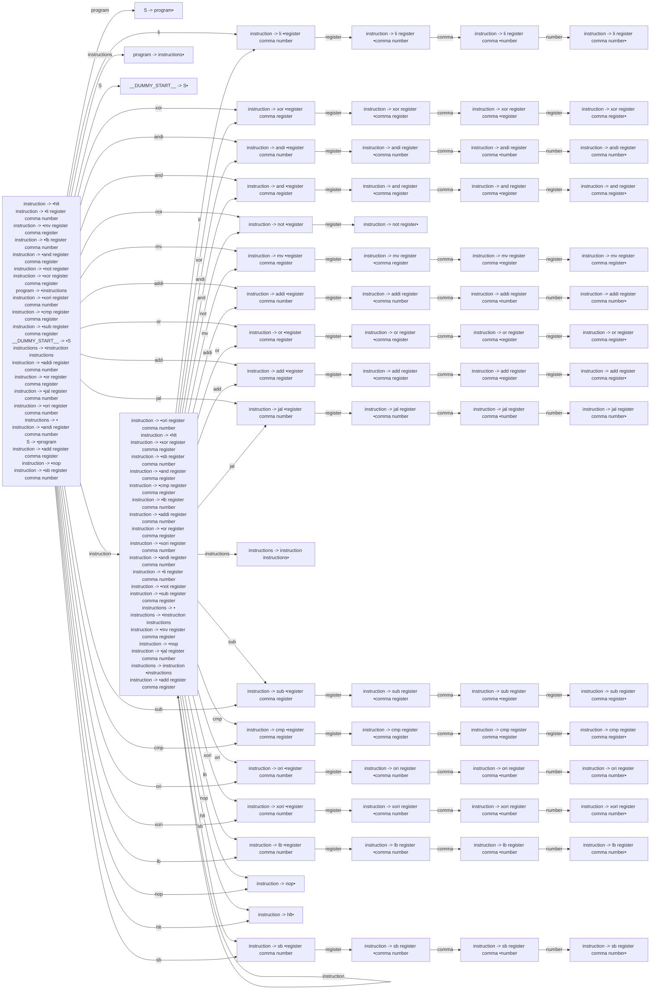

# Generated Info

## Base Info
- config_file: ./conf/rasm.rparser
- output_file: src/rasm_parser.rs
- time: 2023-09-11 16:18:47.226488907 +08:00

---

## DFA Graph


---

## Follow Set
```txt
number: ["nop", "hlt", "xor", "li", "sb", "and", "xori", "__$__", "ori", "addi", "jal", "sub", "mv", "add", "andi", "not", "cmp", "lb", "or"]
xor: ["register"]
instruction: ["ori", "addi", "xori", "hlt", "li", "xor", "jal", "not", "__$__", "lb", "add", "sub", "mv", "sb", "cmp", "andi", "and", "or", "nop"]
program: ["__$__"]
__DUMMY_START__: ["__$__"]
register: ["jal", "li", "ori", "xori", "hlt", "xor", "sub", "lb", "__$__", "and", "addi", "or", "cmp", "andi", "add", "mv", "nop", "not", "sb", "comma"]
mv: ["register"]
lb: ["register"]
sub: ["register"]
S: ["__$__"]
sb: ["register"]
and: ["register"]
andi: ["register"]
instructions: ["__$__"]
ori: ["register"]
not: ["register"]
li: ["register"]
__$__: []
__EPSILON__: ["__$__"]
add: ["register"]
xori: ["register"]
cmp: ["register"]
comma: ["register", "number"]
jal: ["register"]
nop: ["ori", "nop", "hlt", "lb", "cmp", "xori", "add", "sub", "mv", "andi", "li", "__$__", "xor", "jal", "or", "not", "and", "addi", "sb"]
hlt: ["andi", "and", "add", "__$__", "cmp", "sb", "xori", "sub", "xor", "or", "not", "hlt", "li", "mv", "nop", "ori", "lb", "addi", "jal"]
or: ["register"]
addi: ["register"]
```

---
## Action Table
```txt
State 0:
instruction: Shift(40)
sb: Shift(64)
ori: Shift(50)
xori: Shift(54)
and: Shift(13)
__$__: Accept
not: Shift(17)
andi: Shift(9)
add: Shift(31)
li: Shift(1)
program: Shift(35)
lb: Shift(58)
nop: Shift(62)
sub: Shift(42)
jal: Shift(36)
xor: Shift(5)
mv: Shift(19)
or: Shift(27)
cmp: Shift(46)
hlt: Shift(63)
S: Shift(69)
addi: Shift(23)
instructions: Shift(68)
===================
State 1:
register: Shift(2)
===================
State 2:
comma: Shift(3)
===================
State 3:
number: Shift(4)
===================
State 4:
xori: Reduce(ReduceDerivation { left: "instruction", right: ["li", "register", "comma", "number"] })
sb: Reduce(ReduceDerivation { left: "instruction", right: ["li", "register", "comma", "number"] })
add: Reduce(ReduceDerivation { left: "instruction", right: ["li", "register", "comma", "number"] })
or: Reduce(ReduceDerivation { left: "instruction", right: ["li", "register", "comma", "number"] })
mv: Reduce(ReduceDerivation { left: "instruction", right: ["li", "register", "comma", "number"] })
xor: Reduce(ReduceDerivation { left: "instruction", right: ["li", "register", "comma", "number"] })
lb: Reduce(ReduceDerivation { left: "instruction", right: ["li", "register", "comma", "number"] })
sub: Reduce(ReduceDerivation { left: "instruction", right: ["li", "register", "comma", "number"] })
ori: Reduce(ReduceDerivation { left: "instruction", right: ["li", "register", "comma", "number"] })
and: Reduce(ReduceDerivation { left: "instruction", right: ["li", "register", "comma", "number"] })
not: Reduce(ReduceDerivation { left: "instruction", right: ["li", "register", "comma", "number"] })
hlt: Reduce(ReduceDerivation { left: "instruction", right: ["li", "register", "comma", "number"] })
andi: Reduce(ReduceDerivation { left: "instruction", right: ["li", "register", "comma", "number"] })
cmp: Reduce(ReduceDerivation { left: "instruction", right: ["li", "register", "comma", "number"] })
li: Reduce(ReduceDerivation { left: "instruction", right: ["li", "register", "comma", "number"] })
jal: Reduce(ReduceDerivation { left: "instruction", right: ["li", "register", "comma", "number"] })
__$__: Reduce(ReduceDerivation { left: "instruction", right: ["li", "register", "comma", "number"] })
addi: Reduce(ReduceDerivation { left: "instruction", right: ["li", "register", "comma", "number"] })
nop: Reduce(ReduceDerivation { left: "instruction", right: ["li", "register", "comma", "number"] })
===================
State 5:
register: Shift(6)
===================
State 6:
comma: Shift(7)
===================
State 7:
register: Shift(8)
===================
State 8:
mv: Reduce(ReduceDerivation { left: "instruction", right: ["xor", "register", "comma", "register"] })
li: Reduce(ReduceDerivation { left: "instruction", right: ["xor", "register", "comma", "register"] })
xori: Reduce(ReduceDerivation { left: "instruction", right: ["xor", "register", "comma", "register"] })
sub: Reduce(ReduceDerivation { left: "instruction", right: ["xor", "register", "comma", "register"] })
or: Reduce(ReduceDerivation { left: "instruction", right: ["xor", "register", "comma", "register"] })
__$__: Reduce(ReduceDerivation { left: "instruction", right: ["xor", "register", "comma", "register"] })
xor: Reduce(ReduceDerivation { left: "instruction", right: ["xor", "register", "comma", "register"] })
cmp: Reduce(ReduceDerivation { left: "instruction", right: ["xor", "register", "comma", "register"] })
not: Reduce(ReduceDerivation { left: "instruction", right: ["xor", "register", "comma", "register"] })
addi: Reduce(ReduceDerivation { left: "instruction", right: ["xor", "register", "comma", "register"] })
lb: Reduce(ReduceDerivation { left: "instruction", right: ["xor", "register", "comma", "register"] })
and: Reduce(ReduceDerivation { left: "instruction", right: ["xor", "register", "comma", "register"] })
hlt: Reduce(ReduceDerivation { left: "instruction", right: ["xor", "register", "comma", "register"] })
jal: Reduce(ReduceDerivation { left: "instruction", right: ["xor", "register", "comma", "register"] })
nop: Reduce(ReduceDerivation { left: "instruction", right: ["xor", "register", "comma", "register"] })
sb: Reduce(ReduceDerivation { left: "instruction", right: ["xor", "register", "comma", "register"] })
add: Reduce(ReduceDerivation { left: "instruction", right: ["xor", "register", "comma", "register"] })
ori: Reduce(ReduceDerivation { left: "instruction", right: ["xor", "register", "comma", "register"] })
andi: Reduce(ReduceDerivation { left: "instruction", right: ["xor", "register", "comma", "register"] })
===================
State 9:
register: Shift(10)
===================
State 10:
comma: Shift(11)
===================
State 11:
number: Shift(12)
===================
State 12:
add: Reduce(ReduceDerivation { left: "instruction", right: ["andi", "register", "comma", "number"] })
cmp: Reduce(ReduceDerivation { left: "instruction", right: ["andi", "register", "comma", "number"] })
or: Reduce(ReduceDerivation { left: "instruction", right: ["andi", "register", "comma", "number"] })
xor: Reduce(ReduceDerivation { left: "instruction", right: ["andi", "register", "comma", "number"] })
li: Reduce(ReduceDerivation { left: "instruction", right: ["andi", "register", "comma", "number"] })
not: Reduce(ReduceDerivation { left: "instruction", right: ["andi", "register", "comma", "number"] })
nop: Reduce(ReduceDerivation { left: "instruction", right: ["andi", "register", "comma", "number"] })
ori: Reduce(ReduceDerivation { left: "instruction", right: ["andi", "register", "comma", "number"] })
sub: Reduce(ReduceDerivation { left: "instruction", right: ["andi", "register", "comma", "number"] })
addi: Reduce(ReduceDerivation { left: "instruction", right: ["andi", "register", "comma", "number"] })
lb: Reduce(ReduceDerivation { left: "instruction", right: ["andi", "register", "comma", "number"] })
jal: Reduce(ReduceDerivation { left: "instruction", right: ["andi", "register", "comma", "number"] })
xori: Reduce(ReduceDerivation { left: "instruction", right: ["andi", "register", "comma", "number"] })
sb: Reduce(ReduceDerivation { left: "instruction", right: ["andi", "register", "comma", "number"] })
__$__: Reduce(ReduceDerivation { left: "instruction", right: ["andi", "register", "comma", "number"] })
andi: Reduce(ReduceDerivation { left: "instruction", right: ["andi", "register", "comma", "number"] })
mv: Reduce(ReduceDerivation { left: "instruction", right: ["andi", "register", "comma", "number"] })
hlt: Reduce(ReduceDerivation { left: "instruction", right: ["andi", "register", "comma", "number"] })
and: Reduce(ReduceDerivation { left: "instruction", right: ["andi", "register", "comma", "number"] })
===================
State 13:
register: Shift(14)
===================
State 14:
comma: Shift(15)
===================
State 15:
register: Shift(16)
===================
State 16:
addi: Reduce(ReduceDerivation { left: "instruction", right: ["and", "register", "comma", "register"] })
and: Reduce(ReduceDerivation { left: "instruction", right: ["and", "register", "comma", "register"] })
sub: Reduce(ReduceDerivation { left: "instruction", right: ["and", "register", "comma", "register"] })
jal: Reduce(ReduceDerivation { left: "instruction", right: ["and", "register", "comma", "register"] })
lb: Reduce(ReduceDerivation { left: "instruction", right: ["and", "register", "comma", "register"] })
andi: Reduce(ReduceDerivation { left: "instruction", right: ["and", "register", "comma", "register"] })
add: Reduce(ReduceDerivation { left: "instruction", right: ["and", "register", "comma", "register"] })
nop: Reduce(ReduceDerivation { left: "instruction", right: ["and", "register", "comma", "register"] })
mv: Reduce(ReduceDerivation { left: "instruction", right: ["and", "register", "comma", "register"] })
not: Reduce(ReduceDerivation { left: "instruction", right: ["and", "register", "comma", "register"] })
__$__: Reduce(ReduceDerivation { left: "instruction", right: ["and", "register", "comma", "register"] })
or: Reduce(ReduceDerivation { left: "instruction", right: ["and", "register", "comma", "register"] })
li: Reduce(ReduceDerivation { left: "instruction", right: ["and", "register", "comma", "register"] })
ori: Reduce(ReduceDerivation { left: "instruction", right: ["and", "register", "comma", "register"] })
sb: Reduce(ReduceDerivation { left: "instruction", right: ["and", "register", "comma", "register"] })
xori: Reduce(ReduceDerivation { left: "instruction", right: ["and", "register", "comma", "register"] })
xor: Reduce(ReduceDerivation { left: "instruction", right: ["and", "register", "comma", "register"] })
hlt: Reduce(ReduceDerivation { left: "instruction", right: ["and", "register", "comma", "register"] })
cmp: Reduce(ReduceDerivation { left: "instruction", right: ["and", "register", "comma", "register"] })
===================
State 17:
register: Shift(18)
===================
State 18:
addi: Reduce(ReduceDerivation { left: "instruction", right: ["not", "register"] })
xor: Reduce(ReduceDerivation { left: "instruction", right: ["not", "register"] })
sb: Reduce(ReduceDerivation { left: "instruction", right: ["not", "register"] })
mv: Reduce(ReduceDerivation { left: "instruction", right: ["not", "register"] })
nop: Reduce(ReduceDerivation { left: "instruction", right: ["not", "register"] })
lb: Reduce(ReduceDerivation { left: "instruction", right: ["not", "register"] })
__$__: Reduce(ReduceDerivation { left: "instruction", right: ["not", "register"] })
or: Reduce(ReduceDerivation { left: "instruction", right: ["not", "register"] })
not: Reduce(ReduceDerivation { left: "instruction", right: ["not", "register"] })
sub: Reduce(ReduceDerivation { left: "instruction", right: ["not", "register"] })
hlt: Reduce(ReduceDerivation { left: "instruction", right: ["not", "register"] })
and: Reduce(ReduceDerivation { left: "instruction", right: ["not", "register"] })
jal: Reduce(ReduceDerivation { left: "instruction", right: ["not", "register"] })
andi: Reduce(ReduceDerivation { left: "instruction", right: ["not", "register"] })
li: Reduce(ReduceDerivation { left: "instruction", right: ["not", "register"] })
cmp: Reduce(ReduceDerivation { left: "instruction", right: ["not", "register"] })
ori: Reduce(ReduceDerivation { left: "instruction", right: ["not", "register"] })
xori: Reduce(ReduceDerivation { left: "instruction", right: ["not", "register"] })
add: Reduce(ReduceDerivation { left: "instruction", right: ["not", "register"] })
===================
State 19:
register: Shift(20)
===================
State 20:
comma: Shift(21)
===================
State 21:
register: Shift(22)
===================
State 22:
ori: Reduce(ReduceDerivation { left: "instruction", right: ["mv", "register", "comma", "register"] })
add: Reduce(ReduceDerivation { left: "instruction", right: ["mv", "register", "comma", "register"] })
lb: Reduce(ReduceDerivation { left: "instruction", right: ["mv", "register", "comma", "register"] })
andi: Reduce(ReduceDerivation { left: "instruction", right: ["mv", "register", "comma", "register"] })
cmp: Reduce(ReduceDerivation { left: "instruction", right: ["mv", "register", "comma", "register"] })
li: Reduce(ReduceDerivation { left: "instruction", right: ["mv", "register", "comma", "register"] })
jal: Reduce(ReduceDerivation { left: "instruction", right: ["mv", "register", "comma", "register"] })
sb: Reduce(ReduceDerivation { left: "instruction", right: ["mv", "register", "comma", "register"] })
not: Reduce(ReduceDerivation { left: "instruction", right: ["mv", "register", "comma", "register"] })
or: Reduce(ReduceDerivation { left: "instruction", right: ["mv", "register", "comma", "register"] })
and: Reduce(ReduceDerivation { left: "instruction", right: ["mv", "register", "comma", "register"] })
hlt: Reduce(ReduceDerivation { left: "instruction", right: ["mv", "register", "comma", "register"] })
addi: Reduce(ReduceDerivation { left: "instruction", right: ["mv", "register", "comma", "register"] })
xori: Reduce(ReduceDerivation { left: "instruction", right: ["mv", "register", "comma", "register"] })
mv: Reduce(ReduceDerivation { left: "instruction", right: ["mv", "register", "comma", "register"] })
xor: Reduce(ReduceDerivation { left: "instruction", right: ["mv", "register", "comma", "register"] })
sub: Reduce(ReduceDerivation { left: "instruction", right: ["mv", "register", "comma", "register"] })
__$__: Reduce(ReduceDerivation { left: "instruction", right: ["mv", "register", "comma", "register"] })
nop: Reduce(ReduceDerivation { left: "instruction", right: ["mv", "register", "comma", "register"] })
===================
State 23:
register: Shift(24)
===================
State 24:
comma: Shift(25)
===================
State 25:
number: Shift(26)
===================
State 26:
andi: Reduce(ReduceDerivation { left: "instruction", right: ["addi", "register", "comma", "number"] })
hlt: Reduce(ReduceDerivation { left: "instruction", right: ["addi", "register", "comma", "number"] })
or: Reduce(ReduceDerivation { left: "instruction", right: ["addi", "register", "comma", "number"] })
jal: Reduce(ReduceDerivation { left: "instruction", right: ["addi", "register", "comma", "number"] })
ori: Reduce(ReduceDerivation { left: "instruction", right: ["addi", "register", "comma", "number"] })
addi: Reduce(ReduceDerivation { left: "instruction", right: ["addi", "register", "comma", "number"] })
lb: Reduce(ReduceDerivation { left: "instruction", right: ["addi", "register", "comma", "number"] })
and: Reduce(ReduceDerivation { left: "instruction", right: ["addi", "register", "comma", "number"] })
mv: Reduce(ReduceDerivation { left: "instruction", right: ["addi", "register", "comma", "number"] })
__$__: Reduce(ReduceDerivation { left: "instruction", right: ["addi", "register", "comma", "number"] })
not: Reduce(ReduceDerivation { left: "instruction", right: ["addi", "register", "comma", "number"] })
sb: Reduce(ReduceDerivation { left: "instruction", right: ["addi", "register", "comma", "number"] })
add: Reduce(ReduceDerivation { left: "instruction", right: ["addi", "register", "comma", "number"] })
nop: Reduce(ReduceDerivation { left: "instruction", right: ["addi", "register", "comma", "number"] })
xori: Reduce(ReduceDerivation { left: "instruction", right: ["addi", "register", "comma", "number"] })
sub: Reduce(ReduceDerivation { left: "instruction", right: ["addi", "register", "comma", "number"] })
li: Reduce(ReduceDerivation { left: "instruction", right: ["addi", "register", "comma", "number"] })
xor: Reduce(ReduceDerivation { left: "instruction", right: ["addi", "register", "comma", "number"] })
cmp: Reduce(ReduceDerivation { left: "instruction", right: ["addi", "register", "comma", "number"] })
===================
State 27:
register: Shift(28)
===================
State 28:
comma: Shift(29)
===================
State 29:
register: Shift(30)
===================
State 30:
addi: Reduce(ReduceDerivation { left: "instruction", right: ["or", "register", "comma", "register"] })
sub: Reduce(ReduceDerivation { left: "instruction", right: ["or", "register", "comma", "register"] })
sb: Reduce(ReduceDerivation { left: "instruction", right: ["or", "register", "comma", "register"] })
hlt: Reduce(ReduceDerivation { left: "instruction", right: ["or", "register", "comma", "register"] })
li: Reduce(ReduceDerivation { left: "instruction", right: ["or", "register", "comma", "register"] })
xori: Reduce(ReduceDerivation { left: "instruction", right: ["or", "register", "comma", "register"] })
__$__: Reduce(ReduceDerivation { left: "instruction", right: ["or", "register", "comma", "register"] })
add: Reduce(ReduceDerivation { left: "instruction", right: ["or", "register", "comma", "register"] })
andi: Reduce(ReduceDerivation { left: "instruction", right: ["or", "register", "comma", "register"] })
ori: Reduce(ReduceDerivation { left: "instruction", right: ["or", "register", "comma", "register"] })
mv: Reduce(ReduceDerivation { left: "instruction", right: ["or", "register", "comma", "register"] })
not: Reduce(ReduceDerivation { left: "instruction", right: ["or", "register", "comma", "register"] })
or: Reduce(ReduceDerivation { left: "instruction", right: ["or", "register", "comma", "register"] })
and: Reduce(ReduceDerivation { left: "instruction", right: ["or", "register", "comma", "register"] })
xor: Reduce(ReduceDerivation { left: "instruction", right: ["or", "register", "comma", "register"] })
cmp: Reduce(ReduceDerivation { left: "instruction", right: ["or", "register", "comma", "register"] })
jal: Reduce(ReduceDerivation { left: "instruction", right: ["or", "register", "comma", "register"] })
lb: Reduce(ReduceDerivation { left: "instruction", right: ["or", "register", "comma", "register"] })
nop: Reduce(ReduceDerivation { left: "instruction", right: ["or", "register", "comma", "register"] })
===================
State 31:
register: Shift(32)
===================
State 32:
comma: Shift(33)
===================
State 33:
register: Shift(34)
===================
State 34:
xor: Reduce(ReduceDerivation { left: "instruction", right: ["add", "register", "comma", "register"] })
mv: Reduce(ReduceDerivation { left: "instruction", right: ["add", "register", "comma", "register"] })
addi: Reduce(ReduceDerivation { left: "instruction", right: ["add", "register", "comma", "register"] })
add: Reduce(ReduceDerivation { left: "instruction", right: ["add", "register", "comma", "register"] })
sb: Reduce(ReduceDerivation { left: "instruction", right: ["add", "register", "comma", "register"] })
nop: Reduce(ReduceDerivation { left: "instruction", right: ["add", "register", "comma", "register"] })
jal: Reduce(ReduceDerivation { left: "instruction", right: ["add", "register", "comma", "register"] })
hlt: Reduce(ReduceDerivation { left: "instruction", right: ["add", "register", "comma", "register"] })
andi: Reduce(ReduceDerivation { left: "instruction", right: ["add", "register", "comma", "register"] })
ori: Reduce(ReduceDerivation { left: "instruction", right: ["add", "register", "comma", "register"] })
__$__: Reduce(ReduceDerivation { left: "instruction", right: ["add", "register", "comma", "register"] })
li: Reduce(ReduceDerivation { left: "instruction", right: ["add", "register", "comma", "register"] })
and: Reduce(ReduceDerivation { left: "instruction", right: ["add", "register", "comma", "register"] })
not: Reduce(ReduceDerivation { left: "instruction", right: ["add", "register", "comma", "register"] })
lb: Reduce(ReduceDerivation { left: "instruction", right: ["add", "register", "comma", "register"] })
xori: Reduce(ReduceDerivation { left: "instruction", right: ["add", "register", "comma", "register"] })
cmp: Reduce(ReduceDerivation { left: "instruction", right: ["add", "register", "comma", "register"] })
or: Reduce(ReduceDerivation { left: "instruction", right: ["add", "register", "comma", "register"] })
sub: Reduce(ReduceDerivation { left: "instruction", right: ["add", "register", "comma", "register"] })
===================
State 35:
__$__: Reduce(ReduceDerivation { left: "S", right: ["program"] })
===================
State 36:
register: Shift(37)
===================
State 37:
comma: Shift(38)
===================
State 38:
number: Shift(39)
===================
State 39:
add: Reduce(ReduceDerivation { left: "instruction", right: ["jal", "register", "comma", "number"] })
not: Reduce(ReduceDerivation { left: "instruction", right: ["jal", "register", "comma", "number"] })
mv: Reduce(ReduceDerivation { left: "instruction", right: ["jal", "register", "comma", "number"] })
and: Reduce(ReduceDerivation { left: "instruction", right: ["jal", "register", "comma", "number"] })
nop: Reduce(ReduceDerivation { left: "instruction", right: ["jal", "register", "comma", "number"] })
__$__: Reduce(ReduceDerivation { left: "instruction", right: ["jal", "register", "comma", "number"] })
xor: Reduce(ReduceDerivation { left: "instruction", right: ["jal", "register", "comma", "number"] })
andi: Reduce(ReduceDerivation { left: "instruction", right: ["jal", "register", "comma", "number"] })
xori: Reduce(ReduceDerivation { left: "instruction", right: ["jal", "register", "comma", "number"] })
sub: Reduce(ReduceDerivation { left: "instruction", right: ["jal", "register", "comma", "number"] })
jal: Reduce(ReduceDerivation { left: "instruction", right: ["jal", "register", "comma", "number"] })
ori: Reduce(ReduceDerivation { left: "instruction", right: ["jal", "register", "comma", "number"] })
addi: Reduce(ReduceDerivation { left: "instruction", right: ["jal", "register", "comma", "number"] })
sb: Reduce(ReduceDerivation { left: "instruction", right: ["jal", "register", "comma", "number"] })
cmp: Reduce(ReduceDerivation { left: "instruction", right: ["jal", "register", "comma", "number"] })
lb: Reduce(ReduceDerivation { left: "instruction", right: ["jal", "register", "comma", "number"] })
li: Reduce(ReduceDerivation { left: "instruction", right: ["jal", "register", "comma", "number"] })
or: Reduce(ReduceDerivation { left: "instruction", right: ["jal", "register", "comma", "number"] })
hlt: Reduce(ReduceDerivation { left: "instruction", right: ["jal", "register", "comma", "number"] })
===================
State 40:
not: Shift(17)
andi: Shift(9)
jal: Shift(36)
add: Shift(31)
ori: Shift(50)
instruction: Shift(40)
and: Shift(13)
nop: Shift(62)
mv: Shift(19)
sb: Shift(64)
lb: Shift(58)
instructions: Shift(41)
xori: Shift(54)
addi: Shift(23)
hlt: Shift(63)
__$__: Reduce(ReduceDerivation { left: "instructions", right: [] })
xor: Shift(5)
or: Shift(27)
li: Shift(1)
sub: Shift(42)
cmp: Shift(46)
===================
State 41:
__$__: Reduce(ReduceDerivation { left: "instructions", right: ["instruction", "instructions"] })
===================
State 42:
register: Shift(43)
===================
State 43:
comma: Shift(44)
===================
State 44:
register: Shift(45)
===================
State 45:
xori: Reduce(ReduceDerivation { left: "instruction", right: ["sub", "register", "comma", "register"] })
__$__: Reduce(ReduceDerivation { left: "instruction", right: ["sub", "register", "comma", "register"] })
add: Reduce(ReduceDerivation { left: "instruction", right: ["sub", "register", "comma", "register"] })
sub: Reduce(ReduceDerivation { left: "instruction", right: ["sub", "register", "comma", "register"] })
mv: Reduce(ReduceDerivation { left: "instruction", right: ["sub", "register", "comma", "register"] })
sb: Reduce(ReduceDerivation { left: "instruction", right: ["sub", "register", "comma", "register"] })
and: Reduce(ReduceDerivation { left: "instruction", right: ["sub", "register", "comma", "register"] })
nop: Reduce(ReduceDerivation { left: "instruction", right: ["sub", "register", "comma", "register"] })
hlt: Reduce(ReduceDerivation { left: "instruction", right: ["sub", "register", "comma", "register"] })
or: Reduce(ReduceDerivation { left: "instruction", right: ["sub", "register", "comma", "register"] })
xor: Reduce(ReduceDerivation { left: "instruction", right: ["sub", "register", "comma", "register"] })
li: Reduce(ReduceDerivation { left: "instruction", right: ["sub", "register", "comma", "register"] })
addi: Reduce(ReduceDerivation { left: "instruction", right: ["sub", "register", "comma", "register"] })
andi: Reduce(ReduceDerivation { left: "instruction", right: ["sub", "register", "comma", "register"] })
jal: Reduce(ReduceDerivation { left: "instruction", right: ["sub", "register", "comma", "register"] })
not: Reduce(ReduceDerivation { left: "instruction", right: ["sub", "register", "comma", "register"] })
ori: Reduce(ReduceDerivation { left: "instruction", right: ["sub", "register", "comma", "register"] })
cmp: Reduce(ReduceDerivation { left: "instruction", right: ["sub", "register", "comma", "register"] })
lb: Reduce(ReduceDerivation { left: "instruction", right: ["sub", "register", "comma", "register"] })
===================
State 46:
register: Shift(47)
===================
State 47:
comma: Shift(48)
===================
State 48:
register: Shift(49)
===================
State 49:
or: Reduce(ReduceDerivation { left: "instruction", right: ["cmp", "register", "comma", "register"] })
and: Reduce(ReduceDerivation { left: "instruction", right: ["cmp", "register", "comma", "register"] })
sb: Reduce(ReduceDerivation { left: "instruction", right: ["cmp", "register", "comma", "register"] })
not: Reduce(ReduceDerivation { left: "instruction", right: ["cmp", "register", "comma", "register"] })
__$__: Reduce(ReduceDerivation { left: "instruction", right: ["cmp", "register", "comma", "register"] })
lb: Reduce(ReduceDerivation { left: "instruction", right: ["cmp", "register", "comma", "register"] })
cmp: Reduce(ReduceDerivation { left: "instruction", right: ["cmp", "register", "comma", "register"] })
sub: Reduce(ReduceDerivation { left: "instruction", right: ["cmp", "register", "comma", "register"] })
hlt: Reduce(ReduceDerivation { left: "instruction", right: ["cmp", "register", "comma", "register"] })
mv: Reduce(ReduceDerivation { left: "instruction", right: ["cmp", "register", "comma", "register"] })
jal: Reduce(ReduceDerivation { left: "instruction", right: ["cmp", "register", "comma", "register"] })
li: Reduce(ReduceDerivation { left: "instruction", right: ["cmp", "register", "comma", "register"] })
xor: Reduce(ReduceDerivation { left: "instruction", right: ["cmp", "register", "comma", "register"] })
addi: Reduce(ReduceDerivation { left: "instruction", right: ["cmp", "register", "comma", "register"] })
add: Reduce(ReduceDerivation { left: "instruction", right: ["cmp", "register", "comma", "register"] })
nop: Reduce(ReduceDerivation { left: "instruction", right: ["cmp", "register", "comma", "register"] })
xori: Reduce(ReduceDerivation { left: "instruction", right: ["cmp", "register", "comma", "register"] })
ori: Reduce(ReduceDerivation { left: "instruction", right: ["cmp", "register", "comma", "register"] })
andi: Reduce(ReduceDerivation { left: "instruction", right: ["cmp", "register", "comma", "register"] })
===================
State 50:
register: Shift(51)
===================
State 51:
comma: Shift(52)
===================
State 52:
number: Shift(53)
===================
State 53:
hlt: Reduce(ReduceDerivation { left: "instruction", right: ["ori", "register", "comma", "number"] })
jal: Reduce(ReduceDerivation { left: "instruction", right: ["ori", "register", "comma", "number"] })
xor: Reduce(ReduceDerivation { left: "instruction", right: ["ori", "register", "comma", "number"] })
not: Reduce(ReduceDerivation { left: "instruction", right: ["ori", "register", "comma", "number"] })
xori: Reduce(ReduceDerivation { left: "instruction", right: ["ori", "register", "comma", "number"] })
cmp: Reduce(ReduceDerivation { left: "instruction", right: ["ori", "register", "comma", "number"] })
nop: Reduce(ReduceDerivation { left: "instruction", right: ["ori", "register", "comma", "number"] })
sub: Reduce(ReduceDerivation { left: "instruction", right: ["ori", "register", "comma", "number"] })
__$__: Reduce(ReduceDerivation { left: "instruction", right: ["ori", "register", "comma", "number"] })
or: Reduce(ReduceDerivation { left: "instruction", right: ["ori", "register", "comma", "number"] })
sb: Reduce(ReduceDerivation { left: "instruction", right: ["ori", "register", "comma", "number"] })
and: Reduce(ReduceDerivation { left: "instruction", right: ["ori", "register", "comma", "number"] })
li: Reduce(ReduceDerivation { left: "instruction", right: ["ori", "register", "comma", "number"] })
mv: Reduce(ReduceDerivation { left: "instruction", right: ["ori", "register", "comma", "number"] })
andi: Reduce(ReduceDerivation { left: "instruction", right: ["ori", "register", "comma", "number"] })
ori: Reduce(ReduceDerivation { left: "instruction", right: ["ori", "register", "comma", "number"] })
add: Reduce(ReduceDerivation { left: "instruction", right: ["ori", "register", "comma", "number"] })
addi: Reduce(ReduceDerivation { left: "instruction", right: ["ori", "register", "comma", "number"] })
lb: Reduce(ReduceDerivation { left: "instruction", right: ["ori", "register", "comma", "number"] })
===================
State 54:
register: Shift(55)
===================
State 55:
comma: Shift(56)
===================
State 56:
number: Shift(57)
===================
State 57:
li: Reduce(ReduceDerivation { left: "instruction", right: ["xori", "register", "comma", "number"] })
lb: Reduce(ReduceDerivation { left: "instruction", right: ["xori", "register", "comma", "number"] })
andi: Reduce(ReduceDerivation { left: "instruction", right: ["xori", "register", "comma", "number"] })
__$__: Reduce(ReduceDerivation { left: "instruction", right: ["xori", "register", "comma", "number"] })
mv: Reduce(ReduceDerivation { left: "instruction", right: ["xori", "register", "comma", "number"] })
xor: Reduce(ReduceDerivation { left: "instruction", right: ["xori", "register", "comma", "number"] })
cmp: Reduce(ReduceDerivation { left: "instruction", right: ["xori", "register", "comma", "number"] })
sub: Reduce(ReduceDerivation { left: "instruction", right: ["xori", "register", "comma", "number"] })
addi: Reduce(ReduceDerivation { left: "instruction", right: ["xori", "register", "comma", "number"] })
jal: Reduce(ReduceDerivation { left: "instruction", right: ["xori", "register", "comma", "number"] })
or: Reduce(ReduceDerivation { left: "instruction", right: ["xori", "register", "comma", "number"] })
xori: Reduce(ReduceDerivation { left: "instruction", right: ["xori", "register", "comma", "number"] })
ori: Reduce(ReduceDerivation { left: "instruction", right: ["xori", "register", "comma", "number"] })
sb: Reduce(ReduceDerivation { left: "instruction", right: ["xori", "register", "comma", "number"] })
add: Reduce(ReduceDerivation { left: "instruction", right: ["xori", "register", "comma", "number"] })
and: Reduce(ReduceDerivation { left: "instruction", right: ["xori", "register", "comma", "number"] })
hlt: Reduce(ReduceDerivation { left: "instruction", right: ["xori", "register", "comma", "number"] })
nop: Reduce(ReduceDerivation { left: "instruction", right: ["xori", "register", "comma", "number"] })
not: Reduce(ReduceDerivation { left: "instruction", right: ["xori", "register", "comma", "number"] })
===================
State 58:
register: Shift(59)
===================
State 59:
comma: Shift(60)
===================
State 60:
number: Shift(61)
===================
State 61:
cmp: Reduce(ReduceDerivation { left: "instruction", right: ["lb", "register", "comma", "number"] })
addi: Reduce(ReduceDerivation { left: "instruction", right: ["lb", "register", "comma", "number"] })
xor: Reduce(ReduceDerivation { left: "instruction", right: ["lb", "register", "comma", "number"] })
and: Reduce(ReduceDerivation { left: "instruction", right: ["lb", "register", "comma", "number"] })
__$__: Reduce(ReduceDerivation { left: "instruction", right: ["lb", "register", "comma", "number"] })
nop: Reduce(ReduceDerivation { left: "instruction", right: ["lb", "register", "comma", "number"] })
sb: Reduce(ReduceDerivation { left: "instruction", right: ["lb", "register", "comma", "number"] })
ori: Reduce(ReduceDerivation { left: "instruction", right: ["lb", "register", "comma", "number"] })
lb: Reduce(ReduceDerivation { left: "instruction", right: ["lb", "register", "comma", "number"] })
add: Reduce(ReduceDerivation { left: "instruction", right: ["lb", "register", "comma", "number"] })
sub: Reduce(ReduceDerivation { left: "instruction", right: ["lb", "register", "comma", "number"] })
mv: Reduce(ReduceDerivation { left: "instruction", right: ["lb", "register", "comma", "number"] })
li: Reduce(ReduceDerivation { left: "instruction", right: ["lb", "register", "comma", "number"] })
jal: Reduce(ReduceDerivation { left: "instruction", right: ["lb", "register", "comma", "number"] })
not: Reduce(ReduceDerivation { left: "instruction", right: ["lb", "register", "comma", "number"] })
andi: Reduce(ReduceDerivation { left: "instruction", right: ["lb", "register", "comma", "number"] })
xori: Reduce(ReduceDerivation { left: "instruction", right: ["lb", "register", "comma", "number"] })
hlt: Reduce(ReduceDerivation { left: "instruction", right: ["lb", "register", "comma", "number"] })
or: Reduce(ReduceDerivation { left: "instruction", right: ["lb", "register", "comma", "number"] })
===================
State 62:
xor: Reduce(ReduceDerivation { left: "instruction", right: ["nop"] })
sub: Reduce(ReduceDerivation { left: "instruction", right: ["nop"] })
andi: Reduce(ReduceDerivation { left: "instruction", right: ["nop"] })
and: Reduce(ReduceDerivation { left: "instruction", right: ["nop"] })
cmp: Reduce(ReduceDerivation { left: "instruction", right: ["nop"] })
mv: Reduce(ReduceDerivation { left: "instruction", right: ["nop"] })
add: Reduce(ReduceDerivation { left: "instruction", right: ["nop"] })
ori: Reduce(ReduceDerivation { left: "instruction", right: ["nop"] })
nop: Reduce(ReduceDerivation { left: "instruction", right: ["nop"] })
hlt: Reduce(ReduceDerivation { left: "instruction", right: ["nop"] })
xori: Reduce(ReduceDerivation { left: "instruction", right: ["nop"] })
jal: Reduce(ReduceDerivation { left: "instruction", right: ["nop"] })
lb: Reduce(ReduceDerivation { left: "instruction", right: ["nop"] })
sb: Reduce(ReduceDerivation { left: "instruction", right: ["nop"] })
or: Reduce(ReduceDerivation { left: "instruction", right: ["nop"] })
__$__: Reduce(ReduceDerivation { left: "instruction", right: ["nop"] })
addi: Reduce(ReduceDerivation { left: "instruction", right: ["nop"] })
not: Reduce(ReduceDerivation { left: "instruction", right: ["nop"] })
li: Reduce(ReduceDerivation { left: "instruction", right: ["nop"] })
===================
State 63:
xori: Reduce(ReduceDerivation { left: "instruction", right: ["hlt"] })
__$__: Reduce(ReduceDerivation { left: "instruction", right: ["hlt"] })
addi: Reduce(ReduceDerivation { left: "instruction", right: ["hlt"] })
sb: Reduce(ReduceDerivation { left: "instruction", right: ["hlt"] })
cmp: Reduce(ReduceDerivation { left: "instruction", right: ["hlt"] })
nop: Reduce(ReduceDerivation { left: "instruction", right: ["hlt"] })
hlt: Reduce(ReduceDerivation { left: "instruction", right: ["hlt"] })
ori: Reduce(ReduceDerivation { left: "instruction", right: ["hlt"] })
jal: Reduce(ReduceDerivation { left: "instruction", right: ["hlt"] })
sub: Reduce(ReduceDerivation { left: "instruction", right: ["hlt"] })
mv: Reduce(ReduceDerivation { left: "instruction", right: ["hlt"] })
and: Reduce(ReduceDerivation { left: "instruction", right: ["hlt"] })
add: Reduce(ReduceDerivation { left: "instruction", right: ["hlt"] })
xor: Reduce(ReduceDerivation { left: "instruction", right: ["hlt"] })
lb: Reduce(ReduceDerivation { left: "instruction", right: ["hlt"] })
andi: Reduce(ReduceDerivation { left: "instruction", right: ["hlt"] })
or: Reduce(ReduceDerivation { left: "instruction", right: ["hlt"] })
li: Reduce(ReduceDerivation { left: "instruction", right: ["hlt"] })
not: Reduce(ReduceDerivation { left: "instruction", right: ["hlt"] })
===================
State 64:
register: Shift(65)
===================
State 65:
comma: Shift(66)
===================
State 66:
number: Shift(67)
===================
State 67:
sb: Reduce(ReduceDerivation { left: "instruction", right: ["sb", "register", "comma", "number"] })
ori: Reduce(ReduceDerivation { left: "instruction", right: ["sb", "register", "comma", "number"] })
andi: Reduce(ReduceDerivation { left: "instruction", right: ["sb", "register", "comma", "number"] })
mv: Reduce(ReduceDerivation { left: "instruction", right: ["sb", "register", "comma", "number"] })
add: Reduce(ReduceDerivation { left: "instruction", right: ["sb", "register", "comma", "number"] })
xori: Reduce(ReduceDerivation { left: "instruction", right: ["sb", "register", "comma", "number"] })
addi: Reduce(ReduceDerivation { left: "instruction", right: ["sb", "register", "comma", "number"] })
and: Reduce(ReduceDerivation { left: "instruction", right: ["sb", "register", "comma", "number"] })
xor: Reduce(ReduceDerivation { left: "instruction", right: ["sb", "register", "comma", "number"] })
hlt: Reduce(ReduceDerivation { left: "instruction", right: ["sb", "register", "comma", "number"] })
li: Reduce(ReduceDerivation { left: "instruction", right: ["sb", "register", "comma", "number"] })
cmp: Reduce(ReduceDerivation { left: "instruction", right: ["sb", "register", "comma", "number"] })
lb: Reduce(ReduceDerivation { left: "instruction", right: ["sb", "register", "comma", "number"] })
or: Reduce(ReduceDerivation { left: "instruction", right: ["sb", "register", "comma", "number"] })
nop: Reduce(ReduceDerivation { left: "instruction", right: ["sb", "register", "comma", "number"] })
sub: Reduce(ReduceDerivation { left: "instruction", right: ["sb", "register", "comma", "number"] })
__$__: Reduce(ReduceDerivation { left: "instruction", right: ["sb", "register", "comma", "number"] })
jal: Reduce(ReduceDerivation { left: "instruction", right: ["sb", "register", "comma", "number"] })
not: Reduce(ReduceDerivation { left: "instruction", right: ["sb", "register", "comma", "number"] })
===================
State 68:
__$__: Reduce(ReduceDerivation { left: "program", right: ["instructions"] })
===================
State 69:
__$__: Reduce(ReduceDerivation { left: "__DUMMY_START__", right: ["S"] })
===================

```
---
generated by rparser
RockRockWhite 2023
    