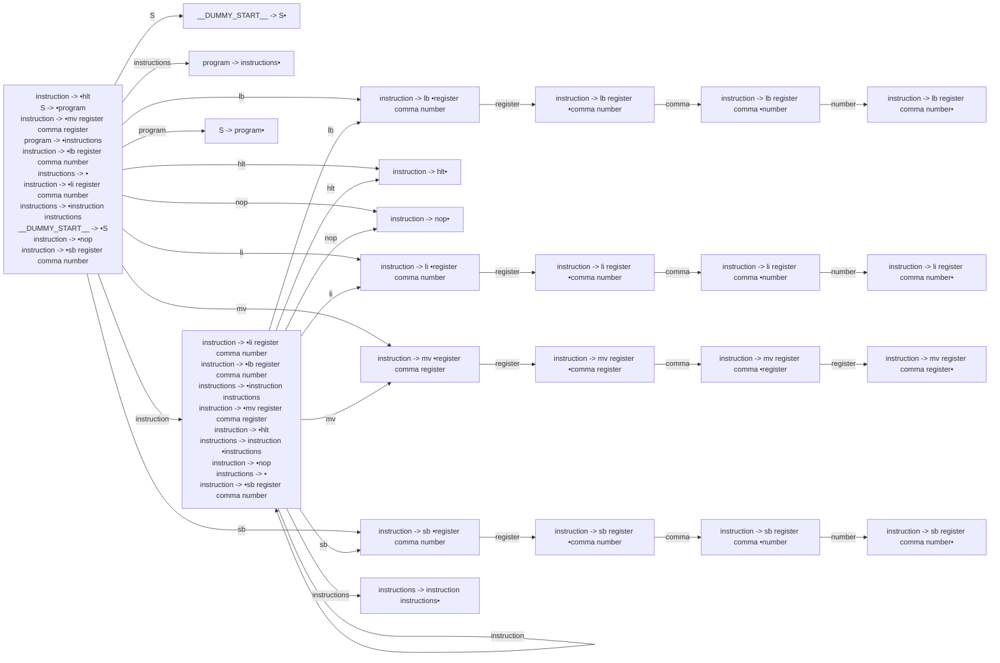

# Generated Info

## Base Info
- config_file: rasm.rparser
- output_file: ../src/rasm_parser.rs
- time: 2023-09-08 15:08:53.893140 +08:00

---

## DFA Graph


---

## Follow Set
```txt
nop: ["sb", "nop", "hlt", "__$__", "lb", "mv", "li"]
__EPSILON__: ["__$__"]
sb: ["register"]
mv: ["register"]
comma: ["number", "register"]
instruction: ["li", "mv", "hlt", "nop", "sb", "lb", "__$__"]
register: ["sb", "lb", "__$__", "comma", "hlt", "li", "nop", "mv"]
li: ["register"]
program: ["__$__"]
lb: ["register"]
S: ["__$__"]
hlt: ["li", "hlt", "nop", "__$__", "mv", "sb", "lb"]
number: ["hlt", "nop", "__$__", "mv", "li", "sb", "lb"]
__DUMMY_START__: ["__$__"]
__$__: []
instructions: ["__$__"]
```

---
## Action Table
```txt
State 0:
hlt: Shift(5)
nop: Shift(7)
S: Shift(6)
mv: Shift(13)
instructions: Shift(8)
program: Shift(23)
li: Shift(9)
__$__: Accept
instruction: Shift(21)
sb: Shift(17)
lb: Shift(1)
===================
State 1:
register: Shift(2)
===================
State 2:
comma: Shift(3)
===================
State 3:
number: Shift(4)
===================
State 4:
lb: Reduce(ReduceDerivation { left: "instruction", right: ["lb", "register", "comma", "number"] })
__$__: Reduce(ReduceDerivation { left: "instruction", right: ["lb", "register", "comma", "number"] })
li: Reduce(ReduceDerivation { left: "instruction", right: ["lb", "register", "comma", "number"] })
hlt: Reduce(ReduceDerivation { left: "instruction", right: ["lb", "register", "comma", "number"] })
nop: Reduce(ReduceDerivation { left: "instruction", right: ["lb", "register", "comma", "number"] })
sb: Reduce(ReduceDerivation { left: "instruction", right: ["lb", "register", "comma", "number"] })
mv: Reduce(ReduceDerivation { left: "instruction", right: ["lb", "register", "comma", "number"] })
===================
State 5:
lb: Reduce(ReduceDerivation { left: "instruction", right: ["hlt"] })
li: Reduce(ReduceDerivation { left: "instruction", right: ["hlt"] })
hlt: Reduce(ReduceDerivation { left: "instruction", right: ["hlt"] })
sb: Reduce(ReduceDerivation { left: "instruction", right: ["hlt"] })
__$__: Reduce(ReduceDerivation { left: "instruction", right: ["hlt"] })
mv: Reduce(ReduceDerivation { left: "instruction", right: ["hlt"] })
nop: Reduce(ReduceDerivation { left: "instruction", right: ["hlt"] })
===================
State 6:
__$__: Reduce(ReduceDerivation { left: "__DUMMY_START__", right: ["S"] })
===================
State 7:
li: Reduce(ReduceDerivation { left: "instruction", right: ["nop"] })
mv: Reduce(ReduceDerivation { left: "instruction", right: ["nop"] })
hlt: Reduce(ReduceDerivation { left: "instruction", right: ["nop"] })
sb: Reduce(ReduceDerivation { left: "instruction", right: ["nop"] })
nop: Reduce(ReduceDerivation { left: "instruction", right: ["nop"] })
lb: Reduce(ReduceDerivation { left: "instruction", right: ["nop"] })
__$__: Reduce(ReduceDerivation { left: "instruction", right: ["nop"] })
===================
State 8:
__$__: Reduce(ReduceDerivation { left: "program", right: ["instructions"] })
===================
State 9:
register: Shift(10)
===================
State 10:
comma: Shift(11)
===================
State 11:
number: Shift(12)
===================
State 12:
nop: Reduce(ReduceDerivation { left: "instruction", right: ["li", "register", "comma", "number"] })
lb: Reduce(ReduceDerivation { left: "instruction", right: ["li", "register", "comma", "number"] })
mv: Reduce(ReduceDerivation { left: "instruction", right: ["li", "register", "comma", "number"] })
__$__: Reduce(ReduceDerivation { left: "instruction", right: ["li", "register", "comma", "number"] })
hlt: Reduce(ReduceDerivation { left: "instruction", right: ["li", "register", "comma", "number"] })
li: Reduce(ReduceDerivation { left: "instruction", right: ["li", "register", "comma", "number"] })
sb: Reduce(ReduceDerivation { left: "instruction", right: ["li", "register", "comma", "number"] })
===================
State 13:
register: Shift(14)
===================
State 14:
comma: Shift(15)
===================
State 15:
register: Shift(16)
===================
State 16:
nop: Reduce(ReduceDerivation { left: "instruction", right: ["mv", "register", "comma", "register"] })
sb: Reduce(ReduceDerivation { left: "instruction", right: ["mv", "register", "comma", "register"] })
hlt: Reduce(ReduceDerivation { left: "instruction", right: ["mv", "register", "comma", "register"] })
__$__: Reduce(ReduceDerivation { left: "instruction", right: ["mv", "register", "comma", "register"] })
lb: Reduce(ReduceDerivation { left: "instruction", right: ["mv", "register", "comma", "register"] })
li: Reduce(ReduceDerivation { left: "instruction", right: ["mv", "register", "comma", "register"] })
mv: Reduce(ReduceDerivation { left: "instruction", right: ["mv", "register", "comma", "register"] })
===================
State 17:
register: Shift(18)
===================
State 18:
comma: Shift(19)
===================
State 19:
number: Shift(20)
===================
State 20:
li: Reduce(ReduceDerivation { left: "instruction", right: ["sb", "register", "comma", "number"] })
hlt: Reduce(ReduceDerivation { left: "instruction", right: ["sb", "register", "comma", "number"] })
lb: Reduce(ReduceDerivation { left: "instruction", right: ["sb", "register", "comma", "number"] })
__$__: Reduce(ReduceDerivation { left: "instruction", right: ["sb", "register", "comma", "number"] })
nop: Reduce(ReduceDerivation { left: "instruction", right: ["sb", "register", "comma", "number"] })
sb: Reduce(ReduceDerivation { left: "instruction", right: ["sb", "register", "comma", "number"] })
mv: Reduce(ReduceDerivation { left: "instruction", right: ["sb", "register", "comma", "number"] })
===================
State 21:
sb: Shift(17)
li: Shift(9)
lb: Shift(1)
mv: Shift(13)
hlt: Shift(5)
instructions: Shift(22)
instruction: Shift(21)
nop: Shift(7)
__$__: Reduce(ReduceDerivation { left: "instructions", right: [] })
===================
State 22:
__$__: Reduce(ReduceDerivation { left: "instructions", right: ["instruction", "instructions"] })
===================
State 23:
__$__: Reduce(ReduceDerivation { left: "S", right: ["program"] })
===================

```
---
generated by rparser
RockRockWhite 2023
    