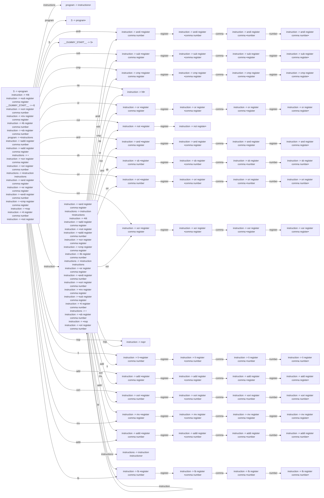

# Generated Info

## Base Info
- config_file: ./conf/rasm.rparser
- output_file: src/rasm_parser.rs
- time: 2023-09-11 13:42:29.209315507 +08:00

---

## DFA Graph


---

## Follow Set
```txt
sub: ["register"]
andi: ["register"]
cmp: ["register"]
__DUMMY_START__: ["__$__"]
hlt: ["nop", "or", "ori", "and", "lb", "andi", "addi", "cmp", "hlt", "mv", "not", "li", "xori", "__$__", "sb", "add", "xor", "sub"]
__EPSILON__: ["__$__"]
xori: ["register"]
S: ["__$__"]
register: ["addi", "nop", "not", "ori", "cmp", "xori", "__$__", "add", "or", "hlt", "sub", "mv", "comma", "li", "and", "andi", "sb", "lb", "xor"]
lb: ["register"]
li: ["register"]
mv: ["register"]
instructions: ["__$__"]
add: ["register"]
not: ["register"]
sb: ["register"]
xor: ["register"]
addi: ["register"]
nop: ["and", "hlt", "not", "sb", "sub", "lb", "andi", "cmp", "addi", "xor", "nop", "add", "or", "xori", "__$__", "ori", "li", "mv"]
instruction: ["ori", "xor", "sub", "sb", "hlt", "li", "addi", "nop", "mv", "__$__", "cmp", "add", "and", "not", "or", "andi", "lb", "xori"]
or: ["register"]
number: ["xor", "hlt", "ori", "or", "add", "sub", "sb", "addi", "and", "not", "__$__", "mv", "nop", "cmp", "li", "andi", "lb", "xori"]
ori: ["register"]
comma: ["register", "number"]
and: ["register"]
program: ["__$__"]
__$__: []
```

---
## Action Table
```txt
State 0:
program: Shift(33)
hlt: Shift(13)
lb: Shift(61)
andi: Shift(1)
instructions: Shift(18)
cmp: Shift(9)
S: Shift(65)
xor: Shift(34)
instruction: Shift(51)
xori: Shift(47)
sub: Shift(5)
or: Shift(14)
addi: Shift(56)
__$__: Accept
and: Shift(21)
mv: Shift(52)
sb: Shift(25)
add: Shift(43)
li: Shift(39)
nop: Shift(38)
not: Shift(19)
ori: Shift(29)
===================
State 1:
register: Shift(2)
===================
State 2:
comma: Shift(3)
===================
State 3:
number: Shift(4)
===================
State 4:
li: Reduce(ReduceDerivation { left: "instruction", right: ["andi", "register", "comma", "number"] })
add: Reduce(ReduceDerivation { left: "instruction", right: ["andi", "register", "comma", "number"] })
sb: Reduce(ReduceDerivation { left: "instruction", right: ["andi", "register", "comma", "number"] })
hlt: Reduce(ReduceDerivation { left: "instruction", right: ["andi", "register", "comma", "number"] })
nop: Reduce(ReduceDerivation { left: "instruction", right: ["andi", "register", "comma", "number"] })
cmp: Reduce(ReduceDerivation { left: "instruction", right: ["andi", "register", "comma", "number"] })
and: Reduce(ReduceDerivation { left: "instruction", right: ["andi", "register", "comma", "number"] })
addi: Reduce(ReduceDerivation { left: "instruction", right: ["andi", "register", "comma", "number"] })
lb: Reduce(ReduceDerivation { left: "instruction", right: ["andi", "register", "comma", "number"] })
not: Reduce(ReduceDerivation { left: "instruction", right: ["andi", "register", "comma", "number"] })
andi: Reduce(ReduceDerivation { left: "instruction", right: ["andi", "register", "comma", "number"] })
xor: Reduce(ReduceDerivation { left: "instruction", right: ["andi", "register", "comma", "number"] })
or: Reduce(ReduceDerivation { left: "instruction", right: ["andi", "register", "comma", "number"] })
xori: Reduce(ReduceDerivation { left: "instruction", right: ["andi", "register", "comma", "number"] })
mv: Reduce(ReduceDerivation { left: "instruction", right: ["andi", "register", "comma", "number"] })
ori: Reduce(ReduceDerivation { left: "instruction", right: ["andi", "register", "comma", "number"] })
sub: Reduce(ReduceDerivation { left: "instruction", right: ["andi", "register", "comma", "number"] })
__$__: Reduce(ReduceDerivation { left: "instruction", right: ["andi", "register", "comma", "number"] })
===================
State 5:
register: Shift(6)
===================
State 6:
comma: Shift(7)
===================
State 7:
register: Shift(8)
===================
State 8:
ori: Reduce(ReduceDerivation { left: "instruction", right: ["sub", "register", "comma", "register"] })
xori: Reduce(ReduceDerivation { left: "instruction", right: ["sub", "register", "comma", "register"] })
hlt: Reduce(ReduceDerivation { left: "instruction", right: ["sub", "register", "comma", "register"] })
xor: Reduce(ReduceDerivation { left: "instruction", right: ["sub", "register", "comma", "register"] })
__$__: Reduce(ReduceDerivation { left: "instruction", right: ["sub", "register", "comma", "register"] })
and: Reduce(ReduceDerivation { left: "instruction", right: ["sub", "register", "comma", "register"] })
sb: Reduce(ReduceDerivation { left: "instruction", right: ["sub", "register", "comma", "register"] })
addi: Reduce(ReduceDerivation { left: "instruction", right: ["sub", "register", "comma", "register"] })
nop: Reduce(ReduceDerivation { left: "instruction", right: ["sub", "register", "comma", "register"] })
not: Reduce(ReduceDerivation { left: "instruction", right: ["sub", "register", "comma", "register"] })
or: Reduce(ReduceDerivation { left: "instruction", right: ["sub", "register", "comma", "register"] })
li: Reduce(ReduceDerivation { left: "instruction", right: ["sub", "register", "comma", "register"] })
lb: Reduce(ReduceDerivation { left: "instruction", right: ["sub", "register", "comma", "register"] })
cmp: Reduce(ReduceDerivation { left: "instruction", right: ["sub", "register", "comma", "register"] })
add: Reduce(ReduceDerivation { left: "instruction", right: ["sub", "register", "comma", "register"] })
andi: Reduce(ReduceDerivation { left: "instruction", right: ["sub", "register", "comma", "register"] })
mv: Reduce(ReduceDerivation { left: "instruction", right: ["sub", "register", "comma", "register"] })
sub: Reduce(ReduceDerivation { left: "instruction", right: ["sub", "register", "comma", "register"] })
===================
State 9:
register: Shift(10)
===================
State 10:
comma: Shift(11)
===================
State 11:
register: Shift(12)
===================
State 12:
or: Reduce(ReduceDerivation { left: "instruction", right: ["cmp", "register", "comma", "register"] })
hlt: Reduce(ReduceDerivation { left: "instruction", right: ["cmp", "register", "comma", "register"] })
sub: Reduce(ReduceDerivation { left: "instruction", right: ["cmp", "register", "comma", "register"] })
xori: Reduce(ReduceDerivation { left: "instruction", right: ["cmp", "register", "comma", "register"] })
ori: Reduce(ReduceDerivation { left: "instruction", right: ["cmp", "register", "comma", "register"] })
addi: Reduce(ReduceDerivation { left: "instruction", right: ["cmp", "register", "comma", "register"] })
nop: Reduce(ReduceDerivation { left: "instruction", right: ["cmp", "register", "comma", "register"] })
and: Reduce(ReduceDerivation { left: "instruction", right: ["cmp", "register", "comma", "register"] })
lb: Reduce(ReduceDerivation { left: "instruction", right: ["cmp", "register", "comma", "register"] })
__$__: Reduce(ReduceDerivation { left: "instruction", right: ["cmp", "register", "comma", "register"] })
li: Reduce(ReduceDerivation { left: "instruction", right: ["cmp", "register", "comma", "register"] })
cmp: Reduce(ReduceDerivation { left: "instruction", right: ["cmp", "register", "comma", "register"] })
mv: Reduce(ReduceDerivation { left: "instruction", right: ["cmp", "register", "comma", "register"] })
andi: Reduce(ReduceDerivation { left: "instruction", right: ["cmp", "register", "comma", "register"] })
add: Reduce(ReduceDerivation { left: "instruction", right: ["cmp", "register", "comma", "register"] })
not: Reduce(ReduceDerivation { left: "instruction", right: ["cmp", "register", "comma", "register"] })
xor: Reduce(ReduceDerivation { left: "instruction", right: ["cmp", "register", "comma", "register"] })
sb: Reduce(ReduceDerivation { left: "instruction", right: ["cmp", "register", "comma", "register"] })
===================
State 13:
xor: Reduce(ReduceDerivation { left: "instruction", right: ["hlt"] })
andi: Reduce(ReduceDerivation { left: "instruction", right: ["hlt"] })
addi: Reduce(ReduceDerivation { left: "instruction", right: ["hlt"] })
mv: Reduce(ReduceDerivation { left: "instruction", right: ["hlt"] })
lb: Reduce(ReduceDerivation { left: "instruction", right: ["hlt"] })
nop: Reduce(ReduceDerivation { left: "instruction", right: ["hlt"] })
__$__: Reduce(ReduceDerivation { left: "instruction", right: ["hlt"] })
sb: Reduce(ReduceDerivation { left: "instruction", right: ["hlt"] })
cmp: Reduce(ReduceDerivation { left: "instruction", right: ["hlt"] })
hlt: Reduce(ReduceDerivation { left: "instruction", right: ["hlt"] })
add: Reduce(ReduceDerivation { left: "instruction", right: ["hlt"] })
and: Reduce(ReduceDerivation { left: "instruction", right: ["hlt"] })
ori: Reduce(ReduceDerivation { left: "instruction", right: ["hlt"] })
li: Reduce(ReduceDerivation { left: "instruction", right: ["hlt"] })
sub: Reduce(ReduceDerivation { left: "instruction", right: ["hlt"] })
not: Reduce(ReduceDerivation { left: "instruction", right: ["hlt"] })
xori: Reduce(ReduceDerivation { left: "instruction", right: ["hlt"] })
or: Reduce(ReduceDerivation { left: "instruction", right: ["hlt"] })
===================
State 14:
register: Shift(15)
===================
State 15:
comma: Shift(16)
===================
State 16:
register: Shift(17)
===================
State 17:
hlt: Reduce(ReduceDerivation { left: "instruction", right: ["or", "register", "comma", "register"] })
andi: Reduce(ReduceDerivation { left: "instruction", right: ["or", "register", "comma", "register"] })
xor: Reduce(ReduceDerivation { left: "instruction", right: ["or", "register", "comma", "register"] })
li: Reduce(ReduceDerivation { left: "instruction", right: ["or", "register", "comma", "register"] })
sb: Reduce(ReduceDerivation { left: "instruction", right: ["or", "register", "comma", "register"] })
not: Reduce(ReduceDerivation { left: "instruction", right: ["or", "register", "comma", "register"] })
or: Reduce(ReduceDerivation { left: "instruction", right: ["or", "register", "comma", "register"] })
ori: Reduce(ReduceDerivation { left: "instruction", right: ["or", "register", "comma", "register"] })
mv: Reduce(ReduceDerivation { left: "instruction", right: ["or", "register", "comma", "register"] })
add: Reduce(ReduceDerivation { left: "instruction", right: ["or", "register", "comma", "register"] })
sub: Reduce(ReduceDerivation { left: "instruction", right: ["or", "register", "comma", "register"] })
nop: Reduce(ReduceDerivation { left: "instruction", right: ["or", "register", "comma", "register"] })
cmp: Reduce(ReduceDerivation { left: "instruction", right: ["or", "register", "comma", "register"] })
addi: Reduce(ReduceDerivation { left: "instruction", right: ["or", "register", "comma", "register"] })
xori: Reduce(ReduceDerivation { left: "instruction", right: ["or", "register", "comma", "register"] })
__$__: Reduce(ReduceDerivation { left: "instruction", right: ["or", "register", "comma", "register"] })
and: Reduce(ReduceDerivation { left: "instruction", right: ["or", "register", "comma", "register"] })
lb: Reduce(ReduceDerivation { left: "instruction", right: ["or", "register", "comma", "register"] })
===================
State 18:
__$__: Reduce(ReduceDerivation { left: "program", right: ["instructions"] })
===================
State 19:
register: Shift(20)
===================
State 20:
xor: Reduce(ReduceDerivation { left: "instruction", right: ["not", "register"] })
addi: Reduce(ReduceDerivation { left: "instruction", right: ["not", "register"] })
or: Reduce(ReduceDerivation { left: "instruction", right: ["not", "register"] })
lb: Reduce(ReduceDerivation { left: "instruction", right: ["not", "register"] })
xori: Reduce(ReduceDerivation { left: "instruction", right: ["not", "register"] })
nop: Reduce(ReduceDerivation { left: "instruction", right: ["not", "register"] })
add: Reduce(ReduceDerivation { left: "instruction", right: ["not", "register"] })
hlt: Reduce(ReduceDerivation { left: "instruction", right: ["not", "register"] })
mv: Reduce(ReduceDerivation { left: "instruction", right: ["not", "register"] })
cmp: Reduce(ReduceDerivation { left: "instruction", right: ["not", "register"] })
ori: Reduce(ReduceDerivation { left: "instruction", right: ["not", "register"] })
sb: Reduce(ReduceDerivation { left: "instruction", right: ["not", "register"] })
__$__: Reduce(ReduceDerivation { left: "instruction", right: ["not", "register"] })
not: Reduce(ReduceDerivation { left: "instruction", right: ["not", "register"] })
sub: Reduce(ReduceDerivation { left: "instruction", right: ["not", "register"] })
and: Reduce(ReduceDerivation { left: "instruction", right: ["not", "register"] })
li: Reduce(ReduceDerivation { left: "instruction", right: ["not", "register"] })
andi: Reduce(ReduceDerivation { left: "instruction", right: ["not", "register"] })
===================
State 21:
register: Shift(22)
===================
State 22:
comma: Shift(23)
===================
State 23:
register: Shift(24)
===================
State 24:
sb: Reduce(ReduceDerivation { left: "instruction", right: ["and", "register", "comma", "register"] })
li: Reduce(ReduceDerivation { left: "instruction", right: ["and", "register", "comma", "register"] })
add: Reduce(ReduceDerivation { left: "instruction", right: ["and", "register", "comma", "register"] })
andi: Reduce(ReduceDerivation { left: "instruction", right: ["and", "register", "comma", "register"] })
lb: Reduce(ReduceDerivation { left: "instruction", right: ["and", "register", "comma", "register"] })
nop: Reduce(ReduceDerivation { left: "instruction", right: ["and", "register", "comma", "register"] })
and: Reduce(ReduceDerivation { left: "instruction", right: ["and", "register", "comma", "register"] })
hlt: Reduce(ReduceDerivation { left: "instruction", right: ["and", "register", "comma", "register"] })
cmp: Reduce(ReduceDerivation { left: "instruction", right: ["and", "register", "comma", "register"] })
xor: Reduce(ReduceDerivation { left: "instruction", right: ["and", "register", "comma", "register"] })
ori: Reduce(ReduceDerivation { left: "instruction", right: ["and", "register", "comma", "register"] })
addi: Reduce(ReduceDerivation { left: "instruction", right: ["and", "register", "comma", "register"] })
sub: Reduce(ReduceDerivation { left: "instruction", right: ["and", "register", "comma", "register"] })
__$__: Reduce(ReduceDerivation { left: "instruction", right: ["and", "register", "comma", "register"] })
mv: Reduce(ReduceDerivation { left: "instruction", right: ["and", "register", "comma", "register"] })
not: Reduce(ReduceDerivation { left: "instruction", right: ["and", "register", "comma", "register"] })
or: Reduce(ReduceDerivation { left: "instruction", right: ["and", "register", "comma", "register"] })
xori: Reduce(ReduceDerivation { left: "instruction", right: ["and", "register", "comma", "register"] })
===================
State 25:
register: Shift(26)
===================
State 26:
comma: Shift(27)
===================
State 27:
number: Shift(28)
===================
State 28:
__$__: Reduce(ReduceDerivation { left: "instruction", right: ["sb", "register", "comma", "number"] })
or: Reduce(ReduceDerivation { left: "instruction", right: ["sb", "register", "comma", "number"] })
xori: Reduce(ReduceDerivation { left: "instruction", right: ["sb", "register", "comma", "number"] })
and: Reduce(ReduceDerivation { left: "instruction", right: ["sb", "register", "comma", "number"] })
lb: Reduce(ReduceDerivation { left: "instruction", right: ["sb", "register", "comma", "number"] })
addi: Reduce(ReduceDerivation { left: "instruction", right: ["sb", "register", "comma", "number"] })
cmp: Reduce(ReduceDerivation { left: "instruction", right: ["sb", "register", "comma", "number"] })
hlt: Reduce(ReduceDerivation { left: "instruction", right: ["sb", "register", "comma", "number"] })
sub: Reduce(ReduceDerivation { left: "instruction", right: ["sb", "register", "comma", "number"] })
li: Reduce(ReduceDerivation { left: "instruction", right: ["sb", "register", "comma", "number"] })
sb: Reduce(ReduceDerivation { left: "instruction", right: ["sb", "register", "comma", "number"] })
nop: Reduce(ReduceDerivation { left: "instruction", right: ["sb", "register", "comma", "number"] })
mv: Reduce(ReduceDerivation { left: "instruction", right: ["sb", "register", "comma", "number"] })
add: Reduce(ReduceDerivation { left: "instruction", right: ["sb", "register", "comma", "number"] })
not: Reduce(ReduceDerivation { left: "instruction", right: ["sb", "register", "comma", "number"] })
andi: Reduce(ReduceDerivation { left: "instruction", right: ["sb", "register", "comma", "number"] })
ori: Reduce(ReduceDerivation { left: "instruction", right: ["sb", "register", "comma", "number"] })
xor: Reduce(ReduceDerivation { left: "instruction", right: ["sb", "register", "comma", "number"] })
===================
State 29:
register: Shift(30)
===================
State 30:
comma: Shift(31)
===================
State 31:
number: Shift(32)
===================
State 32:
cmp: Reduce(ReduceDerivation { left: "instruction", right: ["ori", "register", "comma", "number"] })
and: Reduce(ReduceDerivation { left: "instruction", right: ["ori", "register", "comma", "number"] })
andi: Reduce(ReduceDerivation { left: "instruction", right: ["ori", "register", "comma", "number"] })
lb: Reduce(ReduceDerivation { left: "instruction", right: ["ori", "register", "comma", "number"] })
mv: Reduce(ReduceDerivation { left: "instruction", right: ["ori", "register", "comma", "number"] })
addi: Reduce(ReduceDerivation { left: "instruction", right: ["ori", "register", "comma", "number"] })
add: Reduce(ReduceDerivation { left: "instruction", right: ["ori", "register", "comma", "number"] })
sub: Reduce(ReduceDerivation { left: "instruction", right: ["ori", "register", "comma", "number"] })
ori: Reduce(ReduceDerivation { left: "instruction", right: ["ori", "register", "comma", "number"] })
li: Reduce(ReduceDerivation { left: "instruction", right: ["ori", "register", "comma", "number"] })
__$__: Reduce(ReduceDerivation { left: "instruction", right: ["ori", "register", "comma", "number"] })
xori: Reduce(ReduceDerivation { left: "instruction", right: ["ori", "register", "comma", "number"] })
not: Reduce(ReduceDerivation { left: "instruction", right: ["ori", "register", "comma", "number"] })
nop: Reduce(ReduceDerivation { left: "instruction", right: ["ori", "register", "comma", "number"] })
xor: Reduce(ReduceDerivation { left: "instruction", right: ["ori", "register", "comma", "number"] })
or: Reduce(ReduceDerivation { left: "instruction", right: ["ori", "register", "comma", "number"] })
hlt: Reduce(ReduceDerivation { left: "instruction", right: ["ori", "register", "comma", "number"] })
sb: Reduce(ReduceDerivation { left: "instruction", right: ["ori", "register", "comma", "number"] })
===================
State 33:
__$__: Reduce(ReduceDerivation { left: "S", right: ["program"] })
===================
State 34:
register: Shift(35)
===================
State 35:
comma: Shift(36)
===================
State 36:
register: Shift(37)
===================
State 37:
li: Reduce(ReduceDerivation { left: "instruction", right: ["xor", "register", "comma", "register"] })
ori: Reduce(ReduceDerivation { left: "instruction", right: ["xor", "register", "comma", "register"] })
xori: Reduce(ReduceDerivation { left: "instruction", right: ["xor", "register", "comma", "register"] })
add: Reduce(ReduceDerivation { left: "instruction", right: ["xor", "register", "comma", "register"] })
cmp: Reduce(ReduceDerivation { left: "instruction", right: ["xor", "register", "comma", "register"] })
lb: Reduce(ReduceDerivation { left: "instruction", right: ["xor", "register", "comma", "register"] })
hlt: Reduce(ReduceDerivation { left: "instruction", right: ["xor", "register", "comma", "register"] })
and: Reduce(ReduceDerivation { left: "instruction", right: ["xor", "register", "comma", "register"] })
or: Reduce(ReduceDerivation { left: "instruction", right: ["xor", "register", "comma", "register"] })
sub: Reduce(ReduceDerivation { left: "instruction", right: ["xor", "register", "comma", "register"] })
not: Reduce(ReduceDerivation { left: "instruction", right: ["xor", "register", "comma", "register"] })
sb: Reduce(ReduceDerivation { left: "instruction", right: ["xor", "register", "comma", "register"] })
andi: Reduce(ReduceDerivation { left: "instruction", right: ["xor", "register", "comma", "register"] })
nop: Reduce(ReduceDerivation { left: "instruction", right: ["xor", "register", "comma", "register"] })
xor: Reduce(ReduceDerivation { left: "instruction", right: ["xor", "register", "comma", "register"] })
mv: Reduce(ReduceDerivation { left: "instruction", right: ["xor", "register", "comma", "register"] })
__$__: Reduce(ReduceDerivation { left: "instruction", right: ["xor", "register", "comma", "register"] })
addi: Reduce(ReduceDerivation { left: "instruction", right: ["xor", "register", "comma", "register"] })
===================
State 38:
addi: Reduce(ReduceDerivation { left: "instruction", right: ["nop"] })
nop: Reduce(ReduceDerivation { left: "instruction", right: ["nop"] })
andi: Reduce(ReduceDerivation { left: "instruction", right: ["nop"] })
not: Reduce(ReduceDerivation { left: "instruction", right: ["nop"] })
lb: Reduce(ReduceDerivation { left: "instruction", right: ["nop"] })
sub: Reduce(ReduceDerivation { left: "instruction", right: ["nop"] })
xori: Reduce(ReduceDerivation { left: "instruction", right: ["nop"] })
or: Reduce(ReduceDerivation { left: "instruction", right: ["nop"] })
__$__: Reduce(ReduceDerivation { left: "instruction", right: ["nop"] })
mv: Reduce(ReduceDerivation { left: "instruction", right: ["nop"] })
hlt: Reduce(ReduceDerivation { left: "instruction", right: ["nop"] })
ori: Reduce(ReduceDerivation { left: "instruction", right: ["nop"] })
and: Reduce(ReduceDerivation { left: "instruction", right: ["nop"] })
sb: Reduce(ReduceDerivation { left: "instruction", right: ["nop"] })
add: Reduce(ReduceDerivation { left: "instruction", right: ["nop"] })
li: Reduce(ReduceDerivation { left: "instruction", right: ["nop"] })
cmp: Reduce(ReduceDerivation { left: "instruction", right: ["nop"] })
xor: Reduce(ReduceDerivation { left: "instruction", right: ["nop"] })
===================
State 39:
register: Shift(40)
===================
State 40:
comma: Shift(41)
===================
State 41:
number: Shift(42)
===================
State 42:
addi: Reduce(ReduceDerivation { left: "instruction", right: ["li", "register", "comma", "number"] })
or: Reduce(ReduceDerivation { left: "instruction", right: ["li", "register", "comma", "number"] })
not: Reduce(ReduceDerivation { left: "instruction", right: ["li", "register", "comma", "number"] })
sub: Reduce(ReduceDerivation { left: "instruction", right: ["li", "register", "comma", "number"] })
and: Reduce(ReduceDerivation { left: "instruction", right: ["li", "register", "comma", "number"] })
add: Reduce(ReduceDerivation { left: "instruction", right: ["li", "register", "comma", "number"] })
nop: Reduce(ReduceDerivation { left: "instruction", right: ["li", "register", "comma", "number"] })
mv: Reduce(ReduceDerivation { left: "instruction", right: ["li", "register", "comma", "number"] })
andi: Reduce(ReduceDerivation { left: "instruction", right: ["li", "register", "comma", "number"] })
li: Reduce(ReduceDerivation { left: "instruction", right: ["li", "register", "comma", "number"] })
xori: Reduce(ReduceDerivation { left: "instruction", right: ["li", "register", "comma", "number"] })
hlt: Reduce(ReduceDerivation { left: "instruction", right: ["li", "register", "comma", "number"] })
cmp: Reduce(ReduceDerivation { left: "instruction", right: ["li", "register", "comma", "number"] })
lb: Reduce(ReduceDerivation { left: "instruction", right: ["li", "register", "comma", "number"] })
sb: Reduce(ReduceDerivation { left: "instruction", right: ["li", "register", "comma", "number"] })
xor: Reduce(ReduceDerivation { left: "instruction", right: ["li", "register", "comma", "number"] })
ori: Reduce(ReduceDerivation { left: "instruction", right: ["li", "register", "comma", "number"] })
__$__: Reduce(ReduceDerivation { left: "instruction", right: ["li", "register", "comma", "number"] })
===================
State 43:
register: Shift(44)
===================
State 44:
comma: Shift(45)
===================
State 45:
register: Shift(46)
===================
State 46:
xori: Reduce(ReduceDerivation { left: "instruction", right: ["add", "register", "comma", "register"] })
nop: Reduce(ReduceDerivation { left: "instruction", right: ["add", "register", "comma", "register"] })
andi: Reduce(ReduceDerivation { left: "instruction", right: ["add", "register", "comma", "register"] })
sb: Reduce(ReduceDerivation { left: "instruction", right: ["add", "register", "comma", "register"] })
cmp: Reduce(ReduceDerivation { left: "instruction", right: ["add", "register", "comma", "register"] })
or: Reduce(ReduceDerivation { left: "instruction", right: ["add", "register", "comma", "register"] })
not: Reduce(ReduceDerivation { left: "instruction", right: ["add", "register", "comma", "register"] })
li: Reduce(ReduceDerivation { left: "instruction", right: ["add", "register", "comma", "register"] })
mv: Reduce(ReduceDerivation { left: "instruction", right: ["add", "register", "comma", "register"] })
and: Reduce(ReduceDerivation { left: "instruction", right: ["add", "register", "comma", "register"] })
ori: Reduce(ReduceDerivation { left: "instruction", right: ["add", "register", "comma", "register"] })
xor: Reduce(ReduceDerivation { left: "instruction", right: ["add", "register", "comma", "register"] })
sub: Reduce(ReduceDerivation { left: "instruction", right: ["add", "register", "comma", "register"] })
addi: Reduce(ReduceDerivation { left: "instruction", right: ["add", "register", "comma", "register"] })
hlt: Reduce(ReduceDerivation { left: "instruction", right: ["add", "register", "comma", "register"] })
__$__: Reduce(ReduceDerivation { left: "instruction", right: ["add", "register", "comma", "register"] })
add: Reduce(ReduceDerivation { left: "instruction", right: ["add", "register", "comma", "register"] })
lb: Reduce(ReduceDerivation { left: "instruction", right: ["add", "register", "comma", "register"] })
===================
State 47:
register: Shift(48)
===================
State 48:
comma: Shift(49)
===================
State 49:
number: Shift(50)
===================
State 50:
addi: Reduce(ReduceDerivation { left: "instruction", right: ["xori", "register", "comma", "number"] })
nop: Reduce(ReduceDerivation { left: "instruction", right: ["xori", "register", "comma", "number"] })
and: Reduce(ReduceDerivation { left: "instruction", right: ["xori", "register", "comma", "number"] })
andi: Reduce(ReduceDerivation { left: "instruction", right: ["xori", "register", "comma", "number"] })
hlt: Reduce(ReduceDerivation { left: "instruction", right: ["xori", "register", "comma", "number"] })
add: Reduce(ReduceDerivation { left: "instruction", right: ["xori", "register", "comma", "number"] })
not: Reduce(ReduceDerivation { left: "instruction", right: ["xori", "register", "comma", "number"] })
sub: Reduce(ReduceDerivation { left: "instruction", right: ["xori", "register", "comma", "number"] })
ori: Reduce(ReduceDerivation { left: "instruction", right: ["xori", "register", "comma", "number"] })
xor: Reduce(ReduceDerivation { left: "instruction", right: ["xori", "register", "comma", "number"] })
cmp: Reduce(ReduceDerivation { left: "instruction", right: ["xori", "register", "comma", "number"] })
mv: Reduce(ReduceDerivation { left: "instruction", right: ["xori", "register", "comma", "number"] })
__$__: Reduce(ReduceDerivation { left: "instruction", right: ["xori", "register", "comma", "number"] })
li: Reduce(ReduceDerivation { left: "instruction", right: ["xori", "register", "comma", "number"] })
or: Reduce(ReduceDerivation { left: "instruction", right: ["xori", "register", "comma", "number"] })
lb: Reduce(ReduceDerivation { left: "instruction", right: ["xori", "register", "comma", "number"] })
xori: Reduce(ReduceDerivation { left: "instruction", right: ["xori", "register", "comma", "number"] })
sb: Reduce(ReduceDerivation { left: "instruction", right: ["xori", "register", "comma", "number"] })
===================
State 51:
add: Shift(43)
instruction: Shift(51)
__$__: Reduce(ReduceDerivation { left: "instructions", right: [] })
nop: Shift(38)
lb: Shift(61)
sub: Shift(5)
andi: Shift(1)
sb: Shift(25)
or: Shift(14)
xor: Shift(34)
mv: Shift(52)
hlt: Shift(13)
addi: Shift(56)
instructions: Shift(60)
xori: Shift(47)
ori: Shift(29)
cmp: Shift(9)
li: Shift(39)
and: Shift(21)
not: Shift(19)
===================
State 52:
register: Shift(53)
===================
State 53:
comma: Shift(54)
===================
State 54:
register: Shift(55)
===================
State 55:
add: Reduce(ReduceDerivation { left: "instruction", right: ["mv", "register", "comma", "register"] })
sb: Reduce(ReduceDerivation { left: "instruction", right: ["mv", "register", "comma", "register"] })
hlt: Reduce(ReduceDerivation { left: "instruction", right: ["mv", "register", "comma", "register"] })
and: Reduce(ReduceDerivation { left: "instruction", right: ["mv", "register", "comma", "register"] })
or: Reduce(ReduceDerivation { left: "instruction", right: ["mv", "register", "comma", "register"] })
mv: Reduce(ReduceDerivation { left: "instruction", right: ["mv", "register", "comma", "register"] })
xor: Reduce(ReduceDerivation { left: "instruction", right: ["mv", "register", "comma", "register"] })
not: Reduce(ReduceDerivation { left: "instruction", right: ["mv", "register", "comma", "register"] })
nop: Reduce(ReduceDerivation { left: "instruction", right: ["mv", "register", "comma", "register"] })
addi: Reduce(ReduceDerivation { left: "instruction", right: ["mv", "register", "comma", "register"] })
li: Reduce(ReduceDerivation { left: "instruction", right: ["mv", "register", "comma", "register"] })
andi: Reduce(ReduceDerivation { left: "instruction", right: ["mv", "register", "comma", "register"] })
sub: Reduce(ReduceDerivation { left: "instruction", right: ["mv", "register", "comma", "register"] })
__$__: Reduce(ReduceDerivation { left: "instruction", right: ["mv", "register", "comma", "register"] })
lb: Reduce(ReduceDerivation { left: "instruction", right: ["mv", "register", "comma", "register"] })
cmp: Reduce(ReduceDerivation { left: "instruction", right: ["mv", "register", "comma", "register"] })
ori: Reduce(ReduceDerivation { left: "instruction", right: ["mv", "register", "comma", "register"] })
xori: Reduce(ReduceDerivation { left: "instruction", right: ["mv", "register", "comma", "register"] })
===================
State 56:
register: Shift(57)
===================
State 57:
comma: Shift(58)
===================
State 58:
number: Shift(59)
===================
State 59:
add: Reduce(ReduceDerivation { left: "instruction", right: ["addi", "register", "comma", "number"] })
li: Reduce(ReduceDerivation { left: "instruction", right: ["addi", "register", "comma", "number"] })
addi: Reduce(ReduceDerivation { left: "instruction", right: ["addi", "register", "comma", "number"] })
sb: Reduce(ReduceDerivation { left: "instruction", right: ["addi", "register", "comma", "number"] })
or: Reduce(ReduceDerivation { left: "instruction", right: ["addi", "register", "comma", "number"] })
cmp: Reduce(ReduceDerivation { left: "instruction", right: ["addi", "register", "comma", "number"] })
andi: Reduce(ReduceDerivation { left: "instruction", right: ["addi", "register", "comma", "number"] })
ori: Reduce(ReduceDerivation { left: "instruction", right: ["addi", "register", "comma", "number"] })
not: Reduce(ReduceDerivation { left: "instruction", right: ["addi", "register", "comma", "number"] })
nop: Reduce(ReduceDerivation { left: "instruction", right: ["addi", "register", "comma", "number"] })
xori: Reduce(ReduceDerivation { left: "instruction", right: ["addi", "register", "comma", "number"] })
xor: Reduce(ReduceDerivation { left: "instruction", right: ["addi", "register", "comma", "number"] })
and: Reduce(ReduceDerivation { left: "instruction", right: ["addi", "register", "comma", "number"] })
lb: Reduce(ReduceDerivation { left: "instruction", right: ["addi", "register", "comma", "number"] })
sub: Reduce(ReduceDerivation { left: "instruction", right: ["addi", "register", "comma", "number"] })
mv: Reduce(ReduceDerivation { left: "instruction", right: ["addi", "register", "comma", "number"] })
hlt: Reduce(ReduceDerivation { left: "instruction", right: ["addi", "register", "comma", "number"] })
__$__: Reduce(ReduceDerivation { left: "instruction", right: ["addi", "register", "comma", "number"] })
===================
State 60:
__$__: Reduce(ReduceDerivation { left: "instructions", right: ["instruction", "instructions"] })
===================
State 61:
register: Shift(62)
===================
State 62:
comma: Shift(63)
===================
State 63:
number: Shift(64)
===================
State 64:
sub: Reduce(ReduceDerivation { left: "instruction", right: ["lb", "register", "comma", "number"] })
xor: Reduce(ReduceDerivation { left: "instruction", right: ["lb", "register", "comma", "number"] })
nop: Reduce(ReduceDerivation { left: "instruction", right: ["lb", "register", "comma", "number"] })
ori: Reduce(ReduceDerivation { left: "instruction", right: ["lb", "register", "comma", "number"] })
addi: Reduce(ReduceDerivation { left: "instruction", right: ["lb", "register", "comma", "number"] })
mv: Reduce(ReduceDerivation { left: "instruction", right: ["lb", "register", "comma", "number"] })
lb: Reduce(ReduceDerivation { left: "instruction", right: ["lb", "register", "comma", "number"] })
andi: Reduce(ReduceDerivation { left: "instruction", right: ["lb", "register", "comma", "number"] })
sb: Reduce(ReduceDerivation { left: "instruction", right: ["lb", "register", "comma", "number"] })
not: Reduce(ReduceDerivation { left: "instruction", right: ["lb", "register", "comma", "number"] })
hlt: Reduce(ReduceDerivation { left: "instruction", right: ["lb", "register", "comma", "number"] })
__$__: Reduce(ReduceDerivation { left: "instruction", right: ["lb", "register", "comma", "number"] })
cmp: Reduce(ReduceDerivation { left: "instruction", right: ["lb", "register", "comma", "number"] })
add: Reduce(ReduceDerivation { left: "instruction", right: ["lb", "register", "comma", "number"] })
or: Reduce(ReduceDerivation { left: "instruction", right: ["lb", "register", "comma", "number"] })
xori: Reduce(ReduceDerivation { left: "instruction", right: ["lb", "register", "comma", "number"] })
and: Reduce(ReduceDerivation { left: "instruction", right: ["lb", "register", "comma", "number"] })
li: Reduce(ReduceDerivation { left: "instruction", right: ["lb", "register", "comma", "number"] })
===================
State 65:
__$__: Reduce(ReduceDerivation { left: "__DUMMY_START__", right: ["S"] })
===================

```
---
generated by rparser
RockRockWhite 2023
    