# Generated Info

## Base Info
- config_file: ./conf/rasm.rparser
- output_file: src/rasm_parser.rs
- time: 2023-09-13 15:47:42.281735281 +08:00

---

## DFA Graph

```mermaid
graph LR
0["instruction -> •not register\ninstruction -> •blt register comma number\ninstruction -> •lb register comma ( register )\ninstruction -> •nop\ninstruction -> •mv register comma register\ninstruction -> •andi register comma number\ninstruction -> •xor register comma register\ninstruction -> •or register comma register\ninstruction -> •sub register comma register\n__DUMMY_START__ -> •S\ninstruction -> •jal register comma number\ninstruction -> •sb register comma ( register )\ninstruction -> •addi register comma number\ninstruction -> •hlt\ninstructions -> •instruction instructions\ninstruction -> •and register comma register\ninstructions -> •\ninstruction -> •bne register comma number\ninstruction -> •ori register comma number\nprogram -> •instructions\ninstruction -> •li register comma number\nS -> •program\ninstruction -> •.byte number\ninstruction -> •add register comma register\ninstruction -> •cmp register comma register\ninstruction -> •bge register comma number\ninstruction -> •be register comma number\ninstruction -> •xori register comma number\n"]
1["instruction -> bne •register comma number\n"]
2["instruction -> bne register •comma number\n"]
3["instruction -> bne register comma •number\n"]
4["instruction -> bne register comma number•\n"]
5["S -> program•\n"]
6["instruction -> andi •register comma number\n"]
7["instruction -> andi register •comma number\n"]
8["instruction -> andi register comma •number\n"]
9["instruction -> andi register comma number•\n"]
10["instruction -> blt •register comma number\n"]
11["instruction -> blt register •comma number\n"]
12["instruction -> blt register comma •number\n"]
13["instruction -> blt register comma number•\n"]
14["instruction -> mv •register comma register\n"]
15["instruction -> mv register •comma register\n"]
16["instruction -> mv register comma •register\n"]
17["instruction -> mv register comma register•\n"]
18["instruction -> xor •register comma register\n"]
19["instruction -> xor register •comma register\n"]
20["instruction -> xor register comma •register\n"]
21["instruction -> xor register comma register•\n"]
22["instruction -> addi •register comma number\n"]
23["instruction -> addi register •comma number\n"]
24["instruction -> addi register comma •number\n"]
25["instruction -> addi register comma number•\n"]
26["instruction -> ori •register comma number\n"]
27["instruction -> ori register •comma number\n"]
28["instruction -> ori register comma •number\n"]
29["instruction -> ori register comma number•\n"]
30["instruction -> not •register\n"]
31["instruction -> not register•\n"]
32["program -> instructions•\n"]
33["instruction -> add •register comma register\n"]
34["instruction -> add register •comma register\n"]
35["instruction -> add register comma •register\n"]
36["instruction -> add register comma register•\n"]
37["instruction -> or •register comma register\n"]
38["instruction -> or register •comma register\n"]
39["instruction -> or register comma •register\n"]
40["instruction -> or register comma register•\n"]
41["instruction -> bge •register comma number\n"]
42["instruction -> bge register •comma number\n"]
43["instruction -> bge register comma •number\n"]
44["instruction -> bge register comma number•\n"]
45["instruction -> cmp •register comma register\n"]
46["instruction -> cmp register •comma register\n"]
47["instruction -> cmp register comma •register\n"]
48["instruction -> cmp register comma register•\n"]
49["instructions -> •instruction instructions\ninstruction -> •xori register comma number\ninstruction -> •addi register comma number\ninstruction -> •or register comma register\ninstructions -> instruction •instructions\ninstruction -> •bge register comma number\ninstruction -> •ori register comma number\ninstruction -> •cmp register comma register\ninstruction -> •sub register comma register\ninstructions -> •\ninstruction -> •be register comma number\ninstruction -> •not register\ninstruction -> •.byte number\ninstruction -> •xor register comma register\ninstruction -> •nop\ninstruction -> •blt register comma number\ninstruction -> •add register comma register\ninstruction -> •and register comma register\ninstruction -> •jal register comma number\ninstruction -> •mv register comma register\ninstruction -> •li register comma number\ninstruction -> •hlt\ninstruction -> •bne register comma number\ninstruction -> •andi register comma number\ninstruction -> •sb register comma ( register )\ninstruction -> •lb register comma ( register )\n"]
50["instruction -> xori •register comma number\n"]
51["instruction -> xori register •comma number\n"]
52["instruction -> xori register comma •number\n"]
53["instruction -> xori register comma number•\n"]
54["instruction -> lb •register comma ( register )\n"]
55["instruction -> lb register •comma ( register )\n"]
56["instruction -> lb register comma •( register )\n"]
57["instruction -> lb register comma ( •register )\n"]
58["instruction -> lb register comma ( register •)\n"]
59["instruction -> lb register comma ( register )•\n"]
60["instruction -> sub •register comma register\n"]
61["instruction -> sub register •comma register\n"]
62["instruction -> sub register comma •register\n"]
63["instruction -> sub register comma register•\n"]
64["instruction -> nop•\n"]
65["instructions -> instruction instructions•\n"]
66["instruction -> and •register comma register\n"]
67["instruction -> and register •comma register\n"]
68["instruction -> and register comma •register\n"]
69["instruction -> and register comma register•\n"]
70["instruction -> jal •register comma number\n"]
71["instruction -> jal register •comma number\n"]
72["instruction -> jal register comma •number\n"]
73["instruction -> jal register comma number•\n"]
74["instruction -> li •register comma number\n"]
75["instruction -> li register •comma number\n"]
76["instruction -> li register comma •number\n"]
77["instruction -> li register comma number•\n"]
78["instruction -> .byte •number\n"]
79["instruction -> .byte number•\n"]
80["instruction -> sb •register comma ( register )\n"]
81["instruction -> sb register •comma ( register )\n"]
82["instruction -> sb register comma •( register )\n"]
83["instruction -> sb register comma ( •register )\n"]
84["instruction -> sb register comma ( register •)\n"]
85["instruction -> sb register comma ( register )•\n"]
86["instruction -> hlt•\n"]
87["instruction -> be •register comma number\n"]
88["instruction -> be register •comma number\n"]
89["instruction -> be register comma •number\n"]
90["instruction -> be register comma number•\n"]
91["__DUMMY_START__ -> S•\n"]

3--"number"-->4
2--"comma"-->3
1--"register"-->2
0--"bne"-->1
0--"program"-->5
8--"number"-->9
7--"comma"-->8
6--"register"-->7
0--"andi"-->6
12--"number"-->13
11--"comma"-->12
10--"register"-->11
0--"blt"-->10
16--"register"-->17
15--"comma"-->16
14--"register"-->15
0--"mv"-->14
20--"register"-->21
19--"comma"-->20
18--"register"-->19
0--"xor"-->18
24--"number"-->25
23--"comma"-->24
22--"register"-->23
0--"addi"-->22
28--"number"-->29
27--"comma"-->28
26--"register"-->27
0--"ori"-->26
30--"register"-->31
0--"not"-->30
0--"instructions"-->32
35--"register"-->36
34--"comma"-->35
33--"register"-->34
0--"add"-->33
39--"register"-->40
38--"comma"-->39
37--"register"-->38
0--"or"-->37
43--"number"-->44
42--"comma"-->43
41--"register"-->42
0--"bge"-->41
47--"register"-->48
46--"comma"-->47
45--"register"-->46
0--"cmp"-->45
49--"xor"-->18
49--"bge"-->41
49--"instruction"-->49
49--"addi"-->22
52--"number"-->53
51--"comma"-->52
50--"register"-->51
49--"xori"-->50
49--"not"-->30
58--")"-->59
57--"register"-->58
56--"("-->57
55--"comma"-->56
54--"register"-->55
49--"lb"-->54
49--"blt"-->10
49--"cmp"-->45
62--"register"-->63
61--"comma"-->62
60--"register"-->61
49--"sub"-->60
49--"add"-->33
49--"nop"-->64
49--"ori"-->26
49--"instructions"-->65
68--"register"-->69
67--"comma"-->68
66--"register"-->67
49--"and"-->66
72--"number"-->73
71--"comma"-->72
70--"register"-->71
49--"jal"-->70
76--"number"-->77
75--"comma"-->76
74--"register"-->75
49--"li"-->74
49--"or"-->37
78--"number"-->79
49--".byte"-->78
49--"andi"-->6
84--")"-->85
83--"register"-->84
82--"("-->83
81--"comma"-->82
80--"register"-->81
49--"sb"-->80
49--"bne"-->1
49--"hlt"-->86
49--"mv"-->14
89--"number"-->90
88--"comma"-->89
87--"register"-->88
49--"be"-->87
0--"instruction"-->49
0--"S"-->91
0--"nop"-->64
0--"and"-->66
0--"li"-->74
0--"be"-->87
0--"xori"-->50
0--"lb"-->54
0--"sub"-->60
0--".byte"-->78
0--"hlt"-->86
0--"sb"-->80
0--"jal"-->70

```


---

## Follow Set
```txt
ori: ["register"]
and: ["register"]
__$__: []
add: ["register"]
instruction: ["be", "bge", "lb", "add", "mv", "and", "sub", "or", "sb", "ori", "__$__", "bne", "xori", "nop", "hlt", "andi", "cmp", "jal", "blt", "not", "addi", "li", ".byte", "xor"]
mv: ["register"]
): ["__$__", "sb", ".byte", "not", "bge", "andi", "nop", "lb", "addi", "li", "ori", "be", "sub", "bne", "xor", "cmp", "xori", "mv", "and", "or", "hlt", "add", "blt", "jal"]
sub: ["register"]
be: ["register"]
lb: ["register"]
(: ["register"]
or: ["register"]
xor: ["register"]
instructions: ["__$__"]
program: ["__$__"]
comma: ["number", "register", "("]
hlt: ["hlt", ".byte", "bge", "be", "lb", "mv", "jal", "andi", "li", "and", "blt", "sb", "ori", "addi", "nop", "or", "not", "cmp", "xor", "xori", "__$__", "sub", "add", "bne"]
.byte: ["number"]
__EPSILON__: ["__$__"]
addi: ["register"]
sb: ["register"]
cmp: ["register"]
li: ["register"]
blt: ["register"]
andi: ["register"]
bge: ["register"]
__DUMMY_START__: ["__$__"]
S: ["__$__"]
number: ["nop", "cmp", "bne", "xor", "bge", "sb", "__$__", "andi", "blt", "hlt", "or", "be", "and", "addi", "not", "add", "sub", "xori", "ori", ".byte", "mv", "jal", "li", "lb"]
not: ["register"]
register: ["blt", "ori", "sb", "lb", "li", "xor", "andi", "mv", "not", "sub", "addi", "bge", ")", "add", "or", "bne", "cmp", "nop", "jal", "hlt", "be", "__$__", "xori", "and", "comma", ".byte"]
xori: ["register"]
nop: ["andi", "be", "jal", "xor", "li", "xori", "__$__", ".byte", "blt", "mv", "addi", "not", "nop", "lb", "ori", "hlt", "bge", "cmp", "bne", "and", "add", "sub", "sb", "or"]
jal: ["register"]
bne: ["register"]
```

---
## Action Table
```txt
State 0:
blt: Shift(10)
ori: Shift(26)
.byte: Shift(78)
addi: Shift(22)
bge: Shift(41)
or: Shift(37)
program: Shift(5)
hlt: Shift(86)
jal: Shift(70)
instructions: Shift(32)
instruction: Shift(49)
cmp: Shift(45)
mv: Shift(14)
bne: Shift(1)
lb: Shift(54)
sb: Shift(80)
xori: Shift(50)
and: Shift(66)
li: Shift(74)
andi: Shift(6)
__$__: Accept
sub: Shift(60)
not: Shift(30)
xor: Shift(18)
add: Shift(33)
nop: Shift(64)
S: Shift(91)
be: Shift(87)
===================
State 1:
register: Shift(2)
===================
State 2:
comma: Shift(3)
===================
State 3:
number: Shift(4)
===================
State 4:
cmp: Reduce(ReduceDerivation { left: "instruction", right: ["bne", "register", "comma", "number"] })
addi: Reduce(ReduceDerivation { left: "instruction", right: ["bne", "register", "comma", "number"] })
mv: Reduce(ReduceDerivation { left: "instruction", right: ["bne", "register", "comma", "number"] })
.byte: Reduce(ReduceDerivation { left: "instruction", right: ["bne", "register", "comma", "number"] })
be: Reduce(ReduceDerivation { left: "instruction", right: ["bne", "register", "comma", "number"] })
sb: Reduce(ReduceDerivation { left: "instruction", right: ["bne", "register", "comma", "number"] })
or: Reduce(ReduceDerivation { left: "instruction", right: ["bne", "register", "comma", "number"] })
li: Reduce(ReduceDerivation { left: "instruction", right: ["bne", "register", "comma", "number"] })
lb: Reduce(ReduceDerivation { left: "instruction", right: ["bne", "register", "comma", "number"] })
hlt: Reduce(ReduceDerivation { left: "instruction", right: ["bne", "register", "comma", "number"] })
ori: Reduce(ReduceDerivation { left: "instruction", right: ["bne", "register", "comma", "number"] })
jal: Reduce(ReduceDerivation { left: "instruction", right: ["bne", "register", "comma", "number"] })
xori: Reduce(ReduceDerivation { left: "instruction", right: ["bne", "register", "comma", "number"] })
sub: Reduce(ReduceDerivation { left: "instruction", right: ["bne", "register", "comma", "number"] })
nop: Reduce(ReduceDerivation { left: "instruction", right: ["bne", "register", "comma", "number"] })
and: Reduce(ReduceDerivation { left: "instruction", right: ["bne", "register", "comma", "number"] })
add: Reduce(ReduceDerivation { left: "instruction", right: ["bne", "register", "comma", "number"] })
__$__: Reduce(ReduceDerivation { left: "instruction", right: ["bne", "register", "comma", "number"] })
bne: Reduce(ReduceDerivation { left: "instruction", right: ["bne", "register", "comma", "number"] })
andi: Reduce(ReduceDerivation { left: "instruction", right: ["bne", "register", "comma", "number"] })
not: Reduce(ReduceDerivation { left: "instruction", right: ["bne", "register", "comma", "number"] })
blt: Reduce(ReduceDerivation { left: "instruction", right: ["bne", "register", "comma", "number"] })
bge: Reduce(ReduceDerivation { left: "instruction", right: ["bne", "register", "comma", "number"] })
xor: Reduce(ReduceDerivation { left: "instruction", right: ["bne", "register", "comma", "number"] })
===================
State 5:
__$__: Reduce(ReduceDerivation { left: "S", right: ["program"] })
===================
State 6:
register: Shift(7)
===================
State 7:
comma: Shift(8)
===================
State 8:
number: Shift(9)
===================
State 9:
bge: Reduce(ReduceDerivation { left: "instruction", right: ["andi", "register", "comma", "number"] })
lb: Reduce(ReduceDerivation { left: "instruction", right: ["andi", "register", "comma", "number"] })
mv: Reduce(ReduceDerivation { left: "instruction", right: ["andi", "register", "comma", "number"] })
and: Reduce(ReduceDerivation { left: "instruction", right: ["andi", "register", "comma", "number"] })
be: Reduce(ReduceDerivation { left: "instruction", right: ["andi", "register", "comma", "number"] })
sub: Reduce(ReduceDerivation { left: "instruction", right: ["andi", "register", "comma", "number"] })
or: Reduce(ReduceDerivation { left: "instruction", right: ["andi", "register", "comma", "number"] })
jal: Reduce(ReduceDerivation { left: "instruction", right: ["andi", "register", "comma", "number"] })
hlt: Reduce(ReduceDerivation { left: "instruction", right: ["andi", "register", "comma", "number"] })
not: Reduce(ReduceDerivation { left: "instruction", right: ["andi", "register", "comma", "number"] })
li: Reduce(ReduceDerivation { left: "instruction", right: ["andi", "register", "comma", "number"] })
add: Reduce(ReduceDerivation { left: "instruction", right: ["andi", "register", "comma", "number"] })
__$__: Reduce(ReduceDerivation { left: "instruction", right: ["andi", "register", "comma", "number"] })
ori: Reduce(ReduceDerivation { left: "instruction", right: ["andi", "register", "comma", "number"] })
xor: Reduce(ReduceDerivation { left: "instruction", right: ["andi", "register", "comma", "number"] })
bne: Reduce(ReduceDerivation { left: "instruction", right: ["andi", "register", "comma", "number"] })
sb: Reduce(ReduceDerivation { left: "instruction", right: ["andi", "register", "comma", "number"] })
xori: Reduce(ReduceDerivation { left: "instruction", right: ["andi", "register", "comma", "number"] })
nop: Reduce(ReduceDerivation { left: "instruction", right: ["andi", "register", "comma", "number"] })
blt: Reduce(ReduceDerivation { left: "instruction", right: ["andi", "register", "comma", "number"] })
addi: Reduce(ReduceDerivation { left: "instruction", right: ["andi", "register", "comma", "number"] })
.byte: Reduce(ReduceDerivation { left: "instruction", right: ["andi", "register", "comma", "number"] })
andi: Reduce(ReduceDerivation { left: "instruction", right: ["andi", "register", "comma", "number"] })
cmp: Reduce(ReduceDerivation { left: "instruction", right: ["andi", "register", "comma", "number"] })
===================
State 10:
register: Shift(11)
===================
State 11:
comma: Shift(12)
===================
State 12:
number: Shift(13)
===================
State 13:
and: Reduce(ReduceDerivation { left: "instruction", right: ["blt", "register", "comma", "number"] })
blt: Reduce(ReduceDerivation { left: "instruction", right: ["blt", "register", "comma", "number"] })
sb: Reduce(ReduceDerivation { left: "instruction", right: ["blt", "register", "comma", "number"] })
be: Reduce(ReduceDerivation { left: "instruction", right: ["blt", "register", "comma", "number"] })
mv: Reduce(ReduceDerivation { left: "instruction", right: ["blt", "register", "comma", "number"] })
not: Reduce(ReduceDerivation { left: "instruction", right: ["blt", "register", "comma", "number"] })
xori: Reduce(ReduceDerivation { left: "instruction", right: ["blt", "register", "comma", "number"] })
ori: Reduce(ReduceDerivation { left: "instruction", right: ["blt", "register", "comma", "number"] })
cmp: Reduce(ReduceDerivation { left: "instruction", right: ["blt", "register", "comma", "number"] })
lb: Reduce(ReduceDerivation { left: "instruction", right: ["blt", "register", "comma", "number"] })
or: Reduce(ReduceDerivation { left: "instruction", right: ["blt", "register", "comma", "number"] })
andi: Reduce(ReduceDerivation { left: "instruction", right: ["blt", "register", "comma", "number"] })
.byte: Reduce(ReduceDerivation { left: "instruction", right: ["blt", "register", "comma", "number"] })
nop: Reduce(ReduceDerivation { left: "instruction", right: ["blt", "register", "comma", "number"] })
add: Reduce(ReduceDerivation { left: "instruction", right: ["blt", "register", "comma", "number"] })
sub: Reduce(ReduceDerivation { left: "instruction", right: ["blt", "register", "comma", "number"] })
jal: Reduce(ReduceDerivation { left: "instruction", right: ["blt", "register", "comma", "number"] })
bge: Reduce(ReduceDerivation { left: "instruction", right: ["blt", "register", "comma", "number"] })
bne: Reduce(ReduceDerivation { left: "instruction", right: ["blt", "register", "comma", "number"] })
hlt: Reduce(ReduceDerivation { left: "instruction", right: ["blt", "register", "comma", "number"] })
li: Reduce(ReduceDerivation { left: "instruction", right: ["blt", "register", "comma", "number"] })
xor: Reduce(ReduceDerivation { left: "instruction", right: ["blt", "register", "comma", "number"] })
addi: Reduce(ReduceDerivation { left: "instruction", right: ["blt", "register", "comma", "number"] })
__$__: Reduce(ReduceDerivation { left: "instruction", right: ["blt", "register", "comma", "number"] })
===================
State 14:
register: Shift(15)
===================
State 15:
comma: Shift(16)
===================
State 16:
register: Shift(17)
===================
State 17:
add: Reduce(ReduceDerivation { left: "instruction", right: ["mv", "register", "comma", "register"] })
or: Reduce(ReduceDerivation { left: "instruction", right: ["mv", "register", "comma", "register"] })
addi: Reduce(ReduceDerivation { left: "instruction", right: ["mv", "register", "comma", "register"] })
xor: Reduce(ReduceDerivation { left: "instruction", right: ["mv", "register", "comma", "register"] })
.byte: Reduce(ReduceDerivation { left: "instruction", right: ["mv", "register", "comma", "register"] })
__$__: Reduce(ReduceDerivation { left: "instruction", right: ["mv", "register", "comma", "register"] })
mv: Reduce(ReduceDerivation { left: "instruction", right: ["mv", "register", "comma", "register"] })
xori: Reduce(ReduceDerivation { left: "instruction", right: ["mv", "register", "comma", "register"] })
li: Reduce(ReduceDerivation { left: "instruction", right: ["mv", "register", "comma", "register"] })
jal: Reduce(ReduceDerivation { left: "instruction", right: ["mv", "register", "comma", "register"] })
be: Reduce(ReduceDerivation { left: "instruction", right: ["mv", "register", "comma", "register"] })
hlt: Reduce(ReduceDerivation { left: "instruction", right: ["mv", "register", "comma", "register"] })
sub: Reduce(ReduceDerivation { left: "instruction", right: ["mv", "register", "comma", "register"] })
ori: Reduce(ReduceDerivation { left: "instruction", right: ["mv", "register", "comma", "register"] })
cmp: Reduce(ReduceDerivation { left: "instruction", right: ["mv", "register", "comma", "register"] })
bge: Reduce(ReduceDerivation { left: "instruction", right: ["mv", "register", "comma", "register"] })
and: Reduce(ReduceDerivation { left: "instruction", right: ["mv", "register", "comma", "register"] })
sb: Reduce(ReduceDerivation { left: "instruction", right: ["mv", "register", "comma", "register"] })
bne: Reduce(ReduceDerivation { left: "instruction", right: ["mv", "register", "comma", "register"] })
lb: Reduce(ReduceDerivation { left: "instruction", right: ["mv", "register", "comma", "register"] })
blt: Reduce(ReduceDerivation { left: "instruction", right: ["mv", "register", "comma", "register"] })
not: Reduce(ReduceDerivation { left: "instruction", right: ["mv", "register", "comma", "register"] })
andi: Reduce(ReduceDerivation { left: "instruction", right: ["mv", "register", "comma", "register"] })
nop: Reduce(ReduceDerivation { left: "instruction", right: ["mv", "register", "comma", "register"] })
===================
State 18:
register: Shift(19)
===================
State 19:
comma: Shift(20)
===================
State 20:
register: Shift(21)
===================
State 21:
blt: Reduce(ReduceDerivation { left: "instruction", right: ["xor", "register", "comma", "register"] })
not: Reduce(ReduceDerivation { left: "instruction", right: ["xor", "register", "comma", "register"] })
li: Reduce(ReduceDerivation { left: "instruction", right: ["xor", "register", "comma", "register"] })
xori: Reduce(ReduceDerivation { left: "instruction", right: ["xor", "register", "comma", "register"] })
andi: Reduce(ReduceDerivation { left: "instruction", right: ["xor", "register", "comma", "register"] })
mv: Reduce(ReduceDerivation { left: "instruction", right: ["xor", "register", "comma", "register"] })
bge: Reduce(ReduceDerivation { left: "instruction", right: ["xor", "register", "comma", "register"] })
lb: Reduce(ReduceDerivation { left: "instruction", right: ["xor", "register", "comma", "register"] })
cmp: Reduce(ReduceDerivation { left: "instruction", right: ["xor", "register", "comma", "register"] })
and: Reduce(ReduceDerivation { left: "instruction", right: ["xor", "register", "comma", "register"] })
jal: Reduce(ReduceDerivation { left: "instruction", right: ["xor", "register", "comma", "register"] })
addi: Reduce(ReduceDerivation { left: "instruction", right: ["xor", "register", "comma", "register"] })
.byte: Reduce(ReduceDerivation { left: "instruction", right: ["xor", "register", "comma", "register"] })
bne: Reduce(ReduceDerivation { left: "instruction", right: ["xor", "register", "comma", "register"] })
or: Reduce(ReduceDerivation { left: "instruction", right: ["xor", "register", "comma", "register"] })
xor: Reduce(ReduceDerivation { left: "instruction", right: ["xor", "register", "comma", "register"] })
ori: Reduce(ReduceDerivation { left: "instruction", right: ["xor", "register", "comma", "register"] })
be: Reduce(ReduceDerivation { left: "instruction", right: ["xor", "register", "comma", "register"] })
hlt: Reduce(ReduceDerivation { left: "instruction", right: ["xor", "register", "comma", "register"] })
sub: Reduce(ReduceDerivation { left: "instruction", right: ["xor", "register", "comma", "register"] })
nop: Reduce(ReduceDerivation { left: "instruction", right: ["xor", "register", "comma", "register"] })
__$__: Reduce(ReduceDerivation { left: "instruction", right: ["xor", "register", "comma", "register"] })
add: Reduce(ReduceDerivation { left: "instruction", right: ["xor", "register", "comma", "register"] })
sb: Reduce(ReduceDerivation { left: "instruction", right: ["xor", "register", "comma", "register"] })
===================
State 22:
register: Shift(23)
===================
State 23:
comma: Shift(24)
===================
State 24:
number: Shift(25)
===================
State 25:
be: Reduce(ReduceDerivation { left: "instruction", right: ["addi", "register", "comma", "number"] })
__$__: Reduce(ReduceDerivation { left: "instruction", right: ["addi", "register", "comma", "number"] })
hlt: Reduce(ReduceDerivation { left: "instruction", right: ["addi", "register", "comma", "number"] })
blt: Reduce(ReduceDerivation { left: "instruction", right: ["addi", "register", "comma", "number"] })
.byte: Reduce(ReduceDerivation { left: "instruction", right: ["addi", "register", "comma", "number"] })
add: Reduce(ReduceDerivation { left: "instruction", right: ["addi", "register", "comma", "number"] })
bne: Reduce(ReduceDerivation { left: "instruction", right: ["addi", "register", "comma", "number"] })
addi: Reduce(ReduceDerivation { left: "instruction", right: ["addi", "register", "comma", "number"] })
xor: Reduce(ReduceDerivation { left: "instruction", right: ["addi", "register", "comma", "number"] })
bge: Reduce(ReduceDerivation { left: "instruction", right: ["addi", "register", "comma", "number"] })
and: Reduce(ReduceDerivation { left: "instruction", right: ["addi", "register", "comma", "number"] })
xori: Reduce(ReduceDerivation { left: "instruction", right: ["addi", "register", "comma", "number"] })
sub: Reduce(ReduceDerivation { left: "instruction", right: ["addi", "register", "comma", "number"] })
jal: Reduce(ReduceDerivation { left: "instruction", right: ["addi", "register", "comma", "number"] })
cmp: Reduce(ReduceDerivation { left: "instruction", right: ["addi", "register", "comma", "number"] })
not: Reduce(ReduceDerivation { left: "instruction", right: ["addi", "register", "comma", "number"] })
ori: Reduce(ReduceDerivation { left: "instruction", right: ["addi", "register", "comma", "number"] })
li: Reduce(ReduceDerivation { left: "instruction", right: ["addi", "register", "comma", "number"] })
nop: Reduce(ReduceDerivation { left: "instruction", right: ["addi", "register", "comma", "number"] })
lb: Reduce(ReduceDerivation { left: "instruction", right: ["addi", "register", "comma", "number"] })
mv: Reduce(ReduceDerivation { left: "instruction", right: ["addi", "register", "comma", "number"] })
sb: Reduce(ReduceDerivation { left: "instruction", right: ["addi", "register", "comma", "number"] })
or: Reduce(ReduceDerivation { left: "instruction", right: ["addi", "register", "comma", "number"] })
andi: Reduce(ReduceDerivation { left: "instruction", right: ["addi", "register", "comma", "number"] })
===================
State 26:
register: Shift(27)
===================
State 27:
comma: Shift(28)
===================
State 28:
number: Shift(29)
===================
State 29:
jal: Reduce(ReduceDerivation { left: "instruction", right: ["ori", "register", "comma", "number"] })
xori: Reduce(ReduceDerivation { left: "instruction", right: ["ori", "register", "comma", "number"] })
sb: Reduce(ReduceDerivation { left: "instruction", right: ["ori", "register", "comma", "number"] })
andi: Reduce(ReduceDerivation { left: "instruction", right: ["ori", "register", "comma", "number"] })
cmp: Reduce(ReduceDerivation { left: "instruction", right: ["ori", "register", "comma", "number"] })
li: Reduce(ReduceDerivation { left: "instruction", right: ["ori", "register", "comma", "number"] })
blt: Reduce(ReduceDerivation { left: "instruction", right: ["ori", "register", "comma", "number"] })
bge: Reduce(ReduceDerivation { left: "instruction", right: ["ori", "register", "comma", "number"] })
sub: Reduce(ReduceDerivation { left: "instruction", right: ["ori", "register", "comma", "number"] })
__$__: Reduce(ReduceDerivation { left: "instruction", right: ["ori", "register", "comma", "number"] })
nop: Reduce(ReduceDerivation { left: "instruction", right: ["ori", "register", "comma", "number"] })
addi: Reduce(ReduceDerivation { left: "instruction", right: ["ori", "register", "comma", "number"] })
or: Reduce(ReduceDerivation { left: "instruction", right: ["ori", "register", "comma", "number"] })
bne: Reduce(ReduceDerivation { left: "instruction", right: ["ori", "register", "comma", "number"] })
lb: Reduce(ReduceDerivation { left: "instruction", right: ["ori", "register", "comma", "number"] })
mv: Reduce(ReduceDerivation { left: "instruction", right: ["ori", "register", "comma", "number"] })
add: Reduce(ReduceDerivation { left: "instruction", right: ["ori", "register", "comma", "number"] })
and: Reduce(ReduceDerivation { left: "instruction", right: ["ori", "register", "comma", "number"] })
ori: Reduce(ReduceDerivation { left: "instruction", right: ["ori", "register", "comma", "number"] })
not: Reduce(ReduceDerivation { left: "instruction", right: ["ori", "register", "comma", "number"] })
.byte: Reduce(ReduceDerivation { left: "instruction", right: ["ori", "register", "comma", "number"] })
xor: Reduce(ReduceDerivation { left: "instruction", right: ["ori", "register", "comma", "number"] })
hlt: Reduce(ReduceDerivation { left: "instruction", right: ["ori", "register", "comma", "number"] })
be: Reduce(ReduceDerivation { left: "instruction", right: ["ori", "register", "comma", "number"] })
===================
State 30:
register: Shift(31)
===================
State 31:
or: Reduce(ReduceDerivation { left: "instruction", right: ["not", "register"] })
not: Reduce(ReduceDerivation { left: "instruction", right: ["not", "register"] })
mv: Reduce(ReduceDerivation { left: "instruction", right: ["not", "register"] })
__$__: Reduce(ReduceDerivation { left: "instruction", right: ["not", "register"] })
bne: Reduce(ReduceDerivation { left: "instruction", right: ["not", "register"] })
add: Reduce(ReduceDerivation { left: "instruction", right: ["not", "register"] })
xori: Reduce(ReduceDerivation { left: "instruction", right: ["not", "register"] })
andi: Reduce(ReduceDerivation { left: "instruction", right: ["not", "register"] })
blt: Reduce(ReduceDerivation { left: "instruction", right: ["not", "register"] })
nop: Reduce(ReduceDerivation { left: "instruction", right: ["not", "register"] })
be: Reduce(ReduceDerivation { left: "instruction", right: ["not", "register"] })
li: Reduce(ReduceDerivation { left: "instruction", right: ["not", "register"] })
lb: Reduce(ReduceDerivation { left: "instruction", right: ["not", "register"] })
addi: Reduce(ReduceDerivation { left: "instruction", right: ["not", "register"] })
.byte: Reduce(ReduceDerivation { left: "instruction", right: ["not", "register"] })
bge: Reduce(ReduceDerivation { left: "instruction", right: ["not", "register"] })
ori: Reduce(ReduceDerivation { left: "instruction", right: ["not", "register"] })
and: Reduce(ReduceDerivation { left: "instruction", right: ["not", "register"] })
sub: Reduce(ReduceDerivation { left: "instruction", right: ["not", "register"] })
sb: Reduce(ReduceDerivation { left: "instruction", right: ["not", "register"] })
hlt: Reduce(ReduceDerivation { left: "instruction", right: ["not", "register"] })
cmp: Reduce(ReduceDerivation { left: "instruction", right: ["not", "register"] })
xor: Reduce(ReduceDerivation { left: "instruction", right: ["not", "register"] })
jal: Reduce(ReduceDerivation { left: "instruction", right: ["not", "register"] })
===================
State 32:
__$__: Reduce(ReduceDerivation { left: "program", right: ["instructions"] })
===================
State 33:
register: Shift(34)
===================
State 34:
comma: Shift(35)
===================
State 35:
register: Shift(36)
===================
State 36:
bge: Reduce(ReduceDerivation { left: "instruction", right: ["add", "register", "comma", "register"] })
sub: Reduce(ReduceDerivation { left: "instruction", right: ["add", "register", "comma", "register"] })
sb: Reduce(ReduceDerivation { left: "instruction", right: ["add", "register", "comma", "register"] })
and: Reduce(ReduceDerivation { left: "instruction", right: ["add", "register", "comma", "register"] })
ori: Reduce(ReduceDerivation { left: "instruction", right: ["add", "register", "comma", "register"] })
hlt: Reduce(ReduceDerivation { left: "instruction", right: ["add", "register", "comma", "register"] })
.byte: Reduce(ReduceDerivation { left: "instruction", right: ["add", "register", "comma", "register"] })
lb: Reduce(ReduceDerivation { left: "instruction", right: ["add", "register", "comma", "register"] })
be: Reduce(ReduceDerivation { left: "instruction", right: ["add", "register", "comma", "register"] })
add: Reduce(ReduceDerivation { left: "instruction", right: ["add", "register", "comma", "register"] })
nop: Reduce(ReduceDerivation { left: "instruction", right: ["add", "register", "comma", "register"] })
mv: Reduce(ReduceDerivation { left: "instruction", right: ["add", "register", "comma", "register"] })
andi: Reduce(ReduceDerivation { left: "instruction", right: ["add", "register", "comma", "register"] })
bne: Reduce(ReduceDerivation { left: "instruction", right: ["add", "register", "comma", "register"] })
cmp: Reduce(ReduceDerivation { left: "instruction", right: ["add", "register", "comma", "register"] })
__$__: Reduce(ReduceDerivation { left: "instruction", right: ["add", "register", "comma", "register"] })
jal: Reduce(ReduceDerivation { left: "instruction", right: ["add", "register", "comma", "register"] })
not: Reduce(ReduceDerivation { left: "instruction", right: ["add", "register", "comma", "register"] })
blt: Reduce(ReduceDerivation { left: "instruction", right: ["add", "register", "comma", "register"] })
addi: Reduce(ReduceDerivation { left: "instruction", right: ["add", "register", "comma", "register"] })
li: Reduce(ReduceDerivation { left: "instruction", right: ["add", "register", "comma", "register"] })
xori: Reduce(ReduceDerivation { left: "instruction", right: ["add", "register", "comma", "register"] })
xor: Reduce(ReduceDerivation { left: "instruction", right: ["add", "register", "comma", "register"] })
or: Reduce(ReduceDerivation { left: "instruction", right: ["add", "register", "comma", "register"] })
===================
State 37:
register: Shift(38)
===================
State 38:
comma: Shift(39)
===================
State 39:
register: Shift(40)
===================
State 40:
bge: Reduce(ReduceDerivation { left: "instruction", right: ["or", "register", "comma", "register"] })
li: Reduce(ReduceDerivation { left: "instruction", right: ["or", "register", "comma", "register"] })
and: Reduce(ReduceDerivation { left: "instruction", right: ["or", "register", "comma", "register"] })
xori: Reduce(ReduceDerivation { left: "instruction", right: ["or", "register", "comma", "register"] })
xor: Reduce(ReduceDerivation { left: "instruction", right: ["or", "register", "comma", "register"] })
sb: Reduce(ReduceDerivation { left: "instruction", right: ["or", "register", "comma", "register"] })
add: Reduce(ReduceDerivation { left: "instruction", right: ["or", "register", "comma", "register"] })
mv: Reduce(ReduceDerivation { left: "instruction", right: ["or", "register", "comma", "register"] })
ori: Reduce(ReduceDerivation { left: "instruction", right: ["or", "register", "comma", "register"] })
.byte: Reduce(ReduceDerivation { left: "instruction", right: ["or", "register", "comma", "register"] })
bne: Reduce(ReduceDerivation { left: "instruction", right: ["or", "register", "comma", "register"] })
cmp: Reduce(ReduceDerivation { left: "instruction", right: ["or", "register", "comma", "register"] })
nop: Reduce(ReduceDerivation { left: "instruction", right: ["or", "register", "comma", "register"] })
jal: Reduce(ReduceDerivation { left: "instruction", right: ["or", "register", "comma", "register"] })
addi: Reduce(ReduceDerivation { left: "instruction", right: ["or", "register", "comma", "register"] })
or: Reduce(ReduceDerivation { left: "instruction", right: ["or", "register", "comma", "register"] })
lb: Reduce(ReduceDerivation { left: "instruction", right: ["or", "register", "comma", "register"] })
be: Reduce(ReduceDerivation { left: "instruction", right: ["or", "register", "comma", "register"] })
hlt: Reduce(ReduceDerivation { left: "instruction", right: ["or", "register", "comma", "register"] })
andi: Reduce(ReduceDerivation { left: "instruction", right: ["or", "register", "comma", "register"] })
sub: Reduce(ReduceDerivation { left: "instruction", right: ["or", "register", "comma", "register"] })
blt: Reduce(ReduceDerivation { left: "instruction", right: ["or", "register", "comma", "register"] })
__$__: Reduce(ReduceDerivation { left: "instruction", right: ["or", "register", "comma", "register"] })
not: Reduce(ReduceDerivation { left: "instruction", right: ["or", "register", "comma", "register"] })
===================
State 41:
register: Shift(42)
===================
State 42:
comma: Shift(43)
===================
State 43:
number: Shift(44)
===================
State 44:
add: Reduce(ReduceDerivation { left: "instruction", right: ["bge", "register", "comma", "number"] })
or: Reduce(ReduceDerivation { left: "instruction", right: ["bge", "register", "comma", "number"] })
sb: Reduce(ReduceDerivation { left: "instruction", right: ["bge", "register", "comma", "number"] })
li: Reduce(ReduceDerivation { left: "instruction", right: ["bge", "register", "comma", "number"] })
and: Reduce(ReduceDerivation { left: "instruction", right: ["bge", "register", "comma", "number"] })
be: Reduce(ReduceDerivation { left: "instruction", right: ["bge", "register", "comma", "number"] })
hlt: Reduce(ReduceDerivation { left: "instruction", right: ["bge", "register", "comma", "number"] })
bge: Reduce(ReduceDerivation { left: "instruction", right: ["bge", "register", "comma", "number"] })
jal: Reduce(ReduceDerivation { left: "instruction", right: ["bge", "register", "comma", "number"] })
not: Reduce(ReduceDerivation { left: "instruction", right: ["bge", "register", "comma", "number"] })
sub: Reduce(ReduceDerivation { left: "instruction", right: ["bge", "register", "comma", "number"] })
ori: Reduce(ReduceDerivation { left: "instruction", right: ["bge", "register", "comma", "number"] })
__$__: Reduce(ReduceDerivation { left: "instruction", right: ["bge", "register", "comma", "number"] })
mv: Reduce(ReduceDerivation { left: "instruction", right: ["bge", "register", "comma", "number"] })
lb: Reduce(ReduceDerivation { left: "instruction", right: ["bge", "register", "comma", "number"] })
xori: Reduce(ReduceDerivation { left: "instruction", right: ["bge", "register", "comma", "number"] })
blt: Reduce(ReduceDerivation { left: "instruction", right: ["bge", "register", "comma", "number"] })
addi: Reduce(ReduceDerivation { left: "instruction", right: ["bge", "register", "comma", "number"] })
andi: Reduce(ReduceDerivation { left: "instruction", right: ["bge", "register", "comma", "number"] })
xor: Reduce(ReduceDerivation { left: "instruction", right: ["bge", "register", "comma", "number"] })
cmp: Reduce(ReduceDerivation { left: "instruction", right: ["bge", "register", "comma", "number"] })
bne: Reduce(ReduceDerivation { left: "instruction", right: ["bge", "register", "comma", "number"] })
.byte: Reduce(ReduceDerivation { left: "instruction", right: ["bge", "register", "comma", "number"] })
nop: Reduce(ReduceDerivation { left: "instruction", right: ["bge", "register", "comma", "number"] })
===================
State 45:
register: Shift(46)
===================
State 46:
comma: Shift(47)
===================
State 47:
register: Shift(48)
===================
State 48:
li: Reduce(ReduceDerivation { left: "instruction", right: ["cmp", "register", "comma", "register"] })
__$__: Reduce(ReduceDerivation { left: "instruction", right: ["cmp", "register", "comma", "register"] })
sb: Reduce(ReduceDerivation { left: "instruction", right: ["cmp", "register", "comma", "register"] })
sub: Reduce(ReduceDerivation { left: "instruction", right: ["cmp", "register", "comma", "register"] })
bge: Reduce(ReduceDerivation { left: "instruction", right: ["cmp", "register", "comma", "register"] })
lb: Reduce(ReduceDerivation { left: "instruction", right: ["cmp", "register", "comma", "register"] })
andi: Reduce(ReduceDerivation { left: "instruction", right: ["cmp", "register", "comma", "register"] })
not: Reduce(ReduceDerivation { left: "instruction", right: ["cmp", "register", "comma", "register"] })
or: Reduce(ReduceDerivation { left: "instruction", right: ["cmp", "register", "comma", "register"] })
.byte: Reduce(ReduceDerivation { left: "instruction", right: ["cmp", "register", "comma", "register"] })
xor: Reduce(ReduceDerivation { left: "instruction", right: ["cmp", "register", "comma", "register"] })
be: Reduce(ReduceDerivation { left: "instruction", right: ["cmp", "register", "comma", "register"] })
hlt: Reduce(ReduceDerivation { left: "instruction", right: ["cmp", "register", "comma", "register"] })
cmp: Reduce(ReduceDerivation { left: "instruction", right: ["cmp", "register", "comma", "register"] })
jal: Reduce(ReduceDerivation { left: "instruction", right: ["cmp", "register", "comma", "register"] })
bne: Reduce(ReduceDerivation { left: "instruction", right: ["cmp", "register", "comma", "register"] })
nop: Reduce(ReduceDerivation { left: "instruction", right: ["cmp", "register", "comma", "register"] })
blt: Reduce(ReduceDerivation { left: "instruction", right: ["cmp", "register", "comma", "register"] })
mv: Reduce(ReduceDerivation { left: "instruction", right: ["cmp", "register", "comma", "register"] })
ori: Reduce(ReduceDerivation { left: "instruction", right: ["cmp", "register", "comma", "register"] })
xori: Reduce(ReduceDerivation { left: "instruction", right: ["cmp", "register", "comma", "register"] })
addi: Reduce(ReduceDerivation { left: "instruction", right: ["cmp", "register", "comma", "register"] })
add: Reduce(ReduceDerivation { left: "instruction", right: ["cmp", "register", "comma", "register"] })
and: Reduce(ReduceDerivation { left: "instruction", right: ["cmp", "register", "comma", "register"] })
===================
State 49:
mv: Shift(14)
add: Shift(33)
nop: Shift(64)
not: Shift(30)
__$__: Reduce(ReduceDerivation { left: "instructions", right: [] })
sb: Shift(80)
xori: Shift(50)
bge: Shift(41)
lb: Shift(54)
instructions: Shift(65)
li: Shift(74)
.byte: Shift(78)
be: Shift(87)
andi: Shift(6)
addi: Shift(22)
instruction: Shift(49)
blt: Shift(10)
cmp: Shift(45)
ori: Shift(26)
jal: Shift(70)
hlt: Shift(86)
or: Shift(37)
bne: Shift(1)
xor: Shift(18)
sub: Shift(60)
and: Shift(66)
===================
State 50:
register: Shift(51)
===================
State 51:
comma: Shift(52)
===================
State 52:
number: Shift(53)
===================
State 53:
add: Reduce(ReduceDerivation { left: "instruction", right: ["xori", "register", "comma", "number"] })
bne: Reduce(ReduceDerivation { left: "instruction", right: ["xori", "register", "comma", "number"] })
not: Reduce(ReduceDerivation { left: "instruction", right: ["xori", "register", "comma", "number"] })
or: Reduce(ReduceDerivation { left: "instruction", right: ["xori", "register", "comma", "number"] })
sb: Reduce(ReduceDerivation { left: "instruction", right: ["xori", "register", "comma", "number"] })
bge: Reduce(ReduceDerivation { left: "instruction", right: ["xori", "register", "comma", "number"] })
cmp: Reduce(ReduceDerivation { left: "instruction", right: ["xori", "register", "comma", "number"] })
addi: Reduce(ReduceDerivation { left: "instruction", right: ["xori", "register", "comma", "number"] })
nop: Reduce(ReduceDerivation { left: "instruction", right: ["xori", "register", "comma", "number"] })
hlt: Reduce(ReduceDerivation { left: "instruction", right: ["xori", "register", "comma", "number"] })
be: Reduce(ReduceDerivation { left: "instruction", right: ["xori", "register", "comma", "number"] })
sub: Reduce(ReduceDerivation { left: "instruction", right: ["xori", "register", "comma", "number"] })
xor: Reduce(ReduceDerivation { left: "instruction", right: ["xori", "register", "comma", "number"] })
.byte: Reduce(ReduceDerivation { left: "instruction", right: ["xori", "register", "comma", "number"] })
andi: Reduce(ReduceDerivation { left: "instruction", right: ["xori", "register", "comma", "number"] })
xori: Reduce(ReduceDerivation { left: "instruction", right: ["xori", "register", "comma", "number"] })
lb: Reduce(ReduceDerivation { left: "instruction", right: ["xori", "register", "comma", "number"] })
blt: Reduce(ReduceDerivation { left: "instruction", right: ["xori", "register", "comma", "number"] })
jal: Reduce(ReduceDerivation { left: "instruction", right: ["xori", "register", "comma", "number"] })
ori: Reduce(ReduceDerivation { left: "instruction", right: ["xori", "register", "comma", "number"] })
and: Reduce(ReduceDerivation { left: "instruction", right: ["xori", "register", "comma", "number"] })
__$__: Reduce(ReduceDerivation { left: "instruction", right: ["xori", "register", "comma", "number"] })
mv: Reduce(ReduceDerivation { left: "instruction", right: ["xori", "register", "comma", "number"] })
li: Reduce(ReduceDerivation { left: "instruction", right: ["xori", "register", "comma", "number"] })
===================
State 54:
register: Shift(55)
===================
State 55:
comma: Shift(56)
===================
State 56:
(: Shift(57)
===================
State 57:
register: Shift(58)
===================
State 58:
): Shift(59)
===================
State 59:
lb: Reduce(ReduceDerivation { left: "instruction", right: ["lb", "register", "comma", "(", "register", ")"] })
and: Reduce(ReduceDerivation { left: "instruction", right: ["lb", "register", "comma", "(", "register", ")"] })
li: Reduce(ReduceDerivation { left: "instruction", right: ["lb", "register", "comma", "(", "register", ")"] })
sub: Reduce(ReduceDerivation { left: "instruction", right: ["lb", "register", "comma", "(", "register", ")"] })
sb: Reduce(ReduceDerivation { left: "instruction", right: ["lb", "register", "comma", "(", "register", ")"] })
__$__: Reduce(ReduceDerivation { left: "instruction", right: ["lb", "register", "comma", "(", "register", ")"] })
nop: Reduce(ReduceDerivation { left: "instruction", right: ["lb", "register", "comma", "(", "register", ")"] })
bne: Reduce(ReduceDerivation { left: "instruction", right: ["lb", "register", "comma", "(", "register", ")"] })
be: Reduce(ReduceDerivation { left: "instruction", right: ["lb", "register", "comma", "(", "register", ")"] })
add: Reduce(ReduceDerivation { left: "instruction", right: ["lb", "register", "comma", "(", "register", ")"] })
blt: Reduce(ReduceDerivation { left: "instruction", right: ["lb", "register", "comma", "(", "register", ")"] })
addi: Reduce(ReduceDerivation { left: "instruction", right: ["lb", "register", "comma", "(", "register", ")"] })
bge: Reduce(ReduceDerivation { left: "instruction", right: ["lb", "register", "comma", "(", "register", ")"] })
ori: Reduce(ReduceDerivation { left: "instruction", right: ["lb", "register", "comma", "(", "register", ")"] })
not: Reduce(ReduceDerivation { left: "instruction", right: ["lb", "register", "comma", "(", "register", ")"] })
andi: Reduce(ReduceDerivation { left: "instruction", right: ["lb", "register", "comma", "(", "register", ")"] })
cmp: Reduce(ReduceDerivation { left: "instruction", right: ["lb", "register", "comma", "(", "register", ")"] })
mv: Reduce(ReduceDerivation { left: "instruction", right: ["lb", "register", "comma", "(", "register", ")"] })
jal: Reduce(ReduceDerivation { left: "instruction", right: ["lb", "register", "comma", "(", "register", ")"] })
.byte: Reduce(ReduceDerivation { left: "instruction", right: ["lb", "register", "comma", "(", "register", ")"] })
xor: Reduce(ReduceDerivation { left: "instruction", right: ["lb", "register", "comma", "(", "register", ")"] })
xori: Reduce(ReduceDerivation { left: "instruction", right: ["lb", "register", "comma", "(", "register", ")"] })
hlt: Reduce(ReduceDerivation { left: "instruction", right: ["lb", "register", "comma", "(", "register", ")"] })
or: Reduce(ReduceDerivation { left: "instruction", right: ["lb", "register", "comma", "(", "register", ")"] })
===================
State 60:
register: Shift(61)
===================
State 61:
comma: Shift(62)
===================
State 62:
register: Shift(63)
===================
State 63:
ori: Reduce(ReduceDerivation { left: "instruction", right: ["sub", "register", "comma", "register"] })
addi: Reduce(ReduceDerivation { left: "instruction", right: ["sub", "register", "comma", "register"] })
li: Reduce(ReduceDerivation { left: "instruction", right: ["sub", "register", "comma", "register"] })
.byte: Reduce(ReduceDerivation { left: "instruction", right: ["sub", "register", "comma", "register"] })
bne: Reduce(ReduceDerivation { left: "instruction", right: ["sub", "register", "comma", "register"] })
jal: Reduce(ReduceDerivation { left: "instruction", right: ["sub", "register", "comma", "register"] })
xor: Reduce(ReduceDerivation { left: "instruction", right: ["sub", "register", "comma", "register"] })
or: Reduce(ReduceDerivation { left: "instruction", right: ["sub", "register", "comma", "register"] })
blt: Reduce(ReduceDerivation { left: "instruction", right: ["sub", "register", "comma", "register"] })
__$__: Reduce(ReduceDerivation { left: "instruction", right: ["sub", "register", "comma", "register"] })
cmp: Reduce(ReduceDerivation { left: "instruction", right: ["sub", "register", "comma", "register"] })
hlt: Reduce(ReduceDerivation { left: "instruction", right: ["sub", "register", "comma", "register"] })
xori: Reduce(ReduceDerivation { left: "instruction", right: ["sub", "register", "comma", "register"] })
and: Reduce(ReduceDerivation { left: "instruction", right: ["sub", "register", "comma", "register"] })
be: Reduce(ReduceDerivation { left: "instruction", right: ["sub", "register", "comma", "register"] })
bge: Reduce(ReduceDerivation { left: "instruction", right: ["sub", "register", "comma", "register"] })
sb: Reduce(ReduceDerivation { left: "instruction", right: ["sub", "register", "comma", "register"] })
not: Reduce(ReduceDerivation { left: "instruction", right: ["sub", "register", "comma", "register"] })
lb: Reduce(ReduceDerivation { left: "instruction", right: ["sub", "register", "comma", "register"] })
sub: Reduce(ReduceDerivation { left: "instruction", right: ["sub", "register", "comma", "register"] })
add: Reduce(ReduceDerivation { left: "instruction", right: ["sub", "register", "comma", "register"] })
mv: Reduce(ReduceDerivation { left: "instruction", right: ["sub", "register", "comma", "register"] })
andi: Reduce(ReduceDerivation { left: "instruction", right: ["sub", "register", "comma", "register"] })
nop: Reduce(ReduceDerivation { left: "instruction", right: ["sub", "register", "comma", "register"] })
===================
State 64:
mv: Reduce(ReduceDerivation { left: "instruction", right: ["nop"] })
sub: Reduce(ReduceDerivation { left: "instruction", right: ["nop"] })
lb: Reduce(ReduceDerivation { left: "instruction", right: ["nop"] })
not: Reduce(ReduceDerivation { left: "instruction", right: ["nop"] })
addi: Reduce(ReduceDerivation { left: "instruction", right: ["nop"] })
or: Reduce(ReduceDerivation { left: "instruction", right: ["nop"] })
hlt: Reduce(ReduceDerivation { left: "instruction", right: ["nop"] })
blt: Reduce(ReduceDerivation { left: "instruction", right: ["nop"] })
bge: Reduce(ReduceDerivation { left: "instruction", right: ["nop"] })
andi: Reduce(ReduceDerivation { left: "instruction", right: ["nop"] })
be: Reduce(ReduceDerivation { left: "instruction", right: ["nop"] })
cmp: Reduce(ReduceDerivation { left: "instruction", right: ["nop"] })
sb: Reduce(ReduceDerivation { left: "instruction", right: ["nop"] })
add: Reduce(ReduceDerivation { left: "instruction", right: ["nop"] })
ori: Reduce(ReduceDerivation { left: "instruction", right: ["nop"] })
and: Reduce(ReduceDerivation { left: "instruction", right: ["nop"] })
__$__: Reduce(ReduceDerivation { left: "instruction", right: ["nop"] })
nop: Reduce(ReduceDerivation { left: "instruction", right: ["nop"] })
li: Reduce(ReduceDerivation { left: "instruction", right: ["nop"] })
.byte: Reduce(ReduceDerivation { left: "instruction", right: ["nop"] })
xor: Reduce(ReduceDerivation { left: "instruction", right: ["nop"] })
bne: Reduce(ReduceDerivation { left: "instruction", right: ["nop"] })
xori: Reduce(ReduceDerivation { left: "instruction", right: ["nop"] })
jal: Reduce(ReduceDerivation { left: "instruction", right: ["nop"] })
===================
State 65:
__$__: Reduce(ReduceDerivation { left: "instructions", right: ["instruction", "instructions"] })
===================
State 66:
register: Shift(67)
===================
State 67:
comma: Shift(68)
===================
State 68:
register: Shift(69)
===================
State 69:
lb: Reduce(ReduceDerivation { left: "instruction", right: ["and", "register", "comma", "register"] })
__$__: Reduce(ReduceDerivation { left: "instruction", right: ["and", "register", "comma", "register"] })
and: Reduce(ReduceDerivation { left: "instruction", right: ["and", "register", "comma", "register"] })
add: Reduce(ReduceDerivation { left: "instruction", right: ["and", "register", "comma", "register"] })
xori: Reduce(ReduceDerivation { left: "instruction", right: ["and", "register", "comma", "register"] })
hlt: Reduce(ReduceDerivation { left: "instruction", right: ["and", "register", "comma", "register"] })
cmp: Reduce(ReduceDerivation { left: "instruction", right: ["and", "register", "comma", "register"] })
not: Reduce(ReduceDerivation { left: "instruction", right: ["and", "register", "comma", "register"] })
addi: Reduce(ReduceDerivation { left: "instruction", right: ["and", "register", "comma", "register"] })
mv: Reduce(ReduceDerivation { left: "instruction", right: ["and", "register", "comma", "register"] })
or: Reduce(ReduceDerivation { left: "instruction", right: ["and", "register", "comma", "register"] })
jal: Reduce(ReduceDerivation { left: "instruction", right: ["and", "register", "comma", "register"] })
li: Reduce(ReduceDerivation { left: "instruction", right: ["and", "register", "comma", "register"] })
ori: Reduce(ReduceDerivation { left: "instruction", right: ["and", "register", "comma", "register"] })
sb: Reduce(ReduceDerivation { left: "instruction", right: ["and", "register", "comma", "register"] })
andi: Reduce(ReduceDerivation { left: "instruction", right: ["and", "register", "comma", "register"] })
sub: Reduce(ReduceDerivation { left: "instruction", right: ["and", "register", "comma", "register"] })
blt: Reduce(ReduceDerivation { left: "instruction", right: ["and", "register", "comma", "register"] })
nop: Reduce(ReduceDerivation { left: "instruction", right: ["and", "register", "comma", "register"] })
bge: Reduce(ReduceDerivation { left: "instruction", right: ["and", "register", "comma", "register"] })
.byte: Reduce(ReduceDerivation { left: "instruction", right: ["and", "register", "comma", "register"] })
bne: Reduce(ReduceDerivation { left: "instruction", right: ["and", "register", "comma", "register"] })
xor: Reduce(ReduceDerivation { left: "instruction", right: ["and", "register", "comma", "register"] })
be: Reduce(ReduceDerivation { left: "instruction", right: ["and", "register", "comma", "register"] })
===================
State 70:
register: Shift(71)
===================
State 71:
comma: Shift(72)
===================
State 72:
number: Shift(73)
===================
State 73:
xori: Reduce(ReduceDerivation { left: "instruction", right: ["jal", "register", "comma", "number"] })
be: Reduce(ReduceDerivation { left: "instruction", right: ["jal", "register", "comma", "number"] })
ori: Reduce(ReduceDerivation { left: "instruction", right: ["jal", "register", "comma", "number"] })
hlt: Reduce(ReduceDerivation { left: "instruction", right: ["jal", "register", "comma", "number"] })
addi: Reduce(ReduceDerivation { left: "instruction", right: ["jal", "register", "comma", "number"] })
bge: Reduce(ReduceDerivation { left: "instruction", right: ["jal", "register", "comma", "number"] })
add: Reduce(ReduceDerivation { left: "instruction", right: ["jal", "register", "comma", "number"] })
andi: Reduce(ReduceDerivation { left: "instruction", right: ["jal", "register", "comma", "number"] })
lb: Reduce(ReduceDerivation { left: "instruction", right: ["jal", "register", "comma", "number"] })
__$__: Reduce(ReduceDerivation { left: "instruction", right: ["jal", "register", "comma", "number"] })
cmp: Reduce(ReduceDerivation { left: "instruction", right: ["jal", "register", "comma", "number"] })
mv: Reduce(ReduceDerivation { left: "instruction", right: ["jal", "register", "comma", "number"] })
.byte: Reduce(ReduceDerivation { left: "instruction", right: ["jal", "register", "comma", "number"] })
or: Reduce(ReduceDerivation { left: "instruction", right: ["jal", "register", "comma", "number"] })
blt: Reduce(ReduceDerivation { left: "instruction", right: ["jal", "register", "comma", "number"] })
sub: Reduce(ReduceDerivation { left: "instruction", right: ["jal", "register", "comma", "number"] })
sb: Reduce(ReduceDerivation { left: "instruction", right: ["jal", "register", "comma", "number"] })
jal: Reduce(ReduceDerivation { left: "instruction", right: ["jal", "register", "comma", "number"] })
li: Reduce(ReduceDerivation { left: "instruction", right: ["jal", "register", "comma", "number"] })
xor: Reduce(ReduceDerivation { left: "instruction", right: ["jal", "register", "comma", "number"] })
nop: Reduce(ReduceDerivation { left: "instruction", right: ["jal", "register", "comma", "number"] })
and: Reduce(ReduceDerivation { left: "instruction", right: ["jal", "register", "comma", "number"] })
not: Reduce(ReduceDerivation { left: "instruction", right: ["jal", "register", "comma", "number"] })
bne: Reduce(ReduceDerivation { left: "instruction", right: ["jal", "register", "comma", "number"] })
===================
State 74:
register: Shift(75)
===================
State 75:
comma: Shift(76)
===================
State 76:
number: Shift(77)
===================
State 77:
sub: Reduce(ReduceDerivation { left: "instruction", right: ["li", "register", "comma", "number"] })
and: Reduce(ReduceDerivation { left: "instruction", right: ["li", "register", "comma", "number"] })
not: Reduce(ReduceDerivation { left: "instruction", right: ["li", "register", "comma", "number"] })
li: Reduce(ReduceDerivation { left: "instruction", right: ["li", "register", "comma", "number"] })
xor: Reduce(ReduceDerivation { left: "instruction", right: ["li", "register", "comma", "number"] })
lb: Reduce(ReduceDerivation { left: "instruction", right: ["li", "register", "comma", "number"] })
hlt: Reduce(ReduceDerivation { left: "instruction", right: ["li", "register", "comma", "number"] })
bge: Reduce(ReduceDerivation { left: "instruction", right: ["li", "register", "comma", "number"] })
nop: Reduce(ReduceDerivation { left: "instruction", right: ["li", "register", "comma", "number"] })
sb: Reduce(ReduceDerivation { left: "instruction", right: ["li", "register", "comma", "number"] })
mv: Reduce(ReduceDerivation { left: "instruction", right: ["li", "register", "comma", "number"] })
add: Reduce(ReduceDerivation { left: "instruction", right: ["li", "register", "comma", "number"] })
andi: Reduce(ReduceDerivation { left: "instruction", right: ["li", "register", "comma", "number"] })
blt: Reduce(ReduceDerivation { left: "instruction", right: ["li", "register", "comma", "number"] })
or: Reduce(ReduceDerivation { left: "instruction", right: ["li", "register", "comma", "number"] })
.byte: Reduce(ReduceDerivation { left: "instruction", right: ["li", "register", "comma", "number"] })
ori: Reduce(ReduceDerivation { left: "instruction", right: ["li", "register", "comma", "number"] })
bne: Reduce(ReduceDerivation { left: "instruction", right: ["li", "register", "comma", "number"] })
xori: Reduce(ReduceDerivation { left: "instruction", right: ["li", "register", "comma", "number"] })
jal: Reduce(ReduceDerivation { left: "instruction", right: ["li", "register", "comma", "number"] })
cmp: Reduce(ReduceDerivation { left: "instruction", right: ["li", "register", "comma", "number"] })
__$__: Reduce(ReduceDerivation { left: "instruction", right: ["li", "register", "comma", "number"] })
addi: Reduce(ReduceDerivation { left: "instruction", right: ["li", "register", "comma", "number"] })
be: Reduce(ReduceDerivation { left: "instruction", right: ["li", "register", "comma", "number"] })
===================
State 78:
number: Shift(79)
===================
State 79:
lb: Reduce(ReduceDerivation { left: "instruction", right: [".byte", "number"] })
jal: Reduce(ReduceDerivation { left: "instruction", right: [".byte", "number"] })
ori: Reduce(ReduceDerivation { left: "instruction", right: [".byte", "number"] })
or: Reduce(ReduceDerivation { left: "instruction", right: [".byte", "number"] })
not: Reduce(ReduceDerivation { left: "instruction", right: [".byte", "number"] })
and: Reduce(ReduceDerivation { left: "instruction", right: [".byte", "number"] })
addi: Reduce(ReduceDerivation { left: "instruction", right: [".byte", "number"] })
li: Reduce(ReduceDerivation { left: "instruction", right: [".byte", "number"] })
be: Reduce(ReduceDerivation { left: "instruction", right: [".byte", "number"] })
cmp: Reduce(ReduceDerivation { left: "instruction", right: [".byte", "number"] })
blt: Reduce(ReduceDerivation { left: "instruction", right: [".byte", "number"] })
add: Reduce(ReduceDerivation { left: "instruction", right: [".byte", "number"] })
sb: Reduce(ReduceDerivation { left: "instruction", right: [".byte", "number"] })
nop: Reduce(ReduceDerivation { left: "instruction", right: [".byte", "number"] })
xor: Reduce(ReduceDerivation { left: "instruction", right: [".byte", "number"] })
bge: Reduce(ReduceDerivation { left: "instruction", right: [".byte", "number"] })
mv: Reduce(ReduceDerivation { left: "instruction", right: [".byte", "number"] })
xori: Reduce(ReduceDerivation { left: "instruction", right: [".byte", "number"] })
sub: Reduce(ReduceDerivation { left: "instruction", right: [".byte", "number"] })
hlt: Reduce(ReduceDerivation { left: "instruction", right: [".byte", "number"] })
andi: Reduce(ReduceDerivation { left: "instruction", right: [".byte", "number"] })
__$__: Reduce(ReduceDerivation { left: "instruction", right: [".byte", "number"] })
.byte: Reduce(ReduceDerivation { left: "instruction", right: [".byte", "number"] })
bne: Reduce(ReduceDerivation { left: "instruction", right: [".byte", "number"] })
===================
State 80:
register: Shift(81)
===================
State 81:
comma: Shift(82)
===================
State 82:
(: Shift(83)
===================
State 83:
register: Shift(84)
===================
State 84:
): Shift(85)
===================
State 85:
bne: Reduce(ReduceDerivation { left: "instruction", right: ["sb", "register", "comma", "(", "register", ")"] })
not: Reduce(ReduceDerivation { left: "instruction", right: ["sb", "register", "comma", "(", "register", ")"] })
addi: Reduce(ReduceDerivation { left: "instruction", right: ["sb", "register", "comma", "(", "register", ")"] })
sub: Reduce(ReduceDerivation { left: "instruction", right: ["sb", "register", "comma", "(", "register", ")"] })
bge: Reduce(ReduceDerivation { left: "instruction", right: ["sb", "register", "comma", "(", "register", ")"] })
lb: Reduce(ReduceDerivation { left: "instruction", right: ["sb", "register", "comma", "(", "register", ")"] })
or: Reduce(ReduceDerivation { left: "instruction", right: ["sb", "register", "comma", "(", "register", ")"] })
nop: Reduce(ReduceDerivation { left: "instruction", right: ["sb", "register", "comma", "(", "register", ")"] })
and: Reduce(ReduceDerivation { left: "instruction", right: ["sb", "register", "comma", "(", "register", ")"] })
add: Reduce(ReduceDerivation { left: "instruction", right: ["sb", "register", "comma", "(", "register", ")"] })
__$__: Reduce(ReduceDerivation { left: "instruction", right: ["sb", "register", "comma", "(", "register", ")"] })
hlt: Reduce(ReduceDerivation { left: "instruction", right: ["sb", "register", "comma", "(", "register", ")"] })
li: Reduce(ReduceDerivation { left: "instruction", right: ["sb", "register", "comma", "(", "register", ")"] })
cmp: Reduce(ReduceDerivation { left: "instruction", right: ["sb", "register", "comma", "(", "register", ")"] })
blt: Reduce(ReduceDerivation { left: "instruction", right: ["sb", "register", "comma", "(", "register", ")"] })
.byte: Reduce(ReduceDerivation { left: "instruction", right: ["sb", "register", "comma", "(", "register", ")"] })
xor: Reduce(ReduceDerivation { left: "instruction", right: ["sb", "register", "comma", "(", "register", ")"] })
mv: Reduce(ReduceDerivation { left: "instruction", right: ["sb", "register", "comma", "(", "register", ")"] })
xori: Reduce(ReduceDerivation { left: "instruction", right: ["sb", "register", "comma", "(", "register", ")"] })
be: Reduce(ReduceDerivation { left: "instruction", right: ["sb", "register", "comma", "(", "register", ")"] })
ori: Reduce(ReduceDerivation { left: "instruction", right: ["sb", "register", "comma", "(", "register", ")"] })
andi: Reduce(ReduceDerivation { left: "instruction", right: ["sb", "register", "comma", "(", "register", ")"] })
sb: Reduce(ReduceDerivation { left: "instruction", right: ["sb", "register", "comma", "(", "register", ")"] })
jal: Reduce(ReduceDerivation { left: "instruction", right: ["sb", "register", "comma", "(", "register", ")"] })
===================
State 86:
__$__: Reduce(ReduceDerivation { left: "instruction", right: ["hlt"] })
sub: Reduce(ReduceDerivation { left: "instruction", right: ["hlt"] })
li: Reduce(ReduceDerivation { left: "instruction", right: ["hlt"] })
xor: Reduce(ReduceDerivation { left: "instruction", right: ["hlt"] })
sb: Reduce(ReduceDerivation { left: "instruction", right: ["hlt"] })
xori: Reduce(ReduceDerivation { left: "instruction", right: ["hlt"] })
not: Reduce(ReduceDerivation { left: "instruction", right: ["hlt"] })
.byte: Reduce(ReduceDerivation { left: "instruction", right: ["hlt"] })
lb: Reduce(ReduceDerivation { left: "instruction", right: ["hlt"] })
hlt: Reduce(ReduceDerivation { left: "instruction", right: ["hlt"] })
mv: Reduce(ReduceDerivation { left: "instruction", right: ["hlt"] })
bge: Reduce(ReduceDerivation { left: "instruction", right: ["hlt"] })
andi: Reduce(ReduceDerivation { left: "instruction", right: ["hlt"] })
or: Reduce(ReduceDerivation { left: "instruction", right: ["hlt"] })
ori: Reduce(ReduceDerivation { left: "instruction", right: ["hlt"] })
bne: Reduce(ReduceDerivation { left: "instruction", right: ["hlt"] })
cmp: Reduce(ReduceDerivation { left: "instruction", right: ["hlt"] })
nop: Reduce(ReduceDerivation { left: "instruction", right: ["hlt"] })
add: Reduce(ReduceDerivation { left: "instruction", right: ["hlt"] })
and: Reduce(ReduceDerivation { left: "instruction", right: ["hlt"] })
be: Reduce(ReduceDerivation { left: "instruction", right: ["hlt"] })
blt: Reduce(ReduceDerivation { left: "instruction", right: ["hlt"] })
addi: Reduce(ReduceDerivation { left: "instruction", right: ["hlt"] })
jal: Reduce(ReduceDerivation { left: "instruction", right: ["hlt"] })
===================
State 87:
register: Shift(88)
===================
State 88:
comma: Shift(89)
===================
State 89:
number: Shift(90)
===================
State 90:
cmp: Reduce(ReduceDerivation { left: "instruction", right: ["be", "register", "comma", "number"] })
lb: Reduce(ReduceDerivation { left: "instruction", right: ["be", "register", "comma", "number"] })
mv: Reduce(ReduceDerivation { left: "instruction", right: ["be", "register", "comma", "number"] })
xori: Reduce(ReduceDerivation { left: "instruction", right: ["be", "register", "comma", "number"] })
nop: Reduce(ReduceDerivation { left: "instruction", right: ["be", "register", "comma", "number"] })
sb: Reduce(ReduceDerivation { left: "instruction", right: ["be", "register", "comma", "number"] })
bne: Reduce(ReduceDerivation { left: "instruction", right: ["be", "register", "comma", "number"] })
bge: Reduce(ReduceDerivation { left: "instruction", right: ["be", "register", "comma", "number"] })
blt: Reduce(ReduceDerivation { left: "instruction", right: ["be", "register", "comma", "number"] })
be: Reduce(ReduceDerivation { left: "instruction", right: ["be", "register", "comma", "number"] })
xor: Reduce(ReduceDerivation { left: "instruction", right: ["be", "register", "comma", "number"] })
add: Reduce(ReduceDerivation { left: "instruction", right: ["be", "register", "comma", "number"] })
.byte: Reduce(ReduceDerivation { left: "instruction", right: ["be", "register", "comma", "number"] })
ori: Reduce(ReduceDerivation { left: "instruction", right: ["be", "register", "comma", "number"] })
not: Reduce(ReduceDerivation { left: "instruction", right: ["be", "register", "comma", "number"] })
or: Reduce(ReduceDerivation { left: "instruction", right: ["be", "register", "comma", "number"] })
jal: Reduce(ReduceDerivation { left: "instruction", right: ["be", "register", "comma", "number"] })
addi: Reduce(ReduceDerivation { left: "instruction", right: ["be", "register", "comma", "number"] })
hlt: Reduce(ReduceDerivation { left: "instruction", right: ["be", "register", "comma", "number"] })
andi: Reduce(ReduceDerivation { left: "instruction", right: ["be", "register", "comma", "number"] })
__$__: Reduce(ReduceDerivation { left: "instruction", right: ["be", "register", "comma", "number"] })
li: Reduce(ReduceDerivation { left: "instruction", right: ["be", "register", "comma", "number"] })
and: Reduce(ReduceDerivation { left: "instruction", right: ["be", "register", "comma", "number"] })
sub: Reduce(ReduceDerivation { left: "instruction", right: ["be", "register", "comma", "number"] })
===================
State 91:
__$__: Reduce(ReduceDerivation { left: "__DUMMY_START__", right: ["S"] })
===================

```
---
generated by rparser
RockRockWhite 2023
    