# Generated Info

## Base Info
- config_file: ./conf/rasm.rparser
- output_file: src/rasm_parser.rs
- time: 2023-09-12 14:50:11.728236007 +08:00

---

## DFA Graph

```mermaid
graph LR
0["instruction -> •andi register comma number\ninstruction -> •li register comma number\ninstruction -> •xori register comma number\ninstruction -> •or register comma register\ninstruction -> •ori register comma number\ninstruction -> •add register comma register\ninstruction -> •xor register comma register\ninstruction -> •mv register comma register\ninstructions -> •instruction instructions\nprogram -> •instructions\ninstruction -> •cmp register comma register\ninstruction -> •be register comma number\nS -> •program\ninstruction -> •hlt\ninstruction -> •jal register comma number\ninstructions -> •\n__DUMMY_START__ -> •S\ninstruction -> •addi register comma number\ninstruction -> •sub register comma register\ninstruction -> •not register\ninstruction -> •lb register comma number\ninstruction -> •sb register comma number\ninstruction -> •nop\ninstruction -> •and register comma register\n"]
1["instruction -> sub •register comma register\n"]
2["instruction -> sub register •comma register\n"]
3["instruction -> sub register comma •register\n"]
4["instruction -> sub register comma register•\n"]
5["__DUMMY_START__ -> S•\n"]
6["instruction -> andi •register comma number\n"]
7["instruction -> andi register •comma number\n"]
8["instruction -> andi register comma •number\n"]
9["instruction -> andi register comma number•\n"]
10["instruction -> nop•\n"]
11["instruction -> and •register comma register\n"]
12["instruction -> and register •comma register\n"]
13["instruction -> and register comma •register\n"]
14["instruction -> and register comma register•\n"]
15["instruction -> cmp •register comma register\n"]
16["instruction -> cmp register •comma register\n"]
17["instruction -> cmp register comma •register\n"]
18["instruction -> cmp register comma register•\n"]
19["instruction -> jal •register comma number\n"]
20["instruction -> jal register •comma number\n"]
21["instruction -> jal register comma •number\n"]
22["instruction -> jal register comma number•\n"]
23["instruction -> ori •register comma number\n"]
24["instruction -> ori register •comma number\n"]
25["instruction -> ori register comma •number\n"]
26["instruction -> ori register comma number•\n"]
27["instruction -> xor •register comma register\n"]
28["instruction -> xor register •comma register\n"]
29["instruction -> xor register comma •register\n"]
30["instruction -> xor register comma register•\n"]
31["instruction -> addi •register comma number\n"]
32["instruction -> addi register •comma number\n"]
33["instruction -> addi register comma •number\n"]
34["instruction -> addi register comma number•\n"]
35["instruction -> sb •register comma number\n"]
36["instruction -> sb register •comma number\n"]
37["instruction -> sb register comma •number\n"]
38["instruction -> sb register comma number•\n"]
39["instruction -> xori •register comma number\n"]
40["instruction -> xori register •comma number\n"]
41["instruction -> xori register comma •number\n"]
42["instruction -> xori register comma number•\n"]
43["instruction -> add •register comma register\n"]
44["instruction -> add register •comma register\n"]
45["instruction -> add register comma •register\n"]
46["instruction -> add register comma register•\n"]
47["instruction -> be •register comma number\n"]
48["instruction -> be register •comma number\n"]
49["instruction -> be register comma •number\n"]
50["instruction -> be register comma number•\n"]
51["instruction -> lb •register comma number\n"]
52["instruction -> lb register •comma number\n"]
53["instruction -> lb register comma •number\n"]
54["instruction -> lb register comma number•\n"]
55["instruction -> or •register comma register\n"]
56["instruction -> or register •comma register\n"]
57["instruction -> or register comma •register\n"]
58["instruction -> or register comma register•\n"]
59["instruction -> not •register\n"]
60["instruction -> not register•\n"]
61["S -> program•\n"]
62["instruction -> mv •register comma register\n"]
63["instruction -> mv register •comma register\n"]
64["instruction -> mv register comma •register\n"]
65["instruction -> mv register comma register•\n"]
66["instruction -> •li register comma number\ninstruction -> •hlt\ninstruction -> •addi register comma number\ninstruction -> •andi register comma number\ninstruction -> •mv register comma register\ninstruction -> •and register comma register\ninstruction -> •nop\ninstruction -> •ori register comma number\ninstruction -> •jal register comma number\ninstruction -> •be register comma number\ninstructions -> •\ninstruction -> •lb register comma number\ninstruction -> •sb register comma number\ninstruction -> •not register\ninstruction -> •xor register comma register\ninstruction -> •add register comma register\ninstruction -> •xori register comma number\ninstruction -> •sub register comma register\ninstructions -> •instruction instructions\ninstruction -> •or register comma register\ninstructions -> instruction •instructions\ninstruction -> •cmp register comma register\n"]
67["instructions -> instruction instructions•\n"]
68["instruction -> hlt•\n"]
69["instruction -> li •register comma number\n"]
70["instruction -> li register •comma number\n"]
71["instruction -> li register comma •number\n"]
72["instruction -> li register comma number•\n"]
73["program -> instructions•\n"]

3--"register"-->4
2--"comma"-->3
1--"register"-->2
0--"sub"-->1
0--"S"-->5
8--"number"-->9
7--"comma"-->8
6--"register"-->7
0--"andi"-->6
0--"nop"-->10
13--"register"-->14
12--"comma"-->13
11--"register"-->12
0--"and"-->11
17--"register"-->18
16--"comma"-->17
15--"register"-->16
0--"cmp"-->15
21--"number"-->22
20--"comma"-->21
19--"register"-->20
0--"jal"-->19
25--"number"-->26
24--"comma"-->25
23--"register"-->24
0--"ori"-->23
29--"register"-->30
28--"comma"-->29
27--"register"-->28
0--"xor"-->27
33--"number"-->34
32--"comma"-->33
31--"register"-->32
0--"addi"-->31
37--"number"-->38
36--"comma"-->37
35--"register"-->36
0--"sb"-->35
41--"number"-->42
40--"comma"-->41
39--"register"-->40
0--"xori"-->39
45--"register"-->46
44--"comma"-->45
43--"register"-->44
0--"add"-->43
49--"number"-->50
48--"comma"-->49
47--"register"-->48
0--"be"-->47
53--"number"-->54
52--"comma"-->53
51--"register"-->52
0--"lb"-->51
57--"register"-->58
56--"comma"-->57
55--"register"-->56
0--"or"-->55
59--"register"-->60
0--"not"-->59
0--"program"-->61
64--"register"-->65
63--"comma"-->64
62--"register"-->63
0--"mv"-->62
66--"or"-->55
66--"mv"-->62
66--"xor"-->27
66--"addi"-->31
66--"sb"-->35
66--"add"-->43
66--"sub"-->1
66--"not"-->59
66--"instructions"-->67
66--"be"-->47
66--"cmp"-->15
66--"and"-->11
66--"hlt"-->68
66--"andi"-->6
71--"number"-->72
70--"comma"-->71
69--"register"-->70
66--"li"-->69
66--"ori"-->23
66--"jal"-->19
66--"nop"-->10
66--"xori"-->39
66--"instruction"-->66
66--"lb"-->51
0--"instruction"-->66
0--"instructions"-->73
0--"li"-->69
0--"hlt"-->68

```


---

## Follow Set
```txt
cmp: ["register"]
and: ["register"]
sub: ["register"]
xori: ["register"]
instructions: ["__$__"]
addi: ["register"]
comma: ["register", "number"]
lb: ["register"]
andi: ["register"]
not: ["register"]
nop: ["mv", "lb", "or", "jal", "sb", "li", "sub", "andi", "addi", "be", "add", "xori", "and", "ori", "__$__", "hlt", "not", "nop", "xor", "cmp"]
hlt: ["or", "lb", "add", "sub", "addi", "xor", "not", "li", "__$__", "and", "xori", "jal", "ori", "cmp", "andi", "be", "hlt", "sb", "nop", "mv"]
__DUMMY_START__: ["__$__"]
li: ["register"]
number: ["or", "not", "xori", "li", "cmp", "sb", "mv", "lb", "__$__", "xor", "sub", "hlt", "jal", "add", "nop", "andi", "be", "addi", "and", "ori"]
__EPSILON__: ["__$__"]
jal: ["register"]
__$__: []
register: ["hlt", "or", "li", "add", "jal", "__$__", "andi", "sb", "cmp", "xori", "nop", "be", "not", "and", "comma", "ori", "addi", "xor", "lb", "sub", "mv"]
add: ["register"]
xor: ["register"]
mv: ["register"]
instruction: ["cmp", "xori", "sub", "or", "hlt", "ori", "mv", "li", "andi", "not", "add", "__$__", "nop", "jal", "lb", "addi", "sb", "xor", "and", "be"]
sb: ["register"]
be: ["register"]
S: ["__$__"]
program: ["__$__"]
or: ["register"]
ori: ["register"]
```

---
## Action Table
```txt
State 0:
cmp: Shift(15)
ori: Shift(23)
nop: Shift(10)
jal: Shift(19)
program: Shift(61)
or: Shift(55)
instruction: Shift(66)
not: Shift(59)
lb: Shift(51)
sub: Shift(1)
instructions: Shift(73)
S: Shift(5)
sb: Shift(35)
and: Shift(11)
addi: Shift(31)
xori: Shift(39)
add: Shift(43)
li: Shift(69)
mv: Shift(62)
hlt: Shift(68)
__$__: Accept
xor: Shift(27)
be: Shift(47)
andi: Shift(6)
===================
State 1:
register: Shift(2)
===================
State 2:
comma: Shift(3)
===================
State 3:
register: Shift(4)
===================
State 4:
xori: Reduce(ReduceDerivation { left: "instruction", right: ["sub", "register", "comma", "register"] })
ori: Reduce(ReduceDerivation { left: "instruction", right: ["sub", "register", "comma", "register"] })
xor: Reduce(ReduceDerivation { left: "instruction", right: ["sub", "register", "comma", "register"] })
be: Reduce(ReduceDerivation { left: "instruction", right: ["sub", "register", "comma", "register"] })
__$__: Reduce(ReduceDerivation { left: "instruction", right: ["sub", "register", "comma", "register"] })
nop: Reduce(ReduceDerivation { left: "instruction", right: ["sub", "register", "comma", "register"] })
sub: Reduce(ReduceDerivation { left: "instruction", right: ["sub", "register", "comma", "register"] })
li: Reduce(ReduceDerivation { left: "instruction", right: ["sub", "register", "comma", "register"] })
not: Reduce(ReduceDerivation { left: "instruction", right: ["sub", "register", "comma", "register"] })
lb: Reduce(ReduceDerivation { left: "instruction", right: ["sub", "register", "comma", "register"] })
or: Reduce(ReduceDerivation { left: "instruction", right: ["sub", "register", "comma", "register"] })
hlt: Reduce(ReduceDerivation { left: "instruction", right: ["sub", "register", "comma", "register"] })
mv: Reduce(ReduceDerivation { left: "instruction", right: ["sub", "register", "comma", "register"] })
jal: Reduce(ReduceDerivation { left: "instruction", right: ["sub", "register", "comma", "register"] })
addi: Reduce(ReduceDerivation { left: "instruction", right: ["sub", "register", "comma", "register"] })
sb: Reduce(ReduceDerivation { left: "instruction", right: ["sub", "register", "comma", "register"] })
add: Reduce(ReduceDerivation { left: "instruction", right: ["sub", "register", "comma", "register"] })
cmp: Reduce(ReduceDerivation { left: "instruction", right: ["sub", "register", "comma", "register"] })
and: Reduce(ReduceDerivation { left: "instruction", right: ["sub", "register", "comma", "register"] })
andi: Reduce(ReduceDerivation { left: "instruction", right: ["sub", "register", "comma", "register"] })
===================
State 5:
__$__: Reduce(ReduceDerivation { left: "__DUMMY_START__", right: ["S"] })
===================
State 6:
register: Shift(7)
===================
State 7:
comma: Shift(8)
===================
State 8:
number: Shift(9)
===================
State 9:
li: Reduce(ReduceDerivation { left: "instruction", right: ["andi", "register", "comma", "number"] })
or: Reduce(ReduceDerivation { left: "instruction", right: ["andi", "register", "comma", "number"] })
jal: Reduce(ReduceDerivation { left: "instruction", right: ["andi", "register", "comma", "number"] })
nop: Reduce(ReduceDerivation { left: "instruction", right: ["andi", "register", "comma", "number"] })
__$__: Reduce(ReduceDerivation { left: "instruction", right: ["andi", "register", "comma", "number"] })
mv: Reduce(ReduceDerivation { left: "instruction", right: ["andi", "register", "comma", "number"] })
sub: Reduce(ReduceDerivation { left: "instruction", right: ["andi", "register", "comma", "number"] })
add: Reduce(ReduceDerivation { left: "instruction", right: ["andi", "register", "comma", "number"] })
lb: Reduce(ReduceDerivation { left: "instruction", right: ["andi", "register", "comma", "number"] })
ori: Reduce(ReduceDerivation { left: "instruction", right: ["andi", "register", "comma", "number"] })
addi: Reduce(ReduceDerivation { left: "instruction", right: ["andi", "register", "comma", "number"] })
xori: Reduce(ReduceDerivation { left: "instruction", right: ["andi", "register", "comma", "number"] })
sb: Reduce(ReduceDerivation { left: "instruction", right: ["andi", "register", "comma", "number"] })
not: Reduce(ReduceDerivation { left: "instruction", right: ["andi", "register", "comma", "number"] })
cmp: Reduce(ReduceDerivation { left: "instruction", right: ["andi", "register", "comma", "number"] })
andi: Reduce(ReduceDerivation { left: "instruction", right: ["andi", "register", "comma", "number"] })
hlt: Reduce(ReduceDerivation { left: "instruction", right: ["andi", "register", "comma", "number"] })
be: Reduce(ReduceDerivation { left: "instruction", right: ["andi", "register", "comma", "number"] })
xor: Reduce(ReduceDerivation { left: "instruction", right: ["andi", "register", "comma", "number"] })
and: Reduce(ReduceDerivation { left: "instruction", right: ["andi", "register", "comma", "number"] })
===================
State 10:
add: Reduce(ReduceDerivation { left: "instruction", right: ["nop"] })
lb: Reduce(ReduceDerivation { left: "instruction", right: ["nop"] })
andi: Reduce(ReduceDerivation { left: "instruction", right: ["nop"] })
hlt: Reduce(ReduceDerivation { left: "instruction", right: ["nop"] })
li: Reduce(ReduceDerivation { left: "instruction", right: ["nop"] })
xori: Reduce(ReduceDerivation { left: "instruction", right: ["nop"] })
xor: Reduce(ReduceDerivation { left: "instruction", right: ["nop"] })
not: Reduce(ReduceDerivation { left: "instruction", right: ["nop"] })
or: Reduce(ReduceDerivation { left: "instruction", right: ["nop"] })
__$__: Reduce(ReduceDerivation { left: "instruction", right: ["nop"] })
cmp: Reduce(ReduceDerivation { left: "instruction", right: ["nop"] })
ori: Reduce(ReduceDerivation { left: "instruction", right: ["nop"] })
sub: Reduce(ReduceDerivation { left: "instruction", right: ["nop"] })
jal: Reduce(ReduceDerivation { left: "instruction", right: ["nop"] })
mv: Reduce(ReduceDerivation { left: "instruction", right: ["nop"] })
addi: Reduce(ReduceDerivation { left: "instruction", right: ["nop"] })
and: Reduce(ReduceDerivation { left: "instruction", right: ["nop"] })
be: Reduce(ReduceDerivation { left: "instruction", right: ["nop"] })
nop: Reduce(ReduceDerivation { left: "instruction", right: ["nop"] })
sb: Reduce(ReduceDerivation { left: "instruction", right: ["nop"] })
===================
State 11:
register: Shift(12)
===================
State 12:
comma: Shift(13)
===================
State 13:
register: Shift(14)
===================
State 14:
xor: Reduce(ReduceDerivation { left: "instruction", right: ["and", "register", "comma", "register"] })
mv: Reduce(ReduceDerivation { left: "instruction", right: ["and", "register", "comma", "register"] })
xori: Reduce(ReduceDerivation { left: "instruction", right: ["and", "register", "comma", "register"] })
addi: Reduce(ReduceDerivation { left: "instruction", right: ["and", "register", "comma", "register"] })
hlt: Reduce(ReduceDerivation { left: "instruction", right: ["and", "register", "comma", "register"] })
not: Reduce(ReduceDerivation { left: "instruction", right: ["and", "register", "comma", "register"] })
be: Reduce(ReduceDerivation { left: "instruction", right: ["and", "register", "comma", "register"] })
li: Reduce(ReduceDerivation { left: "instruction", right: ["and", "register", "comma", "register"] })
lb: Reduce(ReduceDerivation { left: "instruction", right: ["and", "register", "comma", "register"] })
sb: Reduce(ReduceDerivation { left: "instruction", right: ["and", "register", "comma", "register"] })
jal: Reduce(ReduceDerivation { left: "instruction", right: ["and", "register", "comma", "register"] })
sub: Reduce(ReduceDerivation { left: "instruction", right: ["and", "register", "comma", "register"] })
cmp: Reduce(ReduceDerivation { left: "instruction", right: ["and", "register", "comma", "register"] })
andi: Reduce(ReduceDerivation { left: "instruction", right: ["and", "register", "comma", "register"] })
nop: Reduce(ReduceDerivation { left: "instruction", right: ["and", "register", "comma", "register"] })
ori: Reduce(ReduceDerivation { left: "instruction", right: ["and", "register", "comma", "register"] })
add: Reduce(ReduceDerivation { left: "instruction", right: ["and", "register", "comma", "register"] })
__$__: Reduce(ReduceDerivation { left: "instruction", right: ["and", "register", "comma", "register"] })
and: Reduce(ReduceDerivation { left: "instruction", right: ["and", "register", "comma", "register"] })
or: Reduce(ReduceDerivation { left: "instruction", right: ["and", "register", "comma", "register"] })
===================
State 15:
register: Shift(16)
===================
State 16:
comma: Shift(17)
===================
State 17:
register: Shift(18)
===================
State 18:
ori: Reduce(ReduceDerivation { left: "instruction", right: ["cmp", "register", "comma", "register"] })
addi: Reduce(ReduceDerivation { left: "instruction", right: ["cmp", "register", "comma", "register"] })
and: Reduce(ReduceDerivation { left: "instruction", right: ["cmp", "register", "comma", "register"] })
or: Reduce(ReduceDerivation { left: "instruction", right: ["cmp", "register", "comma", "register"] })
__$__: Reduce(ReduceDerivation { left: "instruction", right: ["cmp", "register", "comma", "register"] })
cmp: Reduce(ReduceDerivation { left: "instruction", right: ["cmp", "register", "comma", "register"] })
lb: Reduce(ReduceDerivation { left: "instruction", right: ["cmp", "register", "comma", "register"] })
xor: Reduce(ReduceDerivation { left: "instruction", right: ["cmp", "register", "comma", "register"] })
li: Reduce(ReduceDerivation { left: "instruction", right: ["cmp", "register", "comma", "register"] })
not: Reduce(ReduceDerivation { left: "instruction", right: ["cmp", "register", "comma", "register"] })
mv: Reduce(ReduceDerivation { left: "instruction", right: ["cmp", "register", "comma", "register"] })
be: Reduce(ReduceDerivation { left: "instruction", right: ["cmp", "register", "comma", "register"] })
xori: Reduce(ReduceDerivation { left: "instruction", right: ["cmp", "register", "comma", "register"] })
add: Reduce(ReduceDerivation { left: "instruction", right: ["cmp", "register", "comma", "register"] })
sub: Reduce(ReduceDerivation { left: "instruction", right: ["cmp", "register", "comma", "register"] })
sb: Reduce(ReduceDerivation { left: "instruction", right: ["cmp", "register", "comma", "register"] })
jal: Reduce(ReduceDerivation { left: "instruction", right: ["cmp", "register", "comma", "register"] })
nop: Reduce(ReduceDerivation { left: "instruction", right: ["cmp", "register", "comma", "register"] })
hlt: Reduce(ReduceDerivation { left: "instruction", right: ["cmp", "register", "comma", "register"] })
andi: Reduce(ReduceDerivation { left: "instruction", right: ["cmp", "register", "comma", "register"] })
===================
State 19:
register: Shift(20)
===================
State 20:
comma: Shift(21)
===================
State 21:
number: Shift(22)
===================
State 22:
be: Reduce(ReduceDerivation { left: "instruction", right: ["jal", "register", "comma", "number"] })
__$__: Reduce(ReduceDerivation { left: "instruction", right: ["jal", "register", "comma", "number"] })
not: Reduce(ReduceDerivation { left: "instruction", right: ["jal", "register", "comma", "number"] })
or: Reduce(ReduceDerivation { left: "instruction", right: ["jal", "register", "comma", "number"] })
jal: Reduce(ReduceDerivation { left: "instruction", right: ["jal", "register", "comma", "number"] })
hlt: Reduce(ReduceDerivation { left: "instruction", right: ["jal", "register", "comma", "number"] })
mv: Reduce(ReduceDerivation { left: "instruction", right: ["jal", "register", "comma", "number"] })
cmp: Reduce(ReduceDerivation { left: "instruction", right: ["jal", "register", "comma", "number"] })
nop: Reduce(ReduceDerivation { left: "instruction", right: ["jal", "register", "comma", "number"] })
ori: Reduce(ReduceDerivation { left: "instruction", right: ["jal", "register", "comma", "number"] })
li: Reduce(ReduceDerivation { left: "instruction", right: ["jal", "register", "comma", "number"] })
sb: Reduce(ReduceDerivation { left: "instruction", right: ["jal", "register", "comma", "number"] })
lb: Reduce(ReduceDerivation { left: "instruction", right: ["jal", "register", "comma", "number"] })
sub: Reduce(ReduceDerivation { left: "instruction", right: ["jal", "register", "comma", "number"] })
xori: Reduce(ReduceDerivation { left: "instruction", right: ["jal", "register", "comma", "number"] })
xor: Reduce(ReduceDerivation { left: "instruction", right: ["jal", "register", "comma", "number"] })
and: Reduce(ReduceDerivation { left: "instruction", right: ["jal", "register", "comma", "number"] })
add: Reduce(ReduceDerivation { left: "instruction", right: ["jal", "register", "comma", "number"] })
addi: Reduce(ReduceDerivation { left: "instruction", right: ["jal", "register", "comma", "number"] })
andi: Reduce(ReduceDerivation { left: "instruction", right: ["jal", "register", "comma", "number"] })
===================
State 23:
register: Shift(24)
===================
State 24:
comma: Shift(25)
===================
State 25:
number: Shift(26)
===================
State 26:
jal: Reduce(ReduceDerivation { left: "instruction", right: ["ori", "register", "comma", "number"] })
ori: Reduce(ReduceDerivation { left: "instruction", right: ["ori", "register", "comma", "number"] })
sub: Reduce(ReduceDerivation { left: "instruction", right: ["ori", "register", "comma", "number"] })
mv: Reduce(ReduceDerivation { left: "instruction", right: ["ori", "register", "comma", "number"] })
xori: Reduce(ReduceDerivation { left: "instruction", right: ["ori", "register", "comma", "number"] })
xor: Reduce(ReduceDerivation { left: "instruction", right: ["ori", "register", "comma", "number"] })
hlt: Reduce(ReduceDerivation { left: "instruction", right: ["ori", "register", "comma", "number"] })
sb: Reduce(ReduceDerivation { left: "instruction", right: ["ori", "register", "comma", "number"] })
add: Reduce(ReduceDerivation { left: "instruction", right: ["ori", "register", "comma", "number"] })
be: Reduce(ReduceDerivation { left: "instruction", right: ["ori", "register", "comma", "number"] })
nop: Reduce(ReduceDerivation { left: "instruction", right: ["ori", "register", "comma", "number"] })
and: Reduce(ReduceDerivation { left: "instruction", right: ["ori", "register", "comma", "number"] })
lb: Reduce(ReduceDerivation { left: "instruction", right: ["ori", "register", "comma", "number"] })
not: Reduce(ReduceDerivation { left: "instruction", right: ["ori", "register", "comma", "number"] })
addi: Reduce(ReduceDerivation { left: "instruction", right: ["ori", "register", "comma", "number"] })
or: Reduce(ReduceDerivation { left: "instruction", right: ["ori", "register", "comma", "number"] })
andi: Reduce(ReduceDerivation { left: "instruction", right: ["ori", "register", "comma", "number"] })
cmp: Reduce(ReduceDerivation { left: "instruction", right: ["ori", "register", "comma", "number"] })
__$__: Reduce(ReduceDerivation { left: "instruction", right: ["ori", "register", "comma", "number"] })
li: Reduce(ReduceDerivation { left: "instruction", right: ["ori", "register", "comma", "number"] })
===================
State 27:
register: Shift(28)
===================
State 28:
comma: Shift(29)
===================
State 29:
register: Shift(30)
===================
State 30:
be: Reduce(ReduceDerivation { left: "instruction", right: ["xor", "register", "comma", "register"] })
jal: Reduce(ReduceDerivation { left: "instruction", right: ["xor", "register", "comma", "register"] })
li: Reduce(ReduceDerivation { left: "instruction", right: ["xor", "register", "comma", "register"] })
andi: Reduce(ReduceDerivation { left: "instruction", right: ["xor", "register", "comma", "register"] })
mv: Reduce(ReduceDerivation { left: "instruction", right: ["xor", "register", "comma", "register"] })
not: Reduce(ReduceDerivation { left: "instruction", right: ["xor", "register", "comma", "register"] })
and: Reduce(ReduceDerivation { left: "instruction", right: ["xor", "register", "comma", "register"] })
hlt: Reduce(ReduceDerivation { left: "instruction", right: ["xor", "register", "comma", "register"] })
cmp: Reduce(ReduceDerivation { left: "instruction", right: ["xor", "register", "comma", "register"] })
sub: Reduce(ReduceDerivation { left: "instruction", right: ["xor", "register", "comma", "register"] })
__$__: Reduce(ReduceDerivation { left: "instruction", right: ["xor", "register", "comma", "register"] })
xori: Reduce(ReduceDerivation { left: "instruction", right: ["xor", "register", "comma", "register"] })
or: Reduce(ReduceDerivation { left: "instruction", right: ["xor", "register", "comma", "register"] })
ori: Reduce(ReduceDerivation { left: "instruction", right: ["xor", "register", "comma", "register"] })
addi: Reduce(ReduceDerivation { left: "instruction", right: ["xor", "register", "comma", "register"] })
add: Reduce(ReduceDerivation { left: "instruction", right: ["xor", "register", "comma", "register"] })
xor: Reduce(ReduceDerivation { left: "instruction", right: ["xor", "register", "comma", "register"] })
nop: Reduce(ReduceDerivation { left: "instruction", right: ["xor", "register", "comma", "register"] })
sb: Reduce(ReduceDerivation { left: "instruction", right: ["xor", "register", "comma", "register"] })
lb: Reduce(ReduceDerivation { left: "instruction", right: ["xor", "register", "comma", "register"] })
===================
State 31:
register: Shift(32)
===================
State 32:
comma: Shift(33)
===================
State 33:
number: Shift(34)
===================
State 34:
jal: Reduce(ReduceDerivation { left: "instruction", right: ["addi", "register", "comma", "number"] })
add: Reduce(ReduceDerivation { left: "instruction", right: ["addi", "register", "comma", "number"] })
ori: Reduce(ReduceDerivation { left: "instruction", right: ["addi", "register", "comma", "number"] })
xor: Reduce(ReduceDerivation { left: "instruction", right: ["addi", "register", "comma", "number"] })
cmp: Reduce(ReduceDerivation { left: "instruction", right: ["addi", "register", "comma", "number"] })
xori: Reduce(ReduceDerivation { left: "instruction", right: ["addi", "register", "comma", "number"] })
__$__: Reduce(ReduceDerivation { left: "instruction", right: ["addi", "register", "comma", "number"] })
addi: Reduce(ReduceDerivation { left: "instruction", right: ["addi", "register", "comma", "number"] })
hlt: Reduce(ReduceDerivation { left: "instruction", right: ["addi", "register", "comma", "number"] })
be: Reduce(ReduceDerivation { left: "instruction", right: ["addi", "register", "comma", "number"] })
lb: Reduce(ReduceDerivation { left: "instruction", right: ["addi", "register", "comma", "number"] })
li: Reduce(ReduceDerivation { left: "instruction", right: ["addi", "register", "comma", "number"] })
sub: Reduce(ReduceDerivation { left: "instruction", right: ["addi", "register", "comma", "number"] })
or: Reduce(ReduceDerivation { left: "instruction", right: ["addi", "register", "comma", "number"] })
nop: Reduce(ReduceDerivation { left: "instruction", right: ["addi", "register", "comma", "number"] })
sb: Reduce(ReduceDerivation { left: "instruction", right: ["addi", "register", "comma", "number"] })
and: Reduce(ReduceDerivation { left: "instruction", right: ["addi", "register", "comma", "number"] })
mv: Reduce(ReduceDerivation { left: "instruction", right: ["addi", "register", "comma", "number"] })
andi: Reduce(ReduceDerivation { left: "instruction", right: ["addi", "register", "comma", "number"] })
not: Reduce(ReduceDerivation { left: "instruction", right: ["addi", "register", "comma", "number"] })
===================
State 35:
register: Shift(36)
===================
State 36:
comma: Shift(37)
===================
State 37:
number: Shift(38)
===================
State 38:
addi: Reduce(ReduceDerivation { left: "instruction", right: ["sb", "register", "comma", "number"] })
andi: Reduce(ReduceDerivation { left: "instruction", right: ["sb", "register", "comma", "number"] })
__$__: Reduce(ReduceDerivation { left: "instruction", right: ["sb", "register", "comma", "number"] })
lb: Reduce(ReduceDerivation { left: "instruction", right: ["sb", "register", "comma", "number"] })
ori: Reduce(ReduceDerivation { left: "instruction", right: ["sb", "register", "comma", "number"] })
li: Reduce(ReduceDerivation { left: "instruction", right: ["sb", "register", "comma", "number"] })
sub: Reduce(ReduceDerivation { left: "instruction", right: ["sb", "register", "comma", "number"] })
add: Reduce(ReduceDerivation { left: "instruction", right: ["sb", "register", "comma", "number"] })
nop: Reduce(ReduceDerivation { left: "instruction", right: ["sb", "register", "comma", "number"] })
hlt: Reduce(ReduceDerivation { left: "instruction", right: ["sb", "register", "comma", "number"] })
cmp: Reduce(ReduceDerivation { left: "instruction", right: ["sb", "register", "comma", "number"] })
xori: Reduce(ReduceDerivation { left: "instruction", right: ["sb", "register", "comma", "number"] })
or: Reduce(ReduceDerivation { left: "instruction", right: ["sb", "register", "comma", "number"] })
jal: Reduce(ReduceDerivation { left: "instruction", right: ["sb", "register", "comma", "number"] })
sb: Reduce(ReduceDerivation { left: "instruction", right: ["sb", "register", "comma", "number"] })
xor: Reduce(ReduceDerivation { left: "instruction", right: ["sb", "register", "comma", "number"] })
mv: Reduce(ReduceDerivation { left: "instruction", right: ["sb", "register", "comma", "number"] })
not: Reduce(ReduceDerivation { left: "instruction", right: ["sb", "register", "comma", "number"] })
be: Reduce(ReduceDerivation { left: "instruction", right: ["sb", "register", "comma", "number"] })
and: Reduce(ReduceDerivation { left: "instruction", right: ["sb", "register", "comma", "number"] })
===================
State 39:
register: Shift(40)
===================
State 40:
comma: Shift(41)
===================
State 41:
number: Shift(42)
===================
State 42:
mv: Reduce(ReduceDerivation { left: "instruction", right: ["xori", "register", "comma", "number"] })
__$__: Reduce(ReduceDerivation { left: "instruction", right: ["xori", "register", "comma", "number"] })
nop: Reduce(ReduceDerivation { left: "instruction", right: ["xori", "register", "comma", "number"] })
lb: Reduce(ReduceDerivation { left: "instruction", right: ["xori", "register", "comma", "number"] })
not: Reduce(ReduceDerivation { left: "instruction", right: ["xori", "register", "comma", "number"] })
li: Reduce(ReduceDerivation { left: "instruction", right: ["xori", "register", "comma", "number"] })
cmp: Reduce(ReduceDerivation { left: "instruction", right: ["xori", "register", "comma", "number"] })
add: Reduce(ReduceDerivation { left: "instruction", right: ["xori", "register", "comma", "number"] })
jal: Reduce(ReduceDerivation { left: "instruction", right: ["xori", "register", "comma", "number"] })
addi: Reduce(ReduceDerivation { left: "instruction", right: ["xori", "register", "comma", "number"] })
ori: Reduce(ReduceDerivation { left: "instruction", right: ["xori", "register", "comma", "number"] })
and: Reduce(ReduceDerivation { left: "instruction", right: ["xori", "register", "comma", "number"] })
andi: Reduce(ReduceDerivation { left: "instruction", right: ["xori", "register", "comma", "number"] })
be: Reduce(ReduceDerivation { left: "instruction", right: ["xori", "register", "comma", "number"] })
xori: Reduce(ReduceDerivation { left: "instruction", right: ["xori", "register", "comma", "number"] })
or: Reduce(ReduceDerivation { left: "instruction", right: ["xori", "register", "comma", "number"] })
sub: Reduce(ReduceDerivation { left: "instruction", right: ["xori", "register", "comma", "number"] })
hlt: Reduce(ReduceDerivation { left: "instruction", right: ["xori", "register", "comma", "number"] })
sb: Reduce(ReduceDerivation { left: "instruction", right: ["xori", "register", "comma", "number"] })
xor: Reduce(ReduceDerivation { left: "instruction", right: ["xori", "register", "comma", "number"] })
===================
State 43:
register: Shift(44)
===================
State 44:
comma: Shift(45)
===================
State 45:
register: Shift(46)
===================
State 46:
__$__: Reduce(ReduceDerivation { left: "instruction", right: ["add", "register", "comma", "register"] })
andi: Reduce(ReduceDerivation { left: "instruction", right: ["add", "register", "comma", "register"] })
cmp: Reduce(ReduceDerivation { left: "instruction", right: ["add", "register", "comma", "register"] })
sub: Reduce(ReduceDerivation { left: "instruction", right: ["add", "register", "comma", "register"] })
not: Reduce(ReduceDerivation { left: "instruction", right: ["add", "register", "comma", "register"] })
xori: Reduce(ReduceDerivation { left: "instruction", right: ["add", "register", "comma", "register"] })
addi: Reduce(ReduceDerivation { left: "instruction", right: ["add", "register", "comma", "register"] })
sb: Reduce(ReduceDerivation { left: "instruction", right: ["add", "register", "comma", "register"] })
or: Reduce(ReduceDerivation { left: "instruction", right: ["add", "register", "comma", "register"] })
xor: Reduce(ReduceDerivation { left: "instruction", right: ["add", "register", "comma", "register"] })
mv: Reduce(ReduceDerivation { left: "instruction", right: ["add", "register", "comma", "register"] })
hlt: Reduce(ReduceDerivation { left: "instruction", right: ["add", "register", "comma", "register"] })
and: Reduce(ReduceDerivation { left: "instruction", right: ["add", "register", "comma", "register"] })
nop: Reduce(ReduceDerivation { left: "instruction", right: ["add", "register", "comma", "register"] })
li: Reduce(ReduceDerivation { left: "instruction", right: ["add", "register", "comma", "register"] })
lb: Reduce(ReduceDerivation { left: "instruction", right: ["add", "register", "comma", "register"] })
jal: Reduce(ReduceDerivation { left: "instruction", right: ["add", "register", "comma", "register"] })
be: Reduce(ReduceDerivation { left: "instruction", right: ["add", "register", "comma", "register"] })
ori: Reduce(ReduceDerivation { left: "instruction", right: ["add", "register", "comma", "register"] })
add: Reduce(ReduceDerivation { left: "instruction", right: ["add", "register", "comma", "register"] })
===================
State 47:
register: Shift(48)
===================
State 48:
comma: Shift(49)
===================
State 49:
number: Shift(50)
===================
State 50:
nop: Reduce(ReduceDerivation { left: "instruction", right: ["be", "register", "comma", "number"] })
addi: Reduce(ReduceDerivation { left: "instruction", right: ["be", "register", "comma", "number"] })
li: Reduce(ReduceDerivation { left: "instruction", right: ["be", "register", "comma", "number"] })
sub: Reduce(ReduceDerivation { left: "instruction", right: ["be", "register", "comma", "number"] })
ori: Reduce(ReduceDerivation { left: "instruction", right: ["be", "register", "comma", "number"] })
andi: Reduce(ReduceDerivation { left: "instruction", right: ["be", "register", "comma", "number"] })
not: Reduce(ReduceDerivation { left: "instruction", right: ["be", "register", "comma", "number"] })
or: Reduce(ReduceDerivation { left: "instruction", right: ["be", "register", "comma", "number"] })
xori: Reduce(ReduceDerivation { left: "instruction", right: ["be", "register", "comma", "number"] })
mv: Reduce(ReduceDerivation { left: "instruction", right: ["be", "register", "comma", "number"] })
__$__: Reduce(ReduceDerivation { left: "instruction", right: ["be", "register", "comma", "number"] })
lb: Reduce(ReduceDerivation { left: "instruction", right: ["be", "register", "comma", "number"] })
cmp: Reduce(ReduceDerivation { left: "instruction", right: ["be", "register", "comma", "number"] })
add: Reduce(ReduceDerivation { left: "instruction", right: ["be", "register", "comma", "number"] })
hlt: Reduce(ReduceDerivation { left: "instruction", right: ["be", "register", "comma", "number"] })
sb: Reduce(ReduceDerivation { left: "instruction", right: ["be", "register", "comma", "number"] })
xor: Reduce(ReduceDerivation { left: "instruction", right: ["be", "register", "comma", "number"] })
jal: Reduce(ReduceDerivation { left: "instruction", right: ["be", "register", "comma", "number"] })
and: Reduce(ReduceDerivation { left: "instruction", right: ["be", "register", "comma", "number"] })
be: Reduce(ReduceDerivation { left: "instruction", right: ["be", "register", "comma", "number"] })
===================
State 51:
register: Shift(52)
===================
State 52:
comma: Shift(53)
===================
State 53:
number: Shift(54)
===================
State 54:
sub: Reduce(ReduceDerivation { left: "instruction", right: ["lb", "register", "comma", "number"] })
andi: Reduce(ReduceDerivation { left: "instruction", right: ["lb", "register", "comma", "number"] })
or: Reduce(ReduceDerivation { left: "instruction", right: ["lb", "register", "comma", "number"] })
addi: Reduce(ReduceDerivation { left: "instruction", right: ["lb", "register", "comma", "number"] })
cmp: Reduce(ReduceDerivation { left: "instruction", right: ["lb", "register", "comma", "number"] })
jal: Reduce(ReduceDerivation { left: "instruction", right: ["lb", "register", "comma", "number"] })
mv: Reduce(ReduceDerivation { left: "instruction", right: ["lb", "register", "comma", "number"] })
xor: Reduce(ReduceDerivation { left: "instruction", right: ["lb", "register", "comma", "number"] })
__$__: Reduce(ReduceDerivation { left: "instruction", right: ["lb", "register", "comma", "number"] })
lb: Reduce(ReduceDerivation { left: "instruction", right: ["lb", "register", "comma", "number"] })
hlt: Reduce(ReduceDerivation { left: "instruction", right: ["lb", "register", "comma", "number"] })
li: Reduce(ReduceDerivation { left: "instruction", right: ["lb", "register", "comma", "number"] })
not: Reduce(ReduceDerivation { left: "instruction", right: ["lb", "register", "comma", "number"] })
be: Reduce(ReduceDerivation { left: "instruction", right: ["lb", "register", "comma", "number"] })
xori: Reduce(ReduceDerivation { left: "instruction", right: ["lb", "register", "comma", "number"] })
nop: Reduce(ReduceDerivation { left: "instruction", right: ["lb", "register", "comma", "number"] })
and: Reduce(ReduceDerivation { left: "instruction", right: ["lb", "register", "comma", "number"] })
sb: Reduce(ReduceDerivation { left: "instruction", right: ["lb", "register", "comma", "number"] })
ori: Reduce(ReduceDerivation { left: "instruction", right: ["lb", "register", "comma", "number"] })
add: Reduce(ReduceDerivation { left: "instruction", right: ["lb", "register", "comma", "number"] })
===================
State 55:
register: Shift(56)
===================
State 56:
comma: Shift(57)
===================
State 57:
register: Shift(58)
===================
State 58:
cmp: Reduce(ReduceDerivation { left: "instruction", right: ["or", "register", "comma", "register"] })
hlt: Reduce(ReduceDerivation { left: "instruction", right: ["or", "register", "comma", "register"] })
xori: Reduce(ReduceDerivation { left: "instruction", right: ["or", "register", "comma", "register"] })
addi: Reduce(ReduceDerivation { left: "instruction", right: ["or", "register", "comma", "register"] })
sb: Reduce(ReduceDerivation { left: "instruction", right: ["or", "register", "comma", "register"] })
ori: Reduce(ReduceDerivation { left: "instruction", right: ["or", "register", "comma", "register"] })
sub: Reduce(ReduceDerivation { left: "instruction", right: ["or", "register", "comma", "register"] })
add: Reduce(ReduceDerivation { left: "instruction", right: ["or", "register", "comma", "register"] })
be: Reduce(ReduceDerivation { left: "instruction", right: ["or", "register", "comma", "register"] })
mv: Reduce(ReduceDerivation { left: "instruction", right: ["or", "register", "comma", "register"] })
lb: Reduce(ReduceDerivation { left: "instruction", right: ["or", "register", "comma", "register"] })
or: Reduce(ReduceDerivation { left: "instruction", right: ["or", "register", "comma", "register"] })
jal: Reduce(ReduceDerivation { left: "instruction", right: ["or", "register", "comma", "register"] })
nop: Reduce(ReduceDerivation { left: "instruction", right: ["or", "register", "comma", "register"] })
xor: Reduce(ReduceDerivation { left: "instruction", right: ["or", "register", "comma", "register"] })
li: Reduce(ReduceDerivation { left: "instruction", right: ["or", "register", "comma", "register"] })
andi: Reduce(ReduceDerivation { left: "instruction", right: ["or", "register", "comma", "register"] })
and: Reduce(ReduceDerivation { left: "instruction", right: ["or", "register", "comma", "register"] })
not: Reduce(ReduceDerivation { left: "instruction", right: ["or", "register", "comma", "register"] })
__$__: Reduce(ReduceDerivation { left: "instruction", right: ["or", "register", "comma", "register"] })
===================
State 59:
register: Shift(60)
===================
State 60:
ori: Reduce(ReduceDerivation { left: "instruction", right: ["not", "register"] })
hlt: Reduce(ReduceDerivation { left: "instruction", right: ["not", "register"] })
or: Reduce(ReduceDerivation { left: "instruction", right: ["not", "register"] })
be: Reduce(ReduceDerivation { left: "instruction", right: ["not", "register"] })
__$__: Reduce(ReduceDerivation { left: "instruction", right: ["not", "register"] })
lb: Reduce(ReduceDerivation { left: "instruction", right: ["not", "register"] })
jal: Reduce(ReduceDerivation { left: "instruction", right: ["not", "register"] })
addi: Reduce(ReduceDerivation { left: "instruction", right: ["not", "register"] })
sb: Reduce(ReduceDerivation { left: "instruction", right: ["not", "register"] })
xori: Reduce(ReduceDerivation { left: "instruction", right: ["not", "register"] })
cmp: Reduce(ReduceDerivation { left: "instruction", right: ["not", "register"] })
li: Reduce(ReduceDerivation { left: "instruction", right: ["not", "register"] })
not: Reduce(ReduceDerivation { left: "instruction", right: ["not", "register"] })
andi: Reduce(ReduceDerivation { left: "instruction", right: ["not", "register"] })
add: Reduce(ReduceDerivation { left: "instruction", right: ["not", "register"] })
nop: Reduce(ReduceDerivation { left: "instruction", right: ["not", "register"] })
mv: Reduce(ReduceDerivation { left: "instruction", right: ["not", "register"] })
and: Reduce(ReduceDerivation { left: "instruction", right: ["not", "register"] })
sub: Reduce(ReduceDerivation { left: "instruction", right: ["not", "register"] })
xor: Reduce(ReduceDerivation { left: "instruction", right: ["not", "register"] })
===================
State 61:
__$__: Reduce(ReduceDerivation { left: "S", right: ["program"] })
===================
State 62:
register: Shift(63)
===================
State 63:
comma: Shift(64)
===================
State 64:
register: Shift(65)
===================
State 65:
cmp: Reduce(ReduceDerivation { left: "instruction", right: ["mv", "register", "comma", "register"] })
be: Reduce(ReduceDerivation { left: "instruction", right: ["mv", "register", "comma", "register"] })
addi: Reduce(ReduceDerivation { left: "instruction", right: ["mv", "register", "comma", "register"] })
andi: Reduce(ReduceDerivation { left: "instruction", right: ["mv", "register", "comma", "register"] })
or: Reduce(ReduceDerivation { left: "instruction", right: ["mv", "register", "comma", "register"] })
mv: Reduce(ReduceDerivation { left: "instruction", right: ["mv", "register", "comma", "register"] })
li: Reduce(ReduceDerivation { left: "instruction", right: ["mv", "register", "comma", "register"] })
ori: Reduce(ReduceDerivation { left: "instruction", right: ["mv", "register", "comma", "register"] })
xori: Reduce(ReduceDerivation { left: "instruction", right: ["mv", "register", "comma", "register"] })
add: Reduce(ReduceDerivation { left: "instruction", right: ["mv", "register", "comma", "register"] })
sub: Reduce(ReduceDerivation { left: "instruction", right: ["mv", "register", "comma", "register"] })
__$__: Reduce(ReduceDerivation { left: "instruction", right: ["mv", "register", "comma", "register"] })
nop: Reduce(ReduceDerivation { left: "instruction", right: ["mv", "register", "comma", "register"] })
sb: Reduce(ReduceDerivation { left: "instruction", right: ["mv", "register", "comma", "register"] })
and: Reduce(ReduceDerivation { left: "instruction", right: ["mv", "register", "comma", "register"] })
not: Reduce(ReduceDerivation { left: "instruction", right: ["mv", "register", "comma", "register"] })
lb: Reduce(ReduceDerivation { left: "instruction", right: ["mv", "register", "comma", "register"] })
xor: Reduce(ReduceDerivation { left: "instruction", right: ["mv", "register", "comma", "register"] })
jal: Reduce(ReduceDerivation { left: "instruction", right: ["mv", "register", "comma", "register"] })
hlt: Reduce(ReduceDerivation { left: "instruction", right: ["mv", "register", "comma", "register"] })
===================
State 66:
xor: Shift(27)
hlt: Shift(68)
or: Shift(55)
cmp: Shift(15)
instruction: Shift(66)
andi: Shift(6)
jal: Shift(19)
__$__: Reduce(ReduceDerivation { left: "instructions", right: [] })
be: Shift(47)
li: Shift(69)
instructions: Shift(67)
and: Shift(11)
sb: Shift(35)
ori: Shift(23)
mv: Shift(62)
nop: Shift(10)
xori: Shift(39)
sub: Shift(1)
lb: Shift(51)
not: Shift(59)
addi: Shift(31)
add: Shift(43)
===================
State 67:
__$__: Reduce(ReduceDerivation { left: "instructions", right: ["instruction", "instructions"] })
===================
State 68:
nop: Reduce(ReduceDerivation { left: "instruction", right: ["hlt"] })
xori: Reduce(ReduceDerivation { left: "instruction", right: ["hlt"] })
sb: Reduce(ReduceDerivation { left: "instruction", right: ["hlt"] })
xor: Reduce(ReduceDerivation { left: "instruction", right: ["hlt"] })
addi: Reduce(ReduceDerivation { left: "instruction", right: ["hlt"] })
ori: Reduce(ReduceDerivation { left: "instruction", right: ["hlt"] })
mv: Reduce(ReduceDerivation { left: "instruction", right: ["hlt"] })
jal: Reduce(ReduceDerivation { left: "instruction", right: ["hlt"] })
and: Reduce(ReduceDerivation { left: "instruction", right: ["hlt"] })
not: Reduce(ReduceDerivation { left: "instruction", right: ["hlt"] })
be: Reduce(ReduceDerivation { left: "instruction", right: ["hlt"] })
__$__: Reduce(ReduceDerivation { left: "instruction", right: ["hlt"] })
cmp: Reduce(ReduceDerivation { left: "instruction", right: ["hlt"] })
sub: Reduce(ReduceDerivation { left: "instruction", right: ["hlt"] })
lb: Reduce(ReduceDerivation { left: "instruction", right: ["hlt"] })
or: Reduce(ReduceDerivation { left: "instruction", right: ["hlt"] })
hlt: Reduce(ReduceDerivation { left: "instruction", right: ["hlt"] })
andi: Reduce(ReduceDerivation { left: "instruction", right: ["hlt"] })
add: Reduce(ReduceDerivation { left: "instruction", right: ["hlt"] })
li: Reduce(ReduceDerivation { left: "instruction", right: ["hlt"] })
===================
State 69:
register: Shift(70)
===================
State 70:
comma: Shift(71)
===================
State 71:
number: Shift(72)
===================
State 72:
mv: Reduce(ReduceDerivation { left: "instruction", right: ["li", "register", "comma", "number"] })
lb: Reduce(ReduceDerivation { left: "instruction", right: ["li", "register", "comma", "number"] })
__$__: Reduce(ReduceDerivation { left: "instruction", right: ["li", "register", "comma", "number"] })
sb: Reduce(ReduceDerivation { left: "instruction", right: ["li", "register", "comma", "number"] })
xori: Reduce(ReduceDerivation { left: "instruction", right: ["li", "register", "comma", "number"] })
sub: Reduce(ReduceDerivation { left: "instruction", right: ["li", "register", "comma", "number"] })
add: Reduce(ReduceDerivation { left: "instruction", right: ["li", "register", "comma", "number"] })
not: Reduce(ReduceDerivation { left: "instruction", right: ["li", "register", "comma", "number"] })
ori: Reduce(ReduceDerivation { left: "instruction", right: ["li", "register", "comma", "number"] })
nop: Reduce(ReduceDerivation { left: "instruction", right: ["li", "register", "comma", "number"] })
andi: Reduce(ReduceDerivation { left: "instruction", right: ["li", "register", "comma", "number"] })
hlt: Reduce(ReduceDerivation { left: "instruction", right: ["li", "register", "comma", "number"] })
li: Reduce(ReduceDerivation { left: "instruction", right: ["li", "register", "comma", "number"] })
jal: Reduce(ReduceDerivation { left: "instruction", right: ["li", "register", "comma", "number"] })
xor: Reduce(ReduceDerivation { left: "instruction", right: ["li", "register", "comma", "number"] })
addi: Reduce(ReduceDerivation { left: "instruction", right: ["li", "register", "comma", "number"] })
and: Reduce(ReduceDerivation { left: "instruction", right: ["li", "register", "comma", "number"] })
be: Reduce(ReduceDerivation { left: "instruction", right: ["li", "register", "comma", "number"] })
or: Reduce(ReduceDerivation { left: "instruction", right: ["li", "register", "comma", "number"] })
cmp: Reduce(ReduceDerivation { left: "instruction", right: ["li", "register", "comma", "number"] })
===================
State 73:
__$__: Reduce(ReduceDerivation { left: "program", right: ["instructions"] })
===================

```
---
generated by rparser
RockRockWhite 2023
    