# Generated Info

## Base Info
- config_file: ./conf/rasm.rparser
- output_file: src/rasm_parser.rs
- time: 2023-09-13 15:04:56.962594065 +08:00

---

## DFA Graph

```mermaid
graph LR
0["instruction -> •or register comma register\ninstruction -> •nop\ninstruction -> •be register comma number\ninstruction -> •sub register comma register\ninstructions -> •\ninstruction -> •xori register comma number\ninstruction -> •mv register comma register\ninstruction -> •ori register comma number\nprogram -> •instructions\ninstruction -> •blt register comma number\ninstruction -> •lb register comma number\ninstruction -> •add register comma register\ninstruction -> •jal register comma number\ninstruction -> •sb register comma number\ninstruction -> •xor register comma register\ninstruction -> •andi register comma number\ninstruction -> •cmp register comma register\ninstruction -> •and register comma register\n__DUMMY_START__ -> •S\ninstruction -> •.byte number\ninstruction -> •li register comma number\ninstruction -> •not register\ninstruction -> •addi register comma number\ninstruction -> •hlt\ninstruction -> •bge register comma number\ninstruction -> •bne register comma number\ninstructions -> •instruction instructions\nS -> •program\n"]
1["instruction -> not •register\n"]
2["instruction -> not register•\n"]
3["instruction -> addi •register comma number\n"]
4["instruction -> addi register •comma number\n"]
5["instruction -> addi register comma •number\n"]
6["instruction -> addi register comma number•\n"]
7["instruction -> hlt•\n"]
8["instruction -> jal •register comma number\n"]
9["instruction -> jal register •comma number\n"]
10["instruction -> jal register comma •number\n"]
11["instruction -> jal register comma number•\n"]
12["instruction -> cmp •register comma register\n"]
13["instruction -> cmp register •comma register\n"]
14["instruction -> cmp register comma •register\n"]
15["instruction -> cmp register comma register•\n"]
16["instruction -> bge •register comma number\n"]
17["instruction -> bge register •comma number\n"]
18["instruction -> bge register comma •number\n"]
19["instruction -> bge register comma number•\n"]
20["S -> program•\n"]
21["instruction -> or •register comma register\n"]
22["instruction -> or register •comma register\n"]
23["instruction -> or register comma •register\n"]
24["instruction -> or register comma register•\n"]
25["instruction -> be •register comma number\n"]
26["instruction -> be register •comma number\n"]
27["instruction -> be register comma •number\n"]
28["instruction -> be register comma number•\n"]
29["instruction -> xori •register comma number\n"]
30["instruction -> xori register •comma number\n"]
31["instruction -> xori register comma •number\n"]
32["instruction -> xori register comma number•\n"]
33["instruction -> and •register comma register\n"]
34["instruction -> and register •comma register\n"]
35["instruction -> and register comma •register\n"]
36["instruction -> and register comma register•\n"]
37["instruction -> bne •register comma number\n"]
38["instruction -> bne register •comma number\n"]
39["instruction -> bne register comma •number\n"]
40["instruction -> bne register comma number•\n"]
41["program -> instructions•\n"]
42["instruction -> mv •register comma register\n"]
43["instruction -> mv register •comma register\n"]
44["instruction -> mv register comma •register\n"]
45["instruction -> mv register comma register•\n"]
46["instruction -> lb •register comma number\n"]
47["instruction -> lb register •comma number\n"]
48["instruction -> lb register comma •number\n"]
49["instruction -> lb register comma number•\n"]
50["instruction -> sub •register comma register\n"]
51["instruction -> sub register •comma register\n"]
52["instruction -> sub register comma •register\n"]
53["instruction -> sub register comma register•\n"]
54["instruction -> blt •register comma number\n"]
55["instruction -> blt register •comma number\n"]
56["instruction -> blt register comma •number\n"]
57["instruction -> blt register comma number•\n"]
58["instruction -> sb •register comma number\n"]
59["instruction -> sb register •comma number\n"]
60["instruction -> sb register comma •number\n"]
61["instruction -> sb register comma number•\n"]
62["instruction -> xor •register comma register\n"]
63["instruction -> xor register •comma register\n"]
64["instruction -> xor register comma •register\n"]
65["instruction -> xor register comma register•\n"]
66["instruction -> .byte •number\n"]
67["instruction -> .byte number•\n"]
68["instruction -> •andi register comma number\ninstruction -> •mv register comma register\ninstruction -> •.byte number\ninstruction -> •sub register comma register\ninstruction -> •lb register comma number\ninstruction -> •not register\ninstruction -> •xori register comma number\ninstruction -> •nop\ninstruction -> •bge register comma number\ninstruction -> •sb register comma number\ninstruction -> •be register comma number\ninstruction -> •blt register comma number\ninstruction -> •and register comma register\ninstruction -> •add register comma register\ninstruction -> •bne register comma number\ninstructions -> •instruction instructions\ninstruction -> •li register comma number\ninstructions -> •\ninstruction -> •jal register comma number\ninstruction -> •ori register comma number\ninstructions -> instruction •instructions\ninstruction -> •or register comma register\ninstruction -> •cmp register comma register\ninstruction -> •addi register comma number\ninstruction -> •hlt\ninstruction -> •xor register comma register\n"]
69["instruction -> add •register comma register\n"]
70["instruction -> add register •comma register\n"]
71["instruction -> add register comma •register\n"]
72["instruction -> add register comma register•\n"]
73["instruction -> li •register comma number\n"]
74["instruction -> li register •comma number\n"]
75["instruction -> li register comma •number\n"]
76["instruction -> li register comma number•\n"]
77["instruction -> ori •register comma number\n"]
78["instruction -> ori register •comma number\n"]
79["instruction -> ori register comma •number\n"]
80["instruction -> ori register comma number•\n"]
81["instruction -> andi •register comma number\n"]
82["instruction -> andi register •comma number\n"]
83["instruction -> andi register comma •number\n"]
84["instruction -> andi register comma number•\n"]
85["instructions -> instruction instructions•\n"]
86["instruction -> nop•\n"]
87["__DUMMY_START__ -> S•\n"]

1--"register"-->2
0--"not"-->1
5--"number"-->6
4--"comma"-->5
3--"register"-->4
0--"addi"-->3
0--"hlt"-->7
10--"number"-->11
9--"comma"-->10
8--"register"-->9
0--"jal"-->8
14--"register"-->15
13--"comma"-->14
12--"register"-->13
0--"cmp"-->12
18--"number"-->19
17--"comma"-->18
16--"register"-->17
0--"bge"-->16
0--"program"-->20
23--"register"-->24
22--"comma"-->23
21--"register"-->22
0--"or"-->21
27--"number"-->28
26--"comma"-->27
25--"register"-->26
0--"be"-->25
31--"number"-->32
30--"comma"-->31
29--"register"-->30
0--"xori"-->29
35--"register"-->36
34--"comma"-->35
33--"register"-->34
0--"and"-->33
39--"number"-->40
38--"comma"-->39
37--"register"-->38
0--"bne"-->37
0--"instructions"-->41
44--"register"-->45
43--"comma"-->44
42--"register"-->43
0--"mv"-->42
48--"number"-->49
47--"comma"-->48
46--"register"-->47
0--"lb"-->46
52--"register"-->53
51--"comma"-->52
50--"register"-->51
0--"sub"-->50
56--"number"-->57
55--"comma"-->56
54--"register"-->55
0--"blt"-->54
60--"number"-->61
59--"comma"-->60
58--"register"-->59
0--"sb"-->58
64--"register"-->65
63--"comma"-->64
62--"register"-->63
0--"xor"-->62
66--"number"-->67
0--".byte"-->66
68--"lb"-->46
68--"hlt"-->7
68--"xor"-->62
68--"jal"-->8
68--"addi"-->3
68--"cmp"-->12
71--"register"-->72
70--"comma"-->71
69--"register"-->70
68--"add"-->69
68--"bne"-->37
68--"or"-->21
68--"and"-->33
68--"mv"-->42
68--".byte"-->66
68--"instruction"-->68
75--"number"-->76
74--"comma"-->75
73--"register"-->74
68--"li"-->73
68--"be"-->25
79--"number"-->80
78--"comma"-->79
77--"register"-->78
68--"ori"-->77
83--"number"-->84
82--"comma"-->83
81--"register"-->82
68--"andi"-->81
68--"not"-->1
68--"instructions"-->85
68--"sub"-->50
68--"nop"-->86
68--"sb"-->58
68--"bge"-->16
68--"xori"-->29
68--"blt"-->54
0--"instruction"-->68
0--"li"-->73
0--"andi"-->81
0--"add"-->69
0--"ori"-->77
0--"nop"-->86
0--"S"-->87

```


---

## Follow Set
```txt
register: ["hlt", "__$__", "and", "add", "addi", "sb", "andi", "bge", "not", "xori", "ori", "lb", "nop", ".byte", "xor", "comma", "blt", "or", "cmp", "bne", "mv", "be", "jal", "sub", "li"]
be: ["register"]
__$__: []
not: ["register"]
cmp: ["register"]
andi: ["register"]
.byte: ["number"]
xor: ["register"]
mv: ["register"]
or: ["register"]
li: ["register"]
program: ["__$__"]
sb: ["register"]
bne: ["register"]
instructions: ["__$__"]
S: ["__$__"]
sub: ["register"]
bge: ["register"]
__EPSILON__: ["__$__"]
blt: ["register"]
comma: ["register", "number"]
nop: ["be", "nop", "xor", ".byte", "mv", "or", "bge", "jal", "lb", "__$__", "addi", "sb", "bne", "andi", "cmp", "not", "xori", "blt", "add", "hlt", "li", "and", "ori", "sub"]
add: ["register"]
xori: ["register"]
lb: ["register"]
number: ["ori", "hlt", "andi", ".byte", "add", "bne", "be", "__$__", "nop", "cmp", "xor", "bge", "blt", "addi", "lb", "not", "li", "sb", "or", "jal", "xori", "and", "sub", "mv"]
ori: ["register"]
jal: ["register"]
__DUMMY_START__: ["__$__"]
addi: ["register"]
and: ["register"]
hlt: ["be", "sb", "li", "lb", "bge", "xor", "__$__", "cmp", "not", "ori", "mv", ".byte", "xori", "blt", "hlt", "addi", "andi", "jal", "nop", "or", "add", "bne", "sub", "and"]
instruction: ["li", "lb", "and", "nop", "not", "blt", "bne", "xori", "be", "or", "bge", "ori", "cmp", "xor", "jal", ".byte", "mv", "__$__", "hlt", "sub", "andi", "sb", "add", "addi"]
```

---
## Action Table
```txt
State 0:
blt: Shift(54)
be: Shift(25)
sub: Shift(50)
and: Shift(33)
li: Shift(73)
ori: Shift(77)
bge: Shift(16)
instructions: Shift(41)
lb: Shift(46)
.byte: Shift(66)
mv: Shift(42)
program: Shift(20)
addi: Shift(3)
cmp: Shift(12)
nop: Shift(86)
or: Shift(21)
bne: Shift(37)
jal: Shift(8)
not: Shift(1)
xori: Shift(29)
sb: Shift(58)
xor: Shift(62)
andi: Shift(81)
add: Shift(69)
instruction: Shift(68)
S: Shift(87)
__$__: Accept
hlt: Shift(7)
===================
State 1:
register: Shift(2)
===================
State 2:
jal: Reduce(ReduceDerivation { left: "instruction", right: ["not", "register"] })
mv: Reduce(ReduceDerivation { left: "instruction", right: ["not", "register"] })
sub: Reduce(ReduceDerivation { left: "instruction", right: ["not", "register"] })
andi: Reduce(ReduceDerivation { left: "instruction", right: ["not", "register"] })
bge: Reduce(ReduceDerivation { left: "instruction", right: ["not", "register"] })
add: Reduce(ReduceDerivation { left: "instruction", right: ["not", "register"] })
sb: Reduce(ReduceDerivation { left: "instruction", right: ["not", "register"] })
be: Reduce(ReduceDerivation { left: "instruction", right: ["not", "register"] })
lb: Reduce(ReduceDerivation { left: "instruction", right: ["not", "register"] })
bne: Reduce(ReduceDerivation { left: "instruction", right: ["not", "register"] })
li: Reduce(ReduceDerivation { left: "instruction", right: ["not", "register"] })
hlt: Reduce(ReduceDerivation { left: "instruction", right: ["not", "register"] })
xor: Reduce(ReduceDerivation { left: "instruction", right: ["not", "register"] })
.byte: Reduce(ReduceDerivation { left: "instruction", right: ["not", "register"] })
addi: Reduce(ReduceDerivation { left: "instruction", right: ["not", "register"] })
__$__: Reduce(ReduceDerivation { left: "instruction", right: ["not", "register"] })
xori: Reduce(ReduceDerivation { left: "instruction", right: ["not", "register"] })
or: Reduce(ReduceDerivation { left: "instruction", right: ["not", "register"] })
cmp: Reduce(ReduceDerivation { left: "instruction", right: ["not", "register"] })
and: Reduce(ReduceDerivation { left: "instruction", right: ["not", "register"] })
ori: Reduce(ReduceDerivation { left: "instruction", right: ["not", "register"] })
nop: Reduce(ReduceDerivation { left: "instruction", right: ["not", "register"] })
not: Reduce(ReduceDerivation { left: "instruction", right: ["not", "register"] })
blt: Reduce(ReduceDerivation { left: "instruction", right: ["not", "register"] })
===================
State 3:
register: Shift(4)
===================
State 4:
comma: Shift(5)
===================
State 5:
number: Shift(6)
===================
State 6:
xor: Reduce(ReduceDerivation { left: "instruction", right: ["addi", "register", "comma", "number"] })
and: Reduce(ReduceDerivation { left: "instruction", right: ["addi", "register", "comma", "number"] })
sub: Reduce(ReduceDerivation { left: "instruction", right: ["addi", "register", "comma", "number"] })
nop: Reduce(ReduceDerivation { left: "instruction", right: ["addi", "register", "comma", "number"] })
blt: Reduce(ReduceDerivation { left: "instruction", right: ["addi", "register", "comma", "number"] })
or: Reduce(ReduceDerivation { left: "instruction", right: ["addi", "register", "comma", "number"] })
andi: Reduce(ReduceDerivation { left: "instruction", right: ["addi", "register", "comma", "number"] })
add: Reduce(ReduceDerivation { left: "instruction", right: ["addi", "register", "comma", "number"] })
addi: Reduce(ReduceDerivation { left: "instruction", right: ["addi", "register", "comma", "number"] })
__$__: Reduce(ReduceDerivation { left: "instruction", right: ["addi", "register", "comma", "number"] })
mv: Reduce(ReduceDerivation { left: "instruction", right: ["addi", "register", "comma", "number"] })
jal: Reduce(ReduceDerivation { left: "instruction", right: ["addi", "register", "comma", "number"] })
not: Reduce(ReduceDerivation { left: "instruction", right: ["addi", "register", "comma", "number"] })
lb: Reduce(ReduceDerivation { left: "instruction", right: ["addi", "register", "comma", "number"] })
.byte: Reduce(ReduceDerivation { left: "instruction", right: ["addi", "register", "comma", "number"] })
hlt: Reduce(ReduceDerivation { left: "instruction", right: ["addi", "register", "comma", "number"] })
li: Reduce(ReduceDerivation { left: "instruction", right: ["addi", "register", "comma", "number"] })
bne: Reduce(ReduceDerivation { left: "instruction", right: ["addi", "register", "comma", "number"] })
xori: Reduce(ReduceDerivation { left: "instruction", right: ["addi", "register", "comma", "number"] })
be: Reduce(ReduceDerivation { left: "instruction", right: ["addi", "register", "comma", "number"] })
bge: Reduce(ReduceDerivation { left: "instruction", right: ["addi", "register", "comma", "number"] })
cmp: Reduce(ReduceDerivation { left: "instruction", right: ["addi", "register", "comma", "number"] })
sb: Reduce(ReduceDerivation { left: "instruction", right: ["addi", "register", "comma", "number"] })
ori: Reduce(ReduceDerivation { left: "instruction", right: ["addi", "register", "comma", "number"] })
===================
State 7:
ori: Reduce(ReduceDerivation { left: "instruction", right: ["hlt"] })
li: Reduce(ReduceDerivation { left: "instruction", right: ["hlt"] })
add: Reduce(ReduceDerivation { left: "instruction", right: ["hlt"] })
and: Reduce(ReduceDerivation { left: "instruction", right: ["hlt"] })
xor: Reduce(ReduceDerivation { left: "instruction", right: ["hlt"] })
__$__: Reduce(ReduceDerivation { left: "instruction", right: ["hlt"] })
bge: Reduce(ReduceDerivation { left: "instruction", right: ["hlt"] })
andi: Reduce(ReduceDerivation { left: "instruction", right: ["hlt"] })
addi: Reduce(ReduceDerivation { left: "instruction", right: ["hlt"] })
nop: Reduce(ReduceDerivation { left: "instruction", right: ["hlt"] })
sub: Reduce(ReduceDerivation { left: "instruction", right: ["hlt"] })
mv: Reduce(ReduceDerivation { left: "instruction", right: ["hlt"] })
sb: Reduce(ReduceDerivation { left: "instruction", right: ["hlt"] })
not: Reduce(ReduceDerivation { left: "instruction", right: ["hlt"] })
blt: Reduce(ReduceDerivation { left: "instruction", right: ["hlt"] })
jal: Reduce(ReduceDerivation { left: "instruction", right: ["hlt"] })
.byte: Reduce(ReduceDerivation { left: "instruction", right: ["hlt"] })
lb: Reduce(ReduceDerivation { left: "instruction", right: ["hlt"] })
cmp: Reduce(ReduceDerivation { left: "instruction", right: ["hlt"] })
or: Reduce(ReduceDerivation { left: "instruction", right: ["hlt"] })
be: Reduce(ReduceDerivation { left: "instruction", right: ["hlt"] })
xori: Reduce(ReduceDerivation { left: "instruction", right: ["hlt"] })
bne: Reduce(ReduceDerivation { left: "instruction", right: ["hlt"] })
hlt: Reduce(ReduceDerivation { left: "instruction", right: ["hlt"] })
===================
State 8:
register: Shift(9)
===================
State 9:
comma: Shift(10)
===================
State 10:
number: Shift(11)
===================
State 11:
lb: Reduce(ReduceDerivation { left: "instruction", right: ["jal", "register", "comma", "number"] })
and: Reduce(ReduceDerivation { left: "instruction", right: ["jal", "register", "comma", "number"] })
not: Reduce(ReduceDerivation { left: "instruction", right: ["jal", "register", "comma", "number"] })
li: Reduce(ReduceDerivation { left: "instruction", right: ["jal", "register", "comma", "number"] })
blt: Reduce(ReduceDerivation { left: "instruction", right: ["jal", "register", "comma", "number"] })
__$__: Reduce(ReduceDerivation { left: "instruction", right: ["jal", "register", "comma", "number"] })
addi: Reduce(ReduceDerivation { left: "instruction", right: ["jal", "register", "comma", "number"] })
cmp: Reduce(ReduceDerivation { left: "instruction", right: ["jal", "register", "comma", "number"] })
add: Reduce(ReduceDerivation { left: "instruction", right: ["jal", "register", "comma", "number"] })
or: Reduce(ReduceDerivation { left: "instruction", right: ["jal", "register", "comma", "number"] })
mv: Reduce(ReduceDerivation { left: "instruction", right: ["jal", "register", "comma", "number"] })
ori: Reduce(ReduceDerivation { left: "instruction", right: ["jal", "register", "comma", "number"] })
xori: Reduce(ReduceDerivation { left: "instruction", right: ["jal", "register", "comma", "number"] })
bge: Reduce(ReduceDerivation { left: "instruction", right: ["jal", "register", "comma", "number"] })
nop: Reduce(ReduceDerivation { left: "instruction", right: ["jal", "register", "comma", "number"] })
hlt: Reduce(ReduceDerivation { left: "instruction", right: ["jal", "register", "comma", "number"] })
xor: Reduce(ReduceDerivation { left: "instruction", right: ["jal", "register", "comma", "number"] })
jal: Reduce(ReduceDerivation { left: "instruction", right: ["jal", "register", "comma", "number"] })
andi: Reduce(ReduceDerivation { left: "instruction", right: ["jal", "register", "comma", "number"] })
sb: Reduce(ReduceDerivation { left: "instruction", right: ["jal", "register", "comma", "number"] })
be: Reduce(ReduceDerivation { left: "instruction", right: ["jal", "register", "comma", "number"] })
sub: Reduce(ReduceDerivation { left: "instruction", right: ["jal", "register", "comma", "number"] })
bne: Reduce(ReduceDerivation { left: "instruction", right: ["jal", "register", "comma", "number"] })
.byte: Reduce(ReduceDerivation { left: "instruction", right: ["jal", "register", "comma", "number"] })
===================
State 12:
register: Shift(13)
===================
State 13:
comma: Shift(14)
===================
State 14:
register: Shift(15)
===================
State 15:
addi: Reduce(ReduceDerivation { left: "instruction", right: ["cmp", "register", "comma", "register"] })
bne: Reduce(ReduceDerivation { left: "instruction", right: ["cmp", "register", "comma", "register"] })
xor: Reduce(ReduceDerivation { left: "instruction", right: ["cmp", "register", "comma", "register"] })
add: Reduce(ReduceDerivation { left: "instruction", right: ["cmp", "register", "comma", "register"] })
xori: Reduce(ReduceDerivation { left: "instruction", right: ["cmp", "register", "comma", "register"] })
jal: Reduce(ReduceDerivation { left: "instruction", right: ["cmp", "register", "comma", "register"] })
and: Reduce(ReduceDerivation { left: "instruction", right: ["cmp", "register", "comma", "register"] })
__$__: Reduce(ReduceDerivation { left: "instruction", right: ["cmp", "register", "comma", "register"] })
nop: Reduce(ReduceDerivation { left: "instruction", right: ["cmp", "register", "comma", "register"] })
sub: Reduce(ReduceDerivation { left: "instruction", right: ["cmp", "register", "comma", "register"] })
bge: Reduce(ReduceDerivation { left: "instruction", right: ["cmp", "register", "comma", "register"] })
li: Reduce(ReduceDerivation { left: "instruction", right: ["cmp", "register", "comma", "register"] })
hlt: Reduce(ReduceDerivation { left: "instruction", right: ["cmp", "register", "comma", "register"] })
be: Reduce(ReduceDerivation { left: "instruction", right: ["cmp", "register", "comma", "register"] })
sb: Reduce(ReduceDerivation { left: "instruction", right: ["cmp", "register", "comma", "register"] })
.byte: Reduce(ReduceDerivation { left: "instruction", right: ["cmp", "register", "comma", "register"] })
or: Reduce(ReduceDerivation { left: "instruction", right: ["cmp", "register", "comma", "register"] })
andi: Reduce(ReduceDerivation { left: "instruction", right: ["cmp", "register", "comma", "register"] })
cmp: Reduce(ReduceDerivation { left: "instruction", right: ["cmp", "register", "comma", "register"] })
lb: Reduce(ReduceDerivation { left: "instruction", right: ["cmp", "register", "comma", "register"] })
blt: Reduce(ReduceDerivation { left: "instruction", right: ["cmp", "register", "comma", "register"] })
not: Reduce(ReduceDerivation { left: "instruction", right: ["cmp", "register", "comma", "register"] })
mv: Reduce(ReduceDerivation { left: "instruction", right: ["cmp", "register", "comma", "register"] })
ori: Reduce(ReduceDerivation { left: "instruction", right: ["cmp", "register", "comma", "register"] })
===================
State 16:
register: Shift(17)
===================
State 17:
comma: Shift(18)
===================
State 18:
number: Shift(19)
===================
State 19:
sb: Reduce(ReduceDerivation { left: "instruction", right: ["bge", "register", "comma", "number"] })
jal: Reduce(ReduceDerivation { left: "instruction", right: ["bge", "register", "comma", "number"] })
add: Reduce(ReduceDerivation { left: "instruction", right: ["bge", "register", "comma", "number"] })
nop: Reduce(ReduceDerivation { left: "instruction", right: ["bge", "register", "comma", "number"] })
.byte: Reduce(ReduceDerivation { left: "instruction", right: ["bge", "register", "comma", "number"] })
be: Reduce(ReduceDerivation { left: "instruction", right: ["bge", "register", "comma", "number"] })
mv: Reduce(ReduceDerivation { left: "instruction", right: ["bge", "register", "comma", "number"] })
addi: Reduce(ReduceDerivation { left: "instruction", right: ["bge", "register", "comma", "number"] })
xor: Reduce(ReduceDerivation { left: "instruction", right: ["bge", "register", "comma", "number"] })
xori: Reduce(ReduceDerivation { left: "instruction", right: ["bge", "register", "comma", "number"] })
bge: Reduce(ReduceDerivation { left: "instruction", right: ["bge", "register", "comma", "number"] })
or: Reduce(ReduceDerivation { left: "instruction", right: ["bge", "register", "comma", "number"] })
li: Reduce(ReduceDerivation { left: "instruction", right: ["bge", "register", "comma", "number"] })
lb: Reduce(ReduceDerivation { left: "instruction", right: ["bge", "register", "comma", "number"] })
cmp: Reduce(ReduceDerivation { left: "instruction", right: ["bge", "register", "comma", "number"] })
sub: Reduce(ReduceDerivation { left: "instruction", right: ["bge", "register", "comma", "number"] })
hlt: Reduce(ReduceDerivation { left: "instruction", right: ["bge", "register", "comma", "number"] })
not: Reduce(ReduceDerivation { left: "instruction", right: ["bge", "register", "comma", "number"] })
andi: Reduce(ReduceDerivation { left: "instruction", right: ["bge", "register", "comma", "number"] })
ori: Reduce(ReduceDerivation { left: "instruction", right: ["bge", "register", "comma", "number"] })
and: Reduce(ReduceDerivation { left: "instruction", right: ["bge", "register", "comma", "number"] })
__$__: Reduce(ReduceDerivation { left: "instruction", right: ["bge", "register", "comma", "number"] })
blt: Reduce(ReduceDerivation { left: "instruction", right: ["bge", "register", "comma", "number"] })
bne: Reduce(ReduceDerivation { left: "instruction", right: ["bge", "register", "comma", "number"] })
===================
State 20:
__$__: Reduce(ReduceDerivation { left: "S", right: ["program"] })
===================
State 21:
register: Shift(22)
===================
State 22:
comma: Shift(23)
===================
State 23:
register: Shift(24)
===================
State 24:
hlt: Reduce(ReduceDerivation { left: "instruction", right: ["or", "register", "comma", "register"] })
addi: Reduce(ReduceDerivation { left: "instruction", right: ["or", "register", "comma", "register"] })
li: Reduce(ReduceDerivation { left: "instruction", right: ["or", "register", "comma", "register"] })
not: Reduce(ReduceDerivation { left: "instruction", right: ["or", "register", "comma", "register"] })
bge: Reduce(ReduceDerivation { left: "instruction", right: ["or", "register", "comma", "register"] })
__$__: Reduce(ReduceDerivation { left: "instruction", right: ["or", "register", "comma", "register"] })
bne: Reduce(ReduceDerivation { left: "instruction", right: ["or", "register", "comma", "register"] })
and: Reduce(ReduceDerivation { left: "instruction", right: ["or", "register", "comma", "register"] })
mv: Reduce(ReduceDerivation { left: "instruction", right: ["or", "register", "comma", "register"] })
sb: Reduce(ReduceDerivation { left: "instruction", right: ["or", "register", "comma", "register"] })
sub: Reduce(ReduceDerivation { left: "instruction", right: ["or", "register", "comma", "register"] })
ori: Reduce(ReduceDerivation { left: "instruction", right: ["or", "register", "comma", "register"] })
nop: Reduce(ReduceDerivation { left: "instruction", right: ["or", "register", "comma", "register"] })
andi: Reduce(ReduceDerivation { left: "instruction", right: ["or", "register", "comma", "register"] })
be: Reduce(ReduceDerivation { left: "instruction", right: ["or", "register", "comma", "register"] })
or: Reduce(ReduceDerivation { left: "instruction", right: ["or", "register", "comma", "register"] })
lb: Reduce(ReduceDerivation { left: "instruction", right: ["or", "register", "comma", "register"] })
blt: Reduce(ReduceDerivation { left: "instruction", right: ["or", "register", "comma", "register"] })
cmp: Reduce(ReduceDerivation { left: "instruction", right: ["or", "register", "comma", "register"] })
xor: Reduce(ReduceDerivation { left: "instruction", right: ["or", "register", "comma", "register"] })
jal: Reduce(ReduceDerivation { left: "instruction", right: ["or", "register", "comma", "register"] })
xori: Reduce(ReduceDerivation { left: "instruction", right: ["or", "register", "comma", "register"] })
.byte: Reduce(ReduceDerivation { left: "instruction", right: ["or", "register", "comma", "register"] })
add: Reduce(ReduceDerivation { left: "instruction", right: ["or", "register", "comma", "register"] })
===================
State 25:
register: Shift(26)
===================
State 26:
comma: Shift(27)
===================
State 27:
number: Shift(28)
===================
State 28:
nop: Reduce(ReduceDerivation { left: "instruction", right: ["be", "register", "comma", "number"] })
or: Reduce(ReduceDerivation { left: "instruction", right: ["be", "register", "comma", "number"] })
jal: Reduce(ReduceDerivation { left: "instruction", right: ["be", "register", "comma", "number"] })
mv: Reduce(ReduceDerivation { left: "instruction", right: ["be", "register", "comma", "number"] })
ori: Reduce(ReduceDerivation { left: "instruction", right: ["be", "register", "comma", "number"] })
xor: Reduce(ReduceDerivation { left: "instruction", right: ["be", "register", "comma", "number"] })
hlt: Reduce(ReduceDerivation { left: "instruction", right: ["be", "register", "comma", "number"] })
sub: Reduce(ReduceDerivation { left: "instruction", right: ["be", "register", "comma", "number"] })
lb: Reduce(ReduceDerivation { left: "instruction", right: ["be", "register", "comma", "number"] })
.byte: Reduce(ReduceDerivation { left: "instruction", right: ["be", "register", "comma", "number"] })
be: Reduce(ReduceDerivation { left: "instruction", right: ["be", "register", "comma", "number"] })
blt: Reduce(ReduceDerivation { left: "instruction", right: ["be", "register", "comma", "number"] })
__$__: Reduce(ReduceDerivation { left: "instruction", right: ["be", "register", "comma", "number"] })
not: Reduce(ReduceDerivation { left: "instruction", right: ["be", "register", "comma", "number"] })
xori: Reduce(ReduceDerivation { left: "instruction", right: ["be", "register", "comma", "number"] })
and: Reduce(ReduceDerivation { left: "instruction", right: ["be", "register", "comma", "number"] })
andi: Reduce(ReduceDerivation { left: "instruction", right: ["be", "register", "comma", "number"] })
sb: Reduce(ReduceDerivation { left: "instruction", right: ["be", "register", "comma", "number"] })
add: Reduce(ReduceDerivation { left: "instruction", right: ["be", "register", "comma", "number"] })
li: Reduce(ReduceDerivation { left: "instruction", right: ["be", "register", "comma", "number"] })
addi: Reduce(ReduceDerivation { left: "instruction", right: ["be", "register", "comma", "number"] })
bge: Reduce(ReduceDerivation { left: "instruction", right: ["be", "register", "comma", "number"] })
cmp: Reduce(ReduceDerivation { left: "instruction", right: ["be", "register", "comma", "number"] })
bne: Reduce(ReduceDerivation { left: "instruction", right: ["be", "register", "comma", "number"] })
===================
State 29:
register: Shift(30)
===================
State 30:
comma: Shift(31)
===================
State 31:
number: Shift(32)
===================
State 32:
and: Reduce(ReduceDerivation { left: "instruction", right: ["xori", "register", "comma", "number"] })
bge: Reduce(ReduceDerivation { left: "instruction", right: ["xori", "register", "comma", "number"] })
xori: Reduce(ReduceDerivation { left: "instruction", right: ["xori", "register", "comma", "number"] })
sub: Reduce(ReduceDerivation { left: "instruction", right: ["xori", "register", "comma", "number"] })
addi: Reduce(ReduceDerivation { left: "instruction", right: ["xori", "register", "comma", "number"] })
jal: Reduce(ReduceDerivation { left: "instruction", right: ["xori", "register", "comma", "number"] })
bne: Reduce(ReduceDerivation { left: "instruction", right: ["xori", "register", "comma", "number"] })
li: Reduce(ReduceDerivation { left: "instruction", right: ["xori", "register", "comma", "number"] })
or: Reduce(ReduceDerivation { left: "instruction", right: ["xori", "register", "comma", "number"] })
cmp: Reduce(ReduceDerivation { left: "instruction", right: ["xori", "register", "comma", "number"] })
andi: Reduce(ReduceDerivation { left: "instruction", right: ["xori", "register", "comma", "number"] })
hlt: Reduce(ReduceDerivation { left: "instruction", right: ["xori", "register", "comma", "number"] })
__$__: Reduce(ReduceDerivation { left: "instruction", right: ["xori", "register", "comma", "number"] })
add: Reduce(ReduceDerivation { left: "instruction", right: ["xori", "register", "comma", "number"] })
ori: Reduce(ReduceDerivation { left: "instruction", right: ["xori", "register", "comma", "number"] })
be: Reduce(ReduceDerivation { left: "instruction", right: ["xori", "register", "comma", "number"] })
xor: Reduce(ReduceDerivation { left: "instruction", right: ["xori", "register", "comma", "number"] })
mv: Reduce(ReduceDerivation { left: "instruction", right: ["xori", "register", "comma", "number"] })
lb: Reduce(ReduceDerivation { left: "instruction", right: ["xori", "register", "comma", "number"] })
sb: Reduce(ReduceDerivation { left: "instruction", right: ["xori", "register", "comma", "number"] })
nop: Reduce(ReduceDerivation { left: "instruction", right: ["xori", "register", "comma", "number"] })
not: Reduce(ReduceDerivation { left: "instruction", right: ["xori", "register", "comma", "number"] })
.byte: Reduce(ReduceDerivation { left: "instruction", right: ["xori", "register", "comma", "number"] })
blt: Reduce(ReduceDerivation { left: "instruction", right: ["xori", "register", "comma", "number"] })
===================
State 33:
register: Shift(34)
===================
State 34:
comma: Shift(35)
===================
State 35:
register: Shift(36)
===================
State 36:
add: Reduce(ReduceDerivation { left: "instruction", right: ["and", "register", "comma", "register"] })
blt: Reduce(ReduceDerivation { left: "instruction", right: ["and", "register", "comma", "register"] })
not: Reduce(ReduceDerivation { left: "instruction", right: ["and", "register", "comma", "register"] })
mv: Reduce(ReduceDerivation { left: "instruction", right: ["and", "register", "comma", "register"] })
be: Reduce(ReduceDerivation { left: "instruction", right: ["and", "register", "comma", "register"] })
xori: Reduce(ReduceDerivation { left: "instruction", right: ["and", "register", "comma", "register"] })
addi: Reduce(ReduceDerivation { left: "instruction", right: ["and", "register", "comma", "register"] })
cmp: Reduce(ReduceDerivation { left: "instruction", right: ["and", "register", "comma", "register"] })
nop: Reduce(ReduceDerivation { left: "instruction", right: ["and", "register", "comma", "register"] })
bge: Reduce(ReduceDerivation { left: "instruction", right: ["and", "register", "comma", "register"] })
lb: Reduce(ReduceDerivation { left: "instruction", right: ["and", "register", "comma", "register"] })
sb: Reduce(ReduceDerivation { left: "instruction", right: ["and", "register", "comma", "register"] })
or: Reduce(ReduceDerivation { left: "instruction", right: ["and", "register", "comma", "register"] })
li: Reduce(ReduceDerivation { left: "instruction", right: ["and", "register", "comma", "register"] })
bne: Reduce(ReduceDerivation { left: "instruction", right: ["and", "register", "comma", "register"] })
ori: Reduce(ReduceDerivation { left: "instruction", right: ["and", "register", "comma", "register"] })
and: Reduce(ReduceDerivation { left: "instruction", right: ["and", "register", "comma", "register"] })
xor: Reduce(ReduceDerivation { left: "instruction", right: ["and", "register", "comma", "register"] })
.byte: Reduce(ReduceDerivation { left: "instruction", right: ["and", "register", "comma", "register"] })
jal: Reduce(ReduceDerivation { left: "instruction", right: ["and", "register", "comma", "register"] })
__$__: Reduce(ReduceDerivation { left: "instruction", right: ["and", "register", "comma", "register"] })
sub: Reduce(ReduceDerivation { left: "instruction", right: ["and", "register", "comma", "register"] })
andi: Reduce(ReduceDerivation { left: "instruction", right: ["and", "register", "comma", "register"] })
hlt: Reduce(ReduceDerivation { left: "instruction", right: ["and", "register", "comma", "register"] })
===================
State 37:
register: Shift(38)
===================
State 38:
comma: Shift(39)
===================
State 39:
number: Shift(40)
===================
State 40:
jal: Reduce(ReduceDerivation { left: "instruction", right: ["bne", "register", "comma", "number"] })
add: Reduce(ReduceDerivation { left: "instruction", right: ["bne", "register", "comma", "number"] })
li: Reduce(ReduceDerivation { left: "instruction", right: ["bne", "register", "comma", "number"] })
hlt: Reduce(ReduceDerivation { left: "instruction", right: ["bne", "register", "comma", "number"] })
xor: Reduce(ReduceDerivation { left: "instruction", right: ["bne", "register", "comma", "number"] })
lb: Reduce(ReduceDerivation { left: "instruction", right: ["bne", "register", "comma", "number"] })
xori: Reduce(ReduceDerivation { left: "instruction", right: ["bne", "register", "comma", "number"] })
mv: Reduce(ReduceDerivation { left: "instruction", right: ["bne", "register", "comma", "number"] })
not: Reduce(ReduceDerivation { left: "instruction", right: ["bne", "register", "comma", "number"] })
cmp: Reduce(ReduceDerivation { left: "instruction", right: ["bne", "register", "comma", "number"] })
blt: Reduce(ReduceDerivation { left: "instruction", right: ["bne", "register", "comma", "number"] })
nop: Reduce(ReduceDerivation { left: "instruction", right: ["bne", "register", "comma", "number"] })
.byte: Reduce(ReduceDerivation { left: "instruction", right: ["bne", "register", "comma", "number"] })
__$__: Reduce(ReduceDerivation { left: "instruction", right: ["bne", "register", "comma", "number"] })
and: Reduce(ReduceDerivation { left: "instruction", right: ["bne", "register", "comma", "number"] })
or: Reduce(ReduceDerivation { left: "instruction", right: ["bne", "register", "comma", "number"] })
be: Reduce(ReduceDerivation { left: "instruction", right: ["bne", "register", "comma", "number"] })
sub: Reduce(ReduceDerivation { left: "instruction", right: ["bne", "register", "comma", "number"] })
andi: Reduce(ReduceDerivation { left: "instruction", right: ["bne", "register", "comma", "number"] })
addi: Reduce(ReduceDerivation { left: "instruction", right: ["bne", "register", "comma", "number"] })
ori: Reduce(ReduceDerivation { left: "instruction", right: ["bne", "register", "comma", "number"] })
bge: Reduce(ReduceDerivation { left: "instruction", right: ["bne", "register", "comma", "number"] })
bne: Reduce(ReduceDerivation { left: "instruction", right: ["bne", "register", "comma", "number"] })
sb: Reduce(ReduceDerivation { left: "instruction", right: ["bne", "register", "comma", "number"] })
===================
State 41:
__$__: Reduce(ReduceDerivation { left: "program", right: ["instructions"] })
===================
State 42:
register: Shift(43)
===================
State 43:
comma: Shift(44)
===================
State 44:
register: Shift(45)
===================
State 45:
hlt: Reduce(ReduceDerivation { left: "instruction", right: ["mv", "register", "comma", "register"] })
mv: Reduce(ReduceDerivation { left: "instruction", right: ["mv", "register", "comma", "register"] })
be: Reduce(ReduceDerivation { left: "instruction", right: ["mv", "register", "comma", "register"] })
.byte: Reduce(ReduceDerivation { left: "instruction", right: ["mv", "register", "comma", "register"] })
xori: Reduce(ReduceDerivation { left: "instruction", right: ["mv", "register", "comma", "register"] })
__$__: Reduce(ReduceDerivation { left: "instruction", right: ["mv", "register", "comma", "register"] })
sub: Reduce(ReduceDerivation { left: "instruction", right: ["mv", "register", "comma", "register"] })
not: Reduce(ReduceDerivation { left: "instruction", right: ["mv", "register", "comma", "register"] })
bge: Reduce(ReduceDerivation { left: "instruction", right: ["mv", "register", "comma", "register"] })
ori: Reduce(ReduceDerivation { left: "instruction", right: ["mv", "register", "comma", "register"] })
blt: Reduce(ReduceDerivation { left: "instruction", right: ["mv", "register", "comma", "register"] })
xor: Reduce(ReduceDerivation { left: "instruction", right: ["mv", "register", "comma", "register"] })
nop: Reduce(ReduceDerivation { left: "instruction", right: ["mv", "register", "comma", "register"] })
andi: Reduce(ReduceDerivation { left: "instruction", right: ["mv", "register", "comma", "register"] })
or: Reduce(ReduceDerivation { left: "instruction", right: ["mv", "register", "comma", "register"] })
and: Reduce(ReduceDerivation { left: "instruction", right: ["mv", "register", "comma", "register"] })
li: Reduce(ReduceDerivation { left: "instruction", right: ["mv", "register", "comma", "register"] })
sb: Reduce(ReduceDerivation { left: "instruction", right: ["mv", "register", "comma", "register"] })
bne: Reduce(ReduceDerivation { left: "instruction", right: ["mv", "register", "comma", "register"] })
lb: Reduce(ReduceDerivation { left: "instruction", right: ["mv", "register", "comma", "register"] })
jal: Reduce(ReduceDerivation { left: "instruction", right: ["mv", "register", "comma", "register"] })
cmp: Reduce(ReduceDerivation { left: "instruction", right: ["mv", "register", "comma", "register"] })
add: Reduce(ReduceDerivation { left: "instruction", right: ["mv", "register", "comma", "register"] })
addi: Reduce(ReduceDerivation { left: "instruction", right: ["mv", "register", "comma", "register"] })
===================
State 46:
register: Shift(47)
===================
State 47:
comma: Shift(48)
===================
State 48:
number: Shift(49)
===================
State 49:
li: Reduce(ReduceDerivation { left: "instruction", right: ["lb", "register", "comma", "number"] })
be: Reduce(ReduceDerivation { left: "instruction", right: ["lb", "register", "comma", "number"] })
bge: Reduce(ReduceDerivation { left: "instruction", right: ["lb", "register", "comma", "number"] })
ori: Reduce(ReduceDerivation { left: "instruction", right: ["lb", "register", "comma", "number"] })
bne: Reduce(ReduceDerivation { left: "instruction", right: ["lb", "register", "comma", "number"] })
mv: Reduce(ReduceDerivation { left: "instruction", right: ["lb", "register", "comma", "number"] })
blt: Reduce(ReduceDerivation { left: "instruction", right: ["lb", "register", "comma", "number"] })
__$__: Reduce(ReduceDerivation { left: "instruction", right: ["lb", "register", "comma", "number"] })
addi: Reduce(ReduceDerivation { left: "instruction", right: ["lb", "register", "comma", "number"] })
nop: Reduce(ReduceDerivation { left: "instruction", right: ["lb", "register", "comma", "number"] })
sub: Reduce(ReduceDerivation { left: "instruction", right: ["lb", "register", "comma", "number"] })
or: Reduce(ReduceDerivation { left: "instruction", right: ["lb", "register", "comma", "number"] })
cmp: Reduce(ReduceDerivation { left: "instruction", right: ["lb", "register", "comma", "number"] })
lb: Reduce(ReduceDerivation { left: "instruction", right: ["lb", "register", "comma", "number"] })
andi: Reduce(ReduceDerivation { left: "instruction", right: ["lb", "register", "comma", "number"] })
add: Reduce(ReduceDerivation { left: "instruction", right: ["lb", "register", "comma", "number"] })
not: Reduce(ReduceDerivation { left: "instruction", right: ["lb", "register", "comma", "number"] })
and: Reduce(ReduceDerivation { left: "instruction", right: ["lb", "register", "comma", "number"] })
xori: Reduce(ReduceDerivation { left: "instruction", right: ["lb", "register", "comma", "number"] })
xor: Reduce(ReduceDerivation { left: "instruction", right: ["lb", "register", "comma", "number"] })
sb: Reduce(ReduceDerivation { left: "instruction", right: ["lb", "register", "comma", "number"] })
jal: Reduce(ReduceDerivation { left: "instruction", right: ["lb", "register", "comma", "number"] })
.byte: Reduce(ReduceDerivation { left: "instruction", right: ["lb", "register", "comma", "number"] })
hlt: Reduce(ReduceDerivation { left: "instruction", right: ["lb", "register", "comma", "number"] })
===================
State 50:
register: Shift(51)
===================
State 51:
comma: Shift(52)
===================
State 52:
register: Shift(53)
===================
State 53:
li: Reduce(ReduceDerivation { left: "instruction", right: ["sub", "register", "comma", "register"] })
sub: Reduce(ReduceDerivation { left: "instruction", right: ["sub", "register", "comma", "register"] })
cmp: Reduce(ReduceDerivation { left: "instruction", right: ["sub", "register", "comma", "register"] })
ori: Reduce(ReduceDerivation { left: "instruction", right: ["sub", "register", "comma", "register"] })
nop: Reduce(ReduceDerivation { left: "instruction", right: ["sub", "register", "comma", "register"] })
bge: Reduce(ReduceDerivation { left: "instruction", right: ["sub", "register", "comma", "register"] })
and: Reduce(ReduceDerivation { left: "instruction", right: ["sub", "register", "comma", "register"] })
xori: Reduce(ReduceDerivation { left: "instruction", right: ["sub", "register", "comma", "register"] })
be: Reduce(ReduceDerivation { left: "instruction", right: ["sub", "register", "comma", "register"] })
blt: Reduce(ReduceDerivation { left: "instruction", right: ["sub", "register", "comma", "register"] })
not: Reduce(ReduceDerivation { left: "instruction", right: ["sub", "register", "comma", "register"] })
mv: Reduce(ReduceDerivation { left: "instruction", right: ["sub", "register", "comma", "register"] })
jal: Reduce(ReduceDerivation { left: "instruction", right: ["sub", "register", "comma", "register"] })
hlt: Reduce(ReduceDerivation { left: "instruction", right: ["sub", "register", "comma", "register"] })
lb: Reduce(ReduceDerivation { left: "instruction", right: ["sub", "register", "comma", "register"] })
bne: Reduce(ReduceDerivation { left: "instruction", right: ["sub", "register", "comma", "register"] })
xor: Reduce(ReduceDerivation { left: "instruction", right: ["sub", "register", "comma", "register"] })
.byte: Reduce(ReduceDerivation { left: "instruction", right: ["sub", "register", "comma", "register"] })
andi: Reduce(ReduceDerivation { left: "instruction", right: ["sub", "register", "comma", "register"] })
sb: Reduce(ReduceDerivation { left: "instruction", right: ["sub", "register", "comma", "register"] })
add: Reduce(ReduceDerivation { left: "instruction", right: ["sub", "register", "comma", "register"] })
addi: Reduce(ReduceDerivation { left: "instruction", right: ["sub", "register", "comma", "register"] })
or: Reduce(ReduceDerivation { left: "instruction", right: ["sub", "register", "comma", "register"] })
__$__: Reduce(ReduceDerivation { left: "instruction", right: ["sub", "register", "comma", "register"] })
===================
State 54:
register: Shift(55)
===================
State 55:
comma: Shift(56)
===================
State 56:
number: Shift(57)
===================
State 57:
andi: Reduce(ReduceDerivation { left: "instruction", right: ["blt", "register", "comma", "number"] })
.byte: Reduce(ReduceDerivation { left: "instruction", right: ["blt", "register", "comma", "number"] })
nop: Reduce(ReduceDerivation { left: "instruction", right: ["blt", "register", "comma", "number"] })
or: Reduce(ReduceDerivation { left: "instruction", right: ["blt", "register", "comma", "number"] })
ori: Reduce(ReduceDerivation { left: "instruction", right: ["blt", "register", "comma", "number"] })
and: Reduce(ReduceDerivation { left: "instruction", right: ["blt", "register", "comma", "number"] })
xor: Reduce(ReduceDerivation { left: "instruction", right: ["blt", "register", "comma", "number"] })
mv: Reduce(ReduceDerivation { left: "instruction", right: ["blt", "register", "comma", "number"] })
not: Reduce(ReduceDerivation { left: "instruction", right: ["blt", "register", "comma", "number"] })
jal: Reduce(ReduceDerivation { left: "instruction", right: ["blt", "register", "comma", "number"] })
li: Reduce(ReduceDerivation { left: "instruction", right: ["blt", "register", "comma", "number"] })
lb: Reduce(ReduceDerivation { left: "instruction", right: ["blt", "register", "comma", "number"] })
bne: Reduce(ReduceDerivation { left: "instruction", right: ["blt", "register", "comma", "number"] })
blt: Reduce(ReduceDerivation { left: "instruction", right: ["blt", "register", "comma", "number"] })
xori: Reduce(ReduceDerivation { left: "instruction", right: ["blt", "register", "comma", "number"] })
__$__: Reduce(ReduceDerivation { left: "instruction", right: ["blt", "register", "comma", "number"] })
hlt: Reduce(ReduceDerivation { left: "instruction", right: ["blt", "register", "comma", "number"] })
sub: Reduce(ReduceDerivation { left: "instruction", right: ["blt", "register", "comma", "number"] })
sb: Reduce(ReduceDerivation { left: "instruction", right: ["blt", "register", "comma", "number"] })
cmp: Reduce(ReduceDerivation { left: "instruction", right: ["blt", "register", "comma", "number"] })
addi: Reduce(ReduceDerivation { left: "instruction", right: ["blt", "register", "comma", "number"] })
add: Reduce(ReduceDerivation { left: "instruction", right: ["blt", "register", "comma", "number"] })
bge: Reduce(ReduceDerivation { left: "instruction", right: ["blt", "register", "comma", "number"] })
be: Reduce(ReduceDerivation { left: "instruction", right: ["blt", "register", "comma", "number"] })
===================
State 58:
register: Shift(59)
===================
State 59:
comma: Shift(60)
===================
State 60:
number: Shift(61)
===================
State 61:
bne: Reduce(ReduceDerivation { left: "instruction", right: ["sb", "register", "comma", "number"] })
.byte: Reduce(ReduceDerivation { left: "instruction", right: ["sb", "register", "comma", "number"] })
be: Reduce(ReduceDerivation { left: "instruction", right: ["sb", "register", "comma", "number"] })
cmp: Reduce(ReduceDerivation { left: "instruction", right: ["sb", "register", "comma", "number"] })
not: Reduce(ReduceDerivation { left: "instruction", right: ["sb", "register", "comma", "number"] })
mv: Reduce(ReduceDerivation { left: "instruction", right: ["sb", "register", "comma", "number"] })
andi: Reduce(ReduceDerivation { left: "instruction", right: ["sb", "register", "comma", "number"] })
addi: Reduce(ReduceDerivation { left: "instruction", right: ["sb", "register", "comma", "number"] })
bge: Reduce(ReduceDerivation { left: "instruction", right: ["sb", "register", "comma", "number"] })
and: Reduce(ReduceDerivation { left: "instruction", right: ["sb", "register", "comma", "number"] })
lb: Reduce(ReduceDerivation { left: "instruction", right: ["sb", "register", "comma", "number"] })
hlt: Reduce(ReduceDerivation { left: "instruction", right: ["sb", "register", "comma", "number"] })
add: Reduce(ReduceDerivation { left: "instruction", right: ["sb", "register", "comma", "number"] })
jal: Reduce(ReduceDerivation { left: "instruction", right: ["sb", "register", "comma", "number"] })
or: Reduce(ReduceDerivation { left: "instruction", right: ["sb", "register", "comma", "number"] })
__$__: Reduce(ReduceDerivation { left: "instruction", right: ["sb", "register", "comma", "number"] })
xori: Reduce(ReduceDerivation { left: "instruction", right: ["sb", "register", "comma", "number"] })
ori: Reduce(ReduceDerivation { left: "instruction", right: ["sb", "register", "comma", "number"] })
sub: Reduce(ReduceDerivation { left: "instruction", right: ["sb", "register", "comma", "number"] })
blt: Reduce(ReduceDerivation { left: "instruction", right: ["sb", "register", "comma", "number"] })
li: Reduce(ReduceDerivation { left: "instruction", right: ["sb", "register", "comma", "number"] })
sb: Reduce(ReduceDerivation { left: "instruction", right: ["sb", "register", "comma", "number"] })
xor: Reduce(ReduceDerivation { left: "instruction", right: ["sb", "register", "comma", "number"] })
nop: Reduce(ReduceDerivation { left: "instruction", right: ["sb", "register", "comma", "number"] })
===================
State 62:
register: Shift(63)
===================
State 63:
comma: Shift(64)
===================
State 64:
register: Shift(65)
===================
State 65:
hlt: Reduce(ReduceDerivation { left: "instruction", right: ["xor", "register", "comma", "register"] })
__$__: Reduce(ReduceDerivation { left: "instruction", right: ["xor", "register", "comma", "register"] })
sub: Reduce(ReduceDerivation { left: "instruction", right: ["xor", "register", "comma", "register"] })
add: Reduce(ReduceDerivation { left: "instruction", right: ["xor", "register", "comma", "register"] })
or: Reduce(ReduceDerivation { left: "instruction", right: ["xor", "register", "comma", "register"] })
blt: Reduce(ReduceDerivation { left: "instruction", right: ["xor", "register", "comma", "register"] })
lb: Reduce(ReduceDerivation { left: "instruction", right: ["xor", "register", "comma", "register"] })
nop: Reduce(ReduceDerivation { left: "instruction", right: ["xor", "register", "comma", "register"] })
andi: Reduce(ReduceDerivation { left: "instruction", right: ["xor", "register", "comma", "register"] })
and: Reduce(ReduceDerivation { left: "instruction", right: ["xor", "register", "comma", "register"] })
ori: Reduce(ReduceDerivation { left: "instruction", right: ["xor", "register", "comma", "register"] })
bne: Reduce(ReduceDerivation { left: "instruction", right: ["xor", "register", "comma", "register"] })
xor: Reduce(ReduceDerivation { left: "instruction", right: ["xor", "register", "comma", "register"] })
li: Reduce(ReduceDerivation { left: "instruction", right: ["xor", "register", "comma", "register"] })
be: Reduce(ReduceDerivation { left: "instruction", right: ["xor", "register", "comma", "register"] })
jal: Reduce(ReduceDerivation { left: "instruction", right: ["xor", "register", "comma", "register"] })
.byte: Reduce(ReduceDerivation { left: "instruction", right: ["xor", "register", "comma", "register"] })
not: Reduce(ReduceDerivation { left: "instruction", right: ["xor", "register", "comma", "register"] })
xori: Reduce(ReduceDerivation { left: "instruction", right: ["xor", "register", "comma", "register"] })
mv: Reduce(ReduceDerivation { left: "instruction", right: ["xor", "register", "comma", "register"] })
sb: Reduce(ReduceDerivation { left: "instruction", right: ["xor", "register", "comma", "register"] })
addi: Reduce(ReduceDerivation { left: "instruction", right: ["xor", "register", "comma", "register"] })
bge: Reduce(ReduceDerivation { left: "instruction", right: ["xor", "register", "comma", "register"] })
cmp: Reduce(ReduceDerivation { left: "instruction", right: ["xor", "register", "comma", "register"] })
===================
State 66:
number: Shift(67)
===================
State 67:
bge: Reduce(ReduceDerivation { left: "instruction", right: [".byte", "number"] })
xor: Reduce(ReduceDerivation { left: "instruction", right: [".byte", "number"] })
nop: Reduce(ReduceDerivation { left: "instruction", right: [".byte", "number"] })
addi: Reduce(ReduceDerivation { left: "instruction", right: [".byte", "number"] })
lb: Reduce(ReduceDerivation { left: "instruction", right: [".byte", "number"] })
and: Reduce(ReduceDerivation { left: "instruction", right: [".byte", "number"] })
or: Reduce(ReduceDerivation { left: "instruction", right: [".byte", "number"] })
hlt: Reduce(ReduceDerivation { left: "instruction", right: [".byte", "number"] })
ori: Reduce(ReduceDerivation { left: "instruction", right: [".byte", "number"] })
cmp: Reduce(ReduceDerivation { left: "instruction", right: [".byte", "number"] })
add: Reduce(ReduceDerivation { left: "instruction", right: [".byte", "number"] })
jal: Reduce(ReduceDerivation { left: "instruction", right: [".byte", "number"] })
sb: Reduce(ReduceDerivation { left: "instruction", right: [".byte", "number"] })
li: Reduce(ReduceDerivation { left: "instruction", right: [".byte", "number"] })
be: Reduce(ReduceDerivation { left: "instruction", right: [".byte", "number"] })
.byte: Reduce(ReduceDerivation { left: "instruction", right: [".byte", "number"] })
__$__: Reduce(ReduceDerivation { left: "instruction", right: [".byte", "number"] })
andi: Reduce(ReduceDerivation { left: "instruction", right: [".byte", "number"] })
not: Reduce(ReduceDerivation { left: "instruction", right: [".byte", "number"] })
mv: Reduce(ReduceDerivation { left: "instruction", right: [".byte", "number"] })
xori: Reduce(ReduceDerivation { left: "instruction", right: [".byte", "number"] })
bne: Reduce(ReduceDerivation { left: "instruction", right: [".byte", "number"] })
blt: Reduce(ReduceDerivation { left: "instruction", right: [".byte", "number"] })
sub: Reduce(ReduceDerivation { left: "instruction", right: [".byte", "number"] })
===================
State 68:
addi: Shift(3)
add: Shift(69)
.byte: Shift(66)
jal: Shift(8)
be: Shift(25)
not: Shift(1)
sub: Shift(50)
bge: Shift(16)
hlt: Shift(7)
xori: Shift(29)
mv: Shift(42)
instructions: Shift(85)
ori: Shift(77)
xor: Shift(62)
__$__: Reduce(ReduceDerivation { left: "instructions", right: [] })
li: Shift(73)
lb: Shift(46)
nop: Shift(86)
bne: Shift(37)
blt: Shift(54)
or: Shift(21)
and: Shift(33)
andi: Shift(81)
sb: Shift(58)
cmp: Shift(12)
instruction: Shift(68)
===================
State 69:
register: Shift(70)
===================
State 70:
comma: Shift(71)
===================
State 71:
register: Shift(72)
===================
State 72:
__$__: Reduce(ReduceDerivation { left: "instruction", right: ["add", "register", "comma", "register"] })
andi: Reduce(ReduceDerivation { left: "instruction", right: ["add", "register", "comma", "register"] })
li: Reduce(ReduceDerivation { left: "instruction", right: ["add", "register", "comma", "register"] })
nop: Reduce(ReduceDerivation { left: "instruction", right: ["add", "register", "comma", "register"] })
bge: Reduce(ReduceDerivation { left: "instruction", right: ["add", "register", "comma", "register"] })
cmp: Reduce(ReduceDerivation { left: "instruction", right: ["add", "register", "comma", "register"] })
xori: Reduce(ReduceDerivation { left: "instruction", right: ["add", "register", "comma", "register"] })
xor: Reduce(ReduceDerivation { left: "instruction", right: ["add", "register", "comma", "register"] })
be: Reduce(ReduceDerivation { left: "instruction", right: ["add", "register", "comma", "register"] })
ori: Reduce(ReduceDerivation { left: "instruction", right: ["add", "register", "comma", "register"] })
hlt: Reduce(ReduceDerivation { left: "instruction", right: ["add", "register", "comma", "register"] })
not: Reduce(ReduceDerivation { left: "instruction", right: ["add", "register", "comma", "register"] })
bne: Reduce(ReduceDerivation { left: "instruction", right: ["add", "register", "comma", "register"] })
and: Reduce(ReduceDerivation { left: "instruction", right: ["add", "register", "comma", "register"] })
lb: Reduce(ReduceDerivation { left: "instruction", right: ["add", "register", "comma", "register"] })
jal: Reduce(ReduceDerivation { left: "instruction", right: ["add", "register", "comma", "register"] })
.byte: Reduce(ReduceDerivation { left: "instruction", right: ["add", "register", "comma", "register"] })
sub: Reduce(ReduceDerivation { left: "instruction", right: ["add", "register", "comma", "register"] })
or: Reduce(ReduceDerivation { left: "instruction", right: ["add", "register", "comma", "register"] })
blt: Reduce(ReduceDerivation { left: "instruction", right: ["add", "register", "comma", "register"] })
sb: Reduce(ReduceDerivation { left: "instruction", right: ["add", "register", "comma", "register"] })
add: Reduce(ReduceDerivation { left: "instruction", right: ["add", "register", "comma", "register"] })
addi: Reduce(ReduceDerivation { left: "instruction", right: ["add", "register", "comma", "register"] })
mv: Reduce(ReduceDerivation { left: "instruction", right: ["add", "register", "comma", "register"] })
===================
State 73:
register: Shift(74)
===================
State 74:
comma: Shift(75)
===================
State 75:
number: Shift(76)
===================
State 76:
mv: Reduce(ReduceDerivation { left: "instruction", right: ["li", "register", "comma", "number"] })
addi: Reduce(ReduceDerivation { left: "instruction", right: ["li", "register", "comma", "number"] })
and: Reduce(ReduceDerivation { left: "instruction", right: ["li", "register", "comma", "number"] })
cmp: Reduce(ReduceDerivation { left: "instruction", right: ["li", "register", "comma", "number"] })
li: Reduce(ReduceDerivation { left: "instruction", right: ["li", "register", "comma", "number"] })
xori: Reduce(ReduceDerivation { left: "instruction", right: ["li", "register", "comma", "number"] })
be: Reduce(ReduceDerivation { left: "instruction", right: ["li", "register", "comma", "number"] })
ori: Reduce(ReduceDerivation { left: "instruction", right: ["li", "register", "comma", "number"] })
lb: Reduce(ReduceDerivation { left: "instruction", right: ["li", "register", "comma", "number"] })
not: Reduce(ReduceDerivation { left: "instruction", right: ["li", "register", "comma", "number"] })
xor: Reduce(ReduceDerivation { left: "instruction", right: ["li", "register", "comma", "number"] })
add: Reduce(ReduceDerivation { left: "instruction", right: ["li", "register", "comma", "number"] })
.byte: Reduce(ReduceDerivation { left: "instruction", right: ["li", "register", "comma", "number"] })
blt: Reduce(ReduceDerivation { left: "instruction", right: ["li", "register", "comma", "number"] })
hlt: Reduce(ReduceDerivation { left: "instruction", right: ["li", "register", "comma", "number"] })
or: Reduce(ReduceDerivation { left: "instruction", right: ["li", "register", "comma", "number"] })
sub: Reduce(ReduceDerivation { left: "instruction", right: ["li", "register", "comma", "number"] })
nop: Reduce(ReduceDerivation { left: "instruction", right: ["li", "register", "comma", "number"] })
andi: Reduce(ReduceDerivation { left: "instruction", right: ["li", "register", "comma", "number"] })
sb: Reduce(ReduceDerivation { left: "instruction", right: ["li", "register", "comma", "number"] })
bge: Reduce(ReduceDerivation { left: "instruction", right: ["li", "register", "comma", "number"] })
__$__: Reduce(ReduceDerivation { left: "instruction", right: ["li", "register", "comma", "number"] })
jal: Reduce(ReduceDerivation { left: "instruction", right: ["li", "register", "comma", "number"] })
bne: Reduce(ReduceDerivation { left: "instruction", right: ["li", "register", "comma", "number"] })
===================
State 77:
register: Shift(78)
===================
State 78:
comma: Shift(79)
===================
State 79:
number: Shift(80)
===================
State 80:
mv: Reduce(ReduceDerivation { left: "instruction", right: ["ori", "register", "comma", "number"] })
__$__: Reduce(ReduceDerivation { left: "instruction", right: ["ori", "register", "comma", "number"] })
sb: Reduce(ReduceDerivation { left: "instruction", right: ["ori", "register", "comma", "number"] })
nop: Reduce(ReduceDerivation { left: "instruction", right: ["ori", "register", "comma", "number"] })
add: Reduce(ReduceDerivation { left: "instruction", right: ["ori", "register", "comma", "number"] })
hlt: Reduce(ReduceDerivation { left: "instruction", right: ["ori", "register", "comma", "number"] })
or: Reduce(ReduceDerivation { left: "instruction", right: ["ori", "register", "comma", "number"] })
bne: Reduce(ReduceDerivation { left: "instruction", right: ["ori", "register", "comma", "number"] })
addi: Reduce(ReduceDerivation { left: "instruction", right: ["ori", "register", "comma", "number"] })
bge: Reduce(ReduceDerivation { left: "instruction", right: ["ori", "register", "comma", "number"] })
andi: Reduce(ReduceDerivation { left: "instruction", right: ["ori", "register", "comma", "number"] })
and: Reduce(ReduceDerivation { left: "instruction", right: ["ori", "register", "comma", "number"] })
xori: Reduce(ReduceDerivation { left: "instruction", right: ["ori", "register", "comma", "number"] })
lb: Reduce(ReduceDerivation { left: "instruction", right: ["ori", "register", "comma", "number"] })
.byte: Reduce(ReduceDerivation { left: "instruction", right: ["ori", "register", "comma", "number"] })
li: Reduce(ReduceDerivation { left: "instruction", right: ["ori", "register", "comma", "number"] })
ori: Reduce(ReduceDerivation { left: "instruction", right: ["ori", "register", "comma", "number"] })
cmp: Reduce(ReduceDerivation { left: "instruction", right: ["ori", "register", "comma", "number"] })
xor: Reduce(ReduceDerivation { left: "instruction", right: ["ori", "register", "comma", "number"] })
blt: Reduce(ReduceDerivation { left: "instruction", right: ["ori", "register", "comma", "number"] })
jal: Reduce(ReduceDerivation { left: "instruction", right: ["ori", "register", "comma", "number"] })
sub: Reduce(ReduceDerivation { left: "instruction", right: ["ori", "register", "comma", "number"] })
be: Reduce(ReduceDerivation { left: "instruction", right: ["ori", "register", "comma", "number"] })
not: Reduce(ReduceDerivation { left: "instruction", right: ["ori", "register", "comma", "number"] })
===================
State 81:
register: Shift(82)
===================
State 82:
comma: Shift(83)
===================
State 83:
number: Shift(84)
===================
State 84:
sb: Reduce(ReduceDerivation { left: "instruction", right: ["andi", "register", "comma", "number"] })
and: Reduce(ReduceDerivation { left: "instruction", right: ["andi", "register", "comma", "number"] })
.byte: Reduce(ReduceDerivation { left: "instruction", right: ["andi", "register", "comma", "number"] })
sub: Reduce(ReduceDerivation { left: "instruction", right: ["andi", "register", "comma", "number"] })
not: Reduce(ReduceDerivation { left: "instruction", right: ["andi", "register", "comma", "number"] })
hlt: Reduce(ReduceDerivation { left: "instruction", right: ["andi", "register", "comma", "number"] })
mv: Reduce(ReduceDerivation { left: "instruction", right: ["andi", "register", "comma", "number"] })
__$__: Reduce(ReduceDerivation { left: "instruction", right: ["andi", "register", "comma", "number"] })
or: Reduce(ReduceDerivation { left: "instruction", right: ["andi", "register", "comma", "number"] })
cmp: Reduce(ReduceDerivation { left: "instruction", right: ["andi", "register", "comma", "number"] })
nop: Reduce(ReduceDerivation { left: "instruction", right: ["andi", "register", "comma", "number"] })
be: Reduce(ReduceDerivation { left: "instruction", right: ["andi", "register", "comma", "number"] })
lb: Reduce(ReduceDerivation { left: "instruction", right: ["andi", "register", "comma", "number"] })
xori: Reduce(ReduceDerivation { left: "instruction", right: ["andi", "register", "comma", "number"] })
li: Reduce(ReduceDerivation { left: "instruction", right: ["andi", "register", "comma", "number"] })
ori: Reduce(ReduceDerivation { left: "instruction", right: ["andi", "register", "comma", "number"] })
andi: Reduce(ReduceDerivation { left: "instruction", right: ["andi", "register", "comma", "number"] })
add: Reduce(ReduceDerivation { left: "instruction", right: ["andi", "register", "comma", "number"] })
blt: Reduce(ReduceDerivation { left: "instruction", right: ["andi", "register", "comma", "number"] })
bge: Reduce(ReduceDerivation { left: "instruction", right: ["andi", "register", "comma", "number"] })
xor: Reduce(ReduceDerivation { left: "instruction", right: ["andi", "register", "comma", "number"] })
bne: Reduce(ReduceDerivation { left: "instruction", right: ["andi", "register", "comma", "number"] })
jal: Reduce(ReduceDerivation { left: "instruction", right: ["andi", "register", "comma", "number"] })
addi: Reduce(ReduceDerivation { left: "instruction", right: ["andi", "register", "comma", "number"] })
===================
State 85:
__$__: Reduce(ReduceDerivation { left: "instructions", right: ["instruction", "instructions"] })
===================
State 86:
__$__: Reduce(ReduceDerivation { left: "instruction", right: ["nop"] })
.byte: Reduce(ReduceDerivation { left: "instruction", right: ["nop"] })
not: Reduce(ReduceDerivation { left: "instruction", right: ["nop"] })
bne: Reduce(ReduceDerivation { left: "instruction", right: ["nop"] })
or: Reduce(ReduceDerivation { left: "instruction", right: ["nop"] })
bge: Reduce(ReduceDerivation { left: "instruction", right: ["nop"] })
andi: Reduce(ReduceDerivation { left: "instruction", right: ["nop"] })
xor: Reduce(ReduceDerivation { left: "instruction", right: ["nop"] })
xori: Reduce(ReduceDerivation { left: "instruction", right: ["nop"] })
and: Reduce(ReduceDerivation { left: "instruction", right: ["nop"] })
ori: Reduce(ReduceDerivation { left: "instruction", right: ["nop"] })
sb: Reduce(ReduceDerivation { left: "instruction", right: ["nop"] })
add: Reduce(ReduceDerivation { left: "instruction", right: ["nop"] })
cmp: Reduce(ReduceDerivation { left: "instruction", right: ["nop"] })
li: Reduce(ReduceDerivation { left: "instruction", right: ["nop"] })
be: Reduce(ReduceDerivation { left: "instruction", right: ["nop"] })
lb: Reduce(ReduceDerivation { left: "instruction", right: ["nop"] })
mv: Reduce(ReduceDerivation { left: "instruction", right: ["nop"] })
hlt: Reduce(ReduceDerivation { left: "instruction", right: ["nop"] })
sub: Reduce(ReduceDerivation { left: "instruction", right: ["nop"] })
addi: Reduce(ReduceDerivation { left: "instruction", right: ["nop"] })
nop: Reduce(ReduceDerivation { left: "instruction", right: ["nop"] })
blt: Reduce(ReduceDerivation { left: "instruction", right: ["nop"] })
jal: Reduce(ReduceDerivation { left: "instruction", right: ["nop"] })
===================
State 87:
__$__: Reduce(ReduceDerivation { left: "__DUMMY_START__", right: ["S"] })
===================

```
---
generated by rparser
RockRockWhite 2023
    