# Generated Info

## Base Info
- config_file: ./conf/rasm.rparser
- output_file: src/rasm_parser.rs
- time: 2023-09-13 14:52:45.619812066 +08:00

---

## DFA Graph

```mermaid
graph LR
0["instruction -> •addi register comma number\ninstruction -> •cmp register comma register\ninstructions -> •instruction instructions\nS -> •program\nprogram -> •instructions\ninstruction -> •add register comma register\ninstructions -> •\ninstruction -> •ori register comma number\ninstruction -> •andi register comma number\ninstruction -> •nop\ninstruction -> •hlt\ninstruction -> •blt register comma number\ninstruction -> •li register comma number\ninstruction -> •jal register comma number\ninstruction -> •bge register comma number\ninstruction -> •or register comma register\ninstruction -> •not register\ninstruction -> •sub register comma register\ninstruction -> •bne register comma number\ninstruction -> •xori register comma number\ninstruction -> •lb register comma number\n__DUMMY_START__ -> •S\ninstruction -> •mv register comma register\ninstruction -> •xor register comma register\ninstruction -> •sb register comma number\ninstruction -> •be register comma number\ninstruction -> •and register comma register\n"]
1["instruction -> mv •register comma register\n"]
2["instruction -> mv register •comma register\n"]
3["instruction -> mv register comma •register\n"]
4["instruction -> mv register comma register•\n"]
5["instruction -> add •register comma register\n"]
6["instruction -> add register •comma register\n"]
7["instruction -> add register comma •register\n"]
8["instruction -> add register comma register•\n"]
9["instruction -> xori •register comma number\n"]
10["instruction -> xori register •comma number\n"]
11["instruction -> xori register comma •number\n"]
12["instruction -> xori register comma number•\n"]
13["instruction -> li •register comma number\n"]
14["instruction -> li register •comma number\n"]
15["instruction -> li register comma •number\n"]
16["instruction -> li register comma number•\n"]
17["instruction -> or •register comma register\n"]
18["instruction -> or register •comma register\n"]
19["instruction -> or register comma •register\n"]
20["instruction -> or register comma register•\n"]
21["instruction -> xor •register comma register\n"]
22["instruction -> xor register •comma register\n"]
23["instruction -> xor register comma •register\n"]
24["instruction -> xor register comma register•\n"]
25["instruction -> sb •register comma number\n"]
26["instruction -> sb register •comma number\n"]
27["instruction -> sb register comma •number\n"]
28["instruction -> sb register comma number•\n"]
29["instruction -> and •register comma register\n"]
30["instruction -> and register •comma register\n"]
31["instruction -> and register comma •register\n"]
32["instruction -> and register comma register•\n"]
33["instruction -> addi •register comma number\n"]
34["instruction -> addi register •comma number\n"]
35["instruction -> addi register comma •number\n"]
36["instruction -> addi register comma number•\n"]
37["instruction -> bge •register comma number\n"]
38["instruction -> bge register •comma number\n"]
39["instruction -> bge register comma •number\n"]
40["instruction -> bge register comma number•\n"]
41["instruction -> andi •register comma number\n"]
42["instruction -> andi register •comma number\n"]
43["instruction -> andi register comma •number\n"]
44["instruction -> andi register comma number•\n"]
45["instruction -> lb •register comma number\n"]
46["instruction -> lb register •comma number\n"]
47["instruction -> lb register comma •number\n"]
48["instruction -> lb register comma number•\n"]
49["instruction -> sub •register comma register\n"]
50["instruction -> sub register •comma register\n"]
51["instruction -> sub register comma •register\n"]
52["instruction -> sub register comma register•\n"]
53["instruction -> blt •register comma number\n"]
54["instruction -> blt register •comma number\n"]
55["instruction -> blt register comma •number\n"]
56["instruction -> blt register comma number•\n"]
57["__DUMMY_START__ -> S•\n"]
58["instruction -> cmp •register comma register\n"]
59["instruction -> cmp register •comma register\n"]
60["instruction -> cmp register comma •register\n"]
61["instruction -> cmp register comma register•\n"]
62["instruction -> •li register comma number\ninstruction -> •andi register comma number\ninstructions -> instruction •instructions\ninstruction -> •or register comma register\ninstruction -> •jal register comma number\ninstruction -> •and register comma register\ninstruction -> •lb register comma number\ninstruction -> •bge register comma number\ninstruction -> •cmp register comma register\ninstruction -> •be register comma number\ninstruction -> •blt register comma number\ninstruction -> •sb register comma number\ninstructions -> •\ninstructions -> •instruction instructions\ninstruction -> •add register comma register\ninstruction -> •not register\ninstruction -> •bne register comma number\ninstruction -> •xor register comma register\ninstruction -> •hlt\ninstruction -> •addi register comma number\ninstruction -> •xori register comma number\ninstruction -> •ori register comma number\ninstruction -> •mv register comma register\ninstruction -> •nop\ninstruction -> •sub register comma register\n"]
63["instruction -> not •register\n"]
64["instruction -> not register•\n"]
65["instruction -> ori •register comma number\n"]
66["instruction -> ori register •comma number\n"]
67["instruction -> ori register comma •number\n"]
68["instruction -> ori register comma number•\n"]
69["instruction -> hlt•\n"]
70["instruction -> be •register comma number\n"]
71["instruction -> be register •comma number\n"]
72["instruction -> be register comma •number\n"]
73["instruction -> be register comma number•\n"]
74["instruction -> nop•\n"]
75["instruction -> jal •register comma number\n"]
76["instruction -> jal register •comma number\n"]
77["instruction -> jal register comma •number\n"]
78["instruction -> jal register comma number•\n"]
79["instructions -> instruction instructions•\n"]
80["instruction -> bne •register comma number\n"]
81["instruction -> bne register •comma number\n"]
82["instruction -> bne register comma •number\n"]
83["instruction -> bne register comma number•\n"]
84["S -> program•\n"]
85["program -> instructions•\n"]

3--"register"-->4
2--"comma"-->3
1--"register"-->2
0--"mv"-->1
7--"register"-->8
6--"comma"-->7
5--"register"-->6
0--"add"-->5
11--"number"-->12
10--"comma"-->11
9--"register"-->10
0--"xori"-->9
15--"number"-->16
14--"comma"-->15
13--"register"-->14
0--"li"-->13
19--"register"-->20
18--"comma"-->19
17--"register"-->18
0--"or"-->17
23--"register"-->24
22--"comma"-->23
21--"register"-->22
0--"xor"-->21
27--"number"-->28
26--"comma"-->27
25--"register"-->26
0--"sb"-->25
31--"register"-->32
30--"comma"-->31
29--"register"-->30
0--"and"-->29
35--"number"-->36
34--"comma"-->35
33--"register"-->34
0--"addi"-->33
39--"number"-->40
38--"comma"-->39
37--"register"-->38
0--"bge"-->37
43--"number"-->44
42--"comma"-->43
41--"register"-->42
0--"andi"-->41
47--"number"-->48
46--"comma"-->47
45--"register"-->46
0--"lb"-->45
51--"register"-->52
50--"comma"-->51
49--"register"-->50
0--"sub"-->49
55--"number"-->56
54--"comma"-->55
53--"register"-->54
0--"blt"-->53
0--"S"-->57
60--"register"-->61
59--"comma"-->60
58--"register"-->59
0--"cmp"-->58
62--"bge"-->37
62--"sb"-->25
63--"register"-->64
62--"not"-->63
62--"add"-->5
62--"cmp"-->58
67--"number"-->68
66--"comma"-->67
65--"register"-->66
62--"ori"-->65
62--"hlt"-->69
62--"or"-->17
62--"lb"-->45
72--"number"-->73
71--"comma"-->72
70--"register"-->71
62--"be"-->70
62--"blt"-->53
62--"xor"-->21
62--"nop"-->74
62--"sub"-->49
62--"mv"-->1
62--"instruction"-->62
77--"number"-->78
76--"comma"-->77
75--"register"-->76
62--"jal"-->75
62--"instructions"-->79
62--"and"-->29
62--"xori"-->9
62--"addi"-->33
62--"andi"-->41
62--"li"-->13
82--"number"-->83
81--"comma"-->82
80--"register"-->81
62--"bne"-->80
0--"instruction"-->62
0--"ori"-->65
0--"be"-->70
0--"program"-->84
0--"nop"-->74
0--"hlt"-->69
0--"jal"-->75
0--"instructions"-->85
0--"not"-->63
0--"bne"-->80

```


---

## Follow Set
```txt
cmp: ["register"]
bne: ["register"]
nop: ["jal", "ori", "addi", "sub", "andi", "bne", "nop", "bge", "lb", "blt", "sb", "__$__", "xor", "xori", "be", "li", "and", "add", "mv", "hlt", "or", "cmp", "not"]
__$__: []
instructions: ["__$__"]
xori: ["register"]
comma: ["number", "register"]
addi: ["register"]
or: ["register"]
ori: ["register"]
lb: ["register"]
add: ["register"]
__DUMMY_START__: ["__$__"]
S: ["__$__"]
number: ["__$__", "sb", "and", "ori", "andi", "li", "not", "jal", "blt", "xor", "add", "lb", "cmp", "bge", "hlt", "addi", "be", "bne", "or", "xori", "mv", "sub", "nop"]
sb: ["register"]
program: ["__$__"]
__EPSILON__: ["__$__"]
register: ["cmp", "sub", "sb", "and", "bge", "lb", "comma", "mv", "nop", "blt", "andi", "jal", "not", "ori", "li", "xor", "hlt", "be", "bne", "addi", "xori", "add", "__$__", "or"]
mv: ["register"]
instruction: ["not", "sub", "cmp", "ori", "bge", "be", "nop", "xor", "hlt", "lb", "add", "bne", "li", "and", "addi", "jal", "__$__", "sb", "or", "mv", "blt", "xori", "andi"]
not: ["register"]
blt: ["register"]
sub: ["register"]
hlt: ["bge", "be", "lb", "mv", "or", "not", "nop", "sub", "andi", "and", "bne", "sb", "blt", "add", "xor", "addi", "jal", "li", "ori", "hlt", "cmp", "xori", "__$__"]
andi: ["register"]
be: ["register"]
bge: ["register"]
and: ["register"]
jal: ["register"]
li: ["register"]
xor: ["register"]
```

---
## Action Table
```txt
State 0:
xor: Shift(21)
be: Shift(70)
lb: Shift(45)
program: Shift(84)
xori: Shift(9)
sb: Shift(25)
addi: Shift(33)
hlt: Shift(69)
or: Shift(17)
__$__: Accept
add: Shift(5)
li: Shift(13)
mv: Shift(1)
instruction: Shift(62)
nop: Shift(74)
and: Shift(29)
sub: Shift(49)
bne: Shift(80)
blt: Shift(53)
ori: Shift(65)
cmp: Shift(58)
andi: Shift(41)
jal: Shift(75)
instructions: Shift(85)
S: Shift(57)
not: Shift(63)
bge: Shift(37)
===================
State 1:
register: Shift(2)
===================
State 2:
comma: Shift(3)
===================
State 3:
register: Shift(4)
===================
State 4:
be: Reduce(ReduceDerivation { left: "instruction", right: ["mv", "register", "comma", "register"] })
ori: Reduce(ReduceDerivation { left: "instruction", right: ["mv", "register", "comma", "register"] })
blt: Reduce(ReduceDerivation { left: "instruction", right: ["mv", "register", "comma", "register"] })
li: Reduce(ReduceDerivation { left: "instruction", right: ["mv", "register", "comma", "register"] })
xori: Reduce(ReduceDerivation { left: "instruction", right: ["mv", "register", "comma", "register"] })
nop: Reduce(ReduceDerivation { left: "instruction", right: ["mv", "register", "comma", "register"] })
xor: Reduce(ReduceDerivation { left: "instruction", right: ["mv", "register", "comma", "register"] })
bge: Reduce(ReduceDerivation { left: "instruction", right: ["mv", "register", "comma", "register"] })
hlt: Reduce(ReduceDerivation { left: "instruction", right: ["mv", "register", "comma", "register"] })
lb: Reduce(ReduceDerivation { left: "instruction", right: ["mv", "register", "comma", "register"] })
__$__: Reduce(ReduceDerivation { left: "instruction", right: ["mv", "register", "comma", "register"] })
jal: Reduce(ReduceDerivation { left: "instruction", right: ["mv", "register", "comma", "register"] })
or: Reduce(ReduceDerivation { left: "instruction", right: ["mv", "register", "comma", "register"] })
bne: Reduce(ReduceDerivation { left: "instruction", right: ["mv", "register", "comma", "register"] })
mv: Reduce(ReduceDerivation { left: "instruction", right: ["mv", "register", "comma", "register"] })
addi: Reduce(ReduceDerivation { left: "instruction", right: ["mv", "register", "comma", "register"] })
cmp: Reduce(ReduceDerivation { left: "instruction", right: ["mv", "register", "comma", "register"] })
andi: Reduce(ReduceDerivation { left: "instruction", right: ["mv", "register", "comma", "register"] })
not: Reduce(ReduceDerivation { left: "instruction", right: ["mv", "register", "comma", "register"] })
sub: Reduce(ReduceDerivation { left: "instruction", right: ["mv", "register", "comma", "register"] })
sb: Reduce(ReduceDerivation { left: "instruction", right: ["mv", "register", "comma", "register"] })
add: Reduce(ReduceDerivation { left: "instruction", right: ["mv", "register", "comma", "register"] })
and: Reduce(ReduceDerivation { left: "instruction", right: ["mv", "register", "comma", "register"] })
===================
State 5:
register: Shift(6)
===================
State 6:
comma: Shift(7)
===================
State 7:
register: Shift(8)
===================
State 8:
jal: Reduce(ReduceDerivation { left: "instruction", right: ["add", "register", "comma", "register"] })
add: Reduce(ReduceDerivation { left: "instruction", right: ["add", "register", "comma", "register"] })
sub: Reduce(ReduceDerivation { left: "instruction", right: ["add", "register", "comma", "register"] })
addi: Reduce(ReduceDerivation { left: "instruction", right: ["add", "register", "comma", "register"] })
mv: Reduce(ReduceDerivation { left: "instruction", right: ["add", "register", "comma", "register"] })
cmp: Reduce(ReduceDerivation { left: "instruction", right: ["add", "register", "comma", "register"] })
li: Reduce(ReduceDerivation { left: "instruction", right: ["add", "register", "comma", "register"] })
sb: Reduce(ReduceDerivation { left: "instruction", right: ["add", "register", "comma", "register"] })
not: Reduce(ReduceDerivation { left: "instruction", right: ["add", "register", "comma", "register"] })
blt: Reduce(ReduceDerivation { left: "instruction", right: ["add", "register", "comma", "register"] })
xori: Reduce(ReduceDerivation { left: "instruction", right: ["add", "register", "comma", "register"] })
and: Reduce(ReduceDerivation { left: "instruction", right: ["add", "register", "comma", "register"] })
andi: Reduce(ReduceDerivation { left: "instruction", right: ["add", "register", "comma", "register"] })
nop: Reduce(ReduceDerivation { left: "instruction", right: ["add", "register", "comma", "register"] })
be: Reduce(ReduceDerivation { left: "instruction", right: ["add", "register", "comma", "register"] })
bge: Reduce(ReduceDerivation { left: "instruction", right: ["add", "register", "comma", "register"] })
ori: Reduce(ReduceDerivation { left: "instruction", right: ["add", "register", "comma", "register"] })
__$__: Reduce(ReduceDerivation { left: "instruction", right: ["add", "register", "comma", "register"] })
lb: Reduce(ReduceDerivation { left: "instruction", right: ["add", "register", "comma", "register"] })
or: Reduce(ReduceDerivation { left: "instruction", right: ["add", "register", "comma", "register"] })
xor: Reduce(ReduceDerivation { left: "instruction", right: ["add", "register", "comma", "register"] })
hlt: Reduce(ReduceDerivation { left: "instruction", right: ["add", "register", "comma", "register"] })
bne: Reduce(ReduceDerivation { left: "instruction", right: ["add", "register", "comma", "register"] })
===================
State 9:
register: Shift(10)
===================
State 10:
comma: Shift(11)
===================
State 11:
number: Shift(12)
===================
State 12:
sb: Reduce(ReduceDerivation { left: "instruction", right: ["xori", "register", "comma", "number"] })
__$__: Reduce(ReduceDerivation { left: "instruction", right: ["xori", "register", "comma", "number"] })
blt: Reduce(ReduceDerivation { left: "instruction", right: ["xori", "register", "comma", "number"] })
xori: Reduce(ReduceDerivation { left: "instruction", right: ["xori", "register", "comma", "number"] })
nop: Reduce(ReduceDerivation { left: "instruction", right: ["xori", "register", "comma", "number"] })
andi: Reduce(ReduceDerivation { left: "instruction", right: ["xori", "register", "comma", "number"] })
be: Reduce(ReduceDerivation { left: "instruction", right: ["xori", "register", "comma", "number"] })
li: Reduce(ReduceDerivation { left: "instruction", right: ["xori", "register", "comma", "number"] })
xor: Reduce(ReduceDerivation { left: "instruction", right: ["xori", "register", "comma", "number"] })
ori: Reduce(ReduceDerivation { left: "instruction", right: ["xori", "register", "comma", "number"] })
addi: Reduce(ReduceDerivation { left: "instruction", right: ["xori", "register", "comma", "number"] })
add: Reduce(ReduceDerivation { left: "instruction", right: ["xori", "register", "comma", "number"] })
not: Reduce(ReduceDerivation { left: "instruction", right: ["xori", "register", "comma", "number"] })
sub: Reduce(ReduceDerivation { left: "instruction", right: ["xori", "register", "comma", "number"] })
cmp: Reduce(ReduceDerivation { left: "instruction", right: ["xori", "register", "comma", "number"] })
lb: Reduce(ReduceDerivation { left: "instruction", right: ["xori", "register", "comma", "number"] })
bne: Reduce(ReduceDerivation { left: "instruction", right: ["xori", "register", "comma", "number"] })
and: Reduce(ReduceDerivation { left: "instruction", right: ["xori", "register", "comma", "number"] })
jal: Reduce(ReduceDerivation { left: "instruction", right: ["xori", "register", "comma", "number"] })
hlt: Reduce(ReduceDerivation { left: "instruction", right: ["xori", "register", "comma", "number"] })
or: Reduce(ReduceDerivation { left: "instruction", right: ["xori", "register", "comma", "number"] })
bge: Reduce(ReduceDerivation { left: "instruction", right: ["xori", "register", "comma", "number"] })
mv: Reduce(ReduceDerivation { left: "instruction", right: ["xori", "register", "comma", "number"] })
===================
State 13:
register: Shift(14)
===================
State 14:
comma: Shift(15)
===================
State 15:
number: Shift(16)
===================
State 16:
li: Reduce(ReduceDerivation { left: "instruction", right: ["li", "register", "comma", "number"] })
not: Reduce(ReduceDerivation { left: "instruction", right: ["li", "register", "comma", "number"] })
bge: Reduce(ReduceDerivation { left: "instruction", right: ["li", "register", "comma", "number"] })
sub: Reduce(ReduceDerivation { left: "instruction", right: ["li", "register", "comma", "number"] })
add: Reduce(ReduceDerivation { left: "instruction", right: ["li", "register", "comma", "number"] })
addi: Reduce(ReduceDerivation { left: "instruction", right: ["li", "register", "comma", "number"] })
sb: Reduce(ReduceDerivation { left: "instruction", right: ["li", "register", "comma", "number"] })
blt: Reduce(ReduceDerivation { left: "instruction", right: ["li", "register", "comma", "number"] })
andi: Reduce(ReduceDerivation { left: "instruction", right: ["li", "register", "comma", "number"] })
lb: Reduce(ReduceDerivation { left: "instruction", right: ["li", "register", "comma", "number"] })
cmp: Reduce(ReduceDerivation { left: "instruction", right: ["li", "register", "comma", "number"] })
xor: Reduce(ReduceDerivation { left: "instruction", right: ["li", "register", "comma", "number"] })
jal: Reduce(ReduceDerivation { left: "instruction", right: ["li", "register", "comma", "number"] })
and: Reduce(ReduceDerivation { left: "instruction", right: ["li", "register", "comma", "number"] })
__$__: Reduce(ReduceDerivation { left: "instruction", right: ["li", "register", "comma", "number"] })
or: Reduce(ReduceDerivation { left: "instruction", right: ["li", "register", "comma", "number"] })
hlt: Reduce(ReduceDerivation { left: "instruction", right: ["li", "register", "comma", "number"] })
xori: Reduce(ReduceDerivation { left: "instruction", right: ["li", "register", "comma", "number"] })
ori: Reduce(ReduceDerivation { left: "instruction", right: ["li", "register", "comma", "number"] })
mv: Reduce(ReduceDerivation { left: "instruction", right: ["li", "register", "comma", "number"] })
be: Reduce(ReduceDerivation { left: "instruction", right: ["li", "register", "comma", "number"] })
nop: Reduce(ReduceDerivation { left: "instruction", right: ["li", "register", "comma", "number"] })
bne: Reduce(ReduceDerivation { left: "instruction", right: ["li", "register", "comma", "number"] })
===================
State 17:
register: Shift(18)
===================
State 18:
comma: Shift(19)
===================
State 19:
register: Shift(20)
===================
State 20:
be: Reduce(ReduceDerivation { left: "instruction", right: ["or", "register", "comma", "register"] })
lb: Reduce(ReduceDerivation { left: "instruction", right: ["or", "register", "comma", "register"] })
cmp: Reduce(ReduceDerivation { left: "instruction", right: ["or", "register", "comma", "register"] })
sub: Reduce(ReduceDerivation { left: "instruction", right: ["or", "register", "comma", "register"] })
add: Reduce(ReduceDerivation { left: "instruction", right: ["or", "register", "comma", "register"] })
bge: Reduce(ReduceDerivation { left: "instruction", right: ["or", "register", "comma", "register"] })
not: Reduce(ReduceDerivation { left: "instruction", right: ["or", "register", "comma", "register"] })
xor: Reduce(ReduceDerivation { left: "instruction", right: ["or", "register", "comma", "register"] })
li: Reduce(ReduceDerivation { left: "instruction", right: ["or", "register", "comma", "register"] })
hlt: Reduce(ReduceDerivation { left: "instruction", right: ["or", "register", "comma", "register"] })
bne: Reduce(ReduceDerivation { left: "instruction", right: ["or", "register", "comma", "register"] })
or: Reduce(ReduceDerivation { left: "instruction", right: ["or", "register", "comma", "register"] })
mv: Reduce(ReduceDerivation { left: "instruction", right: ["or", "register", "comma", "register"] })
xori: Reduce(ReduceDerivation { left: "instruction", right: ["or", "register", "comma", "register"] })
nop: Reduce(ReduceDerivation { left: "instruction", right: ["or", "register", "comma", "register"] })
addi: Reduce(ReduceDerivation { left: "instruction", right: ["or", "register", "comma", "register"] })
ori: Reduce(ReduceDerivation { left: "instruction", right: ["or", "register", "comma", "register"] })
__$__: Reduce(ReduceDerivation { left: "instruction", right: ["or", "register", "comma", "register"] })
sb: Reduce(ReduceDerivation { left: "instruction", right: ["or", "register", "comma", "register"] })
blt: Reduce(ReduceDerivation { left: "instruction", right: ["or", "register", "comma", "register"] })
andi: Reduce(ReduceDerivation { left: "instruction", right: ["or", "register", "comma", "register"] })
jal: Reduce(ReduceDerivation { left: "instruction", right: ["or", "register", "comma", "register"] })
and: Reduce(ReduceDerivation { left: "instruction", right: ["or", "register", "comma", "register"] })
===================
State 21:
register: Shift(22)
===================
State 22:
comma: Shift(23)
===================
State 23:
register: Shift(24)
===================
State 24:
bge: Reduce(ReduceDerivation { left: "instruction", right: ["xor", "register", "comma", "register"] })
hlt: Reduce(ReduceDerivation { left: "instruction", right: ["xor", "register", "comma", "register"] })
jal: Reduce(ReduceDerivation { left: "instruction", right: ["xor", "register", "comma", "register"] })
or: Reduce(ReduceDerivation { left: "instruction", right: ["xor", "register", "comma", "register"] })
blt: Reduce(ReduceDerivation { left: "instruction", right: ["xor", "register", "comma", "register"] })
xori: Reduce(ReduceDerivation { left: "instruction", right: ["xor", "register", "comma", "register"] })
andi: Reduce(ReduceDerivation { left: "instruction", right: ["xor", "register", "comma", "register"] })
nop: Reduce(ReduceDerivation { left: "instruction", right: ["xor", "register", "comma", "register"] })
ori: Reduce(ReduceDerivation { left: "instruction", right: ["xor", "register", "comma", "register"] })
cmp: Reduce(ReduceDerivation { left: "instruction", right: ["xor", "register", "comma", "register"] })
and: Reduce(ReduceDerivation { left: "instruction", right: ["xor", "register", "comma", "register"] })
xor: Reduce(ReduceDerivation { left: "instruction", right: ["xor", "register", "comma", "register"] })
__$__: Reduce(ReduceDerivation { left: "instruction", right: ["xor", "register", "comma", "register"] })
be: Reduce(ReduceDerivation { left: "instruction", right: ["xor", "register", "comma", "register"] })
mv: Reduce(ReduceDerivation { left: "instruction", right: ["xor", "register", "comma", "register"] })
sub: Reduce(ReduceDerivation { left: "instruction", right: ["xor", "register", "comma", "register"] })
not: Reduce(ReduceDerivation { left: "instruction", right: ["xor", "register", "comma", "register"] })
lb: Reduce(ReduceDerivation { left: "instruction", right: ["xor", "register", "comma", "register"] })
bne: Reduce(ReduceDerivation { left: "instruction", right: ["xor", "register", "comma", "register"] })
li: Reduce(ReduceDerivation { left: "instruction", right: ["xor", "register", "comma", "register"] })
addi: Reduce(ReduceDerivation { left: "instruction", right: ["xor", "register", "comma", "register"] })
add: Reduce(ReduceDerivation { left: "instruction", right: ["xor", "register", "comma", "register"] })
sb: Reduce(ReduceDerivation { left: "instruction", right: ["xor", "register", "comma", "register"] })
===================
State 25:
register: Shift(26)
===================
State 26:
comma: Shift(27)
===================
State 27:
number: Shift(28)
===================
State 28:
li: Reduce(ReduceDerivation { left: "instruction", right: ["sb", "register", "comma", "number"] })
mv: Reduce(ReduceDerivation { left: "instruction", right: ["sb", "register", "comma", "number"] })
or: Reduce(ReduceDerivation { left: "instruction", right: ["sb", "register", "comma", "number"] })
nop: Reduce(ReduceDerivation { left: "instruction", right: ["sb", "register", "comma", "number"] })
sb: Reduce(ReduceDerivation { left: "instruction", right: ["sb", "register", "comma", "number"] })
ori: Reduce(ReduceDerivation { left: "instruction", right: ["sb", "register", "comma", "number"] })
bge: Reduce(ReduceDerivation { left: "instruction", right: ["sb", "register", "comma", "number"] })
jal: Reduce(ReduceDerivation { left: "instruction", right: ["sb", "register", "comma", "number"] })
be: Reduce(ReduceDerivation { left: "instruction", right: ["sb", "register", "comma", "number"] })
__$__: Reduce(ReduceDerivation { left: "instruction", right: ["sb", "register", "comma", "number"] })
xori: Reduce(ReduceDerivation { left: "instruction", right: ["sb", "register", "comma", "number"] })
not: Reduce(ReduceDerivation { left: "instruction", right: ["sb", "register", "comma", "number"] })
add: Reduce(ReduceDerivation { left: "instruction", right: ["sb", "register", "comma", "number"] })
sub: Reduce(ReduceDerivation { left: "instruction", right: ["sb", "register", "comma", "number"] })
xor: Reduce(ReduceDerivation { left: "instruction", right: ["sb", "register", "comma", "number"] })
lb: Reduce(ReduceDerivation { left: "instruction", right: ["sb", "register", "comma", "number"] })
addi: Reduce(ReduceDerivation { left: "instruction", right: ["sb", "register", "comma", "number"] })
hlt: Reduce(ReduceDerivation { left: "instruction", right: ["sb", "register", "comma", "number"] })
blt: Reduce(ReduceDerivation { left: "instruction", right: ["sb", "register", "comma", "number"] })
bne: Reduce(ReduceDerivation { left: "instruction", right: ["sb", "register", "comma", "number"] })
andi: Reduce(ReduceDerivation { left: "instruction", right: ["sb", "register", "comma", "number"] })
cmp: Reduce(ReduceDerivation { left: "instruction", right: ["sb", "register", "comma", "number"] })
and: Reduce(ReduceDerivation { left: "instruction", right: ["sb", "register", "comma", "number"] })
===================
State 29:
register: Shift(30)
===================
State 30:
comma: Shift(31)
===================
State 31:
register: Shift(32)
===================
State 32:
xori: Reduce(ReduceDerivation { left: "instruction", right: ["and", "register", "comma", "register"] })
bge: Reduce(ReduceDerivation { left: "instruction", right: ["and", "register", "comma", "register"] })
__$__: Reduce(ReduceDerivation { left: "instruction", right: ["and", "register", "comma", "register"] })
cmp: Reduce(ReduceDerivation { left: "instruction", right: ["and", "register", "comma", "register"] })
and: Reduce(ReduceDerivation { left: "instruction", right: ["and", "register", "comma", "register"] })
add: Reduce(ReduceDerivation { left: "instruction", right: ["and", "register", "comma", "register"] })
bne: Reduce(ReduceDerivation { left: "instruction", right: ["and", "register", "comma", "register"] })
jal: Reduce(ReduceDerivation { left: "instruction", right: ["and", "register", "comma", "register"] })
not: Reduce(ReduceDerivation { left: "instruction", right: ["and", "register", "comma", "register"] })
lb: Reduce(ReduceDerivation { left: "instruction", right: ["and", "register", "comma", "register"] })
li: Reduce(ReduceDerivation { left: "instruction", right: ["and", "register", "comma", "register"] })
andi: Reduce(ReduceDerivation { left: "instruction", right: ["and", "register", "comma", "register"] })
nop: Reduce(ReduceDerivation { left: "instruction", right: ["and", "register", "comma", "register"] })
or: Reduce(ReduceDerivation { left: "instruction", right: ["and", "register", "comma", "register"] })
be: Reduce(ReduceDerivation { left: "instruction", right: ["and", "register", "comma", "register"] })
hlt: Reduce(ReduceDerivation { left: "instruction", right: ["and", "register", "comma", "register"] })
ori: Reduce(ReduceDerivation { left: "instruction", right: ["and", "register", "comma", "register"] })
sub: Reduce(ReduceDerivation { left: "instruction", right: ["and", "register", "comma", "register"] })
addi: Reduce(ReduceDerivation { left: "instruction", right: ["and", "register", "comma", "register"] })
sb: Reduce(ReduceDerivation { left: "instruction", right: ["and", "register", "comma", "register"] })
mv: Reduce(ReduceDerivation { left: "instruction", right: ["and", "register", "comma", "register"] })
blt: Reduce(ReduceDerivation { left: "instruction", right: ["and", "register", "comma", "register"] })
xor: Reduce(ReduceDerivation { left: "instruction", right: ["and", "register", "comma", "register"] })
===================
State 33:
register: Shift(34)
===================
State 34:
comma: Shift(35)
===================
State 35:
number: Shift(36)
===================
State 36:
be: Reduce(ReduceDerivation { left: "instruction", right: ["addi", "register", "comma", "number"] })
__$__: Reduce(ReduceDerivation { left: "instruction", right: ["addi", "register", "comma", "number"] })
or: Reduce(ReduceDerivation { left: "instruction", right: ["addi", "register", "comma", "number"] })
xori: Reduce(ReduceDerivation { left: "instruction", right: ["addi", "register", "comma", "number"] })
andi: Reduce(ReduceDerivation { left: "instruction", right: ["addi", "register", "comma", "number"] })
jal: Reduce(ReduceDerivation { left: "instruction", right: ["addi", "register", "comma", "number"] })
bge: Reduce(ReduceDerivation { left: "instruction", right: ["addi", "register", "comma", "number"] })
hlt: Reduce(ReduceDerivation { left: "instruction", right: ["addi", "register", "comma", "number"] })
mv: Reduce(ReduceDerivation { left: "instruction", right: ["addi", "register", "comma", "number"] })
blt: Reduce(ReduceDerivation { left: "instruction", right: ["addi", "register", "comma", "number"] })
nop: Reduce(ReduceDerivation { left: "instruction", right: ["addi", "register", "comma", "number"] })
addi: Reduce(ReduceDerivation { left: "instruction", right: ["addi", "register", "comma", "number"] })
xor: Reduce(ReduceDerivation { left: "instruction", right: ["addi", "register", "comma", "number"] })
li: Reduce(ReduceDerivation { left: "instruction", right: ["addi", "register", "comma", "number"] })
not: Reduce(ReduceDerivation { left: "instruction", right: ["addi", "register", "comma", "number"] })
sb: Reduce(ReduceDerivation { left: "instruction", right: ["addi", "register", "comma", "number"] })
sub: Reduce(ReduceDerivation { left: "instruction", right: ["addi", "register", "comma", "number"] })
bne: Reduce(ReduceDerivation { left: "instruction", right: ["addi", "register", "comma", "number"] })
lb: Reduce(ReduceDerivation { left: "instruction", right: ["addi", "register", "comma", "number"] })
and: Reduce(ReduceDerivation { left: "instruction", right: ["addi", "register", "comma", "number"] })
ori: Reduce(ReduceDerivation { left: "instruction", right: ["addi", "register", "comma", "number"] })
add: Reduce(ReduceDerivation { left: "instruction", right: ["addi", "register", "comma", "number"] })
cmp: Reduce(ReduceDerivation { left: "instruction", right: ["addi", "register", "comma", "number"] })
===================
State 37:
register: Shift(38)
===================
State 38:
comma: Shift(39)
===================
State 39:
number: Shift(40)
===================
State 40:
xor: Reduce(ReduceDerivation { left: "instruction", right: ["bge", "register", "comma", "number"] })
hlt: Reduce(ReduceDerivation { left: "instruction", right: ["bge", "register", "comma", "number"] })
and: Reduce(ReduceDerivation { left: "instruction", right: ["bge", "register", "comma", "number"] })
sb: Reduce(ReduceDerivation { left: "instruction", right: ["bge", "register", "comma", "number"] })
bge: Reduce(ReduceDerivation { left: "instruction", right: ["bge", "register", "comma", "number"] })
xori: Reduce(ReduceDerivation { left: "instruction", right: ["bge", "register", "comma", "number"] })
bne: Reduce(ReduceDerivation { left: "instruction", right: ["bge", "register", "comma", "number"] })
be: Reduce(ReduceDerivation { left: "instruction", right: ["bge", "register", "comma", "number"] })
jal: Reduce(ReduceDerivation { left: "instruction", right: ["bge", "register", "comma", "number"] })
blt: Reduce(ReduceDerivation { left: "instruction", right: ["bge", "register", "comma", "number"] })
lb: Reduce(ReduceDerivation { left: "instruction", right: ["bge", "register", "comma", "number"] })
add: Reduce(ReduceDerivation { left: "instruction", right: ["bge", "register", "comma", "number"] })
ori: Reduce(ReduceDerivation { left: "instruction", right: ["bge", "register", "comma", "number"] })
mv: Reduce(ReduceDerivation { left: "instruction", right: ["bge", "register", "comma", "number"] })
sub: Reduce(ReduceDerivation { left: "instruction", right: ["bge", "register", "comma", "number"] })
andi: Reduce(ReduceDerivation { left: "instruction", right: ["bge", "register", "comma", "number"] })
nop: Reduce(ReduceDerivation { left: "instruction", right: ["bge", "register", "comma", "number"] })
li: Reduce(ReduceDerivation { left: "instruction", right: ["bge", "register", "comma", "number"] })
addi: Reduce(ReduceDerivation { left: "instruction", right: ["bge", "register", "comma", "number"] })
not: Reduce(ReduceDerivation { left: "instruction", right: ["bge", "register", "comma", "number"] })
cmp: Reduce(ReduceDerivation { left: "instruction", right: ["bge", "register", "comma", "number"] })
or: Reduce(ReduceDerivation { left: "instruction", right: ["bge", "register", "comma", "number"] })
__$__: Reduce(ReduceDerivation { left: "instruction", right: ["bge", "register", "comma", "number"] })
===================
State 41:
register: Shift(42)
===================
State 42:
comma: Shift(43)
===================
State 43:
number: Shift(44)
===================
State 44:
li: Reduce(ReduceDerivation { left: "instruction", right: ["andi", "register", "comma", "number"] })
jal: Reduce(ReduceDerivation { left: "instruction", right: ["andi", "register", "comma", "number"] })
bge: Reduce(ReduceDerivation { left: "instruction", right: ["andi", "register", "comma", "number"] })
and: Reduce(ReduceDerivation { left: "instruction", right: ["andi", "register", "comma", "number"] })
or: Reduce(ReduceDerivation { left: "instruction", right: ["andi", "register", "comma", "number"] })
xori: Reduce(ReduceDerivation { left: "instruction", right: ["andi", "register", "comma", "number"] })
andi: Reduce(ReduceDerivation { left: "instruction", right: ["andi", "register", "comma", "number"] })
sub: Reduce(ReduceDerivation { left: "instruction", right: ["andi", "register", "comma", "number"] })
sb: Reduce(ReduceDerivation { left: "instruction", right: ["andi", "register", "comma", "number"] })
add: Reduce(ReduceDerivation { left: "instruction", right: ["andi", "register", "comma", "number"] })
lb: Reduce(ReduceDerivation { left: "instruction", right: ["andi", "register", "comma", "number"] })
cmp: Reduce(ReduceDerivation { left: "instruction", right: ["andi", "register", "comma", "number"] })
nop: Reduce(ReduceDerivation { left: "instruction", right: ["andi", "register", "comma", "number"] })
__$__: Reduce(ReduceDerivation { left: "instruction", right: ["andi", "register", "comma", "number"] })
not: Reduce(ReduceDerivation { left: "instruction", right: ["andi", "register", "comma", "number"] })
ori: Reduce(ReduceDerivation { left: "instruction", right: ["andi", "register", "comma", "number"] })
be: Reduce(ReduceDerivation { left: "instruction", right: ["andi", "register", "comma", "number"] })
bne: Reduce(ReduceDerivation { left: "instruction", right: ["andi", "register", "comma", "number"] })
xor: Reduce(ReduceDerivation { left: "instruction", right: ["andi", "register", "comma", "number"] })
blt: Reduce(ReduceDerivation { left: "instruction", right: ["andi", "register", "comma", "number"] })
mv: Reduce(ReduceDerivation { left: "instruction", right: ["andi", "register", "comma", "number"] })
hlt: Reduce(ReduceDerivation { left: "instruction", right: ["andi", "register", "comma", "number"] })
addi: Reduce(ReduceDerivation { left: "instruction", right: ["andi", "register", "comma", "number"] })
===================
State 45:
register: Shift(46)
===================
State 46:
comma: Shift(47)
===================
State 47:
number: Shift(48)
===================
State 48:
be: Reduce(ReduceDerivation { left: "instruction", right: ["lb", "register", "comma", "number"] })
lb: Reduce(ReduceDerivation { left: "instruction", right: ["lb", "register", "comma", "number"] })
not: Reduce(ReduceDerivation { left: "instruction", right: ["lb", "register", "comma", "number"] })
nop: Reduce(ReduceDerivation { left: "instruction", right: ["lb", "register", "comma", "number"] })
add: Reduce(ReduceDerivation { left: "instruction", right: ["lb", "register", "comma", "number"] })
bge: Reduce(ReduceDerivation { left: "instruction", right: ["lb", "register", "comma", "number"] })
jal: Reduce(ReduceDerivation { left: "instruction", right: ["lb", "register", "comma", "number"] })
__$__: Reduce(ReduceDerivation { left: "instruction", right: ["lb", "register", "comma", "number"] })
and: Reduce(ReduceDerivation { left: "instruction", right: ["lb", "register", "comma", "number"] })
xor: Reduce(ReduceDerivation { left: "instruction", right: ["lb", "register", "comma", "number"] })
addi: Reduce(ReduceDerivation { left: "instruction", right: ["lb", "register", "comma", "number"] })
li: Reduce(ReduceDerivation { left: "instruction", right: ["lb", "register", "comma", "number"] })
sb: Reduce(ReduceDerivation { left: "instruction", right: ["lb", "register", "comma", "number"] })
cmp: Reduce(ReduceDerivation { left: "instruction", right: ["lb", "register", "comma", "number"] })
ori: Reduce(ReduceDerivation { left: "instruction", right: ["lb", "register", "comma", "number"] })
bne: Reduce(ReduceDerivation { left: "instruction", right: ["lb", "register", "comma", "number"] })
or: Reduce(ReduceDerivation { left: "instruction", right: ["lb", "register", "comma", "number"] })
blt: Reduce(ReduceDerivation { left: "instruction", right: ["lb", "register", "comma", "number"] })
xori: Reduce(ReduceDerivation { left: "instruction", right: ["lb", "register", "comma", "number"] })
mv: Reduce(ReduceDerivation { left: "instruction", right: ["lb", "register", "comma", "number"] })
andi: Reduce(ReduceDerivation { left: "instruction", right: ["lb", "register", "comma", "number"] })
sub: Reduce(ReduceDerivation { left: "instruction", right: ["lb", "register", "comma", "number"] })
hlt: Reduce(ReduceDerivation { left: "instruction", right: ["lb", "register", "comma", "number"] })
===================
State 49:
register: Shift(50)
===================
State 50:
comma: Shift(51)
===================
State 51:
register: Shift(52)
===================
State 52:
xor: Reduce(ReduceDerivation { left: "instruction", right: ["sub", "register", "comma", "register"] })
and: Reduce(ReduceDerivation { left: "instruction", right: ["sub", "register", "comma", "register"] })
cmp: Reduce(ReduceDerivation { left: "instruction", right: ["sub", "register", "comma", "register"] })
ori: Reduce(ReduceDerivation { left: "instruction", right: ["sub", "register", "comma", "register"] })
not: Reduce(ReduceDerivation { left: "instruction", right: ["sub", "register", "comma", "register"] })
sub: Reduce(ReduceDerivation { left: "instruction", right: ["sub", "register", "comma", "register"] })
bge: Reduce(ReduceDerivation { left: "instruction", right: ["sub", "register", "comma", "register"] })
add: Reduce(ReduceDerivation { left: "instruction", right: ["sub", "register", "comma", "register"] })
bne: Reduce(ReduceDerivation { left: "instruction", right: ["sub", "register", "comma", "register"] })
__$__: Reduce(ReduceDerivation { left: "instruction", right: ["sub", "register", "comma", "register"] })
or: Reduce(ReduceDerivation { left: "instruction", right: ["sub", "register", "comma", "register"] })
be: Reduce(ReduceDerivation { left: "instruction", right: ["sub", "register", "comma", "register"] })
addi: Reduce(ReduceDerivation { left: "instruction", right: ["sub", "register", "comma", "register"] })
blt: Reduce(ReduceDerivation { left: "instruction", right: ["sub", "register", "comma", "register"] })
sb: Reduce(ReduceDerivation { left: "instruction", right: ["sub", "register", "comma", "register"] })
jal: Reduce(ReduceDerivation { left: "instruction", right: ["sub", "register", "comma", "register"] })
hlt: Reduce(ReduceDerivation { left: "instruction", right: ["sub", "register", "comma", "register"] })
lb: Reduce(ReduceDerivation { left: "instruction", right: ["sub", "register", "comma", "register"] })
li: Reduce(ReduceDerivation { left: "instruction", right: ["sub", "register", "comma", "register"] })
nop: Reduce(ReduceDerivation { left: "instruction", right: ["sub", "register", "comma", "register"] })
mv: Reduce(ReduceDerivation { left: "instruction", right: ["sub", "register", "comma", "register"] })
xori: Reduce(ReduceDerivation { left: "instruction", right: ["sub", "register", "comma", "register"] })
andi: Reduce(ReduceDerivation { left: "instruction", right: ["sub", "register", "comma", "register"] })
===================
State 53:
register: Shift(54)
===================
State 54:
comma: Shift(55)
===================
State 55:
number: Shift(56)
===================
State 56:
blt: Reduce(ReduceDerivation { left: "instruction", right: ["blt", "register", "comma", "number"] })
jal: Reduce(ReduceDerivation { left: "instruction", right: ["blt", "register", "comma", "number"] })
bge: Reduce(ReduceDerivation { left: "instruction", right: ["blt", "register", "comma", "number"] })
nop: Reduce(ReduceDerivation { left: "instruction", right: ["blt", "register", "comma", "number"] })
ori: Reduce(ReduceDerivation { left: "instruction", right: ["blt", "register", "comma", "number"] })
add: Reduce(ReduceDerivation { left: "instruction", right: ["blt", "register", "comma", "number"] })
or: Reduce(ReduceDerivation { left: "instruction", right: ["blt", "register", "comma", "number"] })
not: Reduce(ReduceDerivation { left: "instruction", right: ["blt", "register", "comma", "number"] })
sub: Reduce(ReduceDerivation { left: "instruction", right: ["blt", "register", "comma", "number"] })
xor: Reduce(ReduceDerivation { left: "instruction", right: ["blt", "register", "comma", "number"] })
xori: Reduce(ReduceDerivation { left: "instruction", right: ["blt", "register", "comma", "number"] })
cmp: Reduce(ReduceDerivation { left: "instruction", right: ["blt", "register", "comma", "number"] })
addi: Reduce(ReduceDerivation { left: "instruction", right: ["blt", "register", "comma", "number"] })
andi: Reduce(ReduceDerivation { left: "instruction", right: ["blt", "register", "comma", "number"] })
sb: Reduce(ReduceDerivation { left: "instruction", right: ["blt", "register", "comma", "number"] })
hlt: Reduce(ReduceDerivation { left: "instruction", right: ["blt", "register", "comma", "number"] })
bne: Reduce(ReduceDerivation { left: "instruction", right: ["blt", "register", "comma", "number"] })
mv: Reduce(ReduceDerivation { left: "instruction", right: ["blt", "register", "comma", "number"] })
be: Reduce(ReduceDerivation { left: "instruction", right: ["blt", "register", "comma", "number"] })
lb: Reduce(ReduceDerivation { left: "instruction", right: ["blt", "register", "comma", "number"] })
li: Reduce(ReduceDerivation { left: "instruction", right: ["blt", "register", "comma", "number"] })
__$__: Reduce(ReduceDerivation { left: "instruction", right: ["blt", "register", "comma", "number"] })
and: Reduce(ReduceDerivation { left: "instruction", right: ["blt", "register", "comma", "number"] })
===================
State 57:
__$__: Reduce(ReduceDerivation { left: "__DUMMY_START__", right: ["S"] })
===================
State 58:
register: Shift(59)
===================
State 59:
comma: Shift(60)
===================
State 60:
register: Shift(61)
===================
State 61:
andi: Reduce(ReduceDerivation { left: "instruction", right: ["cmp", "register", "comma", "register"] })
addi: Reduce(ReduceDerivation { left: "instruction", right: ["cmp", "register", "comma", "register"] })
jal: Reduce(ReduceDerivation { left: "instruction", right: ["cmp", "register", "comma", "register"] })
add: Reduce(ReduceDerivation { left: "instruction", right: ["cmp", "register", "comma", "register"] })
and: Reduce(ReduceDerivation { left: "instruction", right: ["cmp", "register", "comma", "register"] })
bne: Reduce(ReduceDerivation { left: "instruction", right: ["cmp", "register", "comma", "register"] })
xor: Reduce(ReduceDerivation { left: "instruction", right: ["cmp", "register", "comma", "register"] })
cmp: Reduce(ReduceDerivation { left: "instruction", right: ["cmp", "register", "comma", "register"] })
sub: Reduce(ReduceDerivation { left: "instruction", right: ["cmp", "register", "comma", "register"] })
bge: Reduce(ReduceDerivation { left: "instruction", right: ["cmp", "register", "comma", "register"] })
nop: Reduce(ReduceDerivation { left: "instruction", right: ["cmp", "register", "comma", "register"] })
xori: Reduce(ReduceDerivation { left: "instruction", right: ["cmp", "register", "comma", "register"] })
or: Reduce(ReduceDerivation { left: "instruction", right: ["cmp", "register", "comma", "register"] })
be: Reduce(ReduceDerivation { left: "instruction", right: ["cmp", "register", "comma", "register"] })
blt: Reduce(ReduceDerivation { left: "instruction", right: ["cmp", "register", "comma", "register"] })
__$__: Reduce(ReduceDerivation { left: "instruction", right: ["cmp", "register", "comma", "register"] })
hlt: Reduce(ReduceDerivation { left: "instruction", right: ["cmp", "register", "comma", "register"] })
sb: Reduce(ReduceDerivation { left: "instruction", right: ["cmp", "register", "comma", "register"] })
li: Reduce(ReduceDerivation { left: "instruction", right: ["cmp", "register", "comma", "register"] })
lb: Reduce(ReduceDerivation { left: "instruction", right: ["cmp", "register", "comma", "register"] })
ori: Reduce(ReduceDerivation { left: "instruction", right: ["cmp", "register", "comma", "register"] })
not: Reduce(ReduceDerivation { left: "instruction", right: ["cmp", "register", "comma", "register"] })
mv: Reduce(ReduceDerivation { left: "instruction", right: ["cmp", "register", "comma", "register"] })
===================
State 62:
hlt: Shift(69)
nop: Shift(74)
instructions: Shift(79)
xori: Shift(9)
addi: Shift(33)
bge: Shift(37)
jal: Shift(75)
sb: Shift(25)
sub: Shift(49)
instruction: Shift(62)
blt: Shift(53)
be: Shift(70)
and: Shift(29)
li: Shift(13)
bne: Shift(80)
__$__: Reduce(ReduceDerivation { left: "instructions", right: [] })
not: Shift(63)
ori: Shift(65)
lb: Shift(45)
add: Shift(5)
or: Shift(17)
cmp: Shift(58)
xor: Shift(21)
mv: Shift(1)
andi: Shift(41)
===================
State 63:
register: Shift(64)
===================
State 64:
blt: Reduce(ReduceDerivation { left: "instruction", right: ["not", "register"] })
bge: Reduce(ReduceDerivation { left: "instruction", right: ["not", "register"] })
be: Reduce(ReduceDerivation { left: "instruction", right: ["not", "register"] })
li: Reduce(ReduceDerivation { left: "instruction", right: ["not", "register"] })
sub: Reduce(ReduceDerivation { left: "instruction", right: ["not", "register"] })
__$__: Reduce(ReduceDerivation { left: "instruction", right: ["not", "register"] })
ori: Reduce(ReduceDerivation { left: "instruction", right: ["not", "register"] })
add: Reduce(ReduceDerivation { left: "instruction", right: ["not", "register"] })
jal: Reduce(ReduceDerivation { left: "instruction", right: ["not", "register"] })
sb: Reduce(ReduceDerivation { left: "instruction", right: ["not", "register"] })
bne: Reduce(ReduceDerivation { left: "instruction", right: ["not", "register"] })
not: Reduce(ReduceDerivation { left: "instruction", right: ["not", "register"] })
hlt: Reduce(ReduceDerivation { left: "instruction", right: ["not", "register"] })
nop: Reduce(ReduceDerivation { left: "instruction", right: ["not", "register"] })
addi: Reduce(ReduceDerivation { left: "instruction", right: ["not", "register"] })
andi: Reduce(ReduceDerivation { left: "instruction", right: ["not", "register"] })
or: Reduce(ReduceDerivation { left: "instruction", right: ["not", "register"] })
cmp: Reduce(ReduceDerivation { left: "instruction", right: ["not", "register"] })
lb: Reduce(ReduceDerivation { left: "instruction", right: ["not", "register"] })
and: Reduce(ReduceDerivation { left: "instruction", right: ["not", "register"] })
xori: Reduce(ReduceDerivation { left: "instruction", right: ["not", "register"] })
mv: Reduce(ReduceDerivation { left: "instruction", right: ["not", "register"] })
xor: Reduce(ReduceDerivation { left: "instruction", right: ["not", "register"] })
===================
State 65:
register: Shift(66)
===================
State 66:
comma: Shift(67)
===================
State 67:
number: Shift(68)
===================
State 68:
cmp: Reduce(ReduceDerivation { left: "instruction", right: ["ori", "register", "comma", "number"] })
andi: Reduce(ReduceDerivation { left: "instruction", right: ["ori", "register", "comma", "number"] })
and: Reduce(ReduceDerivation { left: "instruction", right: ["ori", "register", "comma", "number"] })
mv: Reduce(ReduceDerivation { left: "instruction", right: ["ori", "register", "comma", "number"] })
not: Reduce(ReduceDerivation { left: "instruction", right: ["ori", "register", "comma", "number"] })
sub: Reduce(ReduceDerivation { left: "instruction", right: ["ori", "register", "comma", "number"] })
jal: Reduce(ReduceDerivation { left: "instruction", right: ["ori", "register", "comma", "number"] })
ori: Reduce(ReduceDerivation { left: "instruction", right: ["ori", "register", "comma", "number"] })
bne: Reduce(ReduceDerivation { left: "instruction", right: ["ori", "register", "comma", "number"] })
be: Reduce(ReduceDerivation { left: "instruction", right: ["ori", "register", "comma", "number"] })
nop: Reduce(ReduceDerivation { left: "instruction", right: ["ori", "register", "comma", "number"] })
sb: Reduce(ReduceDerivation { left: "instruction", right: ["ori", "register", "comma", "number"] })
xori: Reduce(ReduceDerivation { left: "instruction", right: ["ori", "register", "comma", "number"] })
xor: Reduce(ReduceDerivation { left: "instruction", right: ["ori", "register", "comma", "number"] })
li: Reduce(ReduceDerivation { left: "instruction", right: ["ori", "register", "comma", "number"] })
__$__: Reduce(ReduceDerivation { left: "instruction", right: ["ori", "register", "comma", "number"] })
or: Reduce(ReduceDerivation { left: "instruction", right: ["ori", "register", "comma", "number"] })
bge: Reduce(ReduceDerivation { left: "instruction", right: ["ori", "register", "comma", "number"] })
hlt: Reduce(ReduceDerivation { left: "instruction", right: ["ori", "register", "comma", "number"] })
lb: Reduce(ReduceDerivation { left: "instruction", right: ["ori", "register", "comma", "number"] })
addi: Reduce(ReduceDerivation { left: "instruction", right: ["ori", "register", "comma", "number"] })
add: Reduce(ReduceDerivation { left: "instruction", right: ["ori", "register", "comma", "number"] })
blt: Reduce(ReduceDerivation { left: "instruction", right: ["ori", "register", "comma", "number"] })
===================
State 69:
cmp: Reduce(ReduceDerivation { left: "instruction", right: ["hlt"] })
blt: Reduce(ReduceDerivation { left: "instruction", right: ["hlt"] })
add: Reduce(ReduceDerivation { left: "instruction", right: ["hlt"] })
li: Reduce(ReduceDerivation { left: "instruction", right: ["hlt"] })
and: Reduce(ReduceDerivation { left: "instruction", right: ["hlt"] })
xor: Reduce(ReduceDerivation { left: "instruction", right: ["hlt"] })
bne: Reduce(ReduceDerivation { left: "instruction", right: ["hlt"] })
sb: Reduce(ReduceDerivation { left: "instruction", right: ["hlt"] })
ori: Reduce(ReduceDerivation { left: "instruction", right: ["hlt"] })
or: Reduce(ReduceDerivation { left: "instruction", right: ["hlt"] })
sub: Reduce(ReduceDerivation { left: "instruction", right: ["hlt"] })
lb: Reduce(ReduceDerivation { left: "instruction", right: ["hlt"] })
not: Reduce(ReduceDerivation { left: "instruction", right: ["hlt"] })
nop: Reduce(ReduceDerivation { left: "instruction", right: ["hlt"] })
hlt: Reduce(ReduceDerivation { left: "instruction", right: ["hlt"] })
addi: Reduce(ReduceDerivation { left: "instruction", right: ["hlt"] })
be: Reduce(ReduceDerivation { left: "instruction", right: ["hlt"] })
bge: Reduce(ReduceDerivation { left: "instruction", right: ["hlt"] })
__$__: Reduce(ReduceDerivation { left: "instruction", right: ["hlt"] })
mv: Reduce(ReduceDerivation { left: "instruction", right: ["hlt"] })
xori: Reduce(ReduceDerivation { left: "instruction", right: ["hlt"] })
andi: Reduce(ReduceDerivation { left: "instruction", right: ["hlt"] })
jal: Reduce(ReduceDerivation { left: "instruction", right: ["hlt"] })
===================
State 70:
register: Shift(71)
===================
State 71:
comma: Shift(72)
===================
State 72:
number: Shift(73)
===================
State 73:
__$__: Reduce(ReduceDerivation { left: "instruction", right: ["be", "register", "comma", "number"] })
mv: Reduce(ReduceDerivation { left: "instruction", right: ["be", "register", "comma", "number"] })
not: Reduce(ReduceDerivation { left: "instruction", right: ["be", "register", "comma", "number"] })
hlt: Reduce(ReduceDerivation { left: "instruction", right: ["be", "register", "comma", "number"] })
and: Reduce(ReduceDerivation { left: "instruction", right: ["be", "register", "comma", "number"] })
andi: Reduce(ReduceDerivation { left: "instruction", right: ["be", "register", "comma", "number"] })
lb: Reduce(ReduceDerivation { left: "instruction", right: ["be", "register", "comma", "number"] })
bge: Reduce(ReduceDerivation { left: "instruction", right: ["be", "register", "comma", "number"] })
bne: Reduce(ReduceDerivation { left: "instruction", right: ["be", "register", "comma", "number"] })
xor: Reduce(ReduceDerivation { left: "instruction", right: ["be", "register", "comma", "number"] })
ori: Reduce(ReduceDerivation { left: "instruction", right: ["be", "register", "comma", "number"] })
jal: Reduce(ReduceDerivation { left: "instruction", right: ["be", "register", "comma", "number"] })
sb: Reduce(ReduceDerivation { left: "instruction", right: ["be", "register", "comma", "number"] })
blt: Reduce(ReduceDerivation { left: "instruction", right: ["be", "register", "comma", "number"] })
xori: Reduce(ReduceDerivation { left: "instruction", right: ["be", "register", "comma", "number"] })
or: Reduce(ReduceDerivation { left: "instruction", right: ["be", "register", "comma", "number"] })
cmp: Reduce(ReduceDerivation { left: "instruction", right: ["be", "register", "comma", "number"] })
nop: Reduce(ReduceDerivation { left: "instruction", right: ["be", "register", "comma", "number"] })
li: Reduce(ReduceDerivation { left: "instruction", right: ["be", "register", "comma", "number"] })
sub: Reduce(ReduceDerivation { left: "instruction", right: ["be", "register", "comma", "number"] })
be: Reduce(ReduceDerivation { left: "instruction", right: ["be", "register", "comma", "number"] })
add: Reduce(ReduceDerivation { left: "instruction", right: ["be", "register", "comma", "number"] })
addi: Reduce(ReduceDerivation { left: "instruction", right: ["be", "register", "comma", "number"] })
===================
State 74:
not: Reduce(ReduceDerivation { left: "instruction", right: ["nop"] })
cmp: Reduce(ReduceDerivation { left: "instruction", right: ["nop"] })
nop: Reduce(ReduceDerivation { left: "instruction", right: ["nop"] })
__$__: Reduce(ReduceDerivation { left: "instruction", right: ["nop"] })
sb: Reduce(ReduceDerivation { left: "instruction", right: ["nop"] })
jal: Reduce(ReduceDerivation { left: "instruction", right: ["nop"] })
be: Reduce(ReduceDerivation { left: "instruction", right: ["nop"] })
lb: Reduce(ReduceDerivation { left: "instruction", right: ["nop"] })
ori: Reduce(ReduceDerivation { left: "instruction", right: ["nop"] })
mv: Reduce(ReduceDerivation { left: "instruction", right: ["nop"] })
blt: Reduce(ReduceDerivation { left: "instruction", right: ["nop"] })
or: Reduce(ReduceDerivation { left: "instruction", right: ["nop"] })
xor: Reduce(ReduceDerivation { left: "instruction", right: ["nop"] })
sub: Reduce(ReduceDerivation { left: "instruction", right: ["nop"] })
bne: Reduce(ReduceDerivation { left: "instruction", right: ["nop"] })
andi: Reduce(ReduceDerivation { left: "instruction", right: ["nop"] })
add: Reduce(ReduceDerivation { left: "instruction", right: ["nop"] })
hlt: Reduce(ReduceDerivation { left: "instruction", right: ["nop"] })
xori: Reduce(ReduceDerivation { left: "instruction", right: ["nop"] })
bge: Reduce(ReduceDerivation { left: "instruction", right: ["nop"] })
and: Reduce(ReduceDerivation { left: "instruction", right: ["nop"] })
li: Reduce(ReduceDerivation { left: "instruction", right: ["nop"] })
addi: Reduce(ReduceDerivation { left: "instruction", right: ["nop"] })
===================
State 75:
register: Shift(76)
===================
State 76:
comma: Shift(77)
===================
State 77:
number: Shift(78)
===================
State 78:
or: Reduce(ReduceDerivation { left: "instruction", right: ["jal", "register", "comma", "number"] })
blt: Reduce(ReduceDerivation { left: "instruction", right: ["jal", "register", "comma", "number"] })
xori: Reduce(ReduceDerivation { left: "instruction", right: ["jal", "register", "comma", "number"] })
andi: Reduce(ReduceDerivation { left: "instruction", right: ["jal", "register", "comma", "number"] })
hlt: Reduce(ReduceDerivation { left: "instruction", right: ["jal", "register", "comma", "number"] })
cmp: Reduce(ReduceDerivation { left: "instruction", right: ["jal", "register", "comma", "number"] })
lb: Reduce(ReduceDerivation { left: "instruction", right: ["jal", "register", "comma", "number"] })
sb: Reduce(ReduceDerivation { left: "instruction", right: ["jal", "register", "comma", "number"] })
ori: Reduce(ReduceDerivation { left: "instruction", right: ["jal", "register", "comma", "number"] })
nop: Reduce(ReduceDerivation { left: "instruction", right: ["jal", "register", "comma", "number"] })
sub: Reduce(ReduceDerivation { left: "instruction", right: ["jal", "register", "comma", "number"] })
mv: Reduce(ReduceDerivation { left: "instruction", right: ["jal", "register", "comma", "number"] })
li: Reduce(ReduceDerivation { left: "instruction", right: ["jal", "register", "comma", "number"] })
and: Reduce(ReduceDerivation { left: "instruction", right: ["jal", "register", "comma", "number"] })
add: Reduce(ReduceDerivation { left: "instruction", right: ["jal", "register", "comma", "number"] })
not: Reduce(ReduceDerivation { left: "instruction", right: ["jal", "register", "comma", "number"] })
be: Reduce(ReduceDerivation { left: "instruction", right: ["jal", "register", "comma", "number"] })
xor: Reduce(ReduceDerivation { left: "instruction", right: ["jal", "register", "comma", "number"] })
addi: Reduce(ReduceDerivation { left: "instruction", right: ["jal", "register", "comma", "number"] })
jal: Reduce(ReduceDerivation { left: "instruction", right: ["jal", "register", "comma", "number"] })
bge: Reduce(ReduceDerivation { left: "instruction", right: ["jal", "register", "comma", "number"] })
__$__: Reduce(ReduceDerivation { left: "instruction", right: ["jal", "register", "comma", "number"] })
bne: Reduce(ReduceDerivation { left: "instruction", right: ["jal", "register", "comma", "number"] })
===================
State 79:
__$__: Reduce(ReduceDerivation { left: "instructions", right: ["instruction", "instructions"] })
===================
State 80:
register: Shift(81)
===================
State 81:
comma: Shift(82)
===================
State 82:
number: Shift(83)
===================
State 83:
xor: Reduce(ReduceDerivation { left: "instruction", right: ["bne", "register", "comma", "number"] })
sub: Reduce(ReduceDerivation { left: "instruction", right: ["bne", "register", "comma", "number"] })
be: Reduce(ReduceDerivation { left: "instruction", right: ["bne", "register", "comma", "number"] })
__$__: Reduce(ReduceDerivation { left: "instruction", right: ["bne", "register", "comma", "number"] })
hlt: Reduce(ReduceDerivation { left: "instruction", right: ["bne", "register", "comma", "number"] })
bge: Reduce(ReduceDerivation { left: "instruction", right: ["bne", "register", "comma", "number"] })
sb: Reduce(ReduceDerivation { left: "instruction", right: ["bne", "register", "comma", "number"] })
nop: Reduce(ReduceDerivation { left: "instruction", right: ["bne", "register", "comma", "number"] })
mv: Reduce(ReduceDerivation { left: "instruction", right: ["bne", "register", "comma", "number"] })
bne: Reduce(ReduceDerivation { left: "instruction", right: ["bne", "register", "comma", "number"] })
cmp: Reduce(ReduceDerivation { left: "instruction", right: ["bne", "register", "comma", "number"] })
addi: Reduce(ReduceDerivation { left: "instruction", right: ["bne", "register", "comma", "number"] })
ori: Reduce(ReduceDerivation { left: "instruction", right: ["bne", "register", "comma", "number"] })
or: Reduce(ReduceDerivation { left: "instruction", right: ["bne", "register", "comma", "number"] })
not: Reduce(ReduceDerivation { left: "instruction", right: ["bne", "register", "comma", "number"] })
jal: Reduce(ReduceDerivation { left: "instruction", right: ["bne", "register", "comma", "number"] })
xori: Reduce(ReduceDerivation { left: "instruction", right: ["bne", "register", "comma", "number"] })
add: Reduce(ReduceDerivation { left: "instruction", right: ["bne", "register", "comma", "number"] })
blt: Reduce(ReduceDerivation { left: "instruction", right: ["bne", "register", "comma", "number"] })
li: Reduce(ReduceDerivation { left: "instruction", right: ["bne", "register", "comma", "number"] })
andi: Reduce(ReduceDerivation { left: "instruction", right: ["bne", "register", "comma", "number"] })
lb: Reduce(ReduceDerivation { left: "instruction", right: ["bne", "register", "comma", "number"] })
and: Reduce(ReduceDerivation { left: "instruction", right: ["bne", "register", "comma", "number"] })
===================
State 84:
__$__: Reduce(ReduceDerivation { left: "S", right: ["program"] })
===================
State 85:
__$__: Reduce(ReduceDerivation { left: "program", right: ["instructions"] })
===================

```
---
generated by rparser
RockRockWhite 2023
    