# Generated Info

## Base Info
- config_file: ./conf/rasm.rparser
- output_file: src/rasm_parser.rs
- time: 2023-09-13 16:21:59.811084031 +08:00

---

## DFA Graph

```mermaid
graph LR
0["instruction -> •andi register comma number\ninstruction -> •jalr register comma register\ninstruction -> •bge register comma number\nS -> •program\ninstructions -> •instruction instructions\ninstruction -> •or register comma register\ninstruction -> •hlt\ninstruction -> •bne register comma number\ninstruction -> •sub register comma register\ninstruction -> •not register\ninstructions -> •\ninstruction -> •li register comma number\ninstruction -> •and register comma register\ninstruction -> •.byte number\ninstruction -> •jal register comma number\ninstruction -> •be register comma number\ninstruction -> •ori register comma number\nprogram -> •instructions\ninstruction -> •mv register comma register\ninstruction -> •lb register comma ( register )\ninstruction -> •xor register comma register\ninstruction -> •nop\ninstruction -> •blt register comma number\ninstruction -> •cmp register comma register\ninstruction -> •sb register comma ( register )\ninstruction -> •addi register comma number\ninstruction -> •add register comma register\ninstruction -> •xori register comma number\n__DUMMY_START__ -> •S\n"]
1["instruction -> blt •register comma number\n"]
2["instruction -> blt register •comma number\n"]
3["instruction -> blt register comma •number\n"]
4["instruction -> blt register comma number•\n"]
5["instruction -> add •register comma register\n"]
6["instruction -> add register •comma register\n"]
7["instruction -> add register comma •register\n"]
8["instruction -> add register comma register•\n"]
9["instruction -> •andi register comma number\ninstruction -> •mv register comma register\ninstruction -> •nop\ninstruction -> •be register comma number\ninstruction -> •or register comma register\ninstruction -> •xori register comma number\ninstruction -> •bne register comma number\ninstruction -> •jal register comma number\ninstruction -> •addi register comma number\ninstruction -> •sb register comma ( register )\ninstruction -> •and register comma register\ninstruction -> •ori register comma number\ninstruction -> •bge register comma number\ninstruction -> •blt register comma number\ninstruction -> •not register\ninstruction -> •.byte number\ninstructions -> instruction •instructions\ninstructions -> •\ninstruction -> •jalr register comma register\ninstruction -> •lb register comma ( register )\ninstructions -> •instruction instructions\ninstruction -> •cmp register comma register\ninstruction -> •hlt\ninstruction -> •add register comma register\ninstruction -> •sub register comma register\ninstruction -> •xor register comma register\ninstruction -> •li register comma number\n"]
10["instruction -> jal •register comma number\n"]
11["instruction -> jal register •comma number\n"]
12["instruction -> jal register comma •number\n"]
13["instruction -> jal register comma number•\n"]
14["instruction -> li •register comma number\n"]
15["instruction -> li register •comma number\n"]
16["instruction -> li register comma •number\n"]
17["instruction -> li register comma number•\n"]
18["instructions -> instruction instructions•\n"]
19["instruction -> ori •register comma number\n"]
20["instruction -> ori register •comma number\n"]
21["instruction -> ori register comma •number\n"]
22["instruction -> ori register comma number•\n"]
23["instruction -> sub •register comma register\n"]
24["instruction -> sub register •comma register\n"]
25["instruction -> sub register comma •register\n"]
26["instruction -> sub register comma register•\n"]
27["instruction -> jalr •register comma register\n"]
28["instruction -> jalr register •comma register\n"]
29["instruction -> jalr register comma •register\n"]
30["instruction -> jalr register comma register•\n"]
31["instruction -> .byte •number\n"]
32["instruction -> .byte number•\n"]
33["instruction -> bge •register comma number\n"]
34["instruction -> bge register •comma number\n"]
35["instruction -> bge register comma •number\n"]
36["instruction -> bge register comma number•\n"]
37["instruction -> hlt•\n"]
38["instruction -> xor •register comma register\n"]
39["instruction -> xor register •comma register\n"]
40["instruction -> xor register comma •register\n"]
41["instruction -> xor register comma register•\n"]
42["instruction -> lb •register comma ( register )\n"]
43["instruction -> lb register •comma ( register )\n"]
44["instruction -> lb register comma •( register )\n"]
45["instruction -> lb register comma ( •register )\n"]
46["instruction -> lb register comma ( register •)\n"]
47["instruction -> lb register comma ( register )•\n"]
48["instruction -> andi •register comma number\n"]
49["instruction -> andi register •comma number\n"]
50["instruction -> andi register comma •number\n"]
51["instruction -> andi register comma number•\n"]
52["instruction -> or •register comma register\n"]
53["instruction -> or register •comma register\n"]
54["instruction -> or register comma •register\n"]
55["instruction -> or register comma register•\n"]
56["instruction -> be •register comma number\n"]
57["instruction -> be register •comma number\n"]
58["instruction -> be register comma •number\n"]
59["instruction -> be register comma number•\n"]
60["instruction -> not •register\n"]
61["instruction -> not register•\n"]
62["instruction -> bne •register comma number\n"]
63["instruction -> bne register •comma number\n"]
64["instruction -> bne register comma •number\n"]
65["instruction -> bne register comma number•\n"]
66["instruction -> and •register comma register\n"]
67["instruction -> and register •comma register\n"]
68["instruction -> and register comma •register\n"]
69["instruction -> and register comma register•\n"]
70["instruction -> xori •register comma number\n"]
71["instruction -> xori register •comma number\n"]
72["instruction -> xori register comma •number\n"]
73["instruction -> xori register comma number•\n"]
74["instruction -> mv •register comma register\n"]
75["instruction -> mv register •comma register\n"]
76["instruction -> mv register comma •register\n"]
77["instruction -> mv register comma register•\n"]
78["instruction -> addi •register comma number\n"]
79["instruction -> addi register •comma number\n"]
80["instruction -> addi register comma •number\n"]
81["instruction -> addi register comma number•\n"]
82["instruction -> sb •register comma ( register )\n"]
83["instruction -> sb register •comma ( register )\n"]
84["instruction -> sb register comma •( register )\n"]
85["instruction -> sb register comma ( •register )\n"]
86["instruction -> sb register comma ( register •)\n"]
87["instruction -> sb register comma ( register )•\n"]
88["instruction -> cmp •register comma register\n"]
89["instruction -> cmp register •comma register\n"]
90["instruction -> cmp register comma •register\n"]
91["instruction -> cmp register comma register•\n"]
92["instruction -> nop•\n"]
93["__DUMMY_START__ -> S•\n"]
94["S -> program•\n"]
95["program -> instructions•\n"]

3--"number"-->4
2--"comma"-->3
1--"register"-->2
0--"blt"-->1
7--"register"-->8
6--"comma"-->7
5--"register"-->6
0--"add"-->5
12--"number"-->13
11--"comma"-->12
10--"register"-->11
9--"jal"-->10
16--"number"-->17
15--"comma"-->16
14--"register"-->15
9--"li"-->14
9--"instructions"-->18
21--"number"-->22
20--"comma"-->21
19--"register"-->20
9--"ori"-->19
25--"register"-->26
24--"comma"-->25
23--"register"-->24
9--"sub"-->23
29--"register"-->30
28--"comma"-->29
27--"register"-->28
9--"jalr"-->27
31--"number"-->32
9--".byte"-->31
9--"instruction"-->9
35--"number"-->36
34--"comma"-->35
33--"register"-->34
9--"bge"-->33
9--"blt"-->1
9--"hlt"-->37
40--"register"-->41
39--"comma"-->40
38--"register"-->39
9--"xor"-->38
46--")"-->47
45--"register"-->46
44--"("-->45
43--"comma"-->44
42--"register"-->43
9--"lb"-->42
50--"number"-->51
49--"comma"-->50
48--"register"-->49
9--"andi"-->48
54--"register"-->55
53--"comma"-->54
52--"register"-->53
9--"or"-->52
58--"number"-->59
57--"comma"-->58
56--"register"-->57
9--"be"-->56
60--"register"-->61
9--"not"-->60
64--"number"-->65
63--"comma"-->64
62--"register"-->63
9--"bne"-->62
68--"register"-->69
67--"comma"-->68
66--"register"-->67
9--"and"-->66
72--"number"-->73
71--"comma"-->72
70--"register"-->71
9--"xori"-->70
76--"register"-->77
75--"comma"-->76
74--"register"-->75
9--"mv"-->74
80--"number"-->81
79--"comma"-->80
78--"register"-->79
9--"addi"-->78
86--")"-->87
85--"register"-->86
84--"("-->85
83--"comma"-->84
82--"register"-->83
9--"sb"-->82
9--"add"-->5
90--"register"-->91
89--"comma"-->90
88--"register"-->89
9--"cmp"-->88
9--"nop"-->92
0--"instruction"-->9
0--"ori"-->19
0--"bne"-->62
0--"be"-->56
0--"lb"-->42
0--"cmp"-->88
0--"jalr"-->27
0--"hlt"-->37
0--"nop"-->92
0--"xori"-->70
0--"S"-->93
0--"program"-->94
0--"or"-->52
0--"sub"-->23
0--"andi"-->48
0--"li"-->14
0--"instructions"-->95
0--"mv"-->74
0--"xor"-->38
0--"bge"-->33
0--"and"-->66
0--"addi"-->78
0--".byte"-->31
0--"sb"-->82
0--"not"-->60
0--"jal"-->10

```


---

## Follow Set
```txt
__$__: []
add: ["register"]
xori: ["register"]
sub: ["register"]
jal: ["register"]
__DUMMY_START__: ["__$__"]
S: ["__$__"]
instructions: ["__$__"]
hlt: ["jal", "blt", "__$__", "hlt", "lb", "xor", "mv", "bge", "cmp", "andi", "and", "or", "jalr", "xori", "sb", ".byte", "not", "be", "nop", "add", "sub", "li", "addi", "ori", "bne"]
xor: ["register"]
__EPSILON__: ["__$__"]
ori: ["register"]
.byte: ["number"]
program: ["__$__"]
lb: ["register"]
register: ["lb", "mv", "add", "addi", "blt", "xori", "and", "or", "nop", "hlt", "__$__", "not", "xor", "sub", "be", "jalr", ".byte", "sb", "jal", "ori", "comma", "bne", ")", "bge", "cmp", "li", "andi"]
mv: ["register"]
cmp: ["register"]
blt: ["register"]
addi: ["register"]
not: ["register"]
jalr: ["register"]
li: ["register"]
and: ["register"]
comma: ["(", "register", "number"]
bne: ["register"]
nop: ["jal", "sb", "bne", "lb", "nop", "__$__", "cmp", "addi", "sub", "bge", "andi", "jalr", "not", "ori", "xor", "or", ".byte", "hlt", "mv", "and", "li", "add", "blt", "xori", "be"]
instruction: ["ori", "add", "__$__", ".byte", "or", "jal", "nop", "jalr", "andi", "not", "lb", "xor", "sb", "sub", "blt", "cmp", "hlt", "be", "mv", "and", "li", "bge", "addi", "bne", "xori"]
): ["mv", "jalr", ".byte", "lb", "li", "add", "jal", "hlt", "not", "bge", "ori", "blt", "sb", "cmp", "and", "be", "or", "xori", "nop", "bne", "andi", "addi", "xor", "__$__", "sub"]
andi: ["register"]
sb: ["register"]
or: ["register"]
be: ["register"]
number: ["addi", "or", "sb", "andi", "xori", ".byte", "__$__", "li", "blt", "jalr", "sub", "cmp", "jal", "and", "bge", "bne", "hlt", "add", "xor", "not", "mv", "ori", "nop", "lb", "be"]
bge: ["register"]
(: ["register"]
```

---
## Action Table
```txt
State 0:
andi: Shift(48)
and: Shift(66)
.byte: Shift(31)
instruction: Shift(9)
program: Shift(94)
not: Shift(60)
sub: Shift(23)
or: Shift(52)
__$__: Accept
mv: Shift(74)
add: Shift(5)
lb: Shift(42)
S: Shift(93)
be: Shift(56)
ori: Shift(19)
bge: Shift(33)
xori: Shift(70)
jalr: Shift(27)
jal: Shift(10)
cmp: Shift(88)
nop: Shift(92)
bne: Shift(62)
instructions: Shift(95)
hlt: Shift(37)
blt: Shift(1)
sb: Shift(82)
xor: Shift(38)
addi: Shift(78)
li: Shift(14)
===================
State 1:
register: Shift(2)
===================
State 2:
comma: Shift(3)
===================
State 3:
number: Shift(4)
===================
State 4:
xori: Reduce(ReduceDerivation { left: "instruction", right: ["blt", "register", "comma", "number"] })
sb: Reduce(ReduceDerivation { left: "instruction", right: ["blt", "register", "comma", "number"] })
blt: Reduce(ReduceDerivation { left: "instruction", right: ["blt", "register", "comma", "number"] })
jal: Reduce(ReduceDerivation { left: "instruction", right: ["blt", "register", "comma", "number"] })
sub: Reduce(ReduceDerivation { left: "instruction", right: ["blt", "register", "comma", "number"] })
and: Reduce(ReduceDerivation { left: "instruction", right: ["blt", "register", "comma", "number"] })
cmp: Reduce(ReduceDerivation { left: "instruction", right: ["blt", "register", "comma", "number"] })
ori: Reduce(ReduceDerivation { left: "instruction", right: ["blt", "register", "comma", "number"] })
hlt: Reduce(ReduceDerivation { left: "instruction", right: ["blt", "register", "comma", "number"] })
li: Reduce(ReduceDerivation { left: "instruction", right: ["blt", "register", "comma", "number"] })
jalr: Reduce(ReduceDerivation { left: "instruction", right: ["blt", "register", "comma", "number"] })
xor: Reduce(ReduceDerivation { left: "instruction", right: ["blt", "register", "comma", "number"] })
mv: Reduce(ReduceDerivation { left: "instruction", right: ["blt", "register", "comma", "number"] })
or: Reduce(ReduceDerivation { left: "instruction", right: ["blt", "register", "comma", "number"] })
bne: Reduce(ReduceDerivation { left: "instruction", right: ["blt", "register", "comma", "number"] })
lb: Reduce(ReduceDerivation { left: "instruction", right: ["blt", "register", "comma", "number"] })
andi: Reduce(ReduceDerivation { left: "instruction", right: ["blt", "register", "comma", "number"] })
.byte: Reduce(ReduceDerivation { left: "instruction", right: ["blt", "register", "comma", "number"] })
be: Reduce(ReduceDerivation { left: "instruction", right: ["blt", "register", "comma", "number"] })
not: Reduce(ReduceDerivation { left: "instruction", right: ["blt", "register", "comma", "number"] })
bge: Reduce(ReduceDerivation { left: "instruction", right: ["blt", "register", "comma", "number"] })
addi: Reduce(ReduceDerivation { left: "instruction", right: ["blt", "register", "comma", "number"] })
nop: Reduce(ReduceDerivation { left: "instruction", right: ["blt", "register", "comma", "number"] })
add: Reduce(ReduceDerivation { left: "instruction", right: ["blt", "register", "comma", "number"] })
__$__: Reduce(ReduceDerivation { left: "instruction", right: ["blt", "register", "comma", "number"] })
===================
State 5:
register: Shift(6)
===================
State 6:
comma: Shift(7)
===================
State 7:
register: Shift(8)
===================
State 8:
__$__: Reduce(ReduceDerivation { left: "instruction", right: ["add", "register", "comma", "register"] })
nop: Reduce(ReduceDerivation { left: "instruction", right: ["add", "register", "comma", "register"] })
sb: Reduce(ReduceDerivation { left: "instruction", right: ["add", "register", "comma", "register"] })
xori: Reduce(ReduceDerivation { left: "instruction", right: ["add", "register", "comma", "register"] })
.byte: Reduce(ReduceDerivation { left: "instruction", right: ["add", "register", "comma", "register"] })
bge: Reduce(ReduceDerivation { left: "instruction", right: ["add", "register", "comma", "register"] })
cmp: Reduce(ReduceDerivation { left: "instruction", right: ["add", "register", "comma", "register"] })
bne: Reduce(ReduceDerivation { left: "instruction", right: ["add", "register", "comma", "register"] })
hlt: Reduce(ReduceDerivation { left: "instruction", right: ["add", "register", "comma", "register"] })
blt: Reduce(ReduceDerivation { left: "instruction", right: ["add", "register", "comma", "register"] })
be: Reduce(ReduceDerivation { left: "instruction", right: ["add", "register", "comma", "register"] })
jal: Reduce(ReduceDerivation { left: "instruction", right: ["add", "register", "comma", "register"] })
or: Reduce(ReduceDerivation { left: "instruction", right: ["add", "register", "comma", "register"] })
xor: Reduce(ReduceDerivation { left: "instruction", right: ["add", "register", "comma", "register"] })
add: Reduce(ReduceDerivation { left: "instruction", right: ["add", "register", "comma", "register"] })
andi: Reduce(ReduceDerivation { left: "instruction", right: ["add", "register", "comma", "register"] })
jalr: Reduce(ReduceDerivation { left: "instruction", right: ["add", "register", "comma", "register"] })
mv: Reduce(ReduceDerivation { left: "instruction", right: ["add", "register", "comma", "register"] })
sub: Reduce(ReduceDerivation { left: "instruction", right: ["add", "register", "comma", "register"] })
li: Reduce(ReduceDerivation { left: "instruction", right: ["add", "register", "comma", "register"] })
ori: Reduce(ReduceDerivation { left: "instruction", right: ["add", "register", "comma", "register"] })
not: Reduce(ReduceDerivation { left: "instruction", right: ["add", "register", "comma", "register"] })
and: Reduce(ReduceDerivation { left: "instruction", right: ["add", "register", "comma", "register"] })
lb: Reduce(ReduceDerivation { left: "instruction", right: ["add", "register", "comma", "register"] })
addi: Reduce(ReduceDerivation { left: "instruction", right: ["add", "register", "comma", "register"] })
===================
State 9:
addi: Shift(78)
li: Shift(14)
add: Shift(5)
or: Shift(52)
mv: Shift(74)
not: Shift(60)
hlt: Shift(37)
jal: Shift(10)
__$__: Reduce(ReduceDerivation { left: "instructions", right: [] })
ori: Shift(19)
lb: Shift(42)
blt: Shift(1)
bne: Shift(62)
jalr: Shift(27)
xori: Shift(70)
cmp: Shift(88)
bge: Shift(33)
.byte: Shift(31)
be: Shift(56)
instruction: Shift(9)
andi: Shift(48)
sub: Shift(23)
and: Shift(66)
instructions: Shift(18)
nop: Shift(92)
sb: Shift(82)
xor: Shift(38)
===================
State 10:
register: Shift(11)
===================
State 11:
comma: Shift(12)
===================
State 12:
number: Shift(13)
===================
State 13:
addi: Reduce(ReduceDerivation { left: "instruction", right: ["jal", "register", "comma", "number"] })
blt: Reduce(ReduceDerivation { left: "instruction", right: ["jal", "register", "comma", "number"] })
bne: Reduce(ReduceDerivation { left: "instruction", right: ["jal", "register", "comma", "number"] })
lb: Reduce(ReduceDerivation { left: "instruction", right: ["jal", "register", "comma", "number"] })
add: Reduce(ReduceDerivation { left: "instruction", right: ["jal", "register", "comma", "number"] })
xori: Reduce(ReduceDerivation { left: "instruction", right: ["jal", "register", "comma", "number"] })
nop: Reduce(ReduceDerivation { left: "instruction", right: ["jal", "register", "comma", "number"] })
jalr: Reduce(ReduceDerivation { left: "instruction", right: ["jal", "register", "comma", "number"] })
li: Reduce(ReduceDerivation { left: "instruction", right: ["jal", "register", "comma", "number"] })
sb: Reduce(ReduceDerivation { left: "instruction", right: ["jal", "register", "comma", "number"] })
.byte: Reduce(ReduceDerivation { left: "instruction", right: ["jal", "register", "comma", "number"] })
and: Reduce(ReduceDerivation { left: "instruction", right: ["jal", "register", "comma", "number"] })
ori: Reduce(ReduceDerivation { left: "instruction", right: ["jal", "register", "comma", "number"] })
sub: Reduce(ReduceDerivation { left: "instruction", right: ["jal", "register", "comma", "number"] })
__$__: Reduce(ReduceDerivation { left: "instruction", right: ["jal", "register", "comma", "number"] })
andi: Reduce(ReduceDerivation { left: "instruction", right: ["jal", "register", "comma", "number"] })
xor: Reduce(ReduceDerivation { left: "instruction", right: ["jal", "register", "comma", "number"] })
be: Reduce(ReduceDerivation { left: "instruction", right: ["jal", "register", "comma", "number"] })
jal: Reduce(ReduceDerivation { left: "instruction", right: ["jal", "register", "comma", "number"] })
hlt: Reduce(ReduceDerivation { left: "instruction", right: ["jal", "register", "comma", "number"] })
mv: Reduce(ReduceDerivation { left: "instruction", right: ["jal", "register", "comma", "number"] })
bge: Reduce(ReduceDerivation { left: "instruction", right: ["jal", "register", "comma", "number"] })
or: Reduce(ReduceDerivation { left: "instruction", right: ["jal", "register", "comma", "number"] })
not: Reduce(ReduceDerivation { left: "instruction", right: ["jal", "register", "comma", "number"] })
cmp: Reduce(ReduceDerivation { left: "instruction", right: ["jal", "register", "comma", "number"] })
===================
State 14:
register: Shift(15)
===================
State 15:
comma: Shift(16)
===================
State 16:
number: Shift(17)
===================
State 17:
blt: Reduce(ReduceDerivation { left: "instruction", right: ["li", "register", "comma", "number"] })
jal: Reduce(ReduceDerivation { left: "instruction", right: ["li", "register", "comma", "number"] })
cmp: Reduce(ReduceDerivation { left: "instruction", right: ["li", "register", "comma", "number"] })
and: Reduce(ReduceDerivation { left: "instruction", right: ["li", "register", "comma", "number"] })
bge: Reduce(ReduceDerivation { left: "instruction", right: ["li", "register", "comma", "number"] })
andi: Reduce(ReduceDerivation { left: "instruction", right: ["li", "register", "comma", "number"] })
xori: Reduce(ReduceDerivation { left: "instruction", right: ["li", "register", "comma", "number"] })
lb: Reduce(ReduceDerivation { left: "instruction", right: ["li", "register", "comma", "number"] })
or: Reduce(ReduceDerivation { left: "instruction", right: ["li", "register", "comma", "number"] })
ori: Reduce(ReduceDerivation { left: "instruction", right: ["li", "register", "comma", "number"] })
li: Reduce(ReduceDerivation { left: "instruction", right: ["li", "register", "comma", "number"] })
nop: Reduce(ReduceDerivation { left: "instruction", right: ["li", "register", "comma", "number"] })
xor: Reduce(ReduceDerivation { left: "instruction", right: ["li", "register", "comma", "number"] })
__$__: Reduce(ReduceDerivation { left: "instruction", right: ["li", "register", "comma", "number"] })
.byte: Reduce(ReduceDerivation { left: "instruction", right: ["li", "register", "comma", "number"] })
sb: Reduce(ReduceDerivation { left: "instruction", right: ["li", "register", "comma", "number"] })
not: Reduce(ReduceDerivation { left: "instruction", right: ["li", "register", "comma", "number"] })
mv: Reduce(ReduceDerivation { left: "instruction", right: ["li", "register", "comma", "number"] })
add: Reduce(ReduceDerivation { left: "instruction", right: ["li", "register", "comma", "number"] })
sub: Reduce(ReduceDerivation { left: "instruction", right: ["li", "register", "comma", "number"] })
be: Reduce(ReduceDerivation { left: "instruction", right: ["li", "register", "comma", "number"] })
addi: Reduce(ReduceDerivation { left: "instruction", right: ["li", "register", "comma", "number"] })
hlt: Reduce(ReduceDerivation { left: "instruction", right: ["li", "register", "comma", "number"] })
bne: Reduce(ReduceDerivation { left: "instruction", right: ["li", "register", "comma", "number"] })
jalr: Reduce(ReduceDerivation { left: "instruction", right: ["li", "register", "comma", "number"] })
===================
State 18:
__$__: Reduce(ReduceDerivation { left: "instructions", right: ["instruction", "instructions"] })
===================
State 19:
register: Shift(20)
===================
State 20:
comma: Shift(21)
===================
State 21:
number: Shift(22)
===================
State 22:
andi: Reduce(ReduceDerivation { left: "instruction", right: ["ori", "register", "comma", "number"] })
hlt: Reduce(ReduceDerivation { left: "instruction", right: ["ori", "register", "comma", "number"] })
bge: Reduce(ReduceDerivation { left: "instruction", right: ["ori", "register", "comma", "number"] })
bne: Reduce(ReduceDerivation { left: "instruction", right: ["ori", "register", "comma", "number"] })
be: Reduce(ReduceDerivation { left: "instruction", right: ["ori", "register", "comma", "number"] })
lb: Reduce(ReduceDerivation { left: "instruction", right: ["ori", "register", "comma", "number"] })
.byte: Reduce(ReduceDerivation { left: "instruction", right: ["ori", "register", "comma", "number"] })
addi: Reduce(ReduceDerivation { left: "instruction", right: ["ori", "register", "comma", "number"] })
not: Reduce(ReduceDerivation { left: "instruction", right: ["ori", "register", "comma", "number"] })
and: Reduce(ReduceDerivation { left: "instruction", right: ["ori", "register", "comma", "number"] })
xor: Reduce(ReduceDerivation { left: "instruction", right: ["ori", "register", "comma", "number"] })
mv: Reduce(ReduceDerivation { left: "instruction", right: ["ori", "register", "comma", "number"] })
__$__: Reduce(ReduceDerivation { left: "instruction", right: ["ori", "register", "comma", "number"] })
add: Reduce(ReduceDerivation { left: "instruction", right: ["ori", "register", "comma", "number"] })
sb: Reduce(ReduceDerivation { left: "instruction", right: ["ori", "register", "comma", "number"] })
sub: Reduce(ReduceDerivation { left: "instruction", right: ["ori", "register", "comma", "number"] })
nop: Reduce(ReduceDerivation { left: "instruction", right: ["ori", "register", "comma", "number"] })
li: Reduce(ReduceDerivation { left: "instruction", right: ["ori", "register", "comma", "number"] })
cmp: Reduce(ReduceDerivation { left: "instruction", right: ["ori", "register", "comma", "number"] })
xori: Reduce(ReduceDerivation { left: "instruction", right: ["ori", "register", "comma", "number"] })
blt: Reduce(ReduceDerivation { left: "instruction", right: ["ori", "register", "comma", "number"] })
ori: Reduce(ReduceDerivation { left: "instruction", right: ["ori", "register", "comma", "number"] })
jal: Reduce(ReduceDerivation { left: "instruction", right: ["ori", "register", "comma", "number"] })
or: Reduce(ReduceDerivation { left: "instruction", right: ["ori", "register", "comma", "number"] })
jalr: Reduce(ReduceDerivation { left: "instruction", right: ["ori", "register", "comma", "number"] })
===================
State 23:
register: Shift(24)
===================
State 24:
comma: Shift(25)
===================
State 25:
register: Shift(26)
===================
State 26:
__$__: Reduce(ReduceDerivation { left: "instruction", right: ["sub", "register", "comma", "register"] })
.byte: Reduce(ReduceDerivation { left: "instruction", right: ["sub", "register", "comma", "register"] })
andi: Reduce(ReduceDerivation { left: "instruction", right: ["sub", "register", "comma", "register"] })
mv: Reduce(ReduceDerivation { left: "instruction", right: ["sub", "register", "comma", "register"] })
bne: Reduce(ReduceDerivation { left: "instruction", right: ["sub", "register", "comma", "register"] })
cmp: Reduce(ReduceDerivation { left: "instruction", right: ["sub", "register", "comma", "register"] })
be: Reduce(ReduceDerivation { left: "instruction", right: ["sub", "register", "comma", "register"] })
sub: Reduce(ReduceDerivation { left: "instruction", right: ["sub", "register", "comma", "register"] })
jal: Reduce(ReduceDerivation { left: "instruction", right: ["sub", "register", "comma", "register"] })
sb: Reduce(ReduceDerivation { left: "instruction", right: ["sub", "register", "comma", "register"] })
addi: Reduce(ReduceDerivation { left: "instruction", right: ["sub", "register", "comma", "register"] })
jalr: Reduce(ReduceDerivation { left: "instruction", right: ["sub", "register", "comma", "register"] })
add: Reduce(ReduceDerivation { left: "instruction", right: ["sub", "register", "comma", "register"] })
blt: Reduce(ReduceDerivation { left: "instruction", right: ["sub", "register", "comma", "register"] })
xori: Reduce(ReduceDerivation { left: "instruction", right: ["sub", "register", "comma", "register"] })
ori: Reduce(ReduceDerivation { left: "instruction", right: ["sub", "register", "comma", "register"] })
nop: Reduce(ReduceDerivation { left: "instruction", right: ["sub", "register", "comma", "register"] })
not: Reduce(ReduceDerivation { left: "instruction", right: ["sub", "register", "comma", "register"] })
and: Reduce(ReduceDerivation { left: "instruction", right: ["sub", "register", "comma", "register"] })
li: Reduce(ReduceDerivation { left: "instruction", right: ["sub", "register", "comma", "register"] })
xor: Reduce(ReduceDerivation { left: "instruction", right: ["sub", "register", "comma", "register"] })
or: Reduce(ReduceDerivation { left: "instruction", right: ["sub", "register", "comma", "register"] })
hlt: Reduce(ReduceDerivation { left: "instruction", right: ["sub", "register", "comma", "register"] })
bge: Reduce(ReduceDerivation { left: "instruction", right: ["sub", "register", "comma", "register"] })
lb: Reduce(ReduceDerivation { left: "instruction", right: ["sub", "register", "comma", "register"] })
===================
State 27:
register: Shift(28)
===================
State 28:
comma: Shift(29)
===================
State 29:
register: Shift(30)
===================
State 30:
cmp: Reduce(ReduceDerivation { left: "instruction", right: ["jalr", "register", "comma", "register"] })
add: Reduce(ReduceDerivation { left: "instruction", right: ["jalr", "register", "comma", "register"] })
sub: Reduce(ReduceDerivation { left: "instruction", right: ["jalr", "register", "comma", "register"] })
andi: Reduce(ReduceDerivation { left: "instruction", right: ["jalr", "register", "comma", "register"] })
or: Reduce(ReduceDerivation { left: "instruction", right: ["jalr", "register", "comma", "register"] })
.byte: Reduce(ReduceDerivation { left: "instruction", right: ["jalr", "register", "comma", "register"] })
__$__: Reduce(ReduceDerivation { left: "instruction", right: ["jalr", "register", "comma", "register"] })
xor: Reduce(ReduceDerivation { left: "instruction", right: ["jalr", "register", "comma", "register"] })
be: Reduce(ReduceDerivation { left: "instruction", right: ["jalr", "register", "comma", "register"] })
not: Reduce(ReduceDerivation { left: "instruction", right: ["jalr", "register", "comma", "register"] })
bge: Reduce(ReduceDerivation { left: "instruction", right: ["jalr", "register", "comma", "register"] })
mv: Reduce(ReduceDerivation { left: "instruction", right: ["jalr", "register", "comma", "register"] })
xori: Reduce(ReduceDerivation { left: "instruction", right: ["jalr", "register", "comma", "register"] })
nop: Reduce(ReduceDerivation { left: "instruction", right: ["jalr", "register", "comma", "register"] })
ori: Reduce(ReduceDerivation { left: "instruction", right: ["jalr", "register", "comma", "register"] })
li: Reduce(ReduceDerivation { left: "instruction", right: ["jalr", "register", "comma", "register"] })
blt: Reduce(ReduceDerivation { left: "instruction", right: ["jalr", "register", "comma", "register"] })
lb: Reduce(ReduceDerivation { left: "instruction", right: ["jalr", "register", "comma", "register"] })
hlt: Reduce(ReduceDerivation { left: "instruction", right: ["jalr", "register", "comma", "register"] })
jal: Reduce(ReduceDerivation { left: "instruction", right: ["jalr", "register", "comma", "register"] })
sb: Reduce(ReduceDerivation { left: "instruction", right: ["jalr", "register", "comma", "register"] })
jalr: Reduce(ReduceDerivation { left: "instruction", right: ["jalr", "register", "comma", "register"] })
and: Reduce(ReduceDerivation { left: "instruction", right: ["jalr", "register", "comma", "register"] })
addi: Reduce(ReduceDerivation { left: "instruction", right: ["jalr", "register", "comma", "register"] })
bne: Reduce(ReduceDerivation { left: "instruction", right: ["jalr", "register", "comma", "register"] })
===================
State 31:
number: Shift(32)
===================
State 32:
blt: Reduce(ReduceDerivation { left: "instruction", right: [".byte", "number"] })
jal: Reduce(ReduceDerivation { left: "instruction", right: [".byte", "number"] })
ori: Reduce(ReduceDerivation { left: "instruction", right: [".byte", "number"] })
hlt: Reduce(ReduceDerivation { left: "instruction", right: [".byte", "number"] })
addi: Reduce(ReduceDerivation { left: "instruction", right: [".byte", "number"] })
bne: Reduce(ReduceDerivation { left: "instruction", right: [".byte", "number"] })
or: Reduce(ReduceDerivation { left: "instruction", right: [".byte", "number"] })
andi: Reduce(ReduceDerivation { left: "instruction", right: [".byte", "number"] })
xor: Reduce(ReduceDerivation { left: "instruction", right: [".byte", "number"] })
and: Reduce(ReduceDerivation { left: "instruction", right: [".byte", "number"] })
.byte: Reduce(ReduceDerivation { left: "instruction", right: [".byte", "number"] })
nop: Reduce(ReduceDerivation { left: "instruction", right: [".byte", "number"] })
li: Reduce(ReduceDerivation { left: "instruction", right: [".byte", "number"] })
cmp: Reduce(ReduceDerivation { left: "instruction", right: [".byte", "number"] })
be: Reduce(ReduceDerivation { left: "instruction", right: [".byte", "number"] })
__$__: Reduce(ReduceDerivation { left: "instruction", right: [".byte", "number"] })
bge: Reduce(ReduceDerivation { left: "instruction", right: [".byte", "number"] })
jalr: Reduce(ReduceDerivation { left: "instruction", right: [".byte", "number"] })
mv: Reduce(ReduceDerivation { left: "instruction", right: [".byte", "number"] })
sub: Reduce(ReduceDerivation { left: "instruction", right: [".byte", "number"] })
not: Reduce(ReduceDerivation { left: "instruction", right: [".byte", "number"] })
xori: Reduce(ReduceDerivation { left: "instruction", right: [".byte", "number"] })
sb: Reduce(ReduceDerivation { left: "instruction", right: [".byte", "number"] })
lb: Reduce(ReduceDerivation { left: "instruction", right: [".byte", "number"] })
add: Reduce(ReduceDerivation { left: "instruction", right: [".byte", "number"] })
===================
State 33:
register: Shift(34)
===================
State 34:
comma: Shift(35)
===================
State 35:
number: Shift(36)
===================
State 36:
nop: Reduce(ReduceDerivation { left: "instruction", right: ["bge", "register", "comma", "number"] })
blt: Reduce(ReduceDerivation { left: "instruction", right: ["bge", "register", "comma", "number"] })
xori: Reduce(ReduceDerivation { left: "instruction", right: ["bge", "register", "comma", "number"] })
li: Reduce(ReduceDerivation { left: "instruction", right: ["bge", "register", "comma", "number"] })
be: Reduce(ReduceDerivation { left: "instruction", right: ["bge", "register", "comma", "number"] })
jal: Reduce(ReduceDerivation { left: "instruction", right: ["bge", "register", "comma", "number"] })
andi: Reduce(ReduceDerivation { left: "instruction", right: ["bge", "register", "comma", "number"] })
sb: Reduce(ReduceDerivation { left: "instruction", right: ["bge", "register", "comma", "number"] })
mv: Reduce(ReduceDerivation { left: "instruction", right: ["bge", "register", "comma", "number"] })
not: Reduce(ReduceDerivation { left: "instruction", right: ["bge", "register", "comma", "number"] })
bne: Reduce(ReduceDerivation { left: "instruction", right: ["bge", "register", "comma", "number"] })
sub: Reduce(ReduceDerivation { left: "instruction", right: ["bge", "register", "comma", "number"] })
addi: Reduce(ReduceDerivation { left: "instruction", right: ["bge", "register", "comma", "number"] })
cmp: Reduce(ReduceDerivation { left: "instruction", right: ["bge", "register", "comma", "number"] })
add: Reduce(ReduceDerivation { left: "instruction", right: ["bge", "register", "comma", "number"] })
lb: Reduce(ReduceDerivation { left: "instruction", right: ["bge", "register", "comma", "number"] })
bge: Reduce(ReduceDerivation { left: "instruction", right: ["bge", "register", "comma", "number"] })
or: Reduce(ReduceDerivation { left: "instruction", right: ["bge", "register", "comma", "number"] })
__$__: Reduce(ReduceDerivation { left: "instruction", right: ["bge", "register", "comma", "number"] })
hlt: Reduce(ReduceDerivation { left: "instruction", right: ["bge", "register", "comma", "number"] })
ori: Reduce(ReduceDerivation { left: "instruction", right: ["bge", "register", "comma", "number"] })
.byte: Reduce(ReduceDerivation { left: "instruction", right: ["bge", "register", "comma", "number"] })
jalr: Reduce(ReduceDerivation { left: "instruction", right: ["bge", "register", "comma", "number"] })
xor: Reduce(ReduceDerivation { left: "instruction", right: ["bge", "register", "comma", "number"] })
and: Reduce(ReduceDerivation { left: "instruction", right: ["bge", "register", "comma", "number"] })
===================
State 37:
jal: Reduce(ReduceDerivation { left: "instruction", right: ["hlt"] })
sb: Reduce(ReduceDerivation { left: "instruction", right: ["hlt"] })
blt: Reduce(ReduceDerivation { left: "instruction", right: ["hlt"] })
mv: Reduce(ReduceDerivation { left: "instruction", right: ["hlt"] })
bge: Reduce(ReduceDerivation { left: "instruction", right: ["hlt"] })
ori: Reduce(ReduceDerivation { left: "instruction", right: ["hlt"] })
__$__: Reduce(ReduceDerivation { left: "instruction", right: ["hlt"] })
be: Reduce(ReduceDerivation { left: "instruction", right: ["hlt"] })
addi: Reduce(ReduceDerivation { left: "instruction", right: ["hlt"] })
jalr: Reduce(ReduceDerivation { left: "instruction", right: ["hlt"] })
xor: Reduce(ReduceDerivation { left: "instruction", right: ["hlt"] })
lb: Reduce(ReduceDerivation { left: "instruction", right: ["hlt"] })
nop: Reduce(ReduceDerivation { left: "instruction", right: ["hlt"] })
add: Reduce(ReduceDerivation { left: "instruction", right: ["hlt"] })
and: Reduce(ReduceDerivation { left: "instruction", right: ["hlt"] })
andi: Reduce(ReduceDerivation { left: "instruction", right: ["hlt"] })
sub: Reduce(ReduceDerivation { left: "instruction", right: ["hlt"] })
.byte: Reduce(ReduceDerivation { left: "instruction", right: ["hlt"] })
hlt: Reduce(ReduceDerivation { left: "instruction", right: ["hlt"] })
cmp: Reduce(ReduceDerivation { left: "instruction", right: ["hlt"] })
li: Reduce(ReduceDerivation { left: "instruction", right: ["hlt"] })
bne: Reduce(ReduceDerivation { left: "instruction", right: ["hlt"] })
not: Reduce(ReduceDerivation { left: "instruction", right: ["hlt"] })
xori: Reduce(ReduceDerivation { left: "instruction", right: ["hlt"] })
or: Reduce(ReduceDerivation { left: "instruction", right: ["hlt"] })
===================
State 38:
register: Shift(39)
===================
State 39:
comma: Shift(40)
===================
State 40:
register: Shift(41)
===================
State 41:
cmp: Reduce(ReduceDerivation { left: "instruction", right: ["xor", "register", "comma", "register"] })
hlt: Reduce(ReduceDerivation { left: "instruction", right: ["xor", "register", "comma", "register"] })
mv: Reduce(ReduceDerivation { left: "instruction", right: ["xor", "register", "comma", "register"] })
li: Reduce(ReduceDerivation { left: "instruction", right: ["xor", "register", "comma", "register"] })
sub: Reduce(ReduceDerivation { left: "instruction", right: ["xor", "register", "comma", "register"] })
lb: Reduce(ReduceDerivation { left: "instruction", right: ["xor", "register", "comma", "register"] })
bge: Reduce(ReduceDerivation { left: "instruction", right: ["xor", "register", "comma", "register"] })
.byte: Reduce(ReduceDerivation { left: "instruction", right: ["xor", "register", "comma", "register"] })
__$__: Reduce(ReduceDerivation { left: "instruction", right: ["xor", "register", "comma", "register"] })
xori: Reduce(ReduceDerivation { left: "instruction", right: ["xor", "register", "comma", "register"] })
bne: Reduce(ReduceDerivation { left: "instruction", right: ["xor", "register", "comma", "register"] })
sb: Reduce(ReduceDerivation { left: "instruction", right: ["xor", "register", "comma", "register"] })
jalr: Reduce(ReduceDerivation { left: "instruction", right: ["xor", "register", "comma", "register"] })
addi: Reduce(ReduceDerivation { left: "instruction", right: ["xor", "register", "comma", "register"] })
ori: Reduce(ReduceDerivation { left: "instruction", right: ["xor", "register", "comma", "register"] })
and: Reduce(ReduceDerivation { left: "instruction", right: ["xor", "register", "comma", "register"] })
add: Reduce(ReduceDerivation { left: "instruction", right: ["xor", "register", "comma", "register"] })
jal: Reduce(ReduceDerivation { left: "instruction", right: ["xor", "register", "comma", "register"] })
andi: Reduce(ReduceDerivation { left: "instruction", right: ["xor", "register", "comma", "register"] })
xor: Reduce(ReduceDerivation { left: "instruction", right: ["xor", "register", "comma", "register"] })
blt: Reduce(ReduceDerivation { left: "instruction", right: ["xor", "register", "comma", "register"] })
be: Reduce(ReduceDerivation { left: "instruction", right: ["xor", "register", "comma", "register"] })
or: Reduce(ReduceDerivation { left: "instruction", right: ["xor", "register", "comma", "register"] })
nop: Reduce(ReduceDerivation { left: "instruction", right: ["xor", "register", "comma", "register"] })
not: Reduce(ReduceDerivation { left: "instruction", right: ["xor", "register", "comma", "register"] })
===================
State 42:
register: Shift(43)
===================
State 43:
comma: Shift(44)
===================
State 44:
(: Shift(45)
===================
State 45:
register: Shift(46)
===================
State 46:
): Shift(47)
===================
State 47:
.byte: Reduce(ReduceDerivation { left: "instruction", right: ["lb", "register", "comma", "(", "register", ")"] })
nop: Reduce(ReduceDerivation { left: "instruction", right: ["lb", "register", "comma", "(", "register", ")"] })
bge: Reduce(ReduceDerivation { left: "instruction", right: ["lb", "register", "comma", "(", "register", ")"] })
bne: Reduce(ReduceDerivation { left: "instruction", right: ["lb", "register", "comma", "(", "register", ")"] })
li: Reduce(ReduceDerivation { left: "instruction", right: ["lb", "register", "comma", "(", "register", ")"] })
xor: Reduce(ReduceDerivation { left: "instruction", right: ["lb", "register", "comma", "(", "register", ")"] })
xori: Reduce(ReduceDerivation { left: "instruction", right: ["lb", "register", "comma", "(", "register", ")"] })
sb: Reduce(ReduceDerivation { left: "instruction", right: ["lb", "register", "comma", "(", "register", ")"] })
jal: Reduce(ReduceDerivation { left: "instruction", right: ["lb", "register", "comma", "(", "register", ")"] })
not: Reduce(ReduceDerivation { left: "instruction", right: ["lb", "register", "comma", "(", "register", ")"] })
lb: Reduce(ReduceDerivation { left: "instruction", right: ["lb", "register", "comma", "(", "register", ")"] })
__$__: Reduce(ReduceDerivation { left: "instruction", right: ["lb", "register", "comma", "(", "register", ")"] })
andi: Reduce(ReduceDerivation { left: "instruction", right: ["lb", "register", "comma", "(", "register", ")"] })
cmp: Reduce(ReduceDerivation { left: "instruction", right: ["lb", "register", "comma", "(", "register", ")"] })
or: Reduce(ReduceDerivation { left: "instruction", right: ["lb", "register", "comma", "(", "register", ")"] })
hlt: Reduce(ReduceDerivation { left: "instruction", right: ["lb", "register", "comma", "(", "register", ")"] })
be: Reduce(ReduceDerivation { left: "instruction", right: ["lb", "register", "comma", "(", "register", ")"] })
mv: Reduce(ReduceDerivation { left: "instruction", right: ["lb", "register", "comma", "(", "register", ")"] })
ori: Reduce(ReduceDerivation { left: "instruction", right: ["lb", "register", "comma", "(", "register", ")"] })
sub: Reduce(ReduceDerivation { left: "instruction", right: ["lb", "register", "comma", "(", "register", ")"] })
blt: Reduce(ReduceDerivation { left: "instruction", right: ["lb", "register", "comma", "(", "register", ")"] })
and: Reduce(ReduceDerivation { left: "instruction", right: ["lb", "register", "comma", "(", "register", ")"] })
addi: Reduce(ReduceDerivation { left: "instruction", right: ["lb", "register", "comma", "(", "register", ")"] })
add: Reduce(ReduceDerivation { left: "instruction", right: ["lb", "register", "comma", "(", "register", ")"] })
jalr: Reduce(ReduceDerivation { left: "instruction", right: ["lb", "register", "comma", "(", "register", ")"] })
===================
State 48:
register: Shift(49)
===================
State 49:
comma: Shift(50)
===================
State 50:
number: Shift(51)
===================
State 51:
blt: Reduce(ReduceDerivation { left: "instruction", right: ["andi", "register", "comma", "number"] })
sb: Reduce(ReduceDerivation { left: "instruction", right: ["andi", "register", "comma", "number"] })
sub: Reduce(ReduceDerivation { left: "instruction", right: ["andi", "register", "comma", "number"] })
mv: Reduce(ReduceDerivation { left: "instruction", right: ["andi", "register", "comma", "number"] })
and: Reduce(ReduceDerivation { left: "instruction", right: ["andi", "register", "comma", "number"] })
bge: Reduce(ReduceDerivation { left: "instruction", right: ["andi", "register", "comma", "number"] })
__$__: Reduce(ReduceDerivation { left: "instruction", right: ["andi", "register", "comma", "number"] })
ori: Reduce(ReduceDerivation { left: "instruction", right: ["andi", "register", "comma", "number"] })
jal: Reduce(ReduceDerivation { left: "instruction", right: ["andi", "register", "comma", "number"] })
andi: Reduce(ReduceDerivation { left: "instruction", right: ["andi", "register", "comma", "number"] })
be: Reduce(ReduceDerivation { left: "instruction", right: ["andi", "register", "comma", "number"] })
add: Reduce(ReduceDerivation { left: "instruction", right: ["andi", "register", "comma", "number"] })
xor: Reduce(ReduceDerivation { left: "instruction", right: ["andi", "register", "comma", "number"] })
.byte: Reduce(ReduceDerivation { left: "instruction", right: ["andi", "register", "comma", "number"] })
or: Reduce(ReduceDerivation { left: "instruction", right: ["andi", "register", "comma", "number"] })
cmp: Reduce(ReduceDerivation { left: "instruction", right: ["andi", "register", "comma", "number"] })
addi: Reduce(ReduceDerivation { left: "instruction", right: ["andi", "register", "comma", "number"] })
xori: Reduce(ReduceDerivation { left: "instruction", right: ["andi", "register", "comma", "number"] })
nop: Reduce(ReduceDerivation { left: "instruction", right: ["andi", "register", "comma", "number"] })
bne: Reduce(ReduceDerivation { left: "instruction", right: ["andi", "register", "comma", "number"] })
not: Reduce(ReduceDerivation { left: "instruction", right: ["andi", "register", "comma", "number"] })
li: Reduce(ReduceDerivation { left: "instruction", right: ["andi", "register", "comma", "number"] })
jalr: Reduce(ReduceDerivation { left: "instruction", right: ["andi", "register", "comma", "number"] })
lb: Reduce(ReduceDerivation { left: "instruction", right: ["andi", "register", "comma", "number"] })
hlt: Reduce(ReduceDerivation { left: "instruction", right: ["andi", "register", "comma", "number"] })
===================
State 52:
register: Shift(53)
===================
State 53:
comma: Shift(54)
===================
State 54:
register: Shift(55)
===================
State 55:
.byte: Reduce(ReduceDerivation { left: "instruction", right: ["or", "register", "comma", "register"] })
nop: Reduce(ReduceDerivation { left: "instruction", right: ["or", "register", "comma", "register"] })
or: Reduce(ReduceDerivation { left: "instruction", right: ["or", "register", "comma", "register"] })
lb: Reduce(ReduceDerivation { left: "instruction", right: ["or", "register", "comma", "register"] })
add: Reduce(ReduceDerivation { left: "instruction", right: ["or", "register", "comma", "register"] })
jal: Reduce(ReduceDerivation { left: "instruction", right: ["or", "register", "comma", "register"] })
not: Reduce(ReduceDerivation { left: "instruction", right: ["or", "register", "comma", "register"] })
be: Reduce(ReduceDerivation { left: "instruction", right: ["or", "register", "comma", "register"] })
li: Reduce(ReduceDerivation { left: "instruction", right: ["or", "register", "comma", "register"] })
and: Reduce(ReduceDerivation { left: "instruction", right: ["or", "register", "comma", "register"] })
blt: Reduce(ReduceDerivation { left: "instruction", right: ["or", "register", "comma", "register"] })
jalr: Reduce(ReduceDerivation { left: "instruction", right: ["or", "register", "comma", "register"] })
hlt: Reduce(ReduceDerivation { left: "instruction", right: ["or", "register", "comma", "register"] })
__$__: Reduce(ReduceDerivation { left: "instruction", right: ["or", "register", "comma", "register"] })
sb: Reduce(ReduceDerivation { left: "instruction", right: ["or", "register", "comma", "register"] })
cmp: Reduce(ReduceDerivation { left: "instruction", right: ["or", "register", "comma", "register"] })
mv: Reduce(ReduceDerivation { left: "instruction", right: ["or", "register", "comma", "register"] })
bge: Reduce(ReduceDerivation { left: "instruction", right: ["or", "register", "comma", "register"] })
addi: Reduce(ReduceDerivation { left: "instruction", right: ["or", "register", "comma", "register"] })
xori: Reduce(ReduceDerivation { left: "instruction", right: ["or", "register", "comma", "register"] })
ori: Reduce(ReduceDerivation { left: "instruction", right: ["or", "register", "comma", "register"] })
andi: Reduce(ReduceDerivation { left: "instruction", right: ["or", "register", "comma", "register"] })
xor: Reduce(ReduceDerivation { left: "instruction", right: ["or", "register", "comma", "register"] })
sub: Reduce(ReduceDerivation { left: "instruction", right: ["or", "register", "comma", "register"] })
bne: Reduce(ReduceDerivation { left: "instruction", right: ["or", "register", "comma", "register"] })
===================
State 56:
register: Shift(57)
===================
State 57:
comma: Shift(58)
===================
State 58:
number: Shift(59)
===================
State 59:
jalr: Reduce(ReduceDerivation { left: "instruction", right: ["be", "register", "comma", "number"] })
sub: Reduce(ReduceDerivation { left: "instruction", right: ["be", "register", "comma", "number"] })
hlt: Reduce(ReduceDerivation { left: "instruction", right: ["be", "register", "comma", "number"] })
xori: Reduce(ReduceDerivation { left: "instruction", right: ["be", "register", "comma", "number"] })
__$__: Reduce(ReduceDerivation { left: "instruction", right: ["be", "register", "comma", "number"] })
nop: Reduce(ReduceDerivation { left: "instruction", right: ["be", "register", "comma", "number"] })
sb: Reduce(ReduceDerivation { left: "instruction", right: ["be", "register", "comma", "number"] })
.byte: Reduce(ReduceDerivation { left: "instruction", right: ["be", "register", "comma", "number"] })
add: Reduce(ReduceDerivation { left: "instruction", right: ["be", "register", "comma", "number"] })
li: Reduce(ReduceDerivation { left: "instruction", right: ["be", "register", "comma", "number"] })
cmp: Reduce(ReduceDerivation { left: "instruction", right: ["be", "register", "comma", "number"] })
jal: Reduce(ReduceDerivation { left: "instruction", right: ["be", "register", "comma", "number"] })
not: Reduce(ReduceDerivation { left: "instruction", right: ["be", "register", "comma", "number"] })
lb: Reduce(ReduceDerivation { left: "instruction", right: ["be", "register", "comma", "number"] })
or: Reduce(ReduceDerivation { left: "instruction", right: ["be", "register", "comma", "number"] })
xor: Reduce(ReduceDerivation { left: "instruction", right: ["be", "register", "comma", "number"] })
be: Reduce(ReduceDerivation { left: "instruction", right: ["be", "register", "comma", "number"] })
blt: Reduce(ReduceDerivation { left: "instruction", right: ["be", "register", "comma", "number"] })
ori: Reduce(ReduceDerivation { left: "instruction", right: ["be", "register", "comma", "number"] })
mv: Reduce(ReduceDerivation { left: "instruction", right: ["be", "register", "comma", "number"] })
and: Reduce(ReduceDerivation { left: "instruction", right: ["be", "register", "comma", "number"] })
bge: Reduce(ReduceDerivation { left: "instruction", right: ["be", "register", "comma", "number"] })
bne: Reduce(ReduceDerivation { left: "instruction", right: ["be", "register", "comma", "number"] })
andi: Reduce(ReduceDerivation { left: "instruction", right: ["be", "register", "comma", "number"] })
addi: Reduce(ReduceDerivation { left: "instruction", right: ["be", "register", "comma", "number"] })
===================
State 60:
register: Shift(61)
===================
State 61:
xori: Reduce(ReduceDerivation { left: "instruction", right: ["not", "register"] })
or: Reduce(ReduceDerivation { left: "instruction", right: ["not", "register"] })
mv: Reduce(ReduceDerivation { left: "instruction", right: ["not", "register"] })
nop: Reduce(ReduceDerivation { left: "instruction", right: ["not", "register"] })
sub: Reduce(ReduceDerivation { left: "instruction", right: ["not", "register"] })
not: Reduce(ReduceDerivation { left: "instruction", right: ["not", "register"] })
cmp: Reduce(ReduceDerivation { left: "instruction", right: ["not", "register"] })
sb: Reduce(ReduceDerivation { left: "instruction", right: ["not", "register"] })
be: Reduce(ReduceDerivation { left: "instruction", right: ["not", "register"] })
andi: Reduce(ReduceDerivation { left: "instruction", right: ["not", "register"] })
bge: Reduce(ReduceDerivation { left: "instruction", right: ["not", "register"] })
blt: Reduce(ReduceDerivation { left: "instruction", right: ["not", "register"] })
ori: Reduce(ReduceDerivation { left: "instruction", right: ["not", "register"] })
__$__: Reduce(ReduceDerivation { left: "instruction", right: ["not", "register"] })
hlt: Reduce(ReduceDerivation { left: "instruction", right: ["not", "register"] })
and: Reduce(ReduceDerivation { left: "instruction", right: ["not", "register"] })
.byte: Reduce(ReduceDerivation { left: "instruction", right: ["not", "register"] })
li: Reduce(ReduceDerivation { left: "instruction", right: ["not", "register"] })
addi: Reduce(ReduceDerivation { left: "instruction", right: ["not", "register"] })
xor: Reduce(ReduceDerivation { left: "instruction", right: ["not", "register"] })
add: Reduce(ReduceDerivation { left: "instruction", right: ["not", "register"] })
jal: Reduce(ReduceDerivation { left: "instruction", right: ["not", "register"] })
jalr: Reduce(ReduceDerivation { left: "instruction", right: ["not", "register"] })
bne: Reduce(ReduceDerivation { left: "instruction", right: ["not", "register"] })
lb: Reduce(ReduceDerivation { left: "instruction", right: ["not", "register"] })
===================
State 62:
register: Shift(63)
===================
State 63:
comma: Shift(64)
===================
State 64:
number: Shift(65)
===================
State 65:
or: Reduce(ReduceDerivation { left: "instruction", right: ["bne", "register", "comma", "number"] })
xori: Reduce(ReduceDerivation { left: "instruction", right: ["bne", "register", "comma", "number"] })
andi: Reduce(ReduceDerivation { left: "instruction", right: ["bne", "register", "comma", "number"] })
cmp: Reduce(ReduceDerivation { left: "instruction", right: ["bne", "register", "comma", "number"] })
bne: Reduce(ReduceDerivation { left: "instruction", right: ["bne", "register", "comma", "number"] })
.byte: Reduce(ReduceDerivation { left: "instruction", right: ["bne", "register", "comma", "number"] })
add: Reduce(ReduceDerivation { left: "instruction", right: ["bne", "register", "comma", "number"] })
li: Reduce(ReduceDerivation { left: "instruction", right: ["bne", "register", "comma", "number"] })
lb: Reduce(ReduceDerivation { left: "instruction", right: ["bne", "register", "comma", "number"] })
bge: Reduce(ReduceDerivation { left: "instruction", right: ["bne", "register", "comma", "number"] })
ori: Reduce(ReduceDerivation { left: "instruction", right: ["bne", "register", "comma", "number"] })
sb: Reduce(ReduceDerivation { left: "instruction", right: ["bne", "register", "comma", "number"] })
hlt: Reduce(ReduceDerivation { left: "instruction", right: ["bne", "register", "comma", "number"] })
jal: Reduce(ReduceDerivation { left: "instruction", right: ["bne", "register", "comma", "number"] })
xor: Reduce(ReduceDerivation { left: "instruction", right: ["bne", "register", "comma", "number"] })
__$__: Reduce(ReduceDerivation { left: "instruction", right: ["bne", "register", "comma", "number"] })
nop: Reduce(ReduceDerivation { left: "instruction", right: ["bne", "register", "comma", "number"] })
jalr: Reduce(ReduceDerivation { left: "instruction", right: ["bne", "register", "comma", "number"] })
sub: Reduce(ReduceDerivation { left: "instruction", right: ["bne", "register", "comma", "number"] })
be: Reduce(ReduceDerivation { left: "instruction", right: ["bne", "register", "comma", "number"] })
mv: Reduce(ReduceDerivation { left: "instruction", right: ["bne", "register", "comma", "number"] })
and: Reduce(ReduceDerivation { left: "instruction", right: ["bne", "register", "comma", "number"] })
addi: Reduce(ReduceDerivation { left: "instruction", right: ["bne", "register", "comma", "number"] })
not: Reduce(ReduceDerivation { left: "instruction", right: ["bne", "register", "comma", "number"] })
blt: Reduce(ReduceDerivation { left: "instruction", right: ["bne", "register", "comma", "number"] })
===================
State 66:
register: Shift(67)
===================
State 67:
comma: Shift(68)
===================
State 68:
register: Shift(69)
===================
State 69:
add: Reduce(ReduceDerivation { left: "instruction", right: ["and", "register", "comma", "register"] })
__$__: Reduce(ReduceDerivation { left: "instruction", right: ["and", "register", "comma", "register"] })
nop: Reduce(ReduceDerivation { left: "instruction", right: ["and", "register", "comma", "register"] })
ori: Reduce(ReduceDerivation { left: "instruction", right: ["and", "register", "comma", "register"] })
cmp: Reduce(ReduceDerivation { left: "instruction", right: ["and", "register", "comma", "register"] })
jalr: Reduce(ReduceDerivation { left: "instruction", right: ["and", "register", "comma", "register"] })
mv: Reduce(ReduceDerivation { left: "instruction", right: ["and", "register", "comma", "register"] })
jal: Reduce(ReduceDerivation { left: "instruction", right: ["and", "register", "comma", "register"] })
sb: Reduce(ReduceDerivation { left: "instruction", right: ["and", "register", "comma", "register"] })
lb: Reduce(ReduceDerivation { left: "instruction", right: ["and", "register", "comma", "register"] })
xor: Reduce(ReduceDerivation { left: "instruction", right: ["and", "register", "comma", "register"] })
bne: Reduce(ReduceDerivation { left: "instruction", right: ["and", "register", "comma", "register"] })
li: Reduce(ReduceDerivation { left: "instruction", right: ["and", "register", "comma", "register"] })
andi: Reduce(ReduceDerivation { left: "instruction", right: ["and", "register", "comma", "register"] })
hlt: Reduce(ReduceDerivation { left: "instruction", right: ["and", "register", "comma", "register"] })
not: Reduce(ReduceDerivation { left: "instruction", right: ["and", "register", "comma", "register"] })
.byte: Reduce(ReduceDerivation { left: "instruction", right: ["and", "register", "comma", "register"] })
and: Reduce(ReduceDerivation { left: "instruction", right: ["and", "register", "comma", "register"] })
addi: Reduce(ReduceDerivation { left: "instruction", right: ["and", "register", "comma", "register"] })
or: Reduce(ReduceDerivation { left: "instruction", right: ["and", "register", "comma", "register"] })
sub: Reduce(ReduceDerivation { left: "instruction", right: ["and", "register", "comma", "register"] })
bge: Reduce(ReduceDerivation { left: "instruction", right: ["and", "register", "comma", "register"] })
xori: Reduce(ReduceDerivation { left: "instruction", right: ["and", "register", "comma", "register"] })
be: Reduce(ReduceDerivation { left: "instruction", right: ["and", "register", "comma", "register"] })
blt: Reduce(ReduceDerivation { left: "instruction", right: ["and", "register", "comma", "register"] })
===================
State 70:
register: Shift(71)
===================
State 71:
comma: Shift(72)
===================
State 72:
number: Shift(73)
===================
State 73:
addi: Reduce(ReduceDerivation { left: "instruction", right: ["xori", "register", "comma", "number"] })
sub: Reduce(ReduceDerivation { left: "instruction", right: ["xori", "register", "comma", "number"] })
.byte: Reduce(ReduceDerivation { left: "instruction", right: ["xori", "register", "comma", "number"] })
xori: Reduce(ReduceDerivation { left: "instruction", right: ["xori", "register", "comma", "number"] })
sb: Reduce(ReduceDerivation { left: "instruction", right: ["xori", "register", "comma", "number"] })
andi: Reduce(ReduceDerivation { left: "instruction", right: ["xori", "register", "comma", "number"] })
bne: Reduce(ReduceDerivation { left: "instruction", right: ["xori", "register", "comma", "number"] })
jalr: Reduce(ReduceDerivation { left: "instruction", right: ["xori", "register", "comma", "number"] })
hlt: Reduce(ReduceDerivation { left: "instruction", right: ["xori", "register", "comma", "number"] })
mv: Reduce(ReduceDerivation { left: "instruction", right: ["xori", "register", "comma", "number"] })
xor: Reduce(ReduceDerivation { left: "instruction", right: ["xori", "register", "comma", "number"] })
lb: Reduce(ReduceDerivation { left: "instruction", right: ["xori", "register", "comma", "number"] })
jal: Reduce(ReduceDerivation { left: "instruction", right: ["xori", "register", "comma", "number"] })
__$__: Reduce(ReduceDerivation { left: "instruction", right: ["xori", "register", "comma", "number"] })
blt: Reduce(ReduceDerivation { left: "instruction", right: ["xori", "register", "comma", "number"] })
or: Reduce(ReduceDerivation { left: "instruction", right: ["xori", "register", "comma", "number"] })
not: Reduce(ReduceDerivation { left: "instruction", right: ["xori", "register", "comma", "number"] })
and: Reduce(ReduceDerivation { left: "instruction", right: ["xori", "register", "comma", "number"] })
li: Reduce(ReduceDerivation { left: "instruction", right: ["xori", "register", "comma", "number"] })
bge: Reduce(ReduceDerivation { left: "instruction", right: ["xori", "register", "comma", "number"] })
cmp: Reduce(ReduceDerivation { left: "instruction", right: ["xori", "register", "comma", "number"] })
add: Reduce(ReduceDerivation { left: "instruction", right: ["xori", "register", "comma", "number"] })
nop: Reduce(ReduceDerivation { left: "instruction", right: ["xori", "register", "comma", "number"] })
ori: Reduce(ReduceDerivation { left: "instruction", right: ["xori", "register", "comma", "number"] })
be: Reduce(ReduceDerivation { left: "instruction", right: ["xori", "register", "comma", "number"] })
===================
State 74:
register: Shift(75)
===================
State 75:
comma: Shift(76)
===================
State 76:
register: Shift(77)
===================
State 77:
lb: Reduce(ReduceDerivation { left: "instruction", right: ["mv", "register", "comma", "register"] })
bge: Reduce(ReduceDerivation { left: "instruction", right: ["mv", "register", "comma", "register"] })
bne: Reduce(ReduceDerivation { left: "instruction", right: ["mv", "register", "comma", "register"] })
nop: Reduce(ReduceDerivation { left: "instruction", right: ["mv", "register", "comma", "register"] })
be: Reduce(ReduceDerivation { left: "instruction", right: ["mv", "register", "comma", "register"] })
hlt: Reduce(ReduceDerivation { left: "instruction", right: ["mv", "register", "comma", "register"] })
.byte: Reduce(ReduceDerivation { left: "instruction", right: ["mv", "register", "comma", "register"] })
or: Reduce(ReduceDerivation { left: "instruction", right: ["mv", "register", "comma", "register"] })
mv: Reduce(ReduceDerivation { left: "instruction", right: ["mv", "register", "comma", "register"] })
jalr: Reduce(ReduceDerivation { left: "instruction", right: ["mv", "register", "comma", "register"] })
add: Reduce(ReduceDerivation { left: "instruction", right: ["mv", "register", "comma", "register"] })
xori: Reduce(ReduceDerivation { left: "instruction", right: ["mv", "register", "comma", "register"] })
cmp: Reduce(ReduceDerivation { left: "instruction", right: ["mv", "register", "comma", "register"] })
not: Reduce(ReduceDerivation { left: "instruction", right: ["mv", "register", "comma", "register"] })
jal: Reduce(ReduceDerivation { left: "instruction", right: ["mv", "register", "comma", "register"] })
ori: Reduce(ReduceDerivation { left: "instruction", right: ["mv", "register", "comma", "register"] })
sub: Reduce(ReduceDerivation { left: "instruction", right: ["mv", "register", "comma", "register"] })
xor: Reduce(ReduceDerivation { left: "instruction", right: ["mv", "register", "comma", "register"] })
andi: Reduce(ReduceDerivation { left: "instruction", right: ["mv", "register", "comma", "register"] })
li: Reduce(ReduceDerivation { left: "instruction", right: ["mv", "register", "comma", "register"] })
addi: Reduce(ReduceDerivation { left: "instruction", right: ["mv", "register", "comma", "register"] })
sb: Reduce(ReduceDerivation { left: "instruction", right: ["mv", "register", "comma", "register"] })
__$__: Reduce(ReduceDerivation { left: "instruction", right: ["mv", "register", "comma", "register"] })
blt: Reduce(ReduceDerivation { left: "instruction", right: ["mv", "register", "comma", "register"] })
and: Reduce(ReduceDerivation { left: "instruction", right: ["mv", "register", "comma", "register"] })
===================
State 78:
register: Shift(79)
===================
State 79:
comma: Shift(80)
===================
State 80:
number: Shift(81)
===================
State 81:
add: Reduce(ReduceDerivation { left: "instruction", right: ["addi", "register", "comma", "number"] })
xor: Reduce(ReduceDerivation { left: "instruction", right: ["addi", "register", "comma", "number"] })
bge: Reduce(ReduceDerivation { left: "instruction", right: ["addi", "register", "comma", "number"] })
addi: Reduce(ReduceDerivation { left: "instruction", right: ["addi", "register", "comma", "number"] })
lb: Reduce(ReduceDerivation { left: "instruction", right: ["addi", "register", "comma", "number"] })
sub: Reduce(ReduceDerivation { left: "instruction", right: ["addi", "register", "comma", "number"] })
sb: Reduce(ReduceDerivation { left: "instruction", right: ["addi", "register", "comma", "number"] })
not: Reduce(ReduceDerivation { left: "instruction", right: ["addi", "register", "comma", "number"] })
or: Reduce(ReduceDerivation { left: "instruction", right: ["addi", "register", "comma", "number"] })
blt: Reduce(ReduceDerivation { left: "instruction", right: ["addi", "register", "comma", "number"] })
mv: Reduce(ReduceDerivation { left: "instruction", right: ["addi", "register", "comma", "number"] })
.byte: Reduce(ReduceDerivation { left: "instruction", right: ["addi", "register", "comma", "number"] })
cmp: Reduce(ReduceDerivation { left: "instruction", right: ["addi", "register", "comma", "number"] })
xori: Reduce(ReduceDerivation { left: "instruction", right: ["addi", "register", "comma", "number"] })
jal: Reduce(ReduceDerivation { left: "instruction", right: ["addi", "register", "comma", "number"] })
be: Reduce(ReduceDerivation { left: "instruction", right: ["addi", "register", "comma", "number"] })
__$__: Reduce(ReduceDerivation { left: "instruction", right: ["addi", "register", "comma", "number"] })
jalr: Reduce(ReduceDerivation { left: "instruction", right: ["addi", "register", "comma", "number"] })
and: Reduce(ReduceDerivation { left: "instruction", right: ["addi", "register", "comma", "number"] })
li: Reduce(ReduceDerivation { left: "instruction", right: ["addi", "register", "comma", "number"] })
andi: Reduce(ReduceDerivation { left: "instruction", right: ["addi", "register", "comma", "number"] })
hlt: Reduce(ReduceDerivation { left: "instruction", right: ["addi", "register", "comma", "number"] })
bne: Reduce(ReduceDerivation { left: "instruction", right: ["addi", "register", "comma", "number"] })
ori: Reduce(ReduceDerivation { left: "instruction", right: ["addi", "register", "comma", "number"] })
nop: Reduce(ReduceDerivation { left: "instruction", right: ["addi", "register", "comma", "number"] })
===================
State 82:
register: Shift(83)
===================
State 83:
comma: Shift(84)
===================
State 84:
(: Shift(85)
===================
State 85:
register: Shift(86)
===================
State 86:
): Shift(87)
===================
State 87:
add: Reduce(ReduceDerivation { left: "instruction", right: ["sb", "register", "comma", "(", "register", ")"] })
be: Reduce(ReduceDerivation { left: "instruction", right: ["sb", "register", "comma", "(", "register", ")"] })
bge: Reduce(ReduceDerivation { left: "instruction", right: ["sb", "register", "comma", "(", "register", ")"] })
ori: Reduce(ReduceDerivation { left: "instruction", right: ["sb", "register", "comma", "(", "register", ")"] })
addi: Reduce(ReduceDerivation { left: "instruction", right: ["sb", "register", "comma", "(", "register", ")"] })
jalr: Reduce(ReduceDerivation { left: "instruction", right: ["sb", "register", "comma", "(", "register", ")"] })
mv: Reduce(ReduceDerivation { left: "instruction", right: ["sb", "register", "comma", "(", "register", ")"] })
andi: Reduce(ReduceDerivation { left: "instruction", right: ["sb", "register", "comma", "(", "register", ")"] })
li: Reduce(ReduceDerivation { left: "instruction", right: ["sb", "register", "comma", "(", "register", ")"] })
bne: Reduce(ReduceDerivation { left: "instruction", right: ["sb", "register", "comma", "(", "register", ")"] })
hlt: Reduce(ReduceDerivation { left: "instruction", right: ["sb", "register", "comma", "(", "register", ")"] })
sub: Reduce(ReduceDerivation { left: "instruction", right: ["sb", "register", "comma", "(", "register", ")"] })
sb: Reduce(ReduceDerivation { left: "instruction", right: ["sb", "register", "comma", "(", "register", ")"] })
nop: Reduce(ReduceDerivation { left: "instruction", right: ["sb", "register", "comma", "(", "register", ")"] })
__$__: Reduce(ReduceDerivation { left: "instruction", right: ["sb", "register", "comma", "(", "register", ")"] })
.byte: Reduce(ReduceDerivation { left: "instruction", right: ["sb", "register", "comma", "(", "register", ")"] })
lb: Reduce(ReduceDerivation { left: "instruction", right: ["sb", "register", "comma", "(", "register", ")"] })
or: Reduce(ReduceDerivation { left: "instruction", right: ["sb", "register", "comma", "(", "register", ")"] })
blt: Reduce(ReduceDerivation { left: "instruction", right: ["sb", "register", "comma", "(", "register", ")"] })
not: Reduce(ReduceDerivation { left: "instruction", right: ["sb", "register", "comma", "(", "register", ")"] })
cmp: Reduce(ReduceDerivation { left: "instruction", right: ["sb", "register", "comma", "(", "register", ")"] })
and: Reduce(ReduceDerivation { left: "instruction", right: ["sb", "register", "comma", "(", "register", ")"] })
xori: Reduce(ReduceDerivation { left: "instruction", right: ["sb", "register", "comma", "(", "register", ")"] })
jal: Reduce(ReduceDerivation { left: "instruction", right: ["sb", "register", "comma", "(", "register", ")"] })
xor: Reduce(ReduceDerivation { left: "instruction", right: ["sb", "register", "comma", "(", "register", ")"] })
===================
State 88:
register: Shift(89)
===================
State 89:
comma: Shift(90)
===================
State 90:
register: Shift(91)
===================
State 91:
bne: Reduce(ReduceDerivation { left: "instruction", right: ["cmp", "register", "comma", "register"] })
.byte: Reduce(ReduceDerivation { left: "instruction", right: ["cmp", "register", "comma", "register"] })
or: Reduce(ReduceDerivation { left: "instruction", right: ["cmp", "register", "comma", "register"] })
add: Reduce(ReduceDerivation { left: "instruction", right: ["cmp", "register", "comma", "register"] })
lb: Reduce(ReduceDerivation { left: "instruction", right: ["cmp", "register", "comma", "register"] })
bge: Reduce(ReduceDerivation { left: "instruction", right: ["cmp", "register", "comma", "register"] })
not: Reduce(ReduceDerivation { left: "instruction", right: ["cmp", "register", "comma", "register"] })
jal: Reduce(ReduceDerivation { left: "instruction", right: ["cmp", "register", "comma", "register"] })
__$__: Reduce(ReduceDerivation { left: "instruction", right: ["cmp", "register", "comma", "register"] })
be: Reduce(ReduceDerivation { left: "instruction", right: ["cmp", "register", "comma", "register"] })
mv: Reduce(ReduceDerivation { left: "instruction", right: ["cmp", "register", "comma", "register"] })
ori: Reduce(ReduceDerivation { left: "instruction", right: ["cmp", "register", "comma", "register"] })
hlt: Reduce(ReduceDerivation { left: "instruction", right: ["cmp", "register", "comma", "register"] })
li: Reduce(ReduceDerivation { left: "instruction", right: ["cmp", "register", "comma", "register"] })
sub: Reduce(ReduceDerivation { left: "instruction", right: ["cmp", "register", "comma", "register"] })
xor: Reduce(ReduceDerivation { left: "instruction", right: ["cmp", "register", "comma", "register"] })
sb: Reduce(ReduceDerivation { left: "instruction", right: ["cmp", "register", "comma", "register"] })
jalr: Reduce(ReduceDerivation { left: "instruction", right: ["cmp", "register", "comma", "register"] })
andi: Reduce(ReduceDerivation { left: "instruction", right: ["cmp", "register", "comma", "register"] })
blt: Reduce(ReduceDerivation { left: "instruction", right: ["cmp", "register", "comma", "register"] })
cmp: Reduce(ReduceDerivation { left: "instruction", right: ["cmp", "register", "comma", "register"] })
and: Reduce(ReduceDerivation { left: "instruction", right: ["cmp", "register", "comma", "register"] })
addi: Reduce(ReduceDerivation { left: "instruction", right: ["cmp", "register", "comma", "register"] })
xori: Reduce(ReduceDerivation { left: "instruction", right: ["cmp", "register", "comma", "register"] })
nop: Reduce(ReduceDerivation { left: "instruction", right: ["cmp", "register", "comma", "register"] })
===================
State 92:
bge: Reduce(ReduceDerivation { left: "instruction", right: ["nop"] })
sub: Reduce(ReduceDerivation { left: "instruction", right: ["nop"] })
not: Reduce(ReduceDerivation { left: "instruction", right: ["nop"] })
add: Reduce(ReduceDerivation { left: "instruction", right: ["nop"] })
jalr: Reduce(ReduceDerivation { left: "instruction", right: ["nop"] })
li: Reduce(ReduceDerivation { left: "instruction", right: ["nop"] })
or: Reduce(ReduceDerivation { left: "instruction", right: ["nop"] })
.byte: Reduce(ReduceDerivation { left: "instruction", right: ["nop"] })
jal: Reduce(ReduceDerivation { left: "instruction", right: ["nop"] })
andi: Reduce(ReduceDerivation { left: "instruction", right: ["nop"] })
be: Reduce(ReduceDerivation { left: "instruction", right: ["nop"] })
bne: Reduce(ReduceDerivation { left: "instruction", right: ["nop"] })
mv: Reduce(ReduceDerivation { left: "instruction", right: ["nop"] })
__$__: Reduce(ReduceDerivation { left: "instruction", right: ["nop"] })
xori: Reduce(ReduceDerivation { left: "instruction", right: ["nop"] })
hlt: Reduce(ReduceDerivation { left: "instruction", right: ["nop"] })
and: Reduce(ReduceDerivation { left: "instruction", right: ["nop"] })
ori: Reduce(ReduceDerivation { left: "instruction", right: ["nop"] })
xor: Reduce(ReduceDerivation { left: "instruction", right: ["nop"] })
nop: Reduce(ReduceDerivation { left: "instruction", right: ["nop"] })
cmp: Reduce(ReduceDerivation { left: "instruction", right: ["nop"] })
sb: Reduce(ReduceDerivation { left: "instruction", right: ["nop"] })
lb: Reduce(ReduceDerivation { left: "instruction", right: ["nop"] })
blt: Reduce(ReduceDerivation { left: "instruction", right: ["nop"] })
addi: Reduce(ReduceDerivation { left: "instruction", right: ["nop"] })
===================
State 93:
__$__: Reduce(ReduceDerivation { left: "__DUMMY_START__", right: ["S"] })
===================
State 94:
__$__: Reduce(ReduceDerivation { left: "S", right: ["program"] })
===================
State 95:
__$__: Reduce(ReduceDerivation { left: "program", right: ["instructions"] })
===================

```
---
generated by rparser
RockRockWhite 2023
    