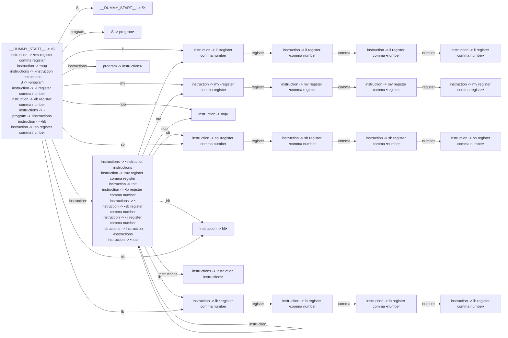

# Generated Info

## Base Info
- config_file: rasm.rparser
- output_file: ../src/rasm_parser.rs
- time: 2023-09-08 00:14:08.765485 +08:00

---

## DFA Graph


---

## Follow Set
```txt
program: ["__$__"]
instruction: ["hlt", "mv", "li", "lb", "sb", "nop", "__$__"]
hlt: ["hlt", "__$__", "sb", "li", "nop", "lb", "mv"]
sb: ["register"]
S: ["__$__"]
mv: ["register"]
register: ["li", "__$__", "comma", "hlt", "nop", "lb", "mv", "sb"]
instructions: ["__$__"]
__$__: []
li: ["register"]
lb: ["register"]
__EPSILON__: ["__$__"]
comma: ["number", "register"]
nop: ["mv", "lb", "li", "hlt", "sb", "nop", "__$__"]
number: ["lb", "li", "hlt", "__$__", "nop", "sb", "mv"]
__DUMMY_START__: ["__$__"]
```

---
## Action Table
```txt
State 0:
__$__: Accept
S: Shift(1)
mv: Shift(7)
lb: Shift(19)
nop: Shift(11)
instructions: Shift(23)
hlt: Shift(17)
li: Shift(2)
instruction: Shift(12)
sb: Shift(13)
program: Shift(6)
===================
State 1:
__$__: Reduce(ReduceDerivation { left: "__DUMMY_START__", right: ["S"] })
===================
State 2:
register: Shift(3)
===================
State 3:
comma: Shift(4)
===================
State 4:
number: Shift(5)
===================
State 5:
mv: Reduce(ReduceDerivation { left: "instruction", right: ["li", "register", "comma", "number"] })
sb: Reduce(ReduceDerivation { left: "instruction", right: ["li", "register", "comma", "number"] })
lb: Reduce(ReduceDerivation { left: "instruction", right: ["li", "register", "comma", "number"] })
nop: Reduce(ReduceDerivation { left: "instruction", right: ["li", "register", "comma", "number"] })
__$__: Reduce(ReduceDerivation { left: "instruction", right: ["li", "register", "comma", "number"] })
hlt: Reduce(ReduceDerivation { left: "instruction", right: ["li", "register", "comma", "number"] })
li: Reduce(ReduceDerivation { left: "instruction", right: ["li", "register", "comma", "number"] })
===================
State 6:
__$__: Reduce(ReduceDerivation { left: "S", right: ["program"] })
===================
State 7:
register: Shift(8)
===================
State 8:
comma: Shift(9)
===================
State 9:
register: Shift(10)
===================
State 10:
nop: Reduce(ReduceDerivation { left: "instruction", right: ["mv", "register", "comma", "register"] })
__$__: Reduce(ReduceDerivation { left: "instruction", right: ["mv", "register", "comma", "register"] })
lb: Reduce(ReduceDerivation { left: "instruction", right: ["mv", "register", "comma", "register"] })
hlt: Reduce(ReduceDerivation { left: "instruction", right: ["mv", "register", "comma", "register"] })
li: Reduce(ReduceDerivation { left: "instruction", right: ["mv", "register", "comma", "register"] })
sb: Reduce(ReduceDerivation { left: "instruction", right: ["mv", "register", "comma", "register"] })
mv: Reduce(ReduceDerivation { left: "instruction", right: ["mv", "register", "comma", "register"] })
===================
State 11:
mv: Reduce(ReduceDerivation { left: "instruction", right: ["nop"] })
li: Reduce(ReduceDerivation { left: "instruction", right: ["nop"] })
hlt: Reduce(ReduceDerivation { left: "instruction", right: ["nop"] })
lb: Reduce(ReduceDerivation { left: "instruction", right: ["nop"] })
sb: Reduce(ReduceDerivation { left: "instruction", right: ["nop"] })
__$__: Reduce(ReduceDerivation { left: "instruction", right: ["nop"] })
nop: Reduce(ReduceDerivation { left: "instruction", right: ["nop"] })
===================
State 12:
sb: Shift(13)
hlt: Shift(17)
instruction: Shift(12)
nop: Shift(11)
__$__: Reduce(ReduceDerivation { left: "instructions", right: [] })
li: Shift(2)
instructions: Shift(18)
mv: Shift(7)
lb: Shift(19)
===================
State 13:
register: Shift(14)
===================
State 14:
comma: Shift(15)
===================
State 15:
number: Shift(16)
===================
State 16:
li: Reduce(ReduceDerivation { left: "instruction", right: ["sb", "register", "comma", "number"] })
mv: Reduce(ReduceDerivation { left: "instruction", right: ["sb", "register", "comma", "number"] })
lb: Reduce(ReduceDerivation { left: "instruction", right: ["sb", "register", "comma", "number"] })
hlt: Reduce(ReduceDerivation { left: "instruction", right: ["sb", "register", "comma", "number"] })
sb: Reduce(ReduceDerivation { left: "instruction", right: ["sb", "register", "comma", "number"] })
nop: Reduce(ReduceDerivation { left: "instruction", right: ["sb", "register", "comma", "number"] })
__$__: Reduce(ReduceDerivation { left: "instruction", right: ["sb", "register", "comma", "number"] })
===================
State 17:
mv: Reduce(ReduceDerivation { left: "instruction", right: ["hlt"] })
li: Reduce(ReduceDerivation { left: "instruction", right: ["hlt"] })
lb: Reduce(ReduceDerivation { left: "instruction", right: ["hlt"] })
sb: Reduce(ReduceDerivation { left: "instruction", right: ["hlt"] })
__$__: Reduce(ReduceDerivation { left: "instruction", right: ["hlt"] })
hlt: Reduce(ReduceDerivation { left: "instruction", right: ["hlt"] })
nop: Reduce(ReduceDerivation { left: "instruction", right: ["hlt"] })
===================
State 18:
__$__: Reduce(ReduceDerivation { left: "instructions", right: ["instruction", "instructions"] })
===================
State 19:
register: Shift(20)
===================
State 20:
comma: Shift(21)
===================
State 21:
number: Shift(22)
===================
State 22:
sb: Reduce(ReduceDerivation { left: "instruction", right: ["lb", "register", "comma", "number"] })
hlt: Reduce(ReduceDerivation { left: "instruction", right: ["lb", "register", "comma", "number"] })
nop: Reduce(ReduceDerivation { left: "instruction", right: ["lb", "register", "comma", "number"] })
__$__: Reduce(ReduceDerivation { left: "instruction", right: ["lb", "register", "comma", "number"] })
mv: Reduce(ReduceDerivation { left: "instruction", right: ["lb", "register", "comma", "number"] })
li: Reduce(ReduceDerivation { left: "instruction", right: ["lb", "register", "comma", "number"] })
lb: Reduce(ReduceDerivation { left: "instruction", right: ["lb", "register", "comma", "number"] })
===================
State 23:
__$__: Reduce(ReduceDerivation { left: "program", right: ["instructions"] })
===================

```
---
generated by rparser
RockRockWhite 2023
    